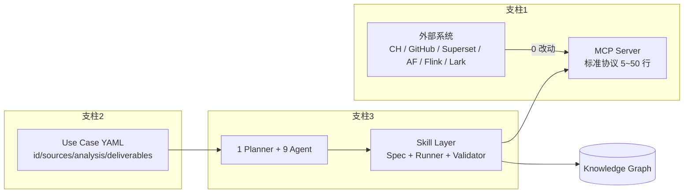
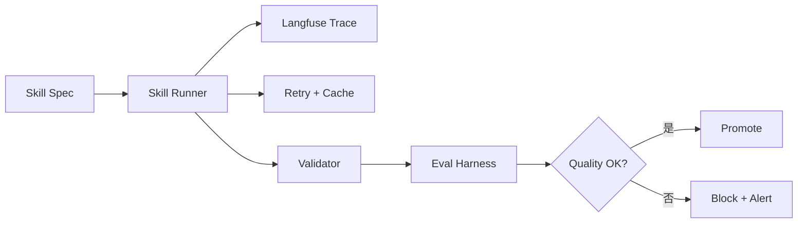
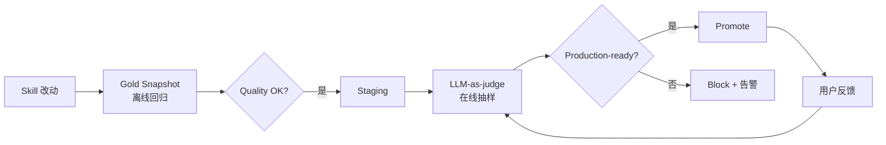

# IDM — Agent Instructions (核心单一文件)

> **目的**：把 IDM (Intelligent Data Mesh) 平台**最核心、最不可违反**的设计决策
> 汇总到 **一个文件**，以便后续任何实现（自己 / 同事 / 下游 Agent / 半年后回看）
> 都能 **5 分钟内拿到"绝对不能搞错"的事实**，**无需扫描全部 18 份设计文档**。
>
> 详细推导、图、样例、ADR 见 `idm/docs/design/*.md` 与 `idm/docs/platform/*.md`。
> 本文件 **优先稳定、不轻易变更**；变更需先动下面"配套阅读"里的大文档。

---

## 0. 一句话愿景

> **让 LLM 成为数据团队的「第一位数据工程师」**
> 业务人员只交付 1 份 YAML, Agent 接管剩下的全部 (发现 / 理解 / 血缘 / 文档 / 质量 / 预警);
> 原系统 **0 改动**。

---

## 1. 五大设计原则 (Must Follow)

| # | 原则 | 含义 | 反面 |
| --- | --- | --- | --- |
| 1 | **MCP-First, Zero-Touch** | 所有外部系统走 Model Context Protocol; IDM 是 MCP **Client** | 写 Connector / 让业务装 SDK |
| 2 | **UseCase-as-Config** | 业务团队只交付 1 份 YAML/JSON, 不写代码 | 写元数据 ETL / 写多份配置 |
| 3 | **Agent-Orchestrated (1+9)** | 1 Planner + 9 Specialist Agent; 任务 = DAG(Agent → Skill) | 大单体 LLM / 散落脚本 |
| 4 | **Skills-Stable** | Agent 用 **Skill (SOP)** 调 MCP + LLM; Skill **可测试、可重放、有 Eval** | 让 LLM 直接调 MCP / 直接生成 SQL |
| 5 | **AI in the Loop, Human in the Lead** | LLM 写建议 → `ai_suggestion.pending` → 人工一键确认才生效 | 让 LLM 自动改生产元数据 / 自动写回业务系统 |

> **绝对禁止**：
> - ❌ 让 LLM 直接调 MCP tool (必须经 Skill)
> - ❌ 让 LLM 自动 `INSERT / UPDATE / DELETE` ClickHouse / Postgres (只读账号 + SQL Guard)
> - ❌ 把业务 PII 送到云端 LLM (默认走本地 Qwen, 或 mask 后再送)
> - ❌ 写新的 Connector 而不自建 MCP Server
> - ❌ 跳过 `ai_suggestion` 审核流, 直接写入知识图谱

---

## 2. 三大支柱 (Pillars)



| 支柱 | 入口 | 实现 | 详细 |
| --- | --- | --- | --- |
| **MCP** | 外部系统 | mcp-python-sdk + 自研 Server, 部署: Sidecar / In-Pod / Remote SSE | [mcp-server-guide.md](./design/mcp-server-guide.md) |
| **UseCase** | GitHub YAML 仓库 | Use Case Registry + JSON Schema 校验 + Diff | [use-case-spec.md](./design/use-case-spec.md) |
| **Agent+Skill** | Planner 触发 | LangGraph + 9 Specialist + Skill Runner + Eval Harness | [agent-orchestration.md](./design/agent-orchestration.md) · [skills-design.md](./design/skills-design.md) |

---

## 3. 1+9 Agent 模型

### 3.1 Planner (gpt-5)

```python
async def plan(use_case: dict) -> PlanResponse:
    snap = await load_snapshot(use_case["id"])
    diff = await compute_diff(use_case, snap)
    resp = await llm.complete(
        model="gpt-5",
        messages=[{"role":"system","content":PLANNER_SYS},
                  {"role":"user","content":build_prompt(use_case, snap, diff)}],
        output_type="json", schema=PlanResponse.model_json_schema(),
        cache_key=["plan", use_case["id"], diff["hash"]],
    )
    return _validate_dag(PlanResponse.model_validate_json(resp))
```

- 状态机: `Idle → Planning → Dispatching → Reflecting → Composing → Idle | Failed`
- 失败 = 降级 / 局部重试 / 整 Use Case 重规划 (不静默)

### 3.2 9 个 Specialist Agent

| # | Agent | 输入 | 输出 (写入 KG) | 主 LLM | Skill |
| --- | --- | --- | --- | --- | --- |
| 1 | **Schema** | MCP (CH/PG/Trino) | `Table`, `Column`, `Database` | deepseek-v3 | `discover_*_assets` |
| 2 | **Lineage** | dbt manifest / AF DAG / Superset export / SQL | `UPSTREAM/DOWNSTREAM` 边 | deepseek-v3 + sqlglot | `parse_*`, `extract_sql_lineage` |
| 3 | **Doc** | schema + sample + glossary | `description`, `glossary_binding` | gpt-5 | `infer_table_description` |
| 4 | **PII** | column meta + sample + regex | `pii_class`, `masking_policy` | gpt-5 | `classify_pii_columns` |
| 5 | **Owner** | git blame + dbt meta + AF owner + query log | `owner`, `steward`, `consumer` | gpt-5 | `infer_owners` |
| 6 | **Quality** | 30 天画像 + LLM 推理 | `anomaly_event`, `metric_baseline` | deepseek-reasoner (R1) | `detect_anomalies`, `run_quality_check` |
| 7 | **Insight** | anomaly / 新资产 / 缺 owner 等 | `insight` + 渠道 push | gpt-5 | `compose_insight` |
| 8 | **ChatBI** | 自然语言 + schema + 历史 | `sql` + `result` + `chart` | gpt-5 | `nl2sql` (5 层 SQL Guard) |
| 9 | **Glossary** | schema + 列名 + 业务文档 | `glossary_term`, `term_binding` | gpt-5 | `map_glossary` |

> **原则**: Planner 拆任务, 每个 Specialist 只做自己的领域, **不跨界调用**; 跨域数据全靠知识图谱。

---

## 4. Skill 体系 (执行稳定性核心)

### 4.1 什么是 Skill

> **Skill = 标准化 SOP = 一组有序的 `mcp_call` / `llm_call` / `validator` 步骤 + 输入/输出 Schema**
> 类似 Claude Skills / OpenAI Skills, **不是裸 LLM**。

### 4.2 Skill Spec (YAML) 最小骨架

```yaml
skill: discover_clickhouse_assets     # 全局唯一
version: 1
description: 发现 CH 中所有表/视图/列
input_schema: { type: object, required: [host, database], properties: { ... } }
output_schema: { type: object, properties: { assets: { type: array } } }
mcp_calls:                             # 全部走 MCP
  - { tool: clickhouse.list_databases }
  - { tool: clickhouse.show_tables, params: { database: "{{ input.database }}" } }
llm_calls:                             # 可选; 模型按 7.x 路由
  - { name: infer_description, when: "column_count > 0",
      model: gpt-5, prompt: "...", output: { type: string } }
post_validators:
  - { rule: fqn_unique, level: error }
  - { rule: column_count > 0, level: warning }
tests:
  - { name: smoke,  input: {...}, expected_assets_min: 1 }
  - { name: gold,   input: {...}, snapshot: tests/gold/...json }
```

### 4.3 内置 Skill 起步集 (Must Have)

| Skill | 作用 |
| --- | --- |
| `discover_clickhouse_assets` | 扫 CH 库/表/列 + 采样 |
| `discover_postgres_assets` | 扫 PG 资产 |
| `parse_dbt_manifest` | 读 manifest.json → model + lineage |
| `parse_airflow_dag` | 解析 DAG 拓扑 |
| `parse_superset_export` | 解析 dashboard zip → chart/lineage |
| `extract_sql_lineage` | SQL → 血缘 (sqlglot) |
| `infer_table_description` | schema + sample → 描述 |
| `classify_pii_columns` | 列名 + sample → PII 分类 |
| `infer_owners` | 多信号 → Owner 建议 |
| `detect_anomalies` | 画像 → 异常检测 |
| `run_quality_check` | 断言 (freshness/volume/...) |
| `compose_insight` | 事件 → 简报 |
| `nl2sql` | 自然语言 → SQL (5 层 Guard) |
| `resolve_entity` | 实体消歧 / 合并 |

### 4.4 三层稳定性保障



1. **Spec**: YAML 静态定义, 可 diff / 可 review
2. **Runner**: 重试 / 缓存 / 校验 / 上下文渲染, **所有 LLM 调用必走 Runner**
3. **Eval Harness**: Gold Snapshot + LLM-as-judge + 用户反馈, **降级自动告警 + 回滚**

---

## 5. MCP 协议 (Zero-Touch 的实现)

### 5.1 内置 MCP Server (起步必装)

| MCP | 工具示例 | 部署 |
| --- | --- | --- |
| `clickhouse` | `list_databases` / `show_tables` / `describe_table` / `sample` / `list_query_log` | GCE Sidecar (贴近 CH) |
| `github` | `get_file_contents` / `list_commits` / `git_blame` | IDM pod (官方) |
| `gcs` | `list_objects` / `read_object` | IDM pod (官方) |
| `superset_export` | `list_dashboards` / `parse_dashboard_yaml` | IDM pod (自研) |
| `airflow` | `list_dags` / `get_dag` / `get_task` | IDM pod (自研 wrapper) |
| `flink` | `list_jobs` / `get_job_plan` | IDM pod (自研 wrapper) |
| `postgres` | `list_schemas` / `list_tables` | IDM pod |
| `slack` / `lark` | `send_message` / `list_channels` | IDM pod (官方) |
| `confluence` / `jira` | 知识 / 工单 | IDM pod (官方) |
| **`idm-self`** | **反向暴露 IDM 能力给外部 Agent (Claude/Cursor)** | IDM pod (自研) |

### 5.2 三种部署模式

```mermaid
flowchart TB
    subgraph A[Sidecar (贴近数据源, 低延迟)]
        A1[IDM Pod] --> A2[CH MCP Sidecar] --> A3[(ClickHouse)]
    end
    subgraph B[In-Pod (无状态服务, 如 github/gcs/slack)]
        B1[IDM Pod] --> B2[github MCP<br/>同容器]
    end
    subgraph C[Remote SSE (跨网络)]
        C1[IDM Pod] -.HTTP/SSE.-> C2[Remote MCP Server]
    end
```

### 5.3 自建 MCP Server 模板 (5~50 行)

```python
# mcp_servers/<name>/server.py
from mcp.server import Server, stdio
app = Server("<name>-mcp")

@app.list_tools()
async def list_tools():
    return [{"name": "x", "description": "...", "inputSchema": {...}}]

@app.call_tool()
async def call_tool(name: str, arguments: dict):
    # 接外部系统, 返回结构化结果
    ...

if __name__ == "__main__":
    stdio.run(app)
```

注册: 在 `idm/mcp_clients/registry.py` 加配置 + Helm chart 起 pod 即可。

---

## 6. LLM 路由 (质量 / 成本 / 合规三角)

### 6.1 模型矩阵 (经 LiteLLM 统一)

| 模型 | 部署 | 用途 | 单价 (1M tok) | 上下文 |
| --- | --- | --- | --- | --- |
| **gpt-5** (主力) | OpenAI API | 规划 / 推理 / 文档 / NL2SQL | $3 in / $12 out | 128k |
| **gpt-5.4** (可平滑升级) | OpenAI API | 同上, 升级路径 | 同档 | 128k |
| **deepseek-v3** (备选) | DeepSeek API | 中文 / 长文 / 成本 | $0.14 / $0.28 | 64k |
| **deepseek-v4-pro** (可平滑升级) | DeepSeek API | 同上, 升级路径 | 同档 | 64k |
| **deepseek-reasoner (R1)** | DeepSeek API | 复杂归因 / 数学 | $0.55 / $2.19 | 64k |
| **qwen2.5:32b** (本地) | Ollama on GKE | **合规 / 内网 / 兜底** | 0 (电费) | 32k |
| **text-embedding-3-large** | OpenAI API | Embedding 主 | $0.13 | 8k |
| **bge-large-zh** | 本地 | Embedding 备 | 0 | 512 |

### 6.2 路由策略 (代码)

```python
def pick_model(task: dict) -> str:
    if task.get("contains_pii"):                return "qwen-local"        # 合规
    if task.get("estimated_input_tokens", 0) > 60_000: return "deepseek-v3" # 长文
    if task.get("requires_reasoning"):          return "gpt-5"             # 复杂
    if task.get("language", "zh") in ("zh",):   return "deepseek-v3"       # 中文
    return "gpt-5"
```

### 6.3 任务 → 默认模型 速查

| 任务 | 默认 | 备选 |
| --- | --- | --- |
| Planner / 文档 / NL2SQL / Owner / PII | **gpt-5** | deepseek-v3 |
| Schema 发现 / Lineage 解析 | **deepseek-v3** | gpt-5 |
| 异常归因 | **deepseek-reasoner** | gpt-5 |
| 敏感字段分析 | **qwen-local** | - |
| 批量回填 (>5k) | **deepseek-v3** | qwen-local |

### 6.4 不可逾越的护栏

- **PII 数据 → 必走 qwen-local**; 云端调用前必 mask
- **CH SQL → 只读账号 + SQL Guard (限 SELECT + 强制 LIMIT + 禁危险函数)**
- **所有 LLM 调用 → Langfuse trace** (token / 延迟 / 成本 / 模型 / cache hit)
- **任何写操作 → 进 `ai_suggestion.pending` → 人工确认后才落 KG**

---

## 7. 知识图谱 (Truth Source)

### 7.1 三层架构 (PostgreSQL 一实例三扩展)

```mermaid
flowchart LR
    PG[PostgreSQL<br/>CloudSQL HA] --> R[关系层<br/>资产/标签/Owner/审计]
    PG --> G[图查询层<br/>Apache AGE<br/>血缘/影响分析]
    PG --> V[向量层<br/>pgvector (HNSW)<br/>语义检索]
    CH[ClickHouse GCE] --> P[画像<br/>Profiler/Query 历史]
    style PG fill:#7AB8FF
    style CH fill:#FFB454
```

### 7.2 关键表 (DDL 见 [data-model.md](./design/data-model.md))

| 表 | 用途 |
| --- | --- |
| `service` / `database` / `schema` | 物理层级 |
| `table_asset` / `column_asset` | 资产 (有 `description_vec` / `fts`) |
| `table_lineage` | 血缘 (PK: upstream, downstream, transform_type, job_id) |
| `tag` / `asset_tag` | 标签 |
| `asset_owner` | Owner / Steward / Consumer |
| `glossary_term` / `asset_term` | 业务术语 |
| `quality_rule` / `quality_result` | 质量断言 + 结果 |
| **`ai_suggestion`** | **LLM 建议, status: pending/approved/rejected** |
| `audit_log` | 审计 |

### 7.3 AGE 图 (派生视图, 异步同步)

- 节点: `Service` / `Database` / `Schema` / `Table` / `Column` / `Pipeline` / `Dashboard` / `User` / `Team` / `GlossaryTerm`
- 边: `UPSTREAM` / `DOWNSTREAM` / `OWNED_BY` / `TAGGED` / `GLOSSARY` / `PRODUCES` / `CONSUMES` / `QUERIES`
- 写 PG → 触发器同步到 AGE; **避免双向写**

### 7.4 ClickHouse 镜像表 (`idm_internal`)

- `asset_profile` (分区按月) — 资产画像
- `query_history` (TTL 180 天) — Query 样本
- `quality_metrics` — 质量时序

---

## 8. Use Case YAML (业务入口)

### 8.1 最小骨架

```yaml
id: shop-orders-daily            # 唯一
version: 1
description: 订单宽表治理
owners: [alice@example.com]

sources:
  - { id: ch-prod, type: clickhouse, mcp: clickhouse,
      config: { host: ch.example.com, database: shop },
      scope: { include_tables: ["orders_daily"] } }
  - { id: gh-warehouse, type: github, mcp: github,
      config: { repo: company/dwh, branch: main },
      scope: { paths: ["dags/etl_orders*", "models/orders_*"] } }
  - { id: sp-export, type: superset_export, mcp: file,
      config: { path: gs://superset-exports/2025-01/ } }

context:
  glossary: [{ term: GMV, definition: 成交总额 }]
  tags: [sales, tier-1]

analysis:
  - { task: discover_assets,    agent: schema }
  - { task: extract_lineage,    agent: lineage,  depends_on: [discover_assets] }
  - { task: generate_docs,      agent: doc,      depends_on: [discover_assets] }
  - { task: classify_pii,       agent: pii,      depends_on: [discover_assets] }
  - { task: suggest_owners,     agent: owner,    depends_on: [discover_assets] }
  - { task: detect_anomalies,   agent: quality,  schedule: "0 9 * * *",
                                 depends_on: [discover_assets] }

deliverables:
  knowledge_graph: { entities: [table, column, dashboard, pipeline] }
  insights: [{ channel: slack, target: "#data-stewards",
               trigger: [anomaly_detected, owner_missing] }]
  api_expose: true
```

> 写完 `git commit` → IDM 自动监听 → 调度 Planner → 全程不需写代码。

### 8.2 字段速记

| 字段 | 必填 | 用途 |
| --- | --- | --- |
| `sources[].type` | ✅ | `clickhouse` / `github` / `superset_export` / `airflow` / `flink` / ... |
| `sources[].mcp` | ✅ | 调用的 MCP server 名 |
| `analysis[].task` | ✅ | 对应 Skill 名 |
| `analysis[].agent` | ✅ | 9 个 Specialist 中一个 |
| `analysis[].depends_on` | - | DAG 依赖 |
| `analysis[].schedule` | - | cron, 周期任务 |
| `deliverables.insights[].channel` | - | `slack` / `lark` / `email` / `jira` |

---

## 9. 前端栈 (不引 antd)

| 层 | 选型 | 备注 |
| --- | --- | --- |
| **构建** | Vite + React 18 + TypeScript | 保持现有栈 |
| **表格** | **ag-grid Community** (免费) | 大表格 / 过滤 / 排序 / 虚拟滚动 |
| **图表** | ECharts | 不引 Recharts/antd |
| **血缘图** | ReactFlow | 沿用 |
| **基础控件** | **IDM UI Kit (自研)** | Button/Card/Tag/Input/Modal/Drawer/Tabs/Toast |
| **设计系统** | **公司 Design Token** | 颜色 / 间距 / 字号 |
| **不引入** | Antd / Material UI / Chakra | 与公司 UX 体系冲突 |

> 资产表 / 建议审核表 / 质量表 一律 ag-grid, 详情侧栏用 IDM UI Kit Drawer。

---

## 10. 部署 (GKE + GCE)

```mermaid
flowchart TB
    subgraph GKE[GKE Autopilot (asia-east1)]
        N1[ns:idm-core<br/>API/GraphQL/Agent]
        N2[ns:idm-ai<br/>LangGraph/LLM Workers]
        N3[ns:idm-web<br/>React Console]
        N4[ns:idm-mcp<br/>MCP Servers]
        N5[ns:idm-jobs<br/>Airflow/CronJob]
    end
    GCE1[GCE: CH 3 节点 Replication]
    CSPG[(CloudSQL PG HA<br/>AGE + pgvector)]
    GCS[(GCS<br/>idm-artifacts)]
    PS[Pub/Sub<br/>idm-events]
    SE[Secret Manager]
```

| 资源 | 选型 | 用途 |
| --- | --- | --- |
| 容器 | GKE Autopilot | 全量 IDM |
| PG | CloudSQL PG 14 HA + AGE + pgvector + pgcrypto + pg_trgm | 元数据 / 图 / 向量 |
| 数仓 | **ClickHouse (GCE) 3 节点 Replication + Keeper** | 画像 / Query 历史 / 质量指标 |
| 对象 | GCS `idm-artifacts` | dbt manifest / Superset export / 样本 |
| 消息 | Pub/Sub `idm-events` | 观察事件流 |
| 缓存 | Memorystore Redis HA | Agent 短期 memory / 去重 / LLM cache |
| 密钥 | Secret Manager | LLM API Key / DB Pass |
| CI/CD | Cloud Build → Artifact Registry → **ArgoCD (GitOps)** | |
| 监控 | Cloud Monitoring + OpenTelemetry + **Langfuse** | Metric / Log / LLM Trace |

---

## 11. 安全 / 护栏 (不可省)

| 维度 | 设计 |
| --- | --- |
| 认证 | Google Workspace SSO (OIDC) + Service Account (M2M) |
| 授权 | RBAC + ABAC (基于 Tag / Domain) |
| 租户 | 起步单租户; 模型预留 `tenant_id` |
| LLM 安全 | **敏感数据脱敏 → LLM**; PII 强制走本地 Qwen; 审计 LLM 调用 |
| **SQL Guard (5 层)** | 1) 解析为 SELECT  2) 禁 DML 关键字  3) 禁危险函数  4) 强制 LIMIT  5) 只读账号 |
| 审计 | 所有写操作 + LLM 调用 + MCP 调用 → `audit_log` |
| 数据驻留 | 本地 LLM 兜底; 海外业务可指定 GPT-5 EU region |
| MCP 鉴权 | 只读账号 + IP allowlist + PAT + mTLS; Least Privilege |

---

## 12. 评估体系 (Eval Harness)



- **离线 Gold**: 每个 Skill 有 `tests/gold/<skill>.json`; 改动后必跑
- **在线 Judge**: GPT-5 作 judge, 按 0~1 打分, 阈值 < 0.8 自动 block
- **用户反馈**: 采纳/拒绝 → 进 `feedback` → Few-shot 自动维护 / 微调

---

## 13. 关键约定 (Conventions)

| 项 | 约定 |
| --- | --- |
| **资产 FQN** | `<service>.<database>.<schema>.<table>` 全小写 |
| **URN** | `urn:idm:<entity>:<service>:<fqn>#<version>` |
| **ID** | 全表 `id UUID DEFAULT gen_random_uuid()` |
| **时间** | 全表 `created_at / updated_at` 强制带 |
| **资产 tier** | `critical` / `important` / `normal` |
| **资产 status** | `active` / `deprecated` / `archived` |
| **PII class** | `none` / `email` / `phone` / `id_card` / `address` / `...` |
| **MCP tool 命名** | `<server>.<verb>` 例: `clickhouse.list_databases` |
| **Skill 命名** | `<verb>_<object>` 例: `discover_clickhouse_assets` |
| **Agent 命名** | `<领域>Agent` 例: `DocAgent` / `PIIAgent` |
| **YAML 仓库路径** | `idm/use_cases/{prod,staging,test}/<id>.yml` |
| **GitOps** | Helm values in `idm-helm` → ArgoCD 自动 sync |
| **API 风格** | GraphQL (主) + REST (Webhook) |

---

## 14. 关键 ADR 摘要 (Why)

| # | 决策 | 选择 | 一句话理由 |
| --- | --- | --- | --- |
| 001 | 元数据存储 | CloudSQL-PG + Apache AGE | 复用现有 PG; 图用 AGE, 不引 Neo4j |
| 002 | 事件总线 | GCP Pub/Sub | 复用 GCP 生态, 免运维 |
| 003 | 向量索引 | pgvector | 与 PG 同实例; 规模大再迁 Qdrant |
| 004 | LLM 编排 | LangGraph + LiteLLM + Langfuse | 成熟 / 可观测 / 多模型 |
| 005 | 接入方式 | **MCP-First (零侵入)** | 替换 Sidecar/Connector; 自建 MCP 即可 |
| 006 | 知识建模 | OM JSON Schema + DataHub Aspect 混合 | 兼得灵活 + 规范 |
| 007 | 前端 | **ag-grid Community + IDM UI Kit** | 不引 antd/material; 复用公司 UX |
| 008 | 部署平台 | GKE | 全部 IDM 在 GKE; ClickHouse 留 GCE |
| 009 | Agent 框架 | **LangGraph + 自研 Specialist + Skill** | 关键 Agent 自研, 可控可审计 |
| 010 | 稳定性 | **Spec + Runner + Validator + Eval Harness** | 避免 LLM 直调 |
| 011 | LLM 模型 | **GPT-5 主力 + DeepSeek V3 备选 + Qwen 本地兜底** | 质量/成本/合规三角 |
| 012 | 业务配置 | **Use Case YAML** | 一份即声明场景 |
| 013 | 评估 | **离线 Gold + 在线 Judge + 用户反馈** | 三层闭环 |
| 014 | 数据格式 | Parquet + Iceberg on GCS | 大样本 / 长期归档 |

---

## 15. 五大失败模式 (Top 5) + 应对

| 失败 | 应对 |
| --- | --- |
| LLM 不可用 | LiteLLM 自动 fallback: gpt-5 → deepseek-v3 → qwen-local |
| PII 误送云端 | 强制 mask + 走 qwen-local + 审计 |
| CH 大查询影响生产 | 只读账号 + SAMPLE + 时间窗 + 强制 LIMIT |
| LLM 成本失控 | Context 预算 + Embedding Cache + 错峰批处理 + 月预算告警 |
| 建议被持续拒绝 | Few-shot 强化 + 反馈回写 + Insight 价值外显 |

---

## 16. 五大绝对不能做 (Top 5 Forbidden)

1. ❌ **不要**让 LLM 直接调 MCP tool — 必须经 Skill Spec
2. ❌ **不要**自动写业务系统 (CH/PG 写表) — 走 `ai_suggestion` 审核流
3. ❌ **不要**在 Skill 里硬编码 prompt — 用 Jinja 模板 + Spec 渲染
4. ❌ **不要**跨 Specialist Agent 直接互调 — 全走知识图谱
5. ❌ **不要**把 Antd 引入前端 — 用 ag-grid + IDM UI Kit

---

## 17. 配套阅读 (按重要性)

### 17.1 必读 (5 分钟内看完)

- [architecture.md](./design/architecture.md) — 一张全景图
- [mcp-first-architecture.md](./design/mcp-first-architecture.md) — 三大支柱
- [ai-driven-design.md](./design/ai-driven-design.md) — AI 驱动的本质
- [use-case-spec.md](./design/use-case-spec.md) — YAML 字段
- [walkthrough.md](./design/walkthrough.md) — 端到端 demo

### 17.2 子系统深入

- [agent-orchestration.md](./design/agent-orchestration.md) — 1+9 Agent 状态机
- [skills-design.md](./design/skills-design.md) — Skill Spec / Runner / Validator
- [data-model.md](./design/data-model.md) — 知识图谱 ER / AGE / pgvector
- [llm-router.md](./design/llm-router.md) — LLM 路由 / 缓存 / 成本
- [frontend-design.md](./design/frontend-design.md) — ag-grid + IDM UI Kit
- [mcp-server-guide.md](./design/mcp-server-guide.md) — 自建 MCP 教程
- [insight-alerting.md](./design/insight-alerting.md) — 决策 / 告警 / SLO
- [chatbi-design.md](./design/chatbi-design.md) — NL2SQL 5 层 Guard
- [eval-harness.md](./design/eval-harness.md) — 评估 / 门禁 / Few-shot

### 17.3 实施 / 运营

- [deployment.md](./design/deployment.md) — GKE 部署 / Helm / GitOps
- [roadmap.md](./design/roadmap.md) — 5 季度里程碑
- [stack-decisions.md](./design/stack-decisions.md) — 技术选型决策

### 17.4 调研 / 背景

- [platform/datahub.md](./platform/datahub.md)
- [platform/openmetadata.md](./platform/openmetadata.md)
- [platform/comparison.md](./platform/comparison.md)

---

## 18. 一句话总结

> **IDM = 1 份 YAML + MCP 旁路 + 1+9 Agent + Skill SOP + GPT-5/DeepSeek/Qwen + ag-grid + 知识图谱 + 人工 in-the-loop**
> 业务 0 改动, 治理全自动。

---

> 📌 **本文件是 IDM 的"宪法"**; 任何代码 / 文档 / 决策与本文档冲突 → 以本文档为准 → 然后提 PR 更新本文档与对应详细文档。
