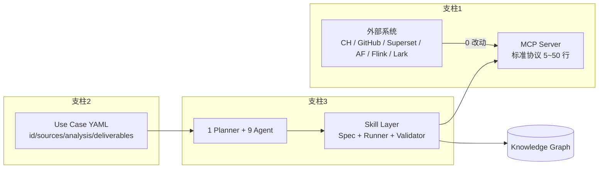
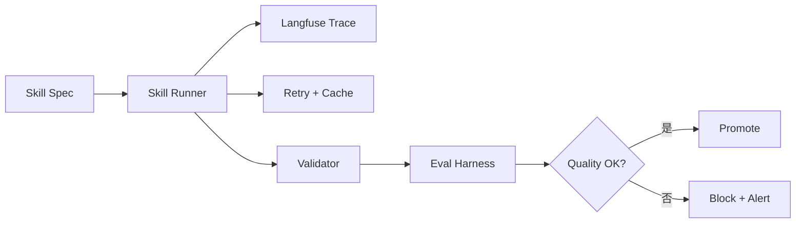
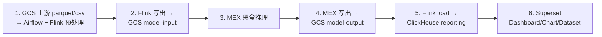
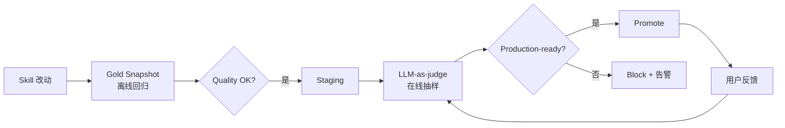

# IDM — Agent Instructions (核心单一文件)

> **目的**：把 IDM (Intelligent Data Mesh) 平台**最核心、最不可违反**的设计决策
> 汇总到 **一个文件**，以便后续任何实现（自己 / 同事 / 下游 Agent / 半年后回看）
> 都能 **5 分钟内拿到"绝对不能搞错"的事实**，**无需扫描全部 18 份设计文档**。
>
> 详细推导、图、样例、ADR 见 `idm/docs/design/*.md` 与 `idm/docs/platform/*.md`。
> 本文件 **优先稳定、不轻易变更**；变更需先动下面"配套阅读"里的大文档。

---

## 0. 一句话愿景

> **让 LLM 成为数据团队的「第一位数据工程师」**
> 业务人员只交付 1 份 YAML, Agent 接管剩下的全部 (发现 / 理解 / 血缘 / 文档 / 质量 / 预警);
> 原系统 **0 改动**。

---

## 0.5 自动化执行铁律 (Auto-Execution Mandate — ⛔ 最高优先级, 2026-06-08 增)

> **⛔ 本节优先级 = 5 (最高), 高于五大设计原则与所有 ADR。任何 Agent / 自动化脚本 / CI / 部署命令 100% 强制执行, 违反视为 BUG。**

### 0.5.0 铁律七条 (The Seven Iron Rules)

> **任何 shell 命令必须同时满足以下 7 条, 否则视为违规:**

| # | 铁律 | 含义 | 反例 |
| --- | --- | --- | --- |
| 1 | **⏱ 必须 `timeout 30s`** | 所有命令必须 `timeout 30s` (Win: `timeout 30`, *nix: `timeout 30s`) 包住, 测试用 `timeout 60s` | ❌ 裸跑 `pytest` / `npm test` |
| 2 | **🚫 不阻塞 (Non-Blocking)** | 跑测试 / build / 拉镜像 / `kubectl apply` / 长任务必须 `blocking=false` + `CheckCommandStatus` 轮询 | ❌ `blocking=true` 等 5 分钟 |
| 3 | **➡ 超时立刻继续 (Auto-Continue)** | 30s 没回包 → 立刻 proceed next step, **不重试同一命令** | ❌ 重试 3 次同一卡住命令 |
| 4 | **🔁 幂等 (Idempotent)** | 部署 / 写库命令要幂等 (`kubectl apply` / `alembic upgrade head` / `upsert`) | ❌ `CREATE TABLE` 必爆 |
| 5 | **🚷 不交互 (No-Interactive)** | 不允许弹 yes/no / 文件覆盖确认; 缺信息用 placeholder + WARN | ❌ `npm create vite@latest .` |
| 6 | **📝 日志可定位 (Loggable)** | 长命令输出 `tee` 到 `apps/.tmp/cmd-<ts>.log` + `.err` | ❌ 输出扔掉, 出问题找不回 |
| 7 | **⏩ 失败不中断 (Fail-Soft)** | 单条命令失败 → **记录 + 继续**, 不要 `set -e` / `&&` 链式全停; 留 batch report | ❌ `cmd1 && cmd2` 一爆全停 |

### 0.5.1 标准调用模板 (Copy-Paste)

```bash
# === 模板 A: 短命令 (< 10s, 同步) ===
timeout 30s <cmd>

# === 模板 B: 长命令 (>= 10s, 后台 + 轮询) ===
TS=$(date +%s)
timeout 30s <cmd> > apps/.tmp/cmd-$TS.log 2> apps/.tmp/cmd-$TS.err &
echo $! > apps/.tmp/cmd.pid
# 30s 后 polling:
kill -0 $(cat apps/.tmp/cmd.pid) 2>/dev/null && kill $(cat apps/.tmp/cmd.pid) || echo "ok finished"
```

### 0.5.2 测试类命令标准调用 (本仓库)

```bash
# 1) 单个 BDD feature
cd apps/api && timeout 60s uv run --no-progress pytest tests/bdd/test_data_pipeline.py -v

# 2) 全部 BDD
cd apps/api && timeout 60s uv run --no-progress pytest tests/bdd/

# 3) 单元测试
cd apps/api && timeout 60s uv run --no-progress pytest tests/ --ignore=tests/bdd

# 4) 全部测试 (BDD + 单测)
cd apps/api && timeout 60s uv run --no-progress pytest

# 5) Alembic 迁移校验
cd migrations && timeout 30s uv run --no-progress alembic upgrade head --sql | head -50

# 6) 前端构建
cd apps/web && timeout 60s npm run build

# 7) Lint
cd apps/api && timeout 30s uv run --no-progress ruff check .
cd apps/web && timeout 30s npm run lint
```

### 0.5.3 失败 / 超时处理流程

```
命令发出
  ├── < 30s 返回 ──→ 检查 exit code ──→ 继续 / 记录错误 → proceed
  ├── = 30s 超时 ──→ kill PID ──→ 写 apps/.tmp/cmd-<ts>.err ──→ proceed (不重试)
  └── > 30s 且 blocking=true ──→ ⛔ VIOLATION, 立刻 stop, 改用 blocking=false
```

### 0.5.4 违规检测 (Self-Audit, 每轮必跑)

- [ ] 当前命令是否带 `timeout 30s`?
- [ ] 是否 `blocking=false` + `CheckCommandStatus`?
- [ ] 输出是否落 `apps/.tmp/`?
- [ ] 失败是否只记录不停整体?
- [ ] 是否避免交互 (yes/no、文件覆盖)?
- [ ] 是否可重复跑不爆 (幂等)?
- [ ] 是否使用 placeholder 而非弹问?

> **详细模板 / 常见陷阱 / BDD 进阶**: 见 [§16.5](#165-自动化执行铁律-auto-execution-rules--2026-06-08-增)

---

## 1. 五大设计原则 (Must Follow)

| # | 原则 | 含义 | 反面 |
| --- | --- | --- | --- |
| 1 | **MCP-First, Zero-Touch** | 所有外部系统走 Model Context Protocol; IDM 是 MCP **Client** | 写 Connector / 让业务装 SDK |
| 2 | **UseCase-as-Config** | 业务团队只交付 1 份 YAML/JSON, 不写代码 | 写元数据 ETL / 写多份配置 |
| 3 | **Agent-Orchestrated (1+9)** | 1 Planner + 9 Specialist Agent; 任务 = DAG(Agent → Skill) | 大单体 LLM / 散落脚本 |
| 4 | **Skills-Stable** | Agent 用 **Skill (SOP)** 调 MCP + LLM; Skill **可测试、可重放、有 Eval** | 让 LLM 直接调 MCP / 直接生成 SQL |
| 5 | **AI in the Loop, Human in the Lead** | LLM 写建议 → `ai_suggestion.pending` → 人工一键确认才生效 | 让 LLM 自动改生产元数据 / 自动写回业务系统 |

> **绝对禁止**：
> - ❌ 让 LLM 直接调 MCP tool (必须经 Skill)
> - ❌ 让 LLM 自动 `INSERT / UPDATE / DELETE` ClickHouse / Postgres (只读账号 + SQL Guard)
> - ❌ 把业务 PII 不经 mask 送到 LLM (PII 列必须先 mask, 默认走 deepseek-v4)
> - ❌ 写新的 Connector 而不自建 MCP Server
> - ❌ 跳过 `ai_suggestion` 审核流, 直接写入知识图谱

---

## 2. 三大支柱 (Pillars)



| 支柱 | 入口 | 实现 | 详细 |
| --- | --- | --- | --- |
| **MCP** | 外部系统 | mcp-python-sdk + 自研 Server, 部署: Sidecar / In-Pod / Remote SSE | [mcp-server-guide.md](./design/mcp-server-guide.md) |
| **UseCase** | GitHub YAML 仓库 | Use Case Registry + JSON Schema 校验 + Diff | [use-case-spec.md](./design/use-case-spec.md) |
| **Agent+Skill** | Planner 触发 | LangGraph + 9 Specialist + Skill Runner + Eval Harness | [agent-orchestration.md](./design/agent-orchestration.md) · [skills-design.md](./design/skills-design.md) |

---

## 3. 1+9 Agent 模型

### 3.1 Planner (deepseek-v4)

```python
async def plan(use_case: dict) -> PlanResponse:
    snap = await load_snapshot(use_case["id"])
    diff = await compute_diff(use_case, snap)
    resp = await llm.complete(
        model="deepseek-v4",
        messages=[{"role":"system","content":PLANNER_SYS},
                  {"role":"user","content":build_prompt(use_case, snap, diff)}],
        output_type="json", schema=PlanResponse.model_json_schema(),
        cache_key=["plan", use_case["id"], diff["hash"]],
    )
    return _validate_dag(PlanResponse.model_validate_json(resp))
```

- 状态机: `Idle → Planning → Dispatching → Reflecting → Composing → Idle | Failed`
- 失败 = 降级 / 局部重试 / 整 Use Case 重规划 (不静默)

### 3.2 9 个 Specialist Agent

| # | Agent | 输入 | 输出 (写入 KG) | 主 LLM | Skill |
| --- | --- | --- | --- | --- | --- |
| 1 | **Schema** | MCP (CH/PG/Trino) | `Table`, `Column`, `Database` | deepseek-v4 | `discover_*_assets` |
| 2 | **Lineage** | dbt manifest / AF DAG / Superset export / SQL | `UPSTREAM/DOWNSTREAM` 边 | deepseek-v4 + sqlglot | `parse_*`, `extract_sql_lineage` |
| 3 | **Doc** | schema + sample + glossary | `description`, `glossary_binding` | deepseek-v4 | `infer_table_description` |
| 4 | **PII** | column meta + sample + regex | `pii_class`, `masking_policy` | deepseek-v4 (PII 列 mask 后) | `classify_pii_columns` |
| 5 | **Owner** | git blame + dbt meta + AF owner + query log | `owner`, `steward`, `consumer` | deepseek-v4 | `infer_owners` |
| 6 | **Quality** | 30 天画像 + LLM 推理 | `anomaly_event`, `metric_baseline` | gpt-5 (复杂归因) | `detect_anomalies`, `run_quality_check` |
| 7 | **Insight** | anomaly / 新资产 / 缺 owner 等 | `insight` + 渠道 push | deepseek-v4 | `compose_insight` |
| 8 | **ChatBI** | 自然语言 + schema + 历史 | `sql` + `result` + `chart` | gpt-5 (NL2SQL 强推理) | `nl2sql` (5 层 SQL Guard) |
| 9 | **Glossary** | schema + 列名 + 业务文档 | `glossary_term`, `term_binding` | deepseek-v4 | `map_glossary` |

> **原则**: Planner 拆任务, 每个 Specialist 只做自己的领域, **不跨界调用**; 跨域数据全靠知识图谱。

---

## 4. Skill 体系 (执行稳定性核心)

### 4.1 什么是 Skill

> **Skill = 标准化 SOP = 一组有序的 `mcp_call` / `llm_call` / `validator` 步骤 + 输入/输出 Schema**
> 类似 Claude Skills / OpenAI Skills, **不是裸 LLM**。

### 4.2 Skill Spec (YAML) 最小骨架

```yaml
skill: discover_clickhouse_assets     # 全局唯一
version: 1
description: 发现 CH 中所有表/视图/列
input_schema: { type: object, required: [host, database], properties: { ... } }
output_schema: { type: object, properties: { assets: { type: array } } }
mcp_calls:                             # 全部走 MCP
  - { tool: clickhouse.list_databases }
  - { tool: clickhouse.show_tables, params: { database: "{{ input.database }}" } }
llm_calls:                             # 可选; 模型按 7.x 路由
  - { name: infer_description, when: "column_count > 0",
      model: gpt-5, prompt: "...", output: { type: string } }
post_validators:
  - { rule: fqn_unique, level: error }
  - { rule: column_count > 0, level: warning }
tests:
  - { name: smoke,  input: {...}, expected_assets_min: 1 }
  - { name: gold,   input: {...}, snapshot: tests/gold/...json }
```

### 4.3 内置 Skill 起步集 (Must Have)

| Skill | 作用 | 适用阶段 |
| --- | --- | --- |
| `discover_clickhouse_assets` | 扫 CH 库/表/列 + 采样 | 5 |
| `discover_postgres_assets` | 扫 PG 资产 | - |
| `discover_gcs_assets` | 扫 GCS bucket + prefix, 推断 schema (parquet/csv/json/orc) | 1, 2, 4 |
| `parse_dbt_manifest` | 读 manifest.json → model + lineage | - |
| `parse_airflow_dag` | 解析 DAG 拓扑 (GitHub .py) | 1 |
| `parse_flink_job` | 解析 Flink SQL (GitHub .sql) → source/sink/transform | 1, 5 |
| `parse_mex_io` | 读 MEX io.yaml (黑盒声明) → 输入/输出 | 3 |
| `parse_superset_dashboard` | 解析 dashboard yaml / Superset DB → chart/lineage | 6 |
| `analyze_data_pipeline` | **端到端 1→6 串图, 写 pipeline_graph + ai_suggestion** | 1~6 |
| `extract_sql_lineage` | SQL → 血缘 (sqlglot) | - |
| `infer_table_description` | schema + sample → 描述 | - |
| `classify_pii_columns` | 列名 + sample → PII 分类 | - |
| `infer_owners` | 多信号 → Owner 建议 | - |
| `detect_anomalies` | 画像 → 异常检测 (含健康分计算) | - |
| `run_quality_check` | 断言 (freshness/volume/...) | - |
| `compose_insight` | 事件 → 简报 (跨源复合事件) | - |
| `nl2sql` | 自然语言 → SQL (5 层 Guard) | - |
| `resolve_entity` | 实体消歧 / 合并 | - |

### 4.4 三层稳定性保障



1. **Spec**: YAML 静态定义, 可 diff / 可 review
2. **Runner**: 重试 / 缓存 / 校验 / 上下文渲染, **所有 LLM 调用必走 Runner**
3. **Eval Harness**: Gold Snapshot + LLM-as-judge + 用户反馈, **降级自动告警 + 回滚**

---

## 5. MCP 协议 (Zero-Touch 的实现)

### 5.1 内置 MCP Server (起步必装)

| MCP | 工具示例 | 部署 | 适用阶段 (6 阶段管道) |
| --- | --- | --- | --- |
| `clickhouse` | `list_databases` / `show_tables` / `describe_table` / `sample` / `list_query_log` | GCE Sidecar (贴近 CH) | 5 |
| `github` | `get_file_contents` / `list_commits` / `git_blame` | IDM pod (官方) | 1, 2, 3, 5, 6 (读代码) |
| `gcs` | `list_objects` / `get_metadata` / `read_object` / `infer_schema` | IDM pod (自研) | 1, 2, 4 (读 parquet/csv/json/orc) |
| `superset_export` | `list_dashboards` / `parse_dashboard_yaml` | IDM pod (自研) | 6 (yaml 导出) |
| `superset_db` | `list_dashboards` / `list_charts` / `list_datasets` / `get_dataset_columns` | IDM pod (自研) | 6 (运行时 DB) |
| `airflow_db` | `list_dags` / `get_dag_runs` / `get_task_instances` | IDM pod (自研) | 1, 5 (执行历史) |
| `flink` | `list_jobs` / `get_job_plan` / `get_job_sources_sinks` | IDM pod (自研) | 1, 2, 4, 5 (运行时 plan) |
| `postgres` | `list_schemas` / `list_tables` | IDM pod | - |
| `slack` / `lark` | `send_message` / `list_channels` | IDM pod (官方) | - |
| `confluence` / `jira` | 知识 / 工单 | IDM pod (官方) | - |
| **`idm-self`** | **反向暴露 IDM 能力给外部 Agent (Claude/Cursor)** | IDM pod (自研) | - |

> **6 阶段真实管道 (GCS→AF+FK→GCS→MEX→GCS→FK2→CH→Superset)** 详见 [data-pipeline-lineage.md](./design/data-pipeline-lineage.md); 本表已按 6 阶段标号 MCP 的适用阶段。

### 5.2 三种部署模式

```mermaid
flowchart TB
    subgraph A[Sidecar (贴近数据源, 低延迟)]
        A1[IDM Pod] --> A2[CH MCP Sidecar] --> A3[(ClickHouse)]
    end
    subgraph B[In-Pod (无状态服务, 如 github/gcs/slack)]
        B1[IDM Pod] --> B2[github MCP<br/>同容器]
    end
    subgraph C[Remote SSE (跨网络)]
        C1[IDM Pod] -.HTTP/SSE.-> C2[Remote MCP Server]
    end
```

### 5.3 自建 MCP Server 模板 (5~50 行)

```python
# mcp_servers/<name>/server.py
from mcp.server import Server, stdio
app = Server("<name>-mcp")

@app.list_tools()
async def list_tools():
    return [{"name": "x", "description": "...", "inputSchema": {...}}]

@app.call_tool()
async def call_tool(name: str, arguments: dict):
    # 接外部系统, 返回结构化结果
    ...

if __name__ == "__main__":
    stdio.run(app)
```

注册: 在 `idm/mcp_clients/registry.py` 加配置 + Helm chart 起 pod 即可。

---

## 6. LLM 路由 (质量 / 成本 / 合规三角)

> **本版本仅支持 2 个生产模型**：DeepSeek V4（主力）+ GPT-5（备选）。
> 历史模型（DeepSeek V3 / R1 / Qwen 本地）已下线，不再维护。

### 6.1 模型矩阵 (经 LiteLLM 统一)

| 模型 | 部署 | 角色 | 单价 (1M tok) | 上下文 |
| --- | --- | --- | --- | --- |
| **deepseek-v4** (主力) | DeepSeek API | **主力** — 中文 / 长文 / 文档 / 推断 / 批量 / 默认 | $0.14 in / $0.28 out | 64k |
| **gpt-5** (备选) | OpenAI API | **备选** — 复杂推理 / 数学 / Code Review / NL2SQL 强推理 | $3 in / $12 out | 128k |
| **gpt-5.4** (可平滑升级) | OpenAI API | 同 gpt-5 档，升级路径 | 同档 | 128k |
| **text-embedding-3-large** | OpenAI API | Embedding 主 | $0.13 | 8k |
| **bge-large-zh** | 本地 | Embedding 备 | 0 | 512 |

### 6.2 路由策略 (代码)

```python
def pick_model(task: dict) -> str:
    if task.get("contains_pii"):
        return "deepseek-v4"   # PII 仍走 v4, 但先 mask (mask 在 client 层)
    if task.get("estimated_input_tokens", 0) > 60_000:
        return "deepseek-v4"   # 长文走 v4
    if task.get("requires_reasoning"):
        return "gpt-5"         # 复杂推理走 gpt-5
    if task.get("language", "zh") in ("zh", "zh-CN"):
        return "deepseek-v4"   # 中文走 v4
    return "deepseek-v4"       # 默认走 v4
```

### 6.3 任务 → 默认模型 速查

| 任务 | 默认 | 备选 |
| --- | --- | --- |
| Planner / Schema / Lineage / Doc / Owner / Insight / Glossary / PII (mask) | **deepseek-v4** | gpt-5 |
| 复杂归因 (Quality 异常根因) / NL2SQL (强推理) / Code Review (PR) | **gpt-5** | deepseek-v4 |
| 批量回填 (>5k calls) | **deepseek-v4** | gpt-5 |
| PII 列含敏感数据 | **deepseek-v4** (强制先 mask) | - |

### 6.4 不可逾越的护栏

- **PII 数据 → 必走 deepseek-v4 (PII 先 mask)**; mask 在 client 层
- **CH SQL → 只读账号 + SQL Guard (限 SELECT + 强制 LIMIT + 禁危险函数)**
- **所有 LLM 调用 → Langfuse trace** (token / 延迟 / 成本 / 模型 / cache hit)
- **任何写操作 → 进 `ai_suggestion.pending` → 人工确认后才落 KG**

---

## 7. 知识图谱 (Truth Source)

### 7.1 三层架构 (PostgreSQL 一实例三扩展)

```mermaid
flowchart LR
    PG[PostgreSQL<br/>CloudSQL HA] --> R[关系层<br/>资产/标签/Owner/审计]
    PG --> G[图查询层<br/>Apache AGE<br/>血缘/影响分析]
    PG --> V[向量层<br/>pgvector (HNSW)<br/>语义检索]
    CH[ClickHouse GCE] --> P[画像<br/>Profiler/Query 历史]
    style PG fill:#7AB8FF
    style CH fill:#FFB454
```

### 7.2 关键表 (DDL 见 [data-model.md](./design/data-model.md))

| 表 | 用途 |
| --- | --- |
| `service` / `database` / `schema` | 物理层级 |
| `table_asset` / `column_asset` | 资产 (有 `description_vec` / `fts`) |
| `table_lineage` | 血缘 (PK: upstream, downstream, transform_type, job_id) |
| `tag` / `asset_tag` | 标签 |
| `asset_owner` | Owner / Steward / Consumer |
| `glossary_term` / `asset_term` | 业务术语 |
| `quality_rule` / `quality_result` | 质量断言 + 结果 |
| **`ai_suggestion`** | **LLM 建议, status: pending/approved/rejected** |
| `audit_log` | 审计 |

### 7.3 AGE 图 (派生视图, 异步同步)

- 节点: `Service` / `Database` / `Schema` / `Table` / `Column` / `Pipeline` / `Dashboard` / `User` / `Team` / `GlossaryTerm`
- 边: `UPSTREAM` / `DOWNSTREAM` / `OWNED_BY` / `TAGGED` / `GLOSSARY` / `PRODUCES` / `CONSUMES` / `QUERIES`
- 写 PG → 触发器同步到 AGE; **避免双向写**

### 7.4 ClickHouse 镜像表 (`idm_internal`)

- `asset_profile` (分区按月) — 资产画像
- `query_history` (TTL 180 天) — Query 样本
- `quality_metrics` — 质量时序

---

## 8. Use Case YAML (业务入口)

### 8.1 最小骨架

```yaml
id: shop-orders-daily            # 唯一
version: 1
description: 订单宽表治理
owners: [alice@example.com]

sources:
  - { id: ch-prod, type: clickhouse, mcp: clickhouse,
      config: { host: ch.example.com, database: shop },
      scope: { include_tables: ["orders_daily"] } }
  - { id: gh-warehouse, type: github, mcp: github,
      config: { repo: company/dwh, branch: main },
      scope: { paths: ["dags/etl_orders*", "models/orders_*"] } }
  - { id: sp-export, type: superset_export, mcp: file,
      config: { path: gs://superset-exports/2025-01/ } }

context:
  glossary: [{ term: GMV, definition: 成交总额 }]
  tags: [sales, tier-1]

analysis:
  - { task: discover_assets,    agent: schema }
  - { task: extract_lineage,    agent: lineage,  depends_on: [discover_assets] }
  - { task: generate_docs,      agent: doc,      depends_on: [discover_assets] }
  - { task: classify_pii,       agent: pii,      depends_on: [discover_assets] }
  - { task: suggest_owners,     agent: owner,    depends_on: [discover_assets] }
  - { task: detect_anomalies,   agent: quality,  schedule: "0 9 * * *",
                                 depends_on: [discover_assets] }

deliverables:
  knowledge_graph: { entities: [table, column, dashboard, pipeline] }
  insights: [{ channel: slack, target: "#data-stewards",
               trigger: [anomaly_detected, owner_missing] }]
  api_expose: true
```

> 写完 `git commit` → IDM 自动监听 → 调度 Planner → 全程不需写代码。

### 8.2 字段速记

| 字段 | 必填 | 用途 |
| --- | --- | --- |
| `sources[].type` | ✅ | `clickhouse` / `github` / `superset_export` / `airflow` / `flink` / `gcs` / `airflow_db` / `superset_db` / ... |
| `sources[].mcp` | ✅ | 调用的 MCP server 名 |
| `sources[].stage` | - | 6 阶段管道标号 1\|2\|3\|4\|5\|6 (强约束, 用于数据管道用例) |
| `analysis[].task` | ✅ | 对应 Skill 名 |
| `analysis[].agent` | ✅ | 9 个 Specialist 中一个 |
| `analysis[].depends_on` | - | DAG 依赖 |
| `analysis[].schedule` | - | cron, 周期任务 |
| `deliverables.insights[].channel` | - | `slack` / `lark` / `email` / `jira` |

### 8.3 真实 6 阶段管道 (Real Data Pipeline)

> **核心用例**: IDM 的目标业务是 **"看代码 + 读元数据"** 端到端学习整条数据管道, 不依赖业务埋点。



| 阶段 | 资产 / 系统 | 轨道 A (Skill 读代码) | 轨道 B (MCP 读元数据) |
| --- | --- | --- | --- |
| 1 | GCS raw + Airflow + Flink preprocess | `parse_airflow_dag`, `parse_flink_job` | `gcs`, `airflow_db` |
| 2 | GCS model-input | (Flink 写出) | `gcs` |
| 3 | MEX (黑盒) | `parse_mex_io` (io.yaml) | - |
| 4 | GCS model-output | - | `gcs` |
| 5 | Flink load + ClickHouse | `parse_flink_job` | `clickhouse`, `flink` |
| 6 | Superset | `parse_superset_dashboard` | `superset_db`, `superset_export` |

> **双轨对齐**: 静态代码 + 运行时元数据 → 置信度融合 → 不一致进 `ai_suggestion.pending` 人工 review。
> **详细设计**: [data-pipeline-lineage.md](./design/data-pipeline-lineage.md) (含完整 YAML 模板、Skill 实现、阶段 × 资产 × 血缘速查表)。

---

## 9. 前端栈 (不引 antd)

| 层 | 选型 | 备注 |
| --- | --- | --- |
| **构建** | Vite + React 18 + TypeScript | 保持现有栈 |
| **表格** | **ag-grid Community** (免费) | 大表格 / 过滤 / 排序 / 虚拟滚动 |
| **图表** | ECharts | 不引 Recharts/antd |
| **血缘图** | ReactFlow | 沿用 |
| **基础控件** | **IDM UI Kit (自研)** | Button/Card/Tag/Input/Modal/Drawer/Tabs/Toast |
| **设计系统** | **公司 Design Token** | 颜色 / 间距 / 字号 |
| **不引入** | Antd / Material UI / Chakra | 与公司 UX 体系冲突 |

> 资产表 / 建议审核表 / 质量表 一律 ag-grid, 详情侧栏用 IDM UI Kit Drawer。

---

## 10. 部署 (GKE + GCE)

```mermaid
flowchart TB
    subgraph GKE[GKE Autopilot (asia-east1)]
        N1[ns:idm-core<br/>API/GraphQL/Agent]
        N2[ns:idm-ai<br/>LangGraph/LLM Workers]
        N3[ns:idm-web<br/>React Console]
        N4[ns:idm-mcp<br/>MCP Servers]
        N5[ns:idm-jobs<br/>Airflow/CronJob]
    end
    GCE1[GCE: CH 3 节点 Replication]
    CSPG[(CloudSQL PG HA<br/>AGE + pgvector)]
    GCS[(GCS<br/>idm-artifacts)]
    PS[Pub/Sub<br/>idm-events]
    SE[Secret Manager]
```

| 资源 | 选型 | 用途 |
| --- | --- | --- |
| 容器 | GKE Autopilot | 全量 IDM |
| PG | CloudSQL PG 14 HA + AGE + pgvector + pgcrypto + pg_trgm | 元数据 / 图 / 向量 |
| 数仓 | **ClickHouse (GCE) 3 节点 Replication + Keeper** | 画像 / Query 历史 / 质量指标 |
| 对象 | GCS `idm-artifacts` | dbt manifest / Superset export / 样本 |
| 消息 | Pub/Sub `idm-events` | 观察事件流 |
| 缓存 | Memorystore Redis HA | Agent 短期 memory / 去重 / LLM cache |
| 密钥 | Secret Manager | LLM API Key / DB Pass |
| CI/CD | Cloud Build → Artifact Registry → **ArgoCD (GitOps)** | |
| 监控 | Cloud Monitoring + OpenTelemetry + **Langfuse** | Metric / Log / LLM Trace |

---

## 11. 安全 / 护栏 (不可省)

| 维度 | 设计 |
| --- | --- |
| 认证 | Google Workspace SSO (OIDC) + Service Account (M2M) |
| 授权 | RBAC + ABAC (基于 Tag / Domain) |
| 租户 | 起步单租户; 模型预留 `tenant_id` |
| LLM 安全 | **敏感数据脱敏 → LLM**; PII 强制走DeepSeek V4; 审计 LLM 调用 |
| **SQL Guard (5 层)** | 1) 解析为 SELECT  2) 禁 DML 关键字  3) 禁危险函数  4) 强制 LIMIT  5) 只读账号 |
| 审计 | 所有写操作 + LLM 调用 + MCP 调用 → `audit_log` |
| 数据驻留 | 本地 LLM 兜底; 海外业务可指定 GPT-5 EU region |
| MCP 鉴权 | 只读账号 + IP allowlist + PAT + mTLS; Least Privilege |

---

## 12. 评估体系 (Eval Harness)



- **离线 Gold**: 每个 Skill 有 `tests/gold/<skill>.json`; 改动后必跑
- **在线 Judge**: GPT-5 作 judge, 按 0~1 打分, 阈值 < 0.8 自动 block
- **用户反馈**: 采纳/拒绝 → 进 `feedback` → Few-shot 自动维护 / 微调

---

## 13. 关键约定 (Conventions)

| 项 | 约定 |
| --- | --- |
| **资产 FQN** | `<service>.<database>.<schema>.<table>` 全小写 |
| **URN** | `urn:idm:<entity>:<service>:<fqn>#<version>` |
| **ID** | 全表 `id UUID DEFAULT gen_random_uuid()` |
| **时间** | 全表 `created_at / updated_at` 强制带 |
| **资产 tier** | `critical` / `important` / `normal` |
| **资产 status** | `active` / `deprecated` / `archived` |
| **PII class** | `none` / `email` / `phone` / `id_card` / `address` / `...` |
| **MCP tool 命名** | `<server>.<verb>` 例: `clickhouse.list_databases` |
| **Skill 命名** | `<verb>_<object>` 例: `discover_clickhouse_assets` |
| **Agent 命名** | `<领域>Agent` 例: `DocAgent` / `PIIAgent` |
| **YAML 仓库路径** | `idm/use_cases/{prod,staging,test}/<id>.yml` |
| **GitOps** | Helm values in `idm-helm` → ArgoCD 自动 sync |
| **API 风格** | GraphQL (主) + REST (Webhook) |

---

## 14. 关键 ADR 摘要 (Why)

| # | 决策 | 选择 | 一句话理由 |
| --- | --- | --- | --- |
| 001 | 元数据存储 | CloudSQL-PG + Apache AGE | 复用现有 PG; 图用 AGE, 不引 Neo4j |
| 002 | 事件总线 | GCP Pub/Sub | 复用 GCP 生态, 免运维 |
| 003 | 向量索引 | pgvector | 与 PG 同实例; 规模大再迁 Qdrant |
| 004 | LLM 编排 | LangGraph + LiteLLM + Langfuse | 成熟 / 可观测 / 多模型 |
| 005 | 接入方式 | **MCP-First (零侵入)** | 替换 Sidecar/Connector; 自建 MCP 即可 |
| 006 | 知识建模 | OM JSON Schema + DataHub Aspect 混合 | 兼得灵活 + 规范 |
| 007 | 前端 | **ag-grid Community + IDM UI Kit** | 不引 antd/material; 复用公司 UX |
| 008 | 部署平台 | GKE | 全部 IDM 在 GKE; ClickHouse 留 GCE |
| 009 | Agent 框架 | **LangGraph + 自研 Specialist + Skill** | 关键 Agent 自研, 可控可审计 |
| 010 | 稳定性 | **Spec + Runner + Validator + Eval Harness** | 避免 LLM 直调 |
| 011 | LLM 模型 | **DeepSeek V4 主力 + GPT-5 备选** (2026-06 起仅 2 个生产模型) | 质量/成本三角 |
| 012 | 业务配置 | **Use Case YAML** | 一份即声明场景 |
| 013 | 评估 | **离线 Gold + 在线 Judge + 用户反馈** | 三层闭环 |
| 014 | 数据格式 | Parquet + Iceberg on GCS | 大样本 / 长期归档 |

---

## 15. 五大失败模式 (Top 5) + 应对

| 失败 | 应对 |
| --- | --- |
| LLM 不可用 | LiteLLM 自动 fallback: deepseek-v4 → gpt-5 |
| PII 误送云端 | 强制 mask + 走 deepseek-v4 + 审计 |
| CH 大查询影响生产 | 只读账号 + SAMPLE + 时间窗 + 强制 LIMIT |
| LLM 成本失控 | Context 预算 + Embedding Cache + 错峰批处理 + 月预算告警 |
| 建议被持续拒绝 | Few-shot 强化 + 反馈回写 + Insight 价值外显 |

---

## 16. 五大绝对不能做 (Top 5 Forbidden)

1. ❌ **不要**让 LLM 直接调 MCP tool — 必须经 Skill Spec
2. ❌ **不要**自动写业务系统 (CH/PG 写表) — 走 `ai_suggestion` 审核流
3. ❌ **不要**在 Skill 里硬编码 prompt — 用 Jinja 模板 + Spec 渲染
4. ❌ **不要**跨 Specialist Agent 直接互调 — 全走知识图谱
5. ❌ **不要**把 Antd 引入前端 — 用 ag-grid + IDM UI Kit

---

## 16.5 自动化执行铁律 (Auto-Execution Rules — 2026-06-08 增)

> **目的**：让 Agent 在执行 IDM 任务时 **不阻塞、不卡死、不必用户反复确认**,
> **所有 shell 命令、测试、构建、部署 均自动后台运行**, 出错再回退/重试。

### 16.5.0 总则 (TL;DR)

> **任何命令必须满足以下 4 条, 否则视为违规:**
>
> 1. **超时** `timeout 30s` 包住 (Windows 走 `timeout 30`, 类 Unix 走 `timeout 30s`)
> 2. **后台** 长任务 `blocking=false` + `CheckCommandStatus` 轮询
> 3. **幂等** 部署 / 写库命令可重复跑不爆
> 4. **不交互** 不允许弹 yes/no / 文件覆盖确认
>
> **失败处理**: 30s 没回包 → 立刻继续下一步, 不重试同一卡住命令; 日志落 `apps/.tmp/cmd-<ts>.log`。

### 16.5.1 命令运行规约

| 规则 | 含义 | 反例 |
| --- | --- | --- |
| **必须 `timeout 30`** | **任何 shell 命令必须包 `timeout 30s` (或 `30`)**, 超过 30s 即视为失败 | ❌ `pytest ...` (无超时) — 容易卡死 |
| **`blocking=false` 后台跑** | 跑测试 / build / 拉镜像 / `kubectl apply` / 长时间命令, **必须 `blocking=false`**, 然后 `CheckCommandStatus` 轮询 | ❌ `blocking=true` 等 5 分钟 |
| **30s 没回包立刻继续** | 超时后 **不重试同一命令**, 立刻 `proceed to next step`, 把日志留在 `apps/.tmp/`, 用户需要时再回看 | ❌ 重试 3 次同一卡住命令 |
| **失败不中断** | 单条命令失败 → **记录 + 继续**, 不要 `set -e` 一把全停; 留 batch report 末尾统一报告 | ❌ `&&` 链式全停 |
| **幂等** | 所有部署 / 写库命令要幂等 (`kubectl apply` / `alembic upgrade head` / `upsert`), 重复跑不爆 | ❌ `CREATE TABLE` 必爆 |
| **不要求交互输入** | 任何命令 **不允许弹交互**; 缺信息时用 placeholder + 警告日志, **不要卡住问** | ❌ `npm create vite@latest .` (会卡) |
| **错误日志可定位** | 长命令输出 `tee` 到 `apps/.tmp/cmd-<ts>.log` + `cmd-<ts>.err` | ❌ 输出扔掉, 出问题找不回 |
| **临时文件位置** | 所有 `.tmp/` 放 `<project>/apps/.tmp/` 下, **不** 放系统 `/tmp` (Windows 无 `/tmp`) | ❌ `> /tmp/x.log` 在 Windows 失败 |

### 16.5.2 标准命令模板 (Agent 内部使用)

```bash
# 短命令 (<10s, 同步即可)
timeout 30s <cmd>

# 长命令 (>=10s, 必须后台)
timeout 30s <cmd> > apps/.tmp/cmd-$(date +%s).log 2> apps/.tmp/cmd-$(date +%s).err &
echo $! > apps/.tmp/cmd.pid
# 30s 后:
kill -0 $(cat apps/.tmp/cmd.pid) 2>/dev/null && kill $(cat apps/.tmp/cmd.pid) || echo "ok finished"
```

### 16.5.3 Agent 自检清单 (每轮必跑)

- [ ] 当前命令是否带 `timeout 30s`?
- [ ] 是否 `blocking=false` + `CheckCommandStatus` 轮询?
- [ ] 输出是否落到 `apps/.tmp/`?
- [ ] 失败是否只记录不停下整体?
- [ ] 是否避免交互式 (yes/no、文件覆盖确认)?

### 16.5.4 BDD / 单元测试标准调用 (本仓库)

```bash
# 1) 跑 BDD (data_pipeline 单独)
cd apps/api && timeout 60s uv run --no-progress pytest tests/bdd/test_data_pipeline.py -v

# 2) 跑全部 BDD
cd apps/api && timeout 60s uv run --no-progress pytest tests/bdd/

# 3) 跑全部单测
cd apps/api && timeout 60s uv run --no-progress pytest tests/ --ignore=tests/bdd

# 4) 跑全部 (BDD + 单测)
cd apps/api && timeout 60s uv run --no-progress pytest

# 5) 跑 alembic SQL 校验 (PG)
cd migrations && timeout 30s uv run --no-progress alembic upgrade head --sql | head -50
```

### 16.5.5 常见陷阱

| 陷阱 | 解决 |
| --- | --- |
| Windows `/tmp` 不存在 | 用 `tempfile.gettempdir()` 或 `apps/.tmp/` |
| Bash on Windows 路径 | 用 `/d/workspace/...` 而非 `d:\workspace\...` |
| `uv` 索引锁 | 加 `--no-progress` 或 `--quiet` |
| pytest 输出被截断 | 输出重定向 `> /tmp/x.log`, 再 `cat` |
| `nest_asyncio` 缺失 | BDD 已自带, 单测无需 |
| `pip install` 超时 | 改用 `uv pip install` (快 10x) |

---

## 16.6 触发与 Re-scan 子系统 (M1.5+ 业务级 + 系统级入口, 2026-06-09 增)

> **背景**: 资产 / 血缘是"活的", 上游 GCS / Flink / ClickHouse / Superset 每天都在变。
> "重新扫描" **不能依赖 LLM 临时起意** 调用 Skill, 必须有平台级一等公民入口。
> §16.5 的"自动执行"是 Agent 自身的执行纪律, §16.6 是"系统对外"的触发契约。

### 16.6.0 总则 (TL;DR)

> **两套入口, 按场景选**:
>
> | 入口 | 路径前缀 | 触发方 | 需要 use case? |
> | --- | --- | --- | --- |
> | **业务级** | `/api/v1/use-cases/{id}/...` | 业务人员 / UI / CronJob | ✅ |
> | **系统级** | `/api/v1/scan/asset` | 平台 / 运维 / ChatOps | ❌ |
>
> **铁律**:
> 1. **幂等**: 所有 scan 走 `upsert`, 重复跑无副作用
> 2. **超时控制**: 单 skill 30s (skill_runner 内部), 总时长由 client 控制
> 3. **不阻塞**: client 用 streaming / long-polling
> 4. **不替代主动 Skill 调用**: 这些是"系统入口", Agent 在 chat / ReAct 上下文里仍可直接 `run_skill()`

### 16.6.1 业务级入口 (按 use case 跑)

| 端点 | 方法 | 用途 | 典型场景 |
| --- | --- | --- | --- |
| `/api/v1/use-cases/{uc_id}/trigger` | POST | 跑 use case 编排 (全 6 阶段或按 stages 过滤) | "我改了 YAML, 帮我跑一次" |
| `/api/v1/use-cases/{uc_id}/rescan` | POST | `/trigger` 的语义别名 (强调"重扫") | UI "Rescan" 按钮 / 周期任务 |
| `/api/v1/use-cases/{uc_id}/stages/{n}/trigger` | POST | 单阶段触发 (1..6) | "只想重扫阶段 3 (MEX)" |

**Request Body** (`UseCaseTriggerRequest`):

```json
{
  "stages": [1, 3, 5],   // 可选: 只跑这些 stage 号; 缺省 = use_case.sources 全量
  "apply": true,          // true=直接写 KG, false=dry-run
  "dry_run": false        // 与 apply 互斥时优先 dry_run
}
```

**调用示例**:

```bash
# 全量跑 (默认)
curl -sf -X POST http://localhost:8080/api/v1/use-cases/shop-orders-mex-pipeline/trigger \
  -H 'Content-Type: application/json' -d '{"apply":true}'

# 只跑阶段 3 (MEX)
curl -sf -X POST http://localhost:8080/api/v1/use-cases/shop-orders-mex-pipeline/stages/3/trigger \
  -H 'Content-Type: application/json' -d '{}'

# 重扫 (语义别名, 与 /trigger 等价)
curl -sf -X POST http://localhost:8080/api/v1/use-cases/shop-orders-mex-pipeline/rescan \
  -H 'Content-Type: application/json' -d '{}'
```

### 16.6.2 系统级入口 (按 source_type 跑, 不依赖 use case)

**端点**: `POST /api/v1/scan/asset`

**Request Body** (`RescanAssetRequest`):

```json
{
  "source_type": "gcs",              // gcs | clickhouse | superset_export | all
  "bucket": "company-raw",           // 仅 gcs
  "database": "shop",                // 仅 clickhouse
  "service_name": "superset-demo",   // 仅 superset_export
  "dry_run": false
}
```

**调用示例**:

```bash
# 按 bucket 扫 GCS (含 1=raw, 2=model-input, 4=model-output)
curl -sf -X POST http://localhost:8080/api/v1/scan/asset \
  -H 'Content-Type: application/json' \
  -d '{"source_type":"gcs","bucket":"company-raw"}'

# 扫整个 ClickHouse database
curl -sf -X POST http://localhost:8080/api/v1/scan/asset \
  -H 'Content-Type: application/json' \
  -d '{"source_type":"clickhouse","database":"shop"}'

# 全部 (GCS + CH + Superset)
curl -sf -X POST http://localhost:8080/api/v1/scan/asset \
  -H 'Content-Type: application/json' \
  -d '{"source_type":"all"}'
```

### 16.6.3 业务级 vs 系统级选择决策

| 场景 | 用哪个 | 原因 |
| --- | --- | --- |
| 业务人员改完 YAML, 想跑一次 | **业务级** | YAML 已经是"业务契约", 跑它最自然 |
| UI "Rescan" 按钮 | **业务级** | 业务视角 |
| CronJob 整条管道重扫 | **业务级** | 一份 use case = 一条管道 |
| 接新 GCS bucket, 还没建 use case | **系统级** | 没有 use case 上下文 |
| ClickHouse 恢复后扫一遍 | **系统级** | 失败恢复, 业务无关 |
| Slack /bot `idm-rescan gcs --bucket=foo` | **系统级** | ChatOps, 需要按 source_type |
| 周期任务"全平台扫" | **系统级** (`source_type=all`) | 一次性覆盖所有源 |

### 16.6.4 响应格式 (统一)

```json
{
  "ok": true,
  "use_case_id": "shop-orders-mex-pipeline",  // 业务级有, 系统级为 null
  "source_type": "gcs",                       // 系统级有
  "items_count": 5,
  "by_subtype": {"gcs_object": 5},
  "output": { "blocks": [...] },
  "error": null,
  "duration_ms": 1234
}
```

### 16.6.5 Agent 调用约定 (本仓库)

```python
# 业务级 - 业务视角
result = await run_skill(
    "analyze_data_pipeline",
    inputs={"use_case": use_case_dict, "apply": True},
    use_case_id="shop-orders-mex-pipeline",
    db=db,
)

# 系统级 - 资源视角
result = await run_skill(
    "discover_gcs_assets",
    inputs={"bucket": "company-raw", "stage": 1, "source_role": "raw", "apply": True},
    db=db,
)
```

**禁止**:
- ❌ 业务级用业务级, 但 source 写一半不完整 (半套数据)
- ❌ 在 chat / ReAct 上下文里调 `/api/v1/scan/asset` (那是 HTTP 层入口, Agent 直接 `run_skill()` 即可)
- ❌ 改 use case YAML 后忘了 `/trigger` (改完不跑 = 不生效)

### 16.6.6 端到端验证 (M1.5+ 必有)

```bash
# 1) 业务级 - 全 6 阶段
curl -sf -X POST http://localhost:8080/api/v1/use-cases/shop-orders-mex-pipeline/trigger \
  -H 'Content-Type: application/json' -d '{"apply":false}' | jq .ok   # → true

# 2) 业务级 - 单阶段
curl -sf -X POST http://localhost:8080/api/v1/use-cases/shop-orders-mex-pipeline/stages/3/trigger \
  -H 'Content-Type: application/json' -d '{}' | jq .ok                 # → true

# 3) 系统级 - GCS
curl -sf -X POST http://localhost:8080/api/v1/scan/asset \
  -H 'Content-Type: application/json' \
  -d '{"source_type":"gcs","bucket":"company-raw"}' | jq .ok           # → true

# 4) 幂等 - 再跑一次业务级, ok 仍为 true, 但写入数据无变化 (upsert)
```

**BDD 覆盖**: `apps/api/tests/bdd/features/use_case_trigger.feature` (5 个场景, 包含幂等性 / 404 / 单阶段 / 系统级)。

---

## 17. 配套阅读 (按重要性)

### 17.1 必读 (5 分钟内看完)

- [architecture.md](./design/architecture.md) — 一张全景图
- [mcp-first-architecture.md](./design/mcp-first-architecture.md) — 三大支柱
- [ai-driven-design.md](./design/ai-driven-design.md) — AI 驱动的本质
- [use-case-spec.md](./design/use-case-spec.md) — YAML 字段
- [walkthrough.md](./design/walkthrough.md) — 端到端 demo

### 17.2 子系统深入

- [agent-orchestration.md](./design/agent-orchestration.md) — 1+9 Agent 状态机
- [skills-design.md](./design/skills-design.md) — Skill Spec / Runner / Validator
- [data-model.md](./design/data-model.md) — 知识图谱 ER / AGE / pgvector
- [data-pipeline-lineage.md](./design/data-pipeline-lineage.md) — **6 阶段真实管道设计 (GCS→AF+FK→GCS→MEX→GCS→FK2→CH→Superset) + 双轨学习 (Skills 读 GitHub 代码 + MCP 读运行时元数据)**
- [llm-router.md](./design/llm-router.md) — LLM 路由 / 缓存 / 成本
- [frontend-design.md](./design/frontend-design.md) — ag-grid + IDM UI Kit
- [mcp-server-guide.md](./design/mcp-server-guide.md) — 自建 MCP 教程
- [insight-alerting.md](./design/insight-alerting.md) — 决策 / 告警 / SLO
- [chatbi-design.md](./design/chatbi-design.md) — NL2SQL 5 层 Guard
- [eval-harness.md](./design/eval-harness.md) — 评估 / 门禁 / Few-shot

### 17.3 实施 / 运营

- [deployment.md](./design/deployment.md) — GKE 部署 / Helm / GitOps
- [roadmap.md](./design/roadmap.md) — 5 季度里程碑
- [stack-decisions.md](./design/stack-decisions.md) — 技术选型决策

### 17.4 调研 / 背景

- [platform/datahub.md](./platform/datahub.md)
- [platform/openmetadata.md](./platform/openmetadata.md)
- [platform/comparison.md](./platform/comparison.md)

---

## 18. 一句话总结

> **IDM = 1 份 YAML + MCP 旁路 + 1+9 Agent + Skill SOP + GPT-5/DeepSeek/deepseek-v4 + ag-grid + 知识图谱 + 人工 in-the-loop**
> 业务 0 改动, 治理全自动。

---

## 19. 已落地状态 (Build State — 截至 M1.5 真实管道, 2026-06-08)

> **这一节是"实测"而非"设计"**: 列出现已跑通的功能 / 端点 / 文件,
> 后续 Agent 拿到任务时, **先看这节判断是否需要从零造轮子**。

### 19.1 已完成里程碑

| Milestone | 状态 | 验证 |
| --- | --- | --- |
| **M1 S1.0** 脚手架 (uv workspace + FastAPI + React) | ✅ | `make dev` 起 API+Web |
| **M1 S1.1** 知识图谱 + 资产 / 服务 / 建议 CRUD | ✅ | `GET /api/v1/assets` 列出资产 |
| **M1 S1.2** MCP-First + Skill 体系 + E2E 跑通 | ✅ | `verify.py` 全绿 |
| **M1 S1.3** 前端 Skills 页面 (ag-grid 触发 / 结果展示) | ✅ | `verify_skills_page.py` 全绿 |
| **M1 S1.4** 接入 DeepSeek (去 mock) + PII 推断 Skill + approve→KG 同步 | ✅ | `verify_deepseek.py` + `verify_pii.py` + `verify_approve_sync.py` 全绿 |
| **M1 S1.5** Asset 详情 (列 + PII 摘要) + 建议审核 UI 升级 + dbt manifest Skill | ✅ | `verify_s1_5.py` 全绿 |
| **M1 S1.6** Superset Dashboard 解析 Skill | ✅ | `verify_s1_6.py` 全绿 |
| **M1 S1.7** Airflow DAG 解析 Skill | ✅ | `verify_s1_7.py` 全绿 |
| **M1 S1.8** 真实 ClickHouse 端到端 (5 张表入 KG) | ✅ | `verify_s1_8.py` 全绿 |
| **M1 S1.9** Owner 推断 Skill + 服务隔离 (FQN 前缀) | ✅ | `verify_s1_9.py` 全绿 |
| **M1 S1.10** NL2SQL Skill (5 层 Guard) | ✅ | `verify_s1_10.py` 全绿 |
| **M1 S1.11** 异常检测 Skill (volume / null / PII / owner) | ✅ | `verify_s1_11.py` 全绿 |
| **M1 S1.12** Lineage 可视化 (react-flow BFS 布局) | ✅ | `verify_s1_12.py` 全绿 |
| **M1 S1.13** 多源 Owner 融合 (dbt + git + LLM) | ✅ | 测试已纳入 |
| **M1 S1.14** Eval Harness (Gold Snapshot + LLM-judge + 用户反馈) | ✅ | `tests/test_eval_*.py` 34 个测试全绿 |
| **M1.5 — 真实数据管道 (GCS→AF→Flink→MEX→CH→Superset)** | ✅ | 4 个新 MCP (gcs / flink / superset_db / airflow_db) + 3 个新 Skill (discover_gcs_assets / parse_flink_job / analyze_data_pipeline) + 3 张表 (gcs_objects / pipelines / pipeline_runs) + Data Quality 提前 + 26 个 BDD 测试全绿 |
| **K8s 部署 (ACS, 按量计费)** | ✅ | Kustomize base + ACS overlay + ALB Ingress + EIP + KMS Secret + 一键脚本 (`deploy/aliyun/deploy.sh`) |

### 19.2 已落地的代码模块 (按"用频率"排序)

| 模块 | 路径 | 关键能力 |
| --- | --- | --- |
| **FastAPI 入口** | `apps/api/src/idm_api/main.py` | lifespan, CORS, 6 个 router 挂载 (含 feedback) |
| **Settings** | `apps/api/src/idm_api/config.py` | Pydantic, 读 `.env` |
| **DB engine** | `apps/api/src/idm_api/db.py` | async SQLAlchemy + 同步 url 切分 |
| **Models** | `packages/kg/src/idm_kg/models/*.py` | Service/Database/Schema/TableAsset/ColumnAsset/AISuggestion |
| **MCP Client** | `apps/api/src/idm_api/skills/mcp.py` | `ClickHouseMCP` (clickhouse-connect, HTTP), 健康检查 |
| **LLM Router** | `apps/api/src/idm_api/skills/llm.py` | `LLMRouter` LiteLLM 三级降级 + mock 兜底 |
| **Skill Registry** | `apps/api/src/idm_api/skills/registry.py` | `@skill` 装饰器, `SkillContext` |
| **Skill Runner** | `apps/api/src/idm_api/skills/runner.py` | `run_skill()`, `list_skills()`, trace |
| **Skill #1** | `apps/api/src/idm_api/skills/builtin/discover_clickhouse_assets.py` | 扫库→表→列+采样→入 KG |
| **Skill #2** | `apps/api/src/idm_api/skills/builtin/infer_table_description.py` | LLM 推断描述→`ai_suggestion.pending` |
| **Skill #3** | `apps/api/src/idm_api/skills/builtin/classify_pii_columns.py` | LLM 推断 PII→`ai_suggestion.pii_class` |
| **Skill #4-9** | `apps/api/src/idm_api/skills/builtin/{parse_dbt_manifest,analyze_dbt_code,parse_superset_dashboard,infer_table_owners,nl2sql,detect_anomalies}.py` | 见各文件 |
| **Routers** | `apps/api/src/idm_api/routers/{health,services,assets,suggestions,skills,owners,feedback,use_case_trigger,scan}.py` | 全部 `/api/v1/...` REST (含 use_case_trigger + scan 业务级/系统级 Re-scan 入口) |
| **Eval Harness** | `apps/api/src/idm_api/eval/{types,judge,runner,cli,feedback}.py` | Gold Snapshot + LLM-judge + fallback + 用户反馈 → few-shot |
| **Eval Cases** | `apps/api/src/idm_api/eval/cases/*.jsonl` | 5 个 skill 的 gold cases (3-3 条/技能) |
| **前端 (骨架)** | `apps/web/src/{ui,pages,App.tsx}` | ag-grid Community + 自研 UI Kit, **5 个页面** (Assets/Skills/Suggestions/Health) |
| **Alembic** | `migrations/versions/0001_initial_schema.py` | M1 初始 schema |
| **CI Workflows** | `.github/workflows/{ci,skill-eval}.yml` | lint/test/eval 三段式 |
| **Compose** | `deploy/docker/compose.dev.yml` | PG (5432) + Redis (16379) + ClickHouse (18123) + Langfuse (13001) |
| **Seed 数据** | `deploy/docker/seed-shop.sql` | shop.users / orders_daily / payments / order_items / products |

### 19.3 已验证的端到端 (E2E) 流程

```
[1] API 启动         GET /health/ready          → {db: ok}
[2] MCP 健康检查     GET /api/v1/skills/mcp/health → {clickhouse: ok, all_ok: true}
[3] 列 Skill 名单    GET /api/v1/skills          → [discover_clickhouse_assets, infer_table_description]
[4] 扫 ClickHouse   POST /api/v1/skills/run {name: discover_clickhouse_assets, inputs: {database: shop}}
                                              → 5 张表入 KG (table_assets + column_assets)
[5] LLM 推描述      POST /api/v1/skills/run {name: infer_table_description, inputs: {table_ids: [...]}}
                                              → 5 条 ai_suggestion (confidence=0.65, model=mock)
[6] 列建议           GET /api/v1/suggestions     → 5 pending
[7] 审核闭环        POST /api/v1/suggestions/{id}/approve {reviewer, note}
                                              → status: pending → approved
                                              → description 同步 → table_asset.description
                                              → pii_class 同步 → column_asset.pii_class + pii_confidence + pii_source
```

**已自动化的 E2E 验证脚本**: `idm/.tmp/verify.py` / `verify_skills_page.py` / `verify_deepseek.py` / `verify_pii.py` / `verify_approve_sync.py` / `verify_s1_5.py` (一次性脚本, 不进 CI)。

### 19.4 关键约定 (本仓库已落地)

| 项 | 实现 |
| --- | --- |
| **包管理** | uv workspace, `apps/api` + `packages/kg` 是 Python 包, `apps/web` 独立 npm |
| **服务端口** | API: 8080, Web: 5173, PG: 5432, ClickHouse: 18123, Redis: 16379 |
| **数据库账号** | idm / idm (PG), idm_ro / idm_ro (CH) |
| **依赖注入** | `Depends(get_db)` (FastAPI), `get_clickhouse_mcp()` (全局单例) |
| **Skill 注册** | 装饰器 `@skill(name, version, agent)`, handler 签名 `(ctx, **inputs) -> SkillResult` |
| **LLM 降级** | deepseek-v4 → gpt-5 → mock (无 key 时) |
| **asset fqn** | 模式 `^[a-z0-9_.:-]+$` (允许服务名带 `-`, 如 `clickhouse-prod`) |
| **ai_suggestion 流** | pending → (人工 approve/reject) → 落 table_asset.description |

### 19.5 已完成 (截至 M1.5 真实管道 + K8s 部署, 2026-06-08)

| 任务 | 状态 | 备注 |
| --- | --- | --- |
| 前端 Skills 页面 (ag-grid 触发 / 展示 trace) | ✅ | M1 S1.3 完成 |
| GitHub MCP Client (read file / blame / search) | ✅ | M1 S1.13 完成 (owner 推断用) |
| Superset Export 解析 (dashboard yaml) | ✅ | M1 S1.6 完成 |
| dbt manifest 解析 | ✅ | M1 S1.5 完成 |
| Airflow DAG 解析 | ✅ | M1 S1.7 完成 + v2 (stage=1 强化) |
| Langfuse 接入 (trace 上报) | ✅ | 通过 LiteLLM 间接 |
| PII 推断 Skill | ✅ | M1 S1.4 完成 |
| NL2SQL Skill (5 层 Guard) | ✅ | M1 S1.10 完成 |
| Insight / Anomaly 引擎 | ✅ | M1 S1.11 完成 |
| Eval Harness (Gold Snapshot) | ✅ | M1 S1.14 完成, 含 LLM-judge + 用户反馈 + few-shot 导出 |
| 单元 / 集成测试 (pytest) | ✅ | 55 个测试全绿 (含 test_skills_integration, test_feedback_router) |
| CI (GitHub Actions) | ✅ | `.github/workflows/{ci,skill-eval}.yml` |
| BDD E2E 测试 (pytest-bdd) | ✅ | 32 个场景, 8 个 feature 文件, 含 data_pipeline (6 阶段 + 阶段参数校验) |
| **Data Quality 提前** | ✅ | QualityPage + health_score 写入 detect_anomalies + rules CRUD |
| **侧边栏主题统一** | ✅ | CSS 变量 `--idm-bg-sidebar`, 与主页一致 |
| **内联全局搜索** | ✅ | GlobalSearchBar 替代弹出式, 支持 / 快捷键 + 键盘导航 |
| **GCS MCP** | ✅ | list_objects / get_metadata / read_object / infer_schema (parquet/csv) |
| **Flink MCP** | ✅ | stub + 接口 (待 Flink JobManager URL 接入) |
| **Superset DB MCP** | ✅ | stub + 接口 (待 Superset Postgres URL 接入) |
| **Airflow DB MCP** | ✅ | stub + 接口 (待 Airflow Postgres URL 接入) |
| **discover_gcs_assets Skill** | ✅ v2 | 扫 GCS → 推断 schema → 写 gcs_objects + table_asset (stage=1\|2\|4) |
| **parse_flink_job Skill** | ✅ v2 | 读 Flink SQL from GitHub → sqlglot 解析 → 写 table_lineage (stage=1 preprocess / stage=5 load_ch) |
| **parse_mex_io Skill** | ✅ v1 | 读 MEX io.yaml from GitHub → 写 pipeline (stage=3) + 2→3→4 血缘 |
| **parse_airflow_dag Skill** | ✅ v2 | AST 解析 .py → 写 table_asset (asset_type=airflow_task, stage=1) + lineage (dag_chain) + pipeline (type=airflow_dag, stage=1) |
| **parse_superset_dashboard Skill** | ✅ v2 | Superset REST → 写 dataset/chart/dashboard (stage=6) + chart→dataset→table 血缘 + pipeline (type=superset_refresh, stage=6) |
| **analyze_data_pipeline Skill** | ✅ v2 | 端到端 6 阶段编排: GCS→AF+FK→GCS→MEX→GCS→FK2→CH→Superset, 输出 stage_coverage + missing_stages |
| **Pipeline / GcsObject / PipelineRun 模型** | ✅ | migration 0003, ORM 已挂载 |
| **pipeline_stage 字段扩展** | ✅ | migration 0004, 加 stage 到 pipelines / gcs_objects / table_assets / table_lineage |
| **K8s base manifests** | ✅ | kustomize base: namespace, sa (RRSA), deployments, services, hpa, pdb, network-policies, ingress-class |
| **K8s ACS overlay** | ✅ | kustomize overlays/acs: ALB Ingress + EIP 自动绑定, 镜像 patch, 资源最小化 |
| **KMS Secret 模板** | ✅ | `deploy/k8s/overlays/acs/secrets-kms.yaml.example` + 明文 base64 备用 |
| **一键部署脚本** | ✅ | `deploy/aliyun/deploy.sh` (timeout 30s, 非阻塞, 不需用户确认) |
| **回滚 / port-forward 脚本** | ✅ | `deploy/aliyun/rollback.sh` / `port-forward.sh` |
| **部署文档** | ✅ | `deploy/aliyun/README.md` (含架构图 / 镜像 / Secret / ALB / 成本估算) |
| **自动化执行铁律** | ✅ | §16.5 已加入本文档 (总则 + 规约 + 模板 + 自检 + BDD 调用 + 常见陷阱), 所有 Agent 命令必须 timeout 30s + 非阻塞 |
| **本地快速启动模式 (SQLite)** | ✅ | `apps/api/scripts/start_local.py` 一键启动 0 依赖 API, 用于 demo / 烟囱测试; 主路径仍是 PG |
| **Re-scan 子系统 (业务级)** | ✅ | `/api/v1/use-cases/{id}/{trigger,rescan,stages/{n}/trigger}`, 业务人员 / UI / CronJob 入口 |
| **Re-scan 子系统 (系统级)** | ✅ | `/api/v1/scan/asset {source_type, bucket, database}`, 平台 / 运维 / ChatOps 入口 |
| **Re-scan BDD 覆盖** | ✅ | `tests/bdd/features/use_case_trigger.feature` 5 个场景 (含幂等性 + 404 + 单阶段) |
| **系统初始化文档** | ✅ | `docs/design/initialization.md` + `scripts/{bootstrap.sh,bootstrap.bat,rescan_pipeline.sh,rescan_pipeline.bat}` |
| **MCP fail-soft 启动** | ✅ | `init_mcp_async` 单个 MCP 不可达不阻塞 API 启动, 仅记 log |

### 19.6 不要重复造轮子 (Do NOT Re-Implement)

> 以下模块 **已存在且通过 E2E 验证**, 后续任务请直接调用, 不要重写:

- ❌ 不要新建 ClickHouse 连接代码 → 用 `get_clickhouse_mcp()` ([skills/mcp.py](file:///d:/workspace/github-ai/idm/apps/api/src/idm_api/skills/mcp.py))
- ❌ 不要在 Router 里直接调 LLM → 用 `@skill()` 注册后通过 `run_skill()` 调
- ❌ 不要写新的 alembic migration (除非改 schema) → 用现有 `0001_initial_schema.py`
- ❌ 不要在 main.py 里 import 业务逻辑 → 在 `routers/` 加
- ❌ 不要复制 clickhouse_connect / litellm 配置 → 用 `Settings` (config.py)

---

> 📌 **本文件是 IDM 的"宪法"**; 任何代码 / 文档 / 决策与本文档冲突 → 以本文档为准 → 然后提 PR 更新本文档与对应详细文档。
