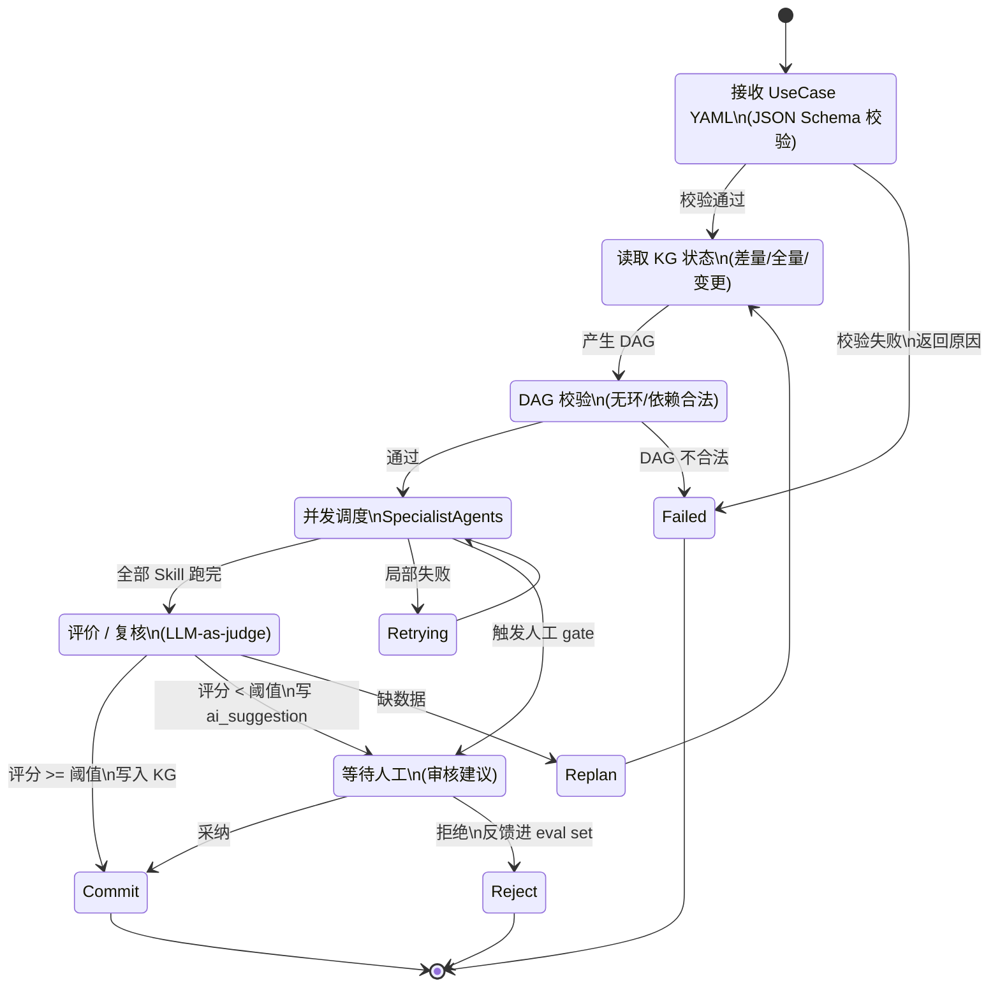
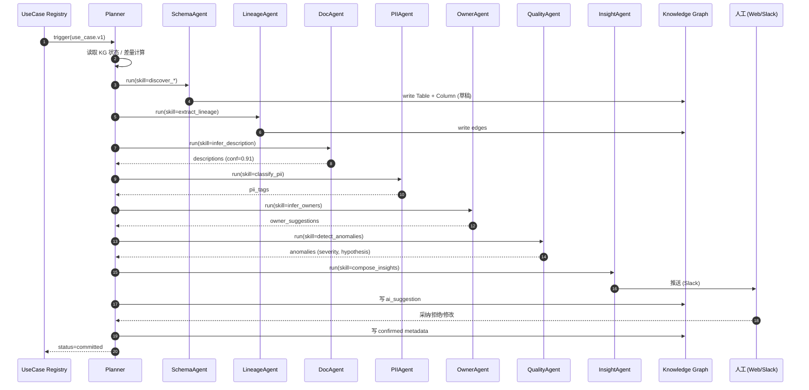
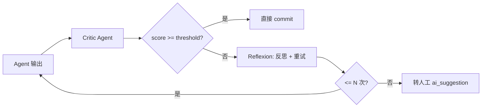
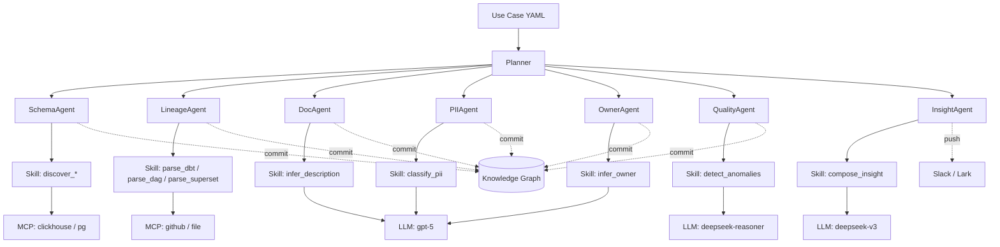

# IDM — 多 Agent 编排设计

> Agent 是「知道要做什么」的决策者
> Skill 是「具体怎么把一件事做对」的执行单元
> Use Case YAML 是「告诉 Agent 要管什么」的唯一入口
> 本文给出 1 个 Planner + 8 个 Specialist 的协作图、状态机、失败恢复

---

## 目录

- [1. 设计哲学](#1-设计哲学)
- [2. Agent 角色清单](#2-agent-角色清单)
- [3. Planner 状态机](#3-planner-状态机)
- [4. 协作图（端到端一次任务）](#4-协作图端到端一次任务)
- [5. 通信协议（AgentMessage）](#5-通信协议agentmessage)
- [6. Planner 实现（LangGraph 风格）](#6-planner-实现langgraph-风格)
- [7. Specialist Agent 实现模板](#7-specialist-agent-实现模板)
- [8. Reflection / Critic 机制](#8-reflection--critic-机制)
- [9. 失败恢复与补偿](#9-失败恢复与补偿)
- [10. 性能与并发](#10-性能与并发)
- [11. 安全护栏（Guardrails）](#11-安全护栏guardrails)
- [12. 可观测](#12-可观测)
- [13. 与 Use Case / Skill / MCP 的关系](#13-与-use-case--skill--mcp-的关系)

---

## 1. 设计哲学

| 层级 | 职责 | 类比 |
| --- | --- | --- |
| **Use Case YAML** | 业务人员声明「要管什么」 | 客户合同 |
| **Planner** | 拆解 Use Case, 排程 Skills, 调度 Specialists | PM / 项目经理 |
| **Specialist Agent** | 单一领域专家 (Schema / Lineage / Doc / ...) | 技术负责人 |
| **Skill** | 把一件事做对的标准化流程 (MCP + LLM + Validator) | SOP |
| **MCP** | 调外部系统的标准化通道 | 接口 |
| **LLM** | 文本理解 / 推理 / 生成 | 大脑 |

> **绝不**让 LLM 直接调 MCP、**绝不**让 Planner 直接写 SQL。
> **永远**走:Planner → Agent → Skill → MCP。

---

## 2. Agent 角色清单

| # | Agent | 输入 | 输出（写入 KG） | 主要 LLM |
| --- | --- | --- | --- | --- |
| 1 | **Planner** | Use Case YAML + KG 状态 | DAG of (agent, skill) | gpt-5 (强推理) |
| 2 | **SchemaAgent** | MCP 数据源 (CH / PG / Trino) | `Table`, `Column`, `Database` | deepseek-v3 |
| 3 | **LineageAgent** | dbt manifest / Airflow DAG / Superset Export / SQL | `UPSTREAM`, `DOWNSTREAM`, `REFERENCED_BY` | deepseek-v3 + sqlglot |
| 4 | **DocAgent** | Table + sample + 业务术语 | `description`, `glossary_binding` | gpt-5 |
| 5 | **PIIAgent** | Column meta + sample + regex | `pii_class`, `masking_policy` | gpt-5 |
| 6 | **OwnerAgent** | git blame + dbt meta + airflow owner + query log | `owner`, `steward`, `consumer` | gpt-5 |
| 7 | **QualityAgent** | 30 天画像 + LLM 推理 | `anomaly_event`, `metric_baseline` | deepseek-reasoner (R1) |
| 8 | **InsightAgent** | anomaly / 新建资产 / 缺失 owner 等 | `insight` + channel push | gpt-5 |
| 9 | **ChatBIAgent** | 自然语言问题 + schema + 历史 | `sql` + `result` + `chart` | gpt-5 |

> Planner 用 gpt-5 (强规划); 批量 / 长文 / 成本敏感任务用 deepseek-v3; 复杂异常归因用 deepseek-reasoner。

---

## 3. Planner 状态机



---

## 4. 协作图（端到端一次任务）



---

## 5. 通信协议（AgentMessage）

```python
from typing import Literal
from pydantic import BaseModel, Field

class AgentMessage(BaseModel):
    """Agent 之间的统一消息格式"""
    msg_id: str
    run_id: str
    from_agent: str
    to_agent:   str
    intent: str                  # "run_skill" | "request_data" | "notify" | "commit"
    use_case_id: str
    payload: dict
    artifacts: list[str] = []    # refs to KG ids
    trace_id: str                # Langfuse
    retry: int = 0

class PlanRequest(BaseModel):
    use_case: dict
    kg_snapshot: dict            # 触发点的 KG 状态
    diff: dict                   # 上次执行后变化

class PlanResponse(BaseModel):
    nodes: list[dict]            # [{agent, skill, args, depends_on, timeout}]
    rationale: str

class AgentResult(BaseModel):
    agent: str
    skill: str
    status: Literal["ok","warn","error"]
    output: dict                 # 写 KG 的内容
    suggestions: list[dict]      # 给人工审核
    metrics: dict                # tokens/cost/latency
    errors: list[str]
```

---

## 6. Planner 实现（LangGraph 风格）

```python
# idm/agents/planner.py
from idm.llm.client import LLM
from idm.agents.registry import AGENTS
from idm.kg import load_snapshot, compute_diff
from idm.tracing import trace

class Planner:
    def __init__(self, llm: LLM):
        self.llm = llm

    @trace(name="planner.plan")
    async def plan(self, use_case: dict) -> PlanResponse:
        snap = await load_snapshot(use_case["id"])
        diff = await compute_diff(use_case, snap)

        prompt = self._build_prompt(use_case, snap, diff)
        resp = await self.llm.complete(
            model="gpt-5",
            messages=[
                {"role": "system", "content": PLANNER_SYS},
                {"role": "user",   "content": prompt}
            ],
            output_type="json",
            schema=PlanResponse.model_json_schema(),
            cache_key=["plan", use_case["id"], diff["hash"]],
            skill="planner.plan",
            use_case=use_case["id"],
        )
        plan = PlanResponse.model_validate_json(resp)
        self._validate_dag(plan)   # 无环 / 依赖合法
        return plan

    def _validate_dag(self, plan):
        seen = set()
        def visit(n):
            if n["skill"] in seen: raise ValueError("cycle")
            for d in n.get("depends_on", []):
                if d in seen: visit({"skill": d})
            seen.add(n["skill"])
        for n in plan.nodes: visit(n)

    async def execute(self, plan: PlanResponse, use_case: dict):
        runner = DAGRunner(plan)
        return await runner.run(use_case)

PLANNER_SYS = """
你是 IDM Planner. 你的任务是把"治理某个数据域"分解为可执行的 DAG.

- 节点 = (agent, skill, args)
- 边 = depends_on
- 必须先 discover, 再 infer, 再 write_kg
- 高 cost 的 skill (LLM) 放在最后, 以便前序失败时早退
- 周期任务用 cron 字段

可用 agents: schema, lineage, doc, pii, owner, quality, insight, chatbi
可用 skills: 见 skills/registry.yaml
"""
```

```python
# idm/agents/dag_runner.py
import asyncio
from collections import defaultdict

class DAGRunner:
    def __init__(self, plan):
        self.nodes = {n["skill"]: n for n in plan.nodes}
        self.deps  = {n["skill"]: n.get("depends_on", []) for n in plan.nodes}

    async def run(self, use_case):
        results = {}
        # 拓扑分层
        layers = self._topo_layers()
        for layer in layers:
            # 同层并发
            coros = [self._run_one(skill, use_case, results) for skill in layer]
            layer_results = await asyncio.gather(*coros, return_exceptions=True)
            for skill, r in zip(layer, layer_results):
                if isinstance(r, Exception):
                    raise PlannerError(skill, r)
                results[skill] = r
        return results

    def _topo_layers(self):
        indeg = {s: len(self.deps[s]) for s in self.nodes}
        adj = defaultdict(list)
        for s, ds in self.deps.items():
            for d in ds: adj[d].append(s)
        layers = []
        while indeg:
            layer = [s for s, d in indeg.items() if d == 0]
            layers.append(layer)
            for s in layer:
                indeg.pop(s)
                for nxt in adj[s]:
                    indeg[nxt] -= 1
        return layers
```

---

## 7. Specialist Agent 实现模板

```python
# idm/agents/base.py
from idm.skills.runner import SkillRunner
from idm.llm.client import LLM
from idm.kg import KGClient
from idm.llm.cache import cached

class BaseAgent:
    name = "base"

    def __init__(self, llm: LLM, kg: KGClient):
        self.llm = llm
        self.kg  = kg

    async def run(self, skill: str, args: dict, use_case: dict) -> dict:
        spec = load_skill_spec(skill)
        runner = SkillRunner(spec, args=args, ctx={"use_case": use_case},
                             llm=self.llm, kg=self.kg)
        return await runner.run()
```

```python
# idm/agents/doc.py
class DocAgent(BaseAgent):
    name = "doc"

    async def generate(self, assets: list[dict], use_case: dict) -> list[dict]:
        out = []
        for a in assets:
            text = await self.llm.complete(
                model="gpt-5",
                messages=[
                    {"role":"system","content": DOC_SYS},
                    {"role":"user","content":
                        f"表名:{a['fqn']}\nSchema:{a['columns']}\n"
                        f"Sample:{a['sample'][:5]}\n术语:{use_case.get('glossary','')}"}
                ],
                output_type="text",
                cache_key=["doc", a["fqn"], hash_schema(a)],
                skill="doc.generate",
                use_case=use_case["id"],
            )
            out.append({"fqn": a["fqn"], "description": text,
                        "confidence": 0.85, "source": "gpt-5"})
        return out

    async def review(self, items: list[dict]) -> list[dict]:
        # 自我反思
        for it in items:
            r = await self.llm.complete(
                model="gpt-5",
                messages=[
                    {"role":"system","content": DOC_CRITIC_SYS},
                    {"role":"user","content": str(it)}
                ],
                output_type="json",
                schema={"score": int, "issues": list[str]}
            )
            it["review"] = r
        return items
```

---

## 8. Reflection / Critic 机制



**Critic Prompt 示例**:

```text
你是一名数据治理审核员, 检查 description 是否合格:
- 准确性 (不夸大, 不编造)
- 具体性 (含业务实体/动作)
- 简洁性 (<= 80 字)
- 中文通顺
返回 JSON: { "score": 0~1, "issues": [...], "rewrite_suggestion": "..." }
```

**阈值配置**:

```yaml
# config/agents.yaml
doc:
  critic_threshold: 0.80
  max_reflexion: 2
pii:
  critic_threshold: 0.95   # PII 要严
  max_reflexion: 1
quality:
  critic_threshold: 0.70
  max_reflexion: 3
```

---

## 9. 失败恢复与补偿

| 失败类型 | 策略 |
| --- | --- |
| **Skill 临时错误 (网络 5xx)** | 自动重试 3 次 (指数回退) |
| **MCP 调用超时** | 重试 2 次 → 标记该步骤 warn, 后续降级 |
| **LLM 输出格式错** | 自动 retry + few-shot, 最多 2 次 |
| **Validator 不通过** | 写 ai_suggestion, 不阻塞 |
| **下游 Skill 依赖失败** | DAG 标记 partial_success, 写 insight |
| **整个 use case 失败** | 入 dlq, 写告警, 不影响其他 use case |
| **Critic 持续低分** | 自动触发 few-shot 增量训练, 通知 Owner |

```python
# idm/agents/recovery.py
class RecoveryPolicy:
    TEMP_ERROR_RETRY = 3
    LLM_FORMAT_RETRY = 2
    REFLEXION_RETRY  = 2
    DEAD_LETTER_TTL  = 7 * 86400

    async def handle(self, err: Exception, ctx):
        if isinstance(err, TransientError):
            return Retry(self.TEMP_ERROR_RETRY, exp_backoff)
        if isinstance(err, ValidationError):
            return WriteSuggestion()
        if isinstance(err, DependencyError):
            return PartialCommit()
        return DeadLetter(ttl=self.DEAD_LETTER_TTL)
```

---

## 10. 性能与并发

| 维度 | 措施 |
| --- | --- |
| **DAG 同层并发** | asyncio.gather |
| **跨 use case 隔离** | 每个 use_case 一个 asyncio task |
| **LLM 限流** | LiteLLM router + 客户端 semaphore |
| **MCP 限流** | MCP server 端 semaphore |
| **缓存** | 1) LLM 缓存 (Prompt hash)  2) MCP 结果缓存 (60s)  3) 资产层缓存 |
| **批量 LLM** | 多个 asset 描述合并为 batch, 1 次调用 10 条 |
| **失败不阻塞** | use case 之间独立队列 |

**单 use case P95 时延** (10 张表):
| 阶段 | 时延 |
| --- | --- |
| Plan | 2s |
| Schema | 8s (并发) |
| Lineage | 5s (并发) |
| Doc (10 表, batch 5) | 12s |
| PII (50 列) | 6s |
| Owner | 3s |
| Insight | 2s |
| **合计** | **~38s** |

---

## 11. 安全护栏（Guardrails）

```yaml
# config/guardrails.yaml
planner:
  max_nodes_per_plan: 50
  forbidden_skills: [write_prod, drop_table]
  cost_budget_per_run_usd: 1.0

agents:
  schema:
    forbidden_tools: [query]    # 不让跑 SELECT
  pii:
    require_approval: true       # 需人工
  quality:
    require_pii_safe: true      # 强制走本地 LLM

skills:
  detect_anomalies:
    require_pii_safe: true
    min_baseline_days: 7

system:
  max_total_concurrent_runs: 10
  per_user_concurrent_runs: 1
  global_token_budget_per_hour: 2000000
```

**Plan 阶段即拦截**:

```python
async def plan(self, use_case):
    plan = await self._llm_plan(use_case)
    for node in plan.nodes:
        if node["skill"] in FORBIDDEN:
            raise GuardrailViolation(node)
        if node["estimated_cost"] > use_case.budget:
            raise BudgetViolation(node)
    return plan
```

---

## 12. 可观测

| 指标 | 来源 |
| --- | --- |
| **Trace** (Planner → Agent → Skill → MCP/LLM) | Langfuse |
| **Span** (每个 LLM call, MCP call, Validator) | OTel |
| **Metrics** (latency, cost, success_rate) | Prometheus |
| **Logs** (结构化 JSON) | Loki |
| **KG 写入历史** | PostgreSQL audit log |
| **使用方回放** | ai_suggestion + llm_feedback |

**统一 Trace ID** 在 `run_id` 上, 贯穿 Planner → Agent → Skill → MCP → LLM。

---

## 13. 与 Use Case / Skill / MCP 的关系



> **YAML 一份, Agent 全跑, Skill 稳做, MCP 零侵入。**

---

## 附录 A. Planner Prompt 全文

```text
# System
你是 IDM Planner Agent.
你的职责: 把一份 UseCase 拆解为可执行的 DAG.

# Rules
1. 节点 = { agent, skill, args, depends_on[], timeout_sec }
2. 顺序: discover → extract → infer → write_kg → notify
3. 同类 skill 并行, 严禁串行无依赖项
4. 周期任务 (cron) 放最后
5. 禁止任何破坏性 skill
6. 不可超过 budget (默认 $1/run)

# Output (JSON Schema)
{ "nodes":[ { "agent": str, "skill": str, "args": dict,
              "depends_on": [str], "timeout_sec": int } ] }

# UseCase
{{ use_case_yaml }}

# Available agents
{{ available_agents }}

# Available skills
{{ available_skills }}

# Diff (上次执行后变化)
{{ diff }}
```

## 附录 B. 反思 (Reflexion) Prompt

```text
你上一次的输出: {{ last_output }}
评分: {{ score }}
问题: {{ issues }}
请重新生成, 必须解决上述问题, 并保留合理部分.
```

## 附录 C. 多 Use Case 并发调度

```python
# idm/scheduler/multi_uc.py
class MultiUCScheduler:
    async def tick(self):
        runs = await self.pick_due()       # cron + 触发
        sem  = asyncio.Semaphore(10)
        async def _run(r):
            async with sem:
                return await self.run_uc(r)
        return await asyncio.gather(*[_run(r) for r in runs])
```

---

> 📌 **配套阅读**：[mcp-first-architecture.md](./mcp-first-architecture.md) · [skills-design.md](./skills-design.md) · [use-case-spec.md](./use-case-spec.md) · [walkthrough.md](./walkthrough.md) · [llm-router.md](./llm-router.md) · [eval-harness.md](./eval-harness.md) · [insight-alerting.md](./insight-alerting.md)
