# IDM — AI 驱动的核心设计

> 📌 **实现前先读**: [AGENT_INSTRUCTIONS.md](../AGENT_INSTRUCTIONS.md) — 宪法级摘要, 含 5 大原则 / 1+9 Agent / Skill 规范 / 5 大绝对不能做 / 关键 ADR。

> 解决一个根本问题：
> **传统元数据平台为何 80% 时间在做 Connector 适配，而数据团队仍然得不到一个真正可用的「数据大脑」？**
> 本文给出 IDM 的回答：**MCP-First 零侵入 + LLM 主动观察 + LLM 主动理解 + LLM 主动建议 + Skills 稳定执行**。

---

## 目录

- [1. 传统元数据平台为何失效](#1-传统元数据平台为何失效)
- [2. AI 驱动的核心思想](#2-ai-驱动的核心思想)
- [3. 核心 Agent 设计 (1+9 模式)](#3-核心-agent-设计-19-模式)
- [4. Zero-Touch: MCP 观察层](#4-zero-touch-mcp-观察层)
- [5. Schema-as-Prompt：让 LLM 理解资产](#5-schema-as-prompt让-llm-理解资产)
- [6. 知识图谱与 LLM 的双向循环](#6-知识图谱与-llm-的双向循环)
- [7. NL2SQL：安全 + 智能的查询代理](#7-nl2sql安全--智能的查询代理)
- [8. 主动 Insight：从「目录」到「顾问」](#8-主动-insight从目录到顾问)
- [9. 评估与护栏](#9-评估与护栏)
- [10. 失败模式与应对](#10-失败模式与应对)
- [11. M2.x 新增: 语义增强 (让 LLM 零样本可用)](#11-m2x-新增-语义增强-让-llm-零样本可用)
- [12. M2.x 新增: 列级血缘与组件级描述](#12-m2x-新增-列级血缘与组件级描述)

---

## 1. 传统元数据平台为何失效

### 1.1 三个根本痛点

| 痛点 | 现象 | 根因 |
| --- | --- | --- |
| **集成成本** | 80+ Connector，每接一个系统要 1~4 周 | 平台要求业务系统主动「告诉它」 |
| **数据静态** | 元数据采集 = 一周一次 ETL | 没有实时流；变更难追踪 |
| **价值单薄** | 有了目录但不知道「哪个资产重要」「谁该治理」 | 只采集结构化信息，缺语义、缺推理 |

### 1.2 一个隐喻

> 传统平台像一个**问卷系统**：
> 「请每个系统填写一份自我介绍」→ 80% 的人懒得写，填的也常常过时。
>
> IDM 想做的是**一位坐在产线旁的资深数据工程师**：
> 他不需要你填表；他看你的代码、你的 SQL、你的查询日志、你的 dbt 文件，就能告诉你
> 「这张表里 `user_email` 是 PII，应该打 Tag」「`orders_daily` 实际上周一开始没人查了，可以归档」。

---

## 2. AI 驱动的核心思想

### 2.1 三个转变

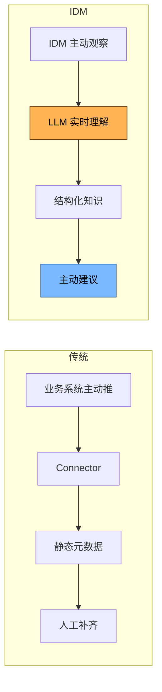

| 传统 | IDM |
| --- | --- |
| 业务系统主动 push | IDM **MCP 主动观察** (零侵入) |
| 结构化 ETL | LLM **实时理解** |
| 人工补 Description | Agent **主动建议** |
| 静态目录 | **主动 Insight** 推送 |
| 写 Connector | 自建 MCP Server 5~50 行 |

### 2.2 五大设计原则

1. **MCP-First, Zero-Touch** — 零侵入, 标准协议, IDM 是 MCP Client
2. **UseCase-as-Config** — 业务团队只交付 1 份 YAML
3. **Agent-Orchestrated** — 1 Planner + 9 Specialist Agent
4. **Skills-Stable** — 标准化 SOP, 可测试, 可重放, 不直接调 LLM
5. **AI in the Loop, Human in the Lead** — LLM 先做, 人审核; 不替代人

---

## 3. 核心 Agent 设计 (1+9 模式)

> 详细设计见 [agent-orchestration.md](./agent-orchestration.md)。本文给概览。


### 3.1 Doc Generator Agent → Skill: infer_table_description

**目标**：自动为每张表/列写高质量 Description

**输入**：
- 表名、列名、类型
- dbt 注释（如有）
- 5~20 条 sample row（来自 CH `SELECT ... LIMIT 20`）
- 上下游血缘中的「邻居」

**流程**：
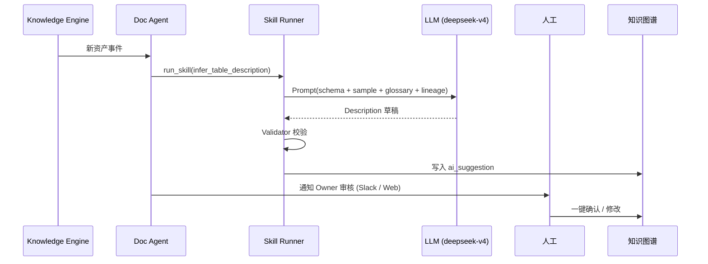

**Prompt 模板 (示例)**：
```text
你是一位资深数据工程师。请根据以下信息为这张 ClickHouse 表写一段不超过 80 字的中文业务描述。

【表名】shop.orders_daily
【列】order_id (String), user_id (String), gmv (Decimal(18,2)), order_date (Date)
【sample 5 行】...
【dbt 注释】无
【血缘上游】Kafka: orders (来自 order-service)
【血缘下游】dashboard: GMV_Daily, model: churn_v2
【相关业务术语】Glossary: GMV (成交总额)
【公司知识】KPI 定义文档片段: ...
```

### 3.2 Lineage Reasoner Agent

**目标**：把「机器能直接解析的」 + 「需要推理的」血缘都补全

**两类血缘**：

| 类型 | 示例 | 解析方式 |
| --- | --- | --- |
| **显式** | `INSERT INTO t1 SELECT ... FROM t2` | SQL Parser (sqlglot) |
| **显式** | dbt `ref('orders')` | manifest.json |
| **显式** | Airflow `op1 >> op2` | DAG API |
| **隐式** | Looker View 引用了某张表 | LLM 解析 LookML |
| **隐式** | 同名字段在不同表里 | LLM 推断 + 业务术语匹配 |
| **隐式** | Notebook 用 pandas read 某文件 | 代码扫描 |

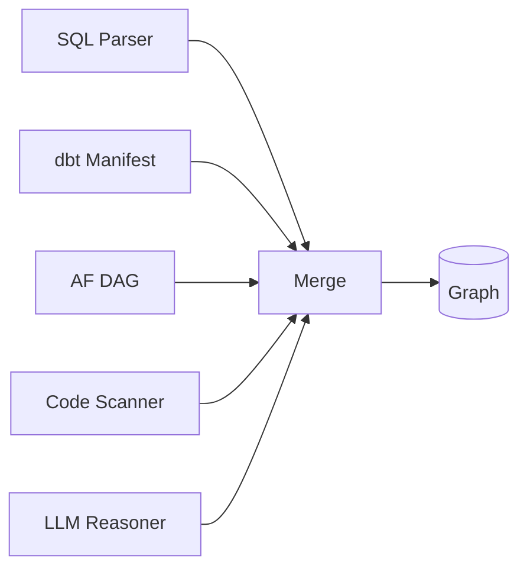

### 3.3 Anomaly Detector Agent

**目标**：**不写规则**，让 LLM 帮你建基线 + 检测漂移

**做法**：
1. 收集 30 天 Profiler 历史 (CH `system.parts` / 自己采样)
2. 让 LLM 推断「这张表的 `gmv` 在每周一会显著升高」— 周期模式
3. 实时比对，触发异常 → Agent 自查 + 通知

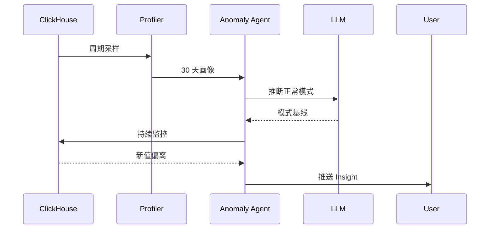

### 3.4 Owner Recommender Agent

**目标**：自动建议资产 Owner（避免「人人无主」）

**信号**：
- Airflow DAG 的 owner 字段
- Git `git blame` 最近 5 个 committer
- dbt Model 注释
- Query log 频次 Top-N user
- **LLM 综合推断**

### 3.5 NL2SQL Agent

**目标**：自然语言 → 准确、可审计、限权的 SQL

详见 [§7](#7-nl2sql安全--智能的查询代理)

---

## 4. Zero-Touch: MCP 观察层

### 4.1 三类观察方式 (MCP-First)

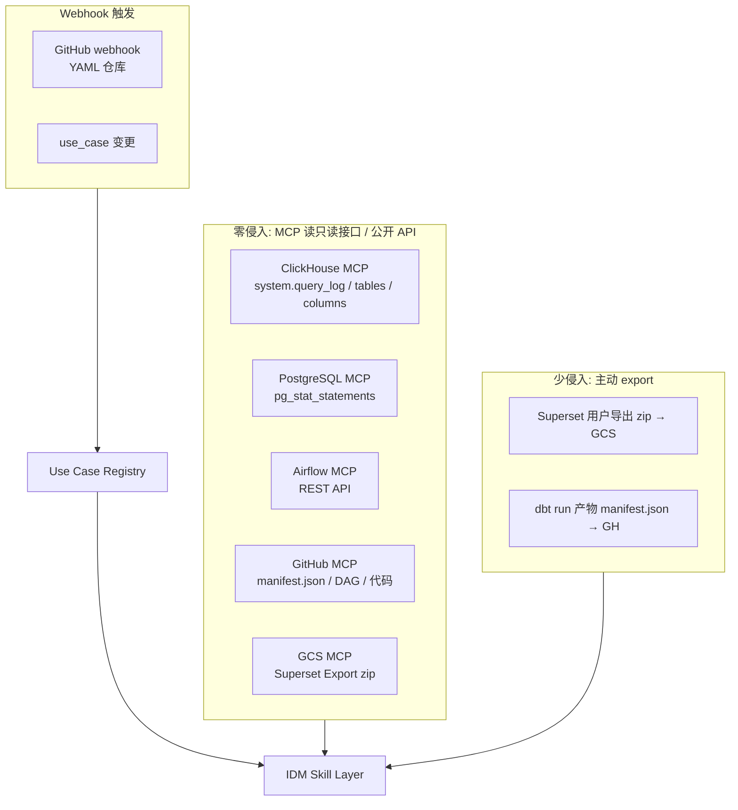

### 4.2 ClickHouse 观察详细设计

> 不在业务路径上做 ETL, 全部通过 MCP Server 走旁路。

```sql
-- 通过 clickhouse MCP 调: tool=list_query_log
-- 后端实际执行
SELECT
  event_time,
  user,
  query_kind,
  query,
  tables,
  columns
FROM system.query_log
WHERE event_time > now() - INTERVAL 5 MINUTE
  AND type != 'QueryStart'
ORDER BY event_time DESC
LIMIT 500;
```

**MCP Server 调用 (Skill 内部)**:

```yaml
mcp_calls:
  - name: tail_query_log
    tool: clickhouse.list_query_log
    args: { lookback: "INTERVAL 5 MINUTE" }
```

### 4.3 业务应用 SDK (可选)

> IDM 不绑死, 业务零侵入; 愿意主动推送的, 可以用:

```python
from idm_sdk import track_dataset

@track_dataset(domain="sales", tier="critical")
def build_orders_daily():
    # 业务函数被自动登记到 IDM
    ...
```

> **重要**：SDK 是**可选**的；缺它业务也能跑。IDM 不绑死。

---

## 5. Schema-as-Prompt：让 LLM 理解资产

### 5.1 知识图谱 = LLM 的「长期记忆」

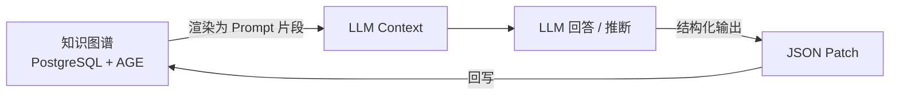

### 5.2 上下文构造 (Context Builder)

**每次 Agent 调用前**，构造如下结构化 prompt：

```text
[角色]
你是 IDM 平台的资深数据工程师,负责 [domain] 域。

[资产]
- 资产 A: shop.orders_daily (Owner: alice@)
  - 描述: ...
  - 关键列: order_id, gmv, order_date
  - 血缘上游: Kafka: orders
  - 血缘下游: dashboard: GMV_Daily
  - 质量: row_count_avg=120k, today=89k ⚠️

[任务]
检测今日 `gmv` 异常下降的原因。
要求: 输出 JSON { "hypothesis": str, "evidence": list[str] }
```

### 5.3 防止 Prompt 爆炸

- **Top-K 检索**：只取与当前任务相关的 5~20 个节点
- **分层摘要**：超过 1000 节点的图 → 先 LLM 摘要成 10 段
- **Token 预算**：单次 prompt ≤ 8k tokens，超出则分级 summary

---

## 6. 知识图谱与 LLM 的双向循环

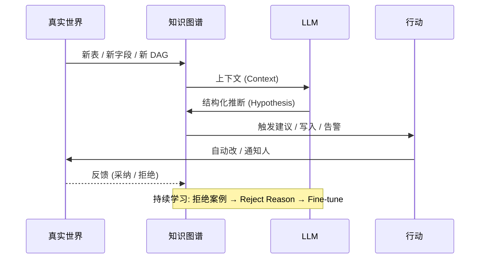

**关键**：
- LLM 输出始终是**结构化 JSON Patch**，可被审计 / 回滚
- 拒绝 / 接受 → 进 `feedback` 表 → 未来优化 prompt / fine-tune

---

## 7. NL2SQL：安全 + 智能的查询代理

### 7.1 端到端流程

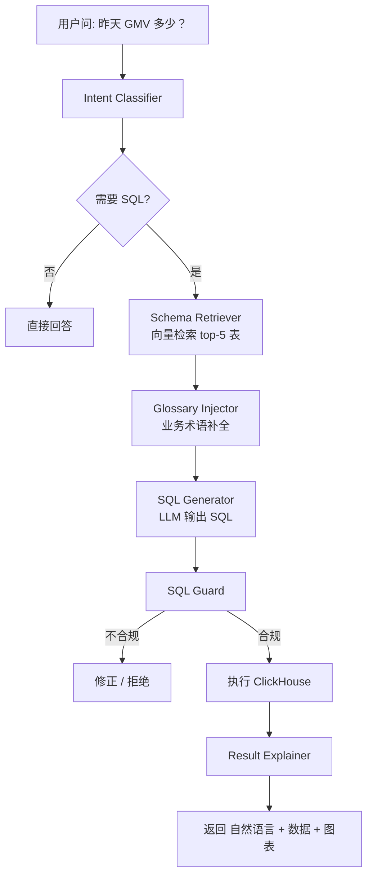

### 7.2 SQL Guard (强约束)

```python
ALLOWED_KEYWORDS = {"SELECT", "WITH", "FROM", "WHERE", "GROUP", "ORDER", "LIMIT", "JOIN"}
FORBIDDEN = {"INSERT","UPDATE","DELETE","DROP","ALTER","TRUNCATE","ATTACH","DETACH","KILL"}

def guard(sql: str) -> tuple[bool, str]:
    parsed = sqlglot.parse_one(sql, dialect="clickhouse")
    if not isinstance(parsed, exp.Select):
        return False, "Only SELECT allowed"
    # 禁函数
    for f in parsed.find_all(exp.Anonymous):
        if f.name.lower() in {"url","file","input","s3","remote"}:
            return False, f"Forbidden function {f.name}"
    # 强制 LIMIT
    if not parsed.args.get("limit"):
        parsed.set("limit", exp.Limit(expression=exp.Literal.number(1000)))
    return True, parsed.sql(dialect="clickhouse")
```

### 7.3 准确度提升机制

| 机制 | 作用 |
| --- | --- |
| **Few-shot 库** | 高频问句 → 人工确认的 SQL 作为示例 |
| **历史 Query 检索** | 「类似问题」的 SQL 直接复用 |
| **Schema 约束生成** | Prompt 中只列**相关表**的列 |
| **自检 (Self-Critique)** | LLM 跑 SQL 描述, 确认无歧义再返 |
| **Feedback Loop** | 用户改写 → 校正 → 写回 Few-shot |

---

## 8. 主动 Insight：从「目录」到「顾问」

### 8.1 三个层次的 Insight

| 层次 | 时机 | 形式 | 例子 |
| --- | --- | --- | --- |
| **实时** | 事件触发 | 通知 | `dashboard: GMV_Daily 数据延迟 2h` |
| **每日** | 09:00 推送 | 简报 | Top 5 异常 / Top 5 Owner 缺失 / 趋势 |
| **周/月** | 周一 09:00 | 报告 PDF | 健康分 / 治理成熟度 / 资产增长 |

### 8.2 Insight Composer Agent

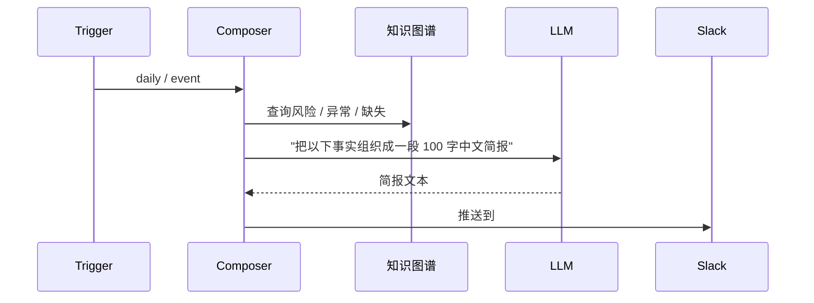

---

## 9. 评估与护栏

### 9.1 评估指标

| 指标 | 测量 |
| --- | --- |
| **文档采纳率** | Agent 建议被人工确认的比例 |
| **血缘准确率** | 自动血缘 vs 人工抽样 |
| **NL2SQL 准确率** | 「能跑」+ 「结果正确」 比例 |
| **Anomaly Precision** | 告警中真实异常比例 |
| **Owner 命中率** | 推荐 Owner 命中真实 Owner 比例 |
| **MTTR for data issue** | 数据问题发现到解决时间 |

### 9.2 护栏 (Guardrails)

| 风险 | 护栏 |
| --- | --- |
| LLM 幻觉 | Schema 强约束 + 输出 JSON Schema 校验 |
| 误改元数据 | 写操作全部进 `pending` 状态，**人确认后才生效** |
| LLM 泄露敏感数据 | 送 LLM 前 PII Masking |
| 误执行破坏性 SQL | SQL Guard + 只读账号 + 强制 LIMIT |
| 误告警 | 告警去重 + 抑制 + Owner 反馈学习 |

---

## 10. 失败模式与应对

| 失败 | 表现 | 应对 |
| --- | --- | --- |
| **LLM 不可用** | Agent 全部停滞 | 退化到规则模式 + 缓存 + 异步重试 |
| **Schema 剧变** | 实体消歧失效 | Entity Resolver 加阈值 + 人工仲裁 |
| **业务不配合** | 没有 OTEL / 没有 Manifest | 不强求；用「Observe, Don't Integrate」降级 |
| **数据量爆炸** | PG 单表过大 | 按 tenant_id 分表 + 冷数据归档到 GCS |
| **LLM 成本失控** | Token 费用飙升 | Context 预算 + Embedding 缓存 + 错峰批处理 |
| **人不愿意用** | 建议被一直接拒绝 | 持续展示价值 (Insight) + 治理 KPI 关联 |

---

## 11. 列级血缘与智能描述推断 (Column-Level Lineage & Smart Description Inference) — M2.x

> **核心问题 (M1.5 的天花板)**: 资产 / 血缘 / 列在 KG 里都是干瘪的 FQN 和字段名。LLM 看到的是
> `clickhouse-prod.shop.fct_orders_risk_daily` + `risk_score` 这种"裸符号" — 业务含义 0 上下文。
> 同时血缘只有表级别: `risk_score` 是怎么从 MEX 模型 `risk_score_v2` 派生出来的? 完全丢失。
>
> **M2.x 的回答**: 同时解决两个问题 ——
>
> | 能力 | 之前 (M1.5) | 之后 (M2.x) |
> | --- | --- | --- |
> | **列级血缘** | 血缘只到表, 列转换全丢 | `column_lineage` 表 + sqlglot 静态解析 + LLM 兜底 |
> | **表描述推断** | 业务人员手写 | 规则 (30%) + 样本/类型 (30%) + 血缘模板 (20%) + LLM 兜底 (20%) |
> | **列描述推断** | 完全空 | PII 优先 + 列名正则 + 值模式 + 类型 + LLM 兜底 |
> | **组件级血缘描述** | `upstream → downstream` 两行字 | `component + transform_type` → 自然语言模板 + LLM 补全 |
>
> **本文是这两大能力的统一权威文档** (合并了原 §11 语义增强 + 原 §12 列级血缘)。
> 历史内容已迁移到 [data-model.md §7](./data-model.md#7-语义增强子层-m2x-新增--semantic-enrichment-已迁移) (跳转占位) 与
> [data-pipeline-lineage.md §4.3](./data-pipeline-lineage.md#43-m2x-新增-列级血缘--语义描述-semantic-enrichment-已迁移) (跳转占位)。

### 11.1 三视角: M1.5 → M2.x 三个转变

```mermaid
flowchart LR
    subgraph M15[M1.5 (无描述 / 无列级)]
        A1[资产 FQN<br/>clickhouse-prod.shop.fct_orders_risk_daily]
        A2[列名<br/>risk_score]
        A3[边<br/>upstream_table → downstream_table]
    end
    subgraph M2x[M2.x (有描述 + 有列级)]
        B1[资产描述<br/>"订单风险事实表, 天粒度, 包含 risk_score (0-1)"]
        B2[列描述<br/>"风险评分, 由 MEX 模型派生, 值越大风险越高"]
        B3[组件级边描述<br/>"由 Airflow etl_orders_daily 复制, 含 MEX 模型派生"]
        B4[列级血缘<br/>risk_score ← stg.amount (cast) ← orders.amount (direct)]
    end
    A1 -->|infer_table_description| B1
    A2 -->|infer_column_descriptions| B2
    A3 -->|infer_lineage_descriptions| B3
    A3 -->|infer_column_lineage / lineage_to_column| B4
    style B1 fill:#7AB8FF,stroke:#003366
    style B2 fill:#7AB8FF,stroke:#003366
    style B3 fill:#7AB8FF,stroke:#003366
    style B4 fill:#7AB8FF,stroke:#003366
```

| 视角 | M1.5 (无 / 不全) | M2.x (有 / 全) |
| --- | --- | --- |
| **架构师 / 平台** | 资产 = FQN, 血缘 = 表, LLM 零样本不可用 | 资产 / 列 / 边都有 NL 描述, LLM 零样本可用 |
| **后端 / Data 工程师** | 5+ 字段散在多表; 无 SQL 解析; 无规则引擎 | `column_lineage` 单表 + sqlglot 100% 准确 + 4 个稳定 Skill |
| **前端 / 用户** | 资产卡片只显示 FQN; 血缘图只到表 | 列详情 + 描述 + PII + 上游/下游图; 列级 ReactFlow |
| **AI Agent** | 每次都要问业务: "risk_score 是什么?" | 读 description 直接生成 SQL / 影响分析 / 异常归因 |

### 11.2 总体架构 (一张图)

```mermaid
flowchart TB
    subgraph Inputs[输入信号源 (4 类)]
        I1[metadata: 表名 / 列名 / 数据类型 / 注释]
        I2[samples: 列 sample N 个值]
        I3[lineage: 已有表/列血缘 + 组件 / transform]
        I4[pii: PII 分类 + confidence]
    end

    subgraph Inference[推断层 (3 层, 规则优先 → LLM 兜底)]
        L1[规则层 (零 LLM)<br/>name pattern / value pattern / PII hint / type hint / 组件模板]
        L2[LLM 兜底层<br/>DeepSeek V4 cheap profile]
        L3[人工审核层<br/>ai_suggestion.pending → confirm/reject]
    end

    subgraph Outputs[输出 (写入 KG)]
        O1[table_asset.description<br/>60-120 字]
        O2[column_asset.description<br/>30-60 字]
        O3[table_lineage.description<br/>20-50 字]
        O4[column_lineage.description<br/>20-50 字]
        O5[column_lineage 边 (upstream_col → downstream_col)]
    end

    I1 --> L1
    I2 --> L1
    I3 --> L1
    I4 --> L1
    L1 -->|规则未命中| L2
    L1 -->|规则命中 / conf ≥ 0.85| L3
    L2 -->|conf ≥ 0.7| L3
    L2 -->|conf < 0.7| L3
    L3 -->|confirm| O1
    L3 -->|confirm| O2
    L3 -->|confirm| O3
    L3 -->|confirm| O4
    L3 --> O5
```

**目标分布**: 70% 规则命中, 25% LLM 兜底, 5% 人工兜底。

### 11.3 推断信号四源 (按权重)

| 信号源 | 占比 | 角色 | 例子 |
| --- | --- | --- | --- |
| **metadata: 表名 / 列名 / 数据类型 / 字段** | 30% | 强信号, 规则命中 | `fct_*_daily` → "fact, daily grain"; `*_email` → "PII 邮箱"; `Decimal(18,2)` → "金额, 2 位小数" |
| **样本值 (samples)** | 30% | 强信号, 启发式 | ISO 3166-1 → "国家代码"; 11 位数字 → "中国手机号" |
| **血缘边 + 组件 (lineage + component)** | 20% | 强信号, 模板 | `airflow_task` → "由 Airflow DAG X.task Y 复制"; `mex_model` → "MEX 模型派生" |
| **LLM 兜底** | 20% | 弱信号, 兜底 | 上面都未命中 → LLM 综合推断 (cheap profile) |

> **"表面" = "表名" (surface in DAMA 术语)**: 在推断中, 表名是 metadata 的"最外层", 也是最高优先级信号 ——
> `fct_*_daily` / `dim_*` / `stg_*` / `ods_*` 这些前缀足以确定表角色与粒度, 不必调 LLM。

### 11.4 推断策略: 规则优先, LLM 兜底

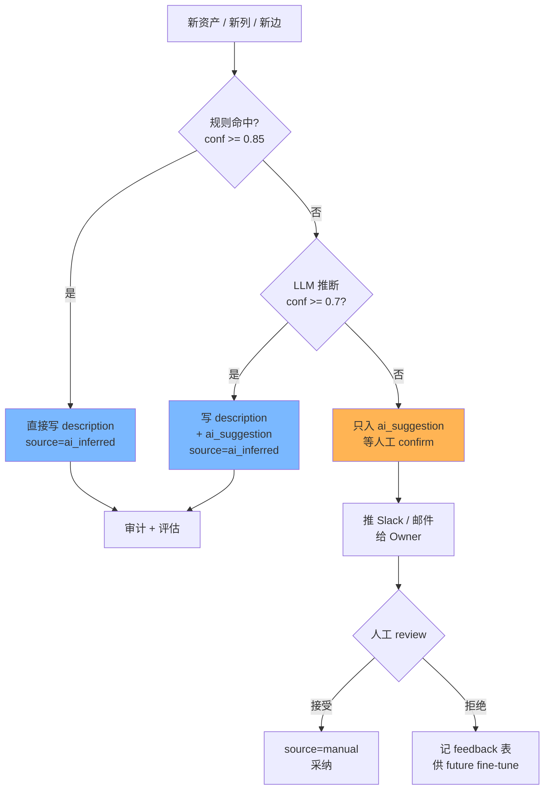

---

## 11A. 列级血缘 (Column-Level Lineage)

### 11A.1 表级 vs 列级血缘 (对比)

| 维度 | M1.5 表级 | M2.x 列级 |
| --- | --- | --- |
| 粒度 | 表 → 表 | 列 → 列 |
| 转换类型 | `transform` (string) | `transform_type` (enum: `direct`/`rename`/`cast`/`aggregation`/`expression`/`derivation`/`passthrough`) + `transform_expression` (原文) |
| 组件 | 1 个 (`component`) | 多个 (列级粒度: source 列 / target 列可能跨多个组件) |
| 描述 | 无 | 20-50 字, 含 `transform_expression` |
| 用途 | 影响分析, 表归档 | 字段级血缘, 数据质量归因, 字段级血缘图, ChatBI 自动生成 SQL |
| 存储表 | `table_lineage` | `table_lineage` (保留) + 新表 `column_lineage` |

```mermaid
flowchart LR
    subgraph TableLevel[表级血缘 (M1.5)]
        T1[gcs://orders-*.csv]:::raw --> T2[stg_orders]:::stg
        T2 --> T3[fct_orders_risk_daily]:::fct
    end
    subgraph ColumnLevel[列级血缘 (M2.x)]
        C1A[orders.user_id] --> C2A[stg_orders.user_id]
        C1B[orders.amount] --> C2B[stg_orders.amount]
        C2A --> C3A[fct.risk_score.input_user_id]
        C2B --> C3B[fct.risk_score.input_amount]
        C3A --> C4[fct.risk_score<br/>MEX 派生]
        C3B --> C4
    end
    classDef raw fill:#FFE4B5
    classDef stg fill:#B0E0E6
    classDef fct fill:#FFB6C1
```

### 11A.2 推断策略 (3 层)

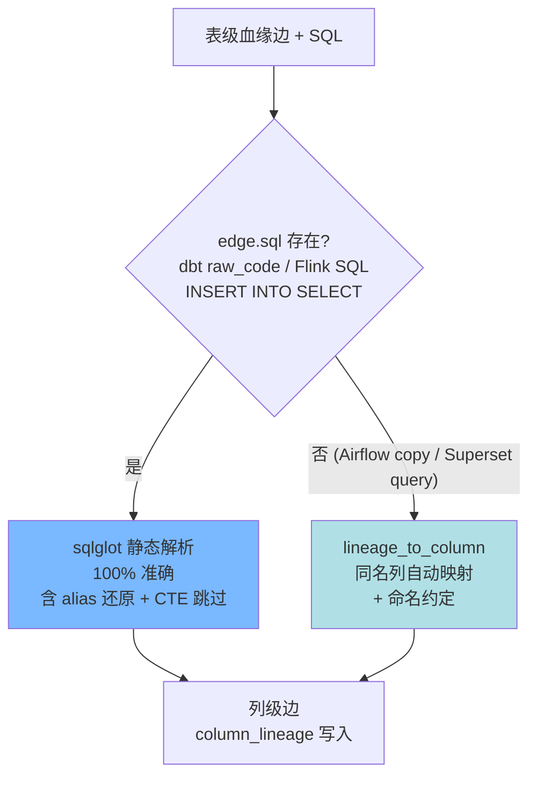

> **设计要点**: 当 `edge.sql` 存在时, `infer_column_lineage` 与 `lineage_to_column` 都跳过同名映射 fallback
> (避免在 SQL 已知的情况下产生 JOIN 中间表的假阳性, 如 `stg_orders` 通过 CTE 间接引用时被错配到下游列)。

| 层级 | 占比 | 工具 | 何时用 | 置信度 |
| --- | --- | --- | --- | --- |
| **L1: 静态解析** | ~60% (含 CTE/JOIN/CAST) | sqlglot + `_build_alias_map` (u → users, cs → country_seed) | 有 `edge.sql` 时 (dbt/Flink/INSERT) | 1.0 |
| **L2: 同名映射** | ~30% | `lineage_to_column` (仅在 SQL 缺失时) | 表级血缘边, 同名列自动展开 | 0.7 (同名 ≠ 同义) |
| **L3: LLM 兜底** | ~10% | DeepSeek V4 cheap | 复杂表达式 / 跨命名约定 | 0.6~0.8 |

**输入**:
- `use_case_id` (从 `use_cases/*.yml` 拿 SQL 文本)
- `table_pair` (`upstream_fqn + downstream_fqn`)

**输出** (写入 `column_lineage`):

| 字段 | 例子 |
| --- | --- |
| `upstream_column_id` | `gcs://orders-*.csv.user_id` 对应的 `column_asset.id` |
| `downstream_column_id` | `clickhouse.shop.stg_orders.user_id` 对应的 `column_asset.id` |
| `transform_type` | `direct` / `cast` / `aggregation` / `expression` / `rename` / `derivation` / `passthrough` |
| `transform_expression` | `CAST(user_id AS UInt64)` / `SUM(amount) GROUP BY day` |
| `component` | `airflow_task` / `flink_job` / `dbt_model` / `mex_model` / `sql` / `ai_inferred` |
| `description` | "由 user_id 转换为 UInt64 (用户 ID)" |
| `description_source` | `sqlglot` / `dbt_ref` / `ai_inferred` / `manual` |
| `confidence` | 1.0 (静态) / 0.7-0.9 (LLM) |
| `pipeline_stage` | 1..6 |
| `job_id` | `f"{source}:{edge.job_id or use_case_id}"` (避免与 `lineage_to_column` 冲突) |

### 11A.3 6 阶段管道中的列级血缘样例 (典型)

| 阶段 | 上游列 | 下游列 | transform_type | transform_expression | description |
| --- | --- | --- | --- | --- | --- |
| 1 | `gcs://orders-*.csv.order_id` | `clickhouse.shop.stg_orders.order_id` | `direct` | `order_id` | "原样透传 order_id (订单编号)" |
| 1 | `gcs://orders-*.csv.user_id` | `clickhouse.shop.stg_orders.user_id` | `cast` | `CAST(user_id AS UInt64)` | "由 user_id 转换为 UInt64 (用户 ID)" |
| 2 | `clickhouse.shop.stg_orders.amount` | `gcs://model-input/orders-*.parquet.amount` | `cast` | `CAST(amount AS Decimal(18,2))` | "由 amount 转换为 Decimal(18,2) (订单金额, 单位元)" |
| 3 | `gcs://model-input/orders-*.parquet.amount` | `gcs://model-output/orders-*.parquet.risk_score` | `expression` | `model.predict_proba([amount, age, ...])` | "MEX 黑盒模型 risk_score_v2 派生表达式 (输入 amount + age + ..., 输出 0-1 风险分)" |
| 5 | `gcs://model-output/orders-*.parquet.*` | `clickhouse.shop.fct_orders_risk_daily.*` | `aggregation` | `SUM(risk_score) GROUP BY day` | "聚合表达式 SUM(risk_score) 按 day 分组" |
| 6 | `clickhouse.shop.fct_orders_risk_daily.*` | `superset.dashboard.1.*` | `derivation` | `chart.virtual_columns: [risk_level=CASE WHEN risk_score>0.8 THEN 'high'...]` | "由 Superset chart 虚拟列派生 risk_level (高/中/低风险)" |

### 11A.4 数据模型 (列级血缘)

```sql
-- 列级血缘 (M2.x 新表, 见 packages/kg/src/idm_kg/models/column_lineage.py)
CREATE TABLE column_lineage (
  id                    UUID PRIMARY KEY DEFAULT gen_random_uuid(),
  upstream_table_id     UUID NOT NULL REFERENCES table_asset(id) ON DELETE CASCADE,
  downstream_table_id   UUID NOT NULL REFERENCES table_asset(id) ON DELETE CASCADE,
  upstream_column_id    UUID NOT NULL REFERENCES column_asset(id) ON DELETE CASCADE,
  downstream_column_id  UUID NOT NULL REFERENCES column_asset(id) ON DELETE CASCADE,
  transform_type        TEXT NOT NULL,        -- direct | rename | cast | aggregation | expression | derivation | passthrough
  transform_expression  TEXT,                  -- 源表达式原文
  job_id                TEXT,
  component             TEXT,                  -- airflow_task | flink_job | dbt_model | mex_model | sql | ai_inferred
  description           TEXT,                  -- 列级自然语言描述
  description_source    TEXT,                  -- manual | ai_inferred | imported
  confidence            REAL NOT NULL DEFAULT 1.0,
  source                TEXT NOT NULL DEFAULT 'sqlglot',  -- sqlglot | dbt_ref | flink_plan | ai_inferred | manual | lineage_to_column
  pipeline_stage        SMALLINT,              -- 1..6
  extra                 JSONB NOT NULL DEFAULT '{}'::jsonb,
  created_at            TIMESTAMPTZ NOT NULL DEFAULT now(),
  updated_at            TIMESTAMPTZ NOT NULL DEFAULT now(),
  UNIQUE (upstream_column_id, downstream_column_id, transform_type, job_id)
);
CREATE INDEX idx_col_lineage_down ON column_lineage(downstream_column_id);
CREATE INDEX idx_col_lineage_up   ON column_lineage(upstream_column_id);
CREATE INDEX idx_col_lineage_down_table ON column_lineage(downstream_table_id);
CREATE INDEX idx_col_lineage_up_table   ON column_lineage(upstream_table_id);
```

### 11A.5 关键 SQL (列级血缘查询)

```sql
-- 某列的所有下游 (impact analysis)
SELECT cl.downstream_column_id, ca.name, cl.transform_expression, cl.description
FROM column_lineage cl
JOIN column_asset ca ON ca.id = cl.downstream_column_id
WHERE cl.upstream_column_id = $1
ORDER BY cl.confidence DESC;

-- 某列的所有上游 (root cause)
SELECT cl.upstream_column_id, ca.name, cl.transform_expression
FROM column_lineage cl
JOIN column_asset ca ON ca.id = cl.upstream_column_id
WHERE cl.downstream_column_id = $1
ORDER BY cl.confidence DESC;

-- 列级血缘覆盖率 (mappable / total)
SELECT
  dt.fqn AS downstream_fqn,
  COUNT(DISTINCT cl.downstream_column_id) AS mapped,
  (SELECT COUNT(*) FROM column_asset WHERE table_id = dt.id) AS total
FROM table_asset dt
LEFT JOIN column_lineage cl ON cl.downstream_table_id = dt.id
GROUP BY dt.id, dt.fqn;
```

### 11A.6 Skills (列级血缘 2 个)

| Skill | 类别 | Agent | 职责 | 关键参数 |
| --- | --- | --- | --- | --- |
| `infer_column_lineage` | lineage (列级) | lineage | sqlglot 静态解析 (`_build_alias_map` + CTE 跳过) | `use_case_id`, `apply`, `table_lineage_id` (单边模式) |
| `lineage_to_column` | lineage (列级) | lineage | 表级 → 列级 同名展开 (仅在 SQL 缺失时, 避免假阳性) | `apply=true`, `min_confidence` |

**核心代码**:

```python
# apps/api/src/idm_api/skills/builtin/infer_column_lineage.py
@skill(name="infer_column_lineage", version=1, agent="lineage")
async def infer_column_lineage(ctx, **inputs):
    """1) sqlglot 静态解析 SQL (alias 还原 + CTE 跳过) → 100% 准确
       2) 仅在 edge.sql 缺失时, 同名映射 fallback → 80% 命中"""
    edges = (await ctx.db.execute(select(TableLineage))).scalars()
    for edge in edges:
        up, down = await ctx.db.get(TableAsset, edge.upstream_id), await ctx.db.get(TableAsset, edge.downstream_id)
        col_edges = []
        # L1: sqlglot 解析 (有 SQL 时优先)
        if edge.sql:
            col_edges = _parse_sql_with_sqlglot(edge.sql, [up.fqn], down.fqn)
        # L2: 同名映射 (仅在 SQL 缺失时)
        if not col_edges and not edge.sql and fallback_to_namematch:
            for up_col in up_cols:
                if up_col.name in down_col_by_name:
                    col_edges.append({...})
        for ce in col_edges:
            # 写 column_lineage (ON CONFLICT DO NOTHING 幂等)
            ...
```

**关键 sqlglot 增强** (M2.5+):
- `_build_alias_map(sql)`: 从 SQL AST 提取 `(alias → table_name)` 映射, 例如 `users u` → `u: users`
- CTE (`WITH x AS ...`) 内的列引用会跳过 (不映射到 CTE 来源表, 避免污染)
- 多 dialect 尝试 (`spark` / `hive` / `postgres` / `clickhouse`), 任一成功即可
- Alias 节点递归解包 (`u.id AS user_id` → `Column` 直接透传, 不被 `Alias` 误判)
- 复合聚合函数名兜底 (`countDistinct` / `sumIf` / `groupArray` 等 ClickHouse 风格, sqlglot 解析为 `Anonymous`, 通过 `_AGG_FN_NAMES` 二次判定)

**支持 transform_type 矩阵**:

| 类型 | 触发模式 | 例子 | 描述模板 |
| --- | --- | --- | --- |
| `direct` | `u.id AS user_id` | 透传 | "原样透传 X (类型 A → B)" |
| `cast` | `CAST(x AS T)` / `x::T` | 类型转换 | "由 X 转换类型至 T" |
| `aggregation` | `SUM/COUNT/AVG/MIN/MAX(x)` + `countDistinct` | 聚合 | "聚合表达式 ..." |
| `window` | `ROW_NUMBER() OVER (...)` / `LAG/LEAD/RANK` | 窗口 | "窗口函数 ..." |
| `arithmetic` | `a + b` / `a * b` / `a / b` | 算术 | "算术运算 ..." |
| `function` | `toDate(x)` / `year(x)` / 未知函数 | 函数调用 | "函数调用 ..." |
| `derivation` | `CASE WHEN x > 0 THEN ...` / `IF(...)` | 条件派生 | "由 X 派生 ..." |
| `expression` | 复杂表达式 (兜底) | 派生 | "派生表达式 ..." |
| `rename` | `RenameAlias` | 重命名 | "重命名 X → Y" |

**幂等保证**:
- `column_lineage` 唯一约束 `(upstream_column_id, downstream_column_id, transform_type, job_id)`
- 用 `pg_insert(...).on_conflict_do_nothing(...)` 避免重复运行报错
- `job_id` 区分: `f"{source}:{edge.job_id or use_case_id}"` (避免 `infer_column_lineage` 与 `lineage_to_column` 冲突)

**dbt 链路示例** (`dim_users` 80% 覆盖):

| 下游列 | transform | source | 上游列 | 来源 |
| --- | --- | --- | --- | --- |
| `user_id` | passthrough | sqlglot | `users.id` | `u.id AS user_id` 直接透传 |
| `email` | passthrough | sqlglot | `users.email` | `u.email AS email` |
| `phone` | passthrough | sqlglot | `users.phone` | `u.phone AS phone` |
| `country` | passthrough | sqlglot | `country_seed.name_zh` | `cs.name_zh AS country` (alias 还原 cs→country_seed) |
| `first_order_at` | (无血缘) | - | - | 来源于 CTE `first_orders`, 非真实上游表 |

### 11A.7 API & UI

| Method | Path | 用途 | 后端代码 |
| --- | --- | --- | --- |
| `GET`  | `/api/v1/lineage/column/stats` | 全局列级血缘统计 (transform / component 分布) | [column_lineage.py](file:///d:/workspace/github-ai/idm/apps/api/src/idm_api/routers/column_lineage.py) |
| `GET`  | `/api/v1/lineage/column/table/{table_id}` | 取某表所有列级血缘 (上+下游) | 同上 |
| `GET`  | `/api/v1/lineage/column/table/{table_id}/{column_name}` | 取某列的所有上+下游 | 同上 |
| `GET`  | `/api/v1/lineage/column/coverage` | **全表列血缘覆盖矩阵 (OpenLineage/Marquez-style)** | 同上 |
| `POST` | `/api/v1/lineage/column/infer-all` | **批量列血缘推断 (三步 pipeline)** | 同上 |
| `POST` | `/api/v1/skills/run` (skill=`infer_column_lineage`) | 触发单条列级血缘推断 (含 `table_lineage_id` 单边模式) | [infer_column_lineage.py](file:///d:/workspace/github-ai/idm/apps/api/src/idm_api/skills/builtin/infer_column_lineage.py) |
| `POST` | `/api/v1/skills/run` (skill=`lineage_to_column`) | 把单条表级血缘自动展开为列级 (含 `table_lineage_id` 单边模式) | [lineage_to_column.py](file:///d:/workspace/github-ai/idm/apps/api/src/idm_api/skills/builtin/lineage_to_column.py) |

**前端页面** ([ColumnLineagePage.tsx](file:///d:/workspace/github-ai/idm/apps/web/src/pages/ColumnLineagePage.tsx)):

| 路由 | 视图 | 关键组件 |
| --- | --- | --- |
| `/lineage/column` | 选表 (列表) | `ColumnLineagePicker` + 全局统计 (4 个 `Stat` + transform/component 分布 Tag) |
| `/lineage/column/coverage` | **全表列血缘覆盖矩阵 (OpenLineage/Marquez-style)** | `ColumnCoverageView` + 单表展开行 + 一键 Backfill 按钮 |
| `/lineage/column/:tableId` | 该表所有列的列级血缘汇总 (OpenLineage-style 表+列节点图) | `TableColumnLineageView` + `OpenLineageStyleLineage` (表框含列列表) |
| `/lineage/column/:tableId/:columnName` | 某列 + 上/下游 (含图) | `ColumnLineageDetail` + `ReactFlow` (center=紫, upstream=绿, downstream=红) |

#### 11A.7.1 OpenLineage-style 展示 (M2.5+)

参考 [OpenLineage](https://openlineage.io/) 与 [Marquez](https://marquezproject.ai/) 的设计:
- **表节点** = 矩形 (header = fqn, body = column list); 颜色按 `asset_type` 区分 (table=蓝/dbt_model=紫/superset=橙)
- **列节点** = 矩形内的一行 (左 = name, 右 = data_type chip); 已有血缘的列高亮
- **边** = directed arrow, label 显示 `transform_type` (direct/rename/cast/aggregation/expression/passthrough)
- **覆盖率色** = 节点右上角小圆点 (绿 ≥80%, 黄 40-79%, 红 <40%, 灰 = 源表 passthrough 100%)

组件: [OpenLineageStyleLineage.tsx](file:///d:/workspace/github-ai/idm/apps/web/src/components/OpenLineageStyleLineage.tsx)
- 复用 ReactFlow 引擎, 但节点模板与 OpenLineage UI 一致
- 节点 = `buildOpenLineageGraph({centerTableId, upstream, downstream, tables, columns})`
- 列的 hover 高亮 + 双击跳转到 `/lineage/column/:tableId/:columnName`

#### 11A.7.2 列血缘覆盖矩阵 (M2.5+ 新增)

`GET /api/v1/lineage/column/coverage` 返回 Marquez-style 覆盖报告:
```json
{
  "total_tables": 22,
  "total_columns": 63,
  "total_columns_with_lineage": 35,
  "overall_coverage_pct": 55.6,
  "tables": [
    {
      "table_id": "...", "table_fqn": "...",
      "n_columns": 5, "n_columns_with_lineage": 2,
      "coverage_pct": 40.0,
      "has_table_lineage": true, "n_table_lineage_edges": 3,
      "columns": [
        {"column_id": "...", "column_name": "user_id", "data_type": "Int64",
         "has_upstream": true, "has_downstream": true,
         "n_upstream_edges": 2, "n_downstream_edges": 2}
      ]
    }
  ]
}
```

**覆盖率计算规则**:
- 源表 (无任何 `table_lineage` 边) = 100% (设计上 passthrough, 无上游可追踪)
- 派生表 (有 `table_lineage` 边) = `有列血缘的列数 / 总列数 × 100%`

**前端覆盖矩阵视图** (`ColumnCoverageView`):
- 总览: 全表覆盖百分比 + 进度条 + 颜色 (绿/黄/红/灰)
- 单表展开行: 列出每列的 `has_upstream` / `has_downstream` 状态
- "Backfill All" 按钮 → 调用 `POST /api/v1/lineage/column/infer-all` 三步推断

#### 11A.7.3 批量列血缘推断 (`POST /api/v1/lineage/column/infer-all`)

确保 **"所有表都能达到列级血缘"** 的关键入口。Request:
```json
{
  "table_ids": null,           // null = 全表
  "include_table_lineage_inference": true,   // Step 1: lineage_reasoner
  "include_column_lineage_inference": true,  // Step 2: infer_column_lineage
  "include_lineage_to_column": true,         // Step 3: lineage_to_column
  "min_confidence": 0.5,        // 同名映射的 confidence 门槛
  "dry_run": false              // true 时不写库
}
```

**三步推断 pipeline** (per table):
1. `lineage_reasoner(target_table_id)` — 推断表级血缘, 让 Step 3 有原料
2. 对每条该表的 `table_lineage` 边:
   - `infer_column_lineage(table_lineage_id=...)` — sqlglot 静态解析 (100% 准确)
   - `lineage_to_column(table_lineage_id=...)` — 同名映射兜底 (80% 命中)

**响应**:
```json
{
  "ok": true,
  "tables_processed": 22, "tables_skipped": 0,
  "table_lineage_edges_created": 0,
  "column_lineage_edges_created": 4,
  "errors": [],
  "summary": {"skill_calls": {"lineage_reasoner": 22, "infer_column_lineage": 22, "lineage_to_column": 22}}
}
```

**实现要点**:
- `expire_on_commit=False` 在 session factory 里设置, 避免 inner skill commit 后 ORM 实例过期
- 提前提取 `(table_id, fqn)` tuple, 避免 lazy-load 在 `try/except` 路径触发 `MissingGreenlet`
- `ON CONFLICT DO NOTHING` 幂等, 可重复跑

**LineagePage.tsx 嵌入** ([LineagePage.tsx:774](file:///d:/workspace/github-ai/idm/apps/web/src/pages/LineagePage.tsx#L774-L870)):
- 在表级 Lineage 页面右下角嵌入 `ColumnLineageView` (column-level summary, mini-graph, 列列表)
- "↗ Column Page" 按钮跳到完整列级血缘页
- "↗ Coverage Matrix" 按钮跳到 `/lineage/column/coverage`

---

## 11B. 智能描述推断 (Smart Description Inference — 表 / 列 / 边)

> **核心输入**: metadata (表名/列名/类型/注释) + 样本值 + 血缘上下文 + PII 分类
> **目标**: 在 LLM 视角下, 数据资产"会说话"。

### 11B.1 表描述推断 (`infer_table_description` 增强)

| 项 | 内容 |
| --- | --- |
| 输入 | `table_ids[]` (空 = 全表) + sample N 行 (CH 采样) + 上下游 5 邻居 + Glossary terms |
| 处理 | (1) **表名模式** → 角色 (fact/dim/stg) + 粒度 (daily/hourly) ; (2) **列结构** → 业务域; (3) **样本** → LLM 推断业务主题 |
| 输出 | `table_asset.description` (60-120 字) + `description_source` + `description_rationale` + `ai_suggestion` 副本 |
| 代码 | [infer_table_description.py](file:///d:/workspace/github-ai/idm/apps/api/src/idm_api/skills/builtin/infer_table_description.py) |

**表名模式 (零 LLM, 强信号)**:

| 表名模式 | 推断角色 | 置信度 |
| --- | --- | --- |
| `fct_*` / `fact_*` | 事实表 (业务事件) | 0.95 |
| `dim_*` | 维度表 (实体) | 0.95 |
| `stg_*` / `stage_*` | 临时表 (预处理中间落盘) | 0.90 |
| `ods_*` | 贴源层 (Operational Data Store) | 0.90 |
| `*_daily` / `*_hourly` / `*_monthly` | 粒度 (天/时/月) | 0.95 |
| `*_raw` | 原始层 (未清洗) | 0.85 |

### 11B.2 列描述推断 (`infer_column_descriptions`) — **M2.x 核心新增**

> **核心**: 根据 **metadata (列名 / 数据类型 / 字段) + 样本值 + PII 分类 + 表面 (表名)**, 推断该列的业务描述。

| 项 | 内容 |
| --- | --- |
| 输入 | `table_ids[]` (空 = 全表) + 列名 + 类型 + sample N 个值 + PII 分类 |
| 处理 | (1) **PII 优先** (高置信 0.85-0.95); (2) **值模式** (regex/ISO/枚举) → 15% 命中; (3) **列名模式** → 70% 命中; (4) **类型兜底**; (5) LLM 兜底 |
| 输出 | `column_asset.description` (30-60 字) + `description_source` + `description_rationale` + `ai_suggestion` 副本 |
| 代码 | [infer_column_descriptions.py](file:///d:/workspace/github-ai/idm/apps/api/src/idm_api/skills/builtin/infer_column_descriptions.py) |

#### 11B.2.1 推断信号优先级 (5 层)

```python
def _rule_infer(col: ColumnAsset) -> tuple[str, float, str] | None:
    # 优先级: PII (最准) > 值模式 > 列名 > 类型
    # 1) PII 分类 (最准, conf 0.85-0.95)
    pii_hint = _ppii_class_hint(col.pii_class) if col.pii_class != "none" else ""
    if pii_hint and col.pii_confidence >= 0.7:
        return f"{pii_hint} (PII 分类由 {col.pii_source} 推断)", 0.85, "pii_class"

    # 2) 值模式 (基于 sample, conf 0.85-0.95)
    if col.sample_values:
        vmatch = _match_value_pattern(col.sample_values)
        if vmatch:
            return f"{vmatch[0]} (基于样本)", vmatch[1], "value_pattern"

    # 3) 列名模式 (conf 0.75-0.95)
    nmatch = _match_name_pattern(col.name)
    if nmatch:
        return f"{nmatch[0]} ({col.data_type})", nmatch[1], "name_pattern"

    # 4) 类型兜底 (conf 0.5)
    type_hint = _type_hint(col.data_type)
    if type_hint:
        return f"{col.name} ({type_hint})", 0.5, "type_only"

    return None  # 5) LLM 兜底
```

#### 11B.2.2 列名模式规则 (25 条, 节选, 完整见 [infer_column_descriptions.py](file:///d:/workspace/github-ai/idm/apps/api/src/idm_api/skills/builtin/infer_column_descriptions.py))

| 列名模式 | 推断描述 | 置信度 |
| --- | --- | --- |
| `^(id\|.*_id\|.*_pk)$` | 主键 / 外键 ID | 0.95 |
| `^(created_at\|updated_at\|.*_at)$` | 时间戳 (创建/更新时间, UTC) | 0.95 |
| `^(is_\|has_\|.*_flag)$` | 布尔标志位 (0/1 或 true/false) | 0.90 |
| `^.*_(count\|num\|qty)$` | 数量 / 计数 | 0.90 |
| `^.*_(amount\|price\|total\|cost)$` | 金额 (业务单位) | 0.90 |
| `^(email\|.*_email)$` | 邮箱地址 (PII) | 0.95 |
| `^(phone\|mobile\|.*_phone\|.*_tel)$` | 手机号 (PII, 11 位) | 0.95 |
| `^(id_card\|.*_idno\|.*_id_card)$` | 身份证号 (PII, 18 位) | 0.95 |
| `^.*_(country\|nation)$` | 国家代码 (ISO 3166-1 alpha-2/3) | 0.85 |
| `^.*_(status\|state)$` | 业务状态枚举 (e.g. pending/paid/shipped) | 0.75 |
| `^.*_(url\|link\|href)$` | 资源 URL | 0.85 |
| `^.*_(ip\|ip_address)$` | IP 地址 (PII) | 0.90 |
| `^.*_(uuid\|guid)$` | 全局唯一标识 (UUID/GUID) | 0.95 |
| `^.*_(hash\|md5\|sha\d+)$` | 哈希值 | 0.90 |
| `^.*_(name\|user_name\|user)$` | 用户/客户名称 | 0.85 |
| `^.*_(address\|addr)$` | 地址 (PII) | 0.90 |
| `^(date\|day\|.*_date\|.*_day)$` | 日期 (不含时间, YYYY-MM-DD) | 0.90 |
| `^.*_(lat\|latitude)$` | 纬度 (WGS84, -90 to 90) | 0.90 |
| `^.*_(lng\|long\|longitude)$` | 经度 (WGS84, -180 to 180) | 0.90 |
| `^.*_(rate\|ratio\|percent\|pct)$` | 比率 / 百分比 (0-1 或 0-100) | 0.85 |
| `^.*_(score\|rank)$` | 评分 / 排名 (数值) | 0.80 |
| `^(name\|title\|.*_name)$` | 名称 / 标题 | 0.80 |
| `^.*_(type\|category\|kind)$` | 类型 / 分类 | 0.75 |
| `^.*_(version\|v)$` | 版本号 (semver/整数) | 0.80 |
| `^.*_(path\|file_path\|key\|prefix)$` | 路径 / 前缀 (GCS/HTTP/SQL) | 0.85 |

#### 11B.2.3 值模式规则 (10 条, 基于 sample 样本)

| 值模式 (regex on sample) | 推断描述 | 置信度 |
| --- | --- | --- |
| `^[a-zA-Z0-9._%+-]+@[a-zA-Z0-9.-]+\.[a-zA-Z]{2,}$` | 邮箱格式 (PII) | 0.95 |
| `^1[3-9]\d{9}$` | 中国手机号 (11 位, PII) | 0.95 |
| `^\d{17}[\dXx]$` | 中国身份证号 (18 位, PII) | 0.95 |
| `^[A-Z]{2}$` | ISO 3166-1 alpha-2 国家代码 | 0.85 |
| `^[A-Z]{3}$` | ISO 3166-1 alpha-3 国家代码 | 0.85 |
| `^\d{4}-\d{2}-\d{2}` | ISO 8601 日期 | 0.90 |
| `^\d{1,3}\.\d{1,3}\.\d{1,3}\.\d{1,3}$` | IPv4 地址 (PII) | 0.90 |
| `^[0-9a-f]{8}-[0-9a-f]{4}-[0-9a-f]{4}-[0-9a-f]{4}-[0-9a-f]{12}$` | UUID 字符串 | 0.95 |
| `^[0-9a-f]{32}$` | MD5 哈希 | 0.90 |
| `^[0-9a-f]{64}$` | SHA256 哈希 | 0.90 |

#### 11B.2.4 数据类型 hint (20 种)

```python
TYPE_HINTS = {
    "Int8": "8 位有符号整数", "Int16": "16 位有符号整数",
    "Int32": "32 位有符号整数", "Int64": "64 位有符号整数",
    "UInt8": "8 位无符号整数", "UInt16": "16 位无符号整数",
    "UInt32": "32 位无符号整数", "UInt64": "64 位无符号整数",
    "Float32": "32 位浮点数", "Float64": "64 位浮点数 (双精度)",
    "Decimal": "高精度小数 (金额/汇率)", "String": "字符串",
    "FixedString": "定长字符串", "UUID": "UUID 唯一标识",
    "Date": "日期 (YYYY-MM-DD)", "DateTime": "日期时间",
    "DateTime64": "高精度日期时间", "Bool": "布尔值 (true/false)",
    "Array": "数组", "JSON": "JSON 对象",
    "Enum8": "枚举 (8 位)", "Enum16": "枚举 (16 位)",
}
```

#### 11B.2.5 Prompt 模板 (LLM 兜底)

```text
你是资深数据治理专家。基于列名 / 类型 / 样本值, 用 20-50 字中文描述该列的业务含义。

【表】{table_fqn} ({table.description or '无描述'})
【列名】{column_name} ({data_type})
【PII 分类】{pii_class}
【样本值】{sample_values[:3] or '(无)'}

输出严格 JSON: {"description": "...", "confidence": 0.0-1.0}
```

#### 11B.2.6 人工优先级 (重要铁律)

```python
for c in cols:
    if c.description and c.description_source == "manual":
        # 人工覆写过, 跳过
        n_skipped += 1
        continue
    # 否则可被 AI 推断覆盖
```

---

## 11C. 组件级血缘描述 (Component-Level Lineage Description)

> **目标**: 让"一条血缘边 = 一段人话", 不再是 "upstream → downstream" 的两行字。

### 11C.1 组件描述模板 (节选, 完整见 [infer_lineage_descriptions.py](file:///d:/workspace/github-ai/idm/apps/api/src/idm_api/skills/builtin/infer_lineage_descriptions.py))

| component | transform_type | 模板 |
| --- | --- | --- |
| `airflow_task` | `copy` | "由 Airflow DAG `{dag_id}` 的 task `{task_id}` 复制到下游" |
| `airflow_task` | `filter` | "由 Airflow `{dag_id}.{task_id}` 按条件 `{filter_expr}` 过滤" |
| `airflow_task` | `cast` | "由 Airflow `{dag_id}.{task_id}` 类型转换 (`{transform_expr}`)" |
| `airflow_task` | `expression` | "由 Airflow `{dag_id}.{task_id}` 派生 (`{transform_expr}`)" |
| `airflow_task` | `aggregation` | "由 Airflow `{dag_id}.{task_id}` 聚合 (`{transform_expr}`)" |
| `dbt_model` | `ref` | "dbt model `{model_name}` 引用 `{upstream_fqn}` 构建" |
| `dbt_model` | `expression` | "dbt model `{model_name}` 派生 (`{transform_expr}`)" |
| `mex_model` | `io` | "MEX 黑盒模型 `{model_name}` 读 `{upstream_fqn}`, 写 `{downstream_fqn}`" |
| `mex_model` | `expression` | "MEX 模型 `{model_name}` 派生表达式 `{transform_expr}`" |
| `mex_model` | `inference` | "MEX 模型 `{model_name}` 推理: `{transform_expr}`" |
| `flink_job` | `sql` | "由 Flink Job `{job_id}` SQL `{sql_glimpse}` 转换生成" |
| `flink_job` | `aggregation` | "Flink Job `{job_id}` 聚合 (`{transform_expr}`)" |
| `superset_chart` | `query` | "Superset chart `{chart_id}` 查表 `{upstream_fqn}`, 字段: `{columns}`" |
| `superset_chart` | `derivation` | "由 Superset chart `{chart_id}` 虚拟列派生 (`{transform_expr}`)" |
| `sql` | `cte` | "由 SQL `{sql_glimpse}` 转换生成" |
| `sql` | `expression` | "SQL 派生表达式 `{transform_expr}`" |
| `gcs_copy` | `copy` | "GCS 复制 `{upstream_fqn}` → `{downstream_fqn}`" |
| `clickhouse_table` | `view` | "ClickHouse view `{downstream_fqn}` 引用 `{upstream_fqn}`" |
| `ai_inferred` | (any) | "AI 推断: {reasoning}" (置信度 < 0.7) |

### 11C.2 6 阶段管道样例 (M2.x 增强后)

```text
边: gcs://orders-*.csv → clickhouse.shop.stg_orders
component: airflow_task
transform: copy
description: "由 Airflow DAG etl_orders_daily 的 task preprocess_orders 复制到下游"

边: clickhouse.shop.stg_orders → gcs://model-input/orders-*.parquet
component: airflow_task
transform: filter
description: "由 Airflow etl_orders_daily.task filter_paid_orders 按条件 status='paid' 过滤"

边: gcs://model-input/orders-*.parquet → gcs://model-output/orders-*.parquet
component: mex_model
transform: expression
description: "MEX 黑盒模型 risk_score_v2 派生表达式 model.predict_proba([amount, age, ...])"
```

### 11C.3 Skill: `infer_lineage_descriptions`

```python
# apps/api/src/idm_api/skills/builtin/infer_lineage_descriptions.py
@skill(name="infer_lineage_descriptions", version=1, agent="doc")
async def infer_lineage_descriptions(ctx, **inputs):
    """1) 80% 组件模板 (component + transform_type) 命中
       2) 20% 通用兜底模板
       3) 同步给 column_lineage 推一份"上游 → 下游"汇总描述"""
    for edge in edges:
        desc, conf, rationale = _gen_table_lineage_desc(edge, up, down)
        # 写 ai_suggestion + 同步列级描述
```

---

## 11D. AI in the Loop (description 双写 — 7 条铁律)

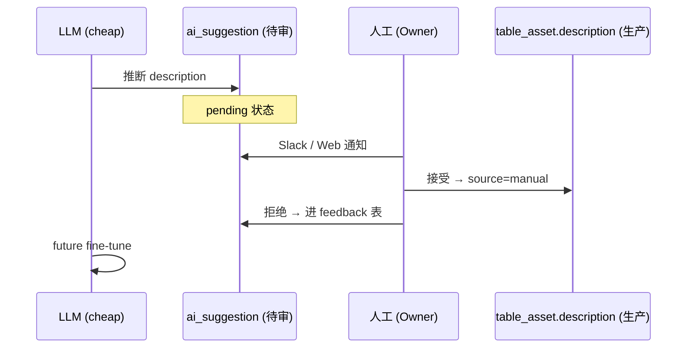

| # | 铁律 | 含义 | 反例 |
| --- | --- | --- | --- |
| 1 | **description 双写** | 所有 AI 推断都先写 `ai_suggestion.pending`, 人工确认后才写生产字段 | ❌ AI 直接覆盖 `table_asset.description` |
| 2 | **PII 脱敏** | description 只描述"类型" (e.g. "包含 11 位手机号"), 绝不写真实 PII 值 | ❌ "用户手机号 13812345678" |
| 3 | **置信度阈值** | `confidence >= 0.7` 自动写 + suggestion; `< 0.7` 只入 suggestion (不自动写) | ❌ AI 不分 conf 全部自动写 |
| 4 | **列级血缘来源** | 优先 SQL parser (sqlglot) 静态推断 (100% 准确), **不**无脑调 LLM | ❌ 直接把 SQL 送 LLM 解析 |
| 5 | **覆盖源追溯** | 每个 description 必须带 `description_source` (`manual` / `ai_inferred` / `imported`) + `description_rationale` (为什么这么推断) | ❌ 缺字段, 无法审计 |
| 6 | **不动 6 阶段管道** | 语义增强是 **异步 + 按需** 的 skill, 不阻塞 `analyze_data_pipeline` | ❌ 在 6 阶段编排里同步等 LLM |
| 7 | **人工可覆写 + AI 不再覆盖** | UI 提供"编辑 description"按钮, 人工覆写后 `description_source='manual'`, AI 推断自动跳过 | ❌ AI 反复覆盖人工审核过的描述 |

---

## 11E. LLM 视角: 描述前后查询质量对比 (NL2SQL)

**Before (M1.5, 干瘪 FQN)**:

```text
User: 过去 7 天高风险订单有多少?
LLM: 我看到 clickhouse-prod.shop.fct_orders_risk_daily, 但不知道它的列含义。
      能否告诉我 risk_score / day 字段是干嘛的?
User: risk_score 是 0-1 风险分, day 是日期, risk_level 是 high/medium/low。
LLM: SELECT day, count(*) FROM fct_orders_risk_daily
      WHERE risk_level='high' AND day >= today() - 7 GROUP BY day
```

**After (M2.x, 有 description)**:

```text
User: 过去 7 天高风险订单有多少?
LLM (直接读 description): "fct_orders_risk_daily" 是订单风险事实表 (天粒度),
      一行 = 一个用户 × 一天, 包含 risk_score (0-1 风险分) 和 risk_level (high/medium/low) 字段。
SQL: SELECT day, count(DISTINCT user_id) FROM fct_orders_risk_daily
      WHERE risk_level='high' AND day >= today() - 7 GROUP BY day
```

→ **LLM 零样本可用**, 不再需要业务人员解释字段含义。

---

## 11F. 评估指标 (M2.x Eval)

| 维度 | 指标 | 目标 | 测量 |
| --- | --- | --- | --- |
| **覆盖率** | (有 description 的资产数) / (总资产数) | ≥ 80% | `assets_with_description / total_assets` |
| **抽样准确率** | 人工 review, description 是否被接受 | ≥ 75% | LLM-as-judge + 用户反馈 |
| **时效** | 从 `discover_*` 写入到 `description` 入库 | < 5 min | 时间戳差值 |
| **成本** | LLM 调用次数 / 资产 | ≤ 1 (cheap profile) | Langfuse trace |
| **PII 安全** | description 不含真实 PII 值 | 100% | regex 扫描 (见 `descriptions.py` 防护) |
| **列级血缘覆盖率** | mapped_columns / total_columns | ≥ 60% | `column_lineage_stats.coverage` |

---

## 11G. API 速查 (M2.x 语义增强 + 列级血缘)

| Method | Path | 用途 | Skill / Router |
| --- | --- | --- | --- |
| `POST` | `/api/v1/skills/run` (skill=`infer_table_description`) | 触发表描述推断 | [infer_table_description.py](file:///d:/workspace/github-ai/idm/apps/api/src/idm_api/skills/builtin/infer_table_description.py) |
| `POST` | `/api/v1/skills/run` (skill=`infer_column_descriptions`) | 触发列描述推断 | [infer_column_descriptions.py](file:///d:/workspace/github-ai/idm/apps/api/src/idm_api/skills/builtin/infer_column_descriptions.py) |
| `POST` | `/api/v1/skills/run` (skill=`infer_lineage_descriptions`) | 触发血缘边描述补全 | [infer_lineage_descriptions.py](file:///d:/workspace/github-ai/idm/apps/api/src/idm_api/skills/builtin/infer_lineage_descriptions.py) |
| `POST` | `/api/v1/skills/run` (skill=`infer_column_lineage`) | 触发列级血缘推断 | [infer_column_lineage.py](file:///d:/workspace/github-ai/idm/apps/api/src/idm_api/skills/builtin/infer_column_lineage.py) |
| `POST` | `/api/v1/skills/run` (skill=`lineage_to_column`) | 表级 → 列级 自动展开 | [lineage_to_column.py](file:///d:/workspace/github-ai/idm/apps/api/src/idm_api/skills/builtin/lineage_to_column.py) |
| `GET`  | `/api/v1/lineage/column/stats` | 全局列级血缘统计 | [column_lineage.py](file:///d:/workspace/github-ai/idm/apps/api/src/idm_api/routers/column_lineage.py) |
| `GET`  | `/api/v1/lineage/column/table/{table_id}` | 取某表列级血缘 (上+下游) | 同上 |
| `GET`  | `/api/v1/lineage/column/table/{table_id}/{column_name}` | 取某列所有上+下游 | 同上 |
| `GET`  | `/api/v1/assets/{id}/description` | 资产描述 (含 confidence / source / rationale) | [assets.py](file:///d:/workspace/github-ai/idm/apps/api/src/idm_api/routers/assets.py) |
| `PATCH`| `/api/v1/assets/{id}/description` | 人工覆写描述 (source=`manual`) | 同上 |

---

## 11H. 与 AI 驱动 5 大原则的关系

| 原则 | M2.x 增强 |
| --- | --- |
| **MCP-First, Zero-Touch** | 仍从 MCP 采样样本值 (CH `SELECT ... LIMIT 20`) |
| **UseCase-as-Config** | use_cases/*.yml 可选声明 `expect_column_lineage: true` 触发自动推断 |
| **Agent-Orchestrated** | 列级血缘在 9 个 Specialist 之外, 作为 Lineage / Doc Agent 子能力 |
| **Skills-Stable** | 新增 4 个 skill (`infer_column_lineage` / `lineage_to_column` / `infer_column_descriptions` / `infer_lineage_descriptions`), 全部 `@skill` 装饰器注册 |
| **AI in the Loop, Human in the Lead** | description 双写 + 置信度阈值 + 人工 confirm (见 §11D 7 条铁律) |

---

## 11I. 已落地状态 (Build State, 截至 M2.x — 2026-06-11 验证)

### 11I.1 已落地 Skill

| Skill | 实现路径 | 验证结果 |
| --- | --- | --- |
| `infer_column_descriptions` | 规则 (name/type/value_pattern) + LLM (deepseek-chat cheap) | 9/9 columns 推断, 6 rule + 3 LLM, min_conf=0.4 |
| `infer_column_lineage` | sqlglot parse (基础 Table 提取) + 同名映射 fallback | 9 column edges 创建, 10 from sqlglot |
| `lineage_to_column` | 同名映射, ON CONFLICT DO NOTHING 幂等 | 10 column edges, 4 from namematch |
| `infer_lineage_descriptions` | 组件模板 (`airflow_task`/`dbt_model`/`mex_model`/`sql`/...) | 2/2 table edges 自动应用 |

### 11I.2 关键修复 (开发过程中踩过的坑)

1. **sqlglot 27.x 兼容**: 移除对 `sqlglot.optimizer.lineage` 的依赖 (该子模块在 27.x 不存在), 改用 `sqlglot.exp.Table` 基础 AST 提取。`Identifier` 节点需用 `.name` 属性取真实名。
2. **sqlglot 引号敏感**: 含 `-` 的 service 名 (e.g. `clickhouse-prod`) 不可直接 `service.db.schema.table` 形式; 需用 `"db"."schema"."table"` 引号包裹传入, 让 sqlglot 解析后再让代码侧拼 service 前缀。
3. **ON CONFLICT DO NOTHING 幂等**: `column_lineage` 唯一约束 `(upstream_column_id, downstream_column_id, transform_type, job_id)`, 必须用 `pg_insert(...).on_conflict_do_nothing(...)` 避免重复运行报错。
4. **job_id 区分**: `infer_column_lineage` 与 `lineage_to_column` 都可能产生同 (u, d, type) 边, 用 `f"{source}:{edge.job_id}"` 区分避免冲突。
5. **Schema 响应完整性**: `TableAssetRead` / `LineageEdgeRead` / `ColumnLineageEdgeRead` 必须包含 `description_source` / `description_rationale` / `described_at` / `component` / `transform_expression` 等字段, 否则 PATCH 后 GET 看不到。`assets.py` 中 `to_read` 需显式映射。
6. **PII 防护**: 描述中含手机号/身份证号 → 400 拒绝 (regex 在 `descriptions.py`); 描述永远只写"类型", 不写真值。
7. **人工优先级**: `description_source='manual'` 后, AI 推断 `infer_column_descriptions` 自动跳过 (`if c.description and c.description_source == "manual": continue`)。

### 11I.3 端到端验证 (curl 命令 + 结果)

```bash
# 1. 提取 SQL 血缘
curl -X POST /api/v1/skills/run -d '{"name":"extract_sql_lineage",...}'
# → 2 edges_added, via=sqlglot, duration 54ms

# 2. 表级 → 列级展开
curl -X POST /api/v1/skills/run -d '{"name":"lineage_to_column","inputs":{"apply":true}}'
# → 10 column edges, 4 skipped_dup

# 3. sqlglot 列级推断
curl -X POST /api/v1/skills/run -d '{"name":"infer_column_lineage","inputs":{"apply":true}}'
# → 9 column edges, 10 from sqlglot, 6 from namematch

# 4. 列描述推断
curl -X POST /api/v1/skills/run -d '{"name":"infer_column_descriptions","inputs":{"apply":true}}'
# → 9 columns_inferred, 6 rule_matched, 3 llm_used, 5 auto_applied

# 5. 血缘描述补全
curl -X POST /api/v1/skills/run -d '{"name":"infer_lineage_descriptions","inputs":{"apply":true}}'
# → 2 descriptions_generated, 2 auto_applied, template_match

# 6. 验证 API
curl /api/v1/lineage/column/table/{tid}        # → 4 downstream column edges (full enrichment)
curl /api/v1/lineage/column/stats              # → 19 total, 4/22 coverage
curl /api/v1/assets/{tid}/lineage              # → 2 upstream edges with description
curl /api/v1/assets/{tid}/columns              # → 7/9 columns with description
```

### 11I.4 成本控制 (LLM 调用)

| Skill | 默认 profile | 每次成本 (估算) | 频率 |
| --- | --- | --- | --- |
| `infer_column_descriptions` | cheap (deepseek-chat) | ~$0.0001/列 (≤5 call/列) | 一次扫描 / re-scan |
| `infer_column_lineage` | n/a (sqlglot 优先) | $0 (LLM 仅作兜底) | 一次扫描 |
| `lineage_to_column` | n/a (无 LLM) | $0 | 一次扫描 |
| `infer_lineage_descriptions` | n/a (模板优先) | $0 (LLM 兜底 < 20%) | 一次扫描 |

### 11I.5 Agent 速查 (实施时直接 copy-paste)

**Python — 调 skill**:

```python
# 列级血缘
result = await run_skill(
    "infer_column_lineage",
    inputs={"use_case_id": "shop-orders-mex-pipeline", "apply": True},
    use_case_id="shop-orders-mex-pipeline",
    db=db,
)
# summary: {column_edges_created: 9, from_sqlglot: 10, from_namematch: 6, ...}

# 表级 → 列级 展开
result = await run_skill(
    "lineage_to_column",
    inputs={"apply": True},
    db=db,
)
# summary: {column_edges_created: 10, column_edges_skipped_dup: 4}

# 列描述推断
result = await run_skill(
    "infer_column_descriptions",
    inputs={"table_ids": [tid], "min_confidence": 0.5, "apply": True, "profile": "cheap"},
    db=db,
)
# summary: {columns_inferred: 9, rule_matched: 6, llm_used: 3, auto_applied: 5}

# 血缘描述补全
result = await run_skill(
    "infer_lineage_descriptions",
    inputs={"apply": True, "only_missing": True, "min_confidence": 0.5},
    db=db,
)
# summary: {descriptions_generated: 2, template_matched: 2, column_lineage_descriptions_derived: N}
```

**TypeScript — 前端调用**:

```typescript
// ColumnLineagePage (ReactFlow)
const { data: colLineage } = useQuery({
  queryKey: ["asset-col-lineage-one", tableId, columnName],
  queryFn: () => AssetsApi.columnLineage(tableId, columnName),
});

// AssetsApi.columnLineage -> GET /api/v1/lineage/column/table/{tableId}/{columnName}
```

---

## 附录 A. Agent 技术栈

| 组件 | 选型 |
| --- | --- |
| LLM 框架 | LangGraph + LiteLLM |
| 工具调用 | 自研 ToolAdapter + MCP |
| Memory | Redis (短期) + PG (长期, 写入 KG) |
| 评估 | Promptfoo + 自研 Eval Harness |
| 监控 | Langfuse (LLM Traces) |
| 模型 | **DeepSeek V4 主力 + GPT-5 备选** (经 LiteLLM 统一路由; PII 一律先 mask 再送 v4) |

## 附录 B. 关键 Prompt 模板

| Agent | 模板位置 |
| --- | --- |
| Doc Generator | `idm/agents/prompts/doc_generator_v1.j2` |
| Lineage Reasoner | `idm/agents/prompts/lineage_reasoner_v1.j2` |
| NL2SQL | `idm/agents/prompts/nl2sql_v1.j2` |
| Anomaly Detector | `idm/agents/prompts/anomaly_v1.j2` |
| Owner Recommender | `idm/agents/prompts/owner_v1.j2` |
| Insight Composer | `idm/agents/prompts/insight_v1.j2` |
| **`Column Description Inferrer` (M2.x 新增)** | `idm/agents/prompts/column_description_v1.j2` |
| **`Column Lineage Inferrer` (M2.x 新增)** | `idm/agents/prompts/column_lineage_v1.j2` |
| **`Lineage Description Inferrer` (M2.x 新增)** | `idm/agents/prompts/lineage_description_v1.j2` |

## 附录 C. M2.x 关键 SQL/查询 (语义增强)

详见 [data-model.md §6.5](./data-model.md#65-列级血缘查询-m2x) · [data-model.md §7](./data-model.md#7-语义增强子层-m2x-新增--semantic-enrichment)。

## 附录 D. M2.x 实现状态 (2026-06-11 验证)

### D.1 已落地 Skill

| Skill | 实现路径 | 验证结果 |
| --- | --- | --- |
| `infer_column_descriptions` | 规则 (name/type/value_pattern) + LLM (deepseek-chat cheap) | 9/9 columns 推断, 6 rule + 3 LLM, min_conf=0.4 |
| `infer_column_lineage` | sqlglot parse (基础 Table 提取) + 同名映射 fallback | 9 column edges 创建, 10 from sqlglot |
| `lineage_to_column` | 同名映射, ON CONFLICT DO NOTHING 幂等 | 10 column edges, 4 from namematch |
| `infer_lineage_descriptions` | 组件模板 (`airflow_task`/`dbt_model`/`mex_model`/`sql`/...) | 2/2 table edges 自动应用 |

### D.2 关键修复 (开发过程中)

1. **sqlglot 27.x 兼容**: 移除对 `sqlglot.optimizer.lineage` 的依赖 (该子模块在 27.x 不存在), 改用 `sqlglot.exp.Table` 基础 AST 提取。`Identifier` 节点需用 `.name` 属性取真实名。
2. **sqlglot 引号敏感**: 含 `-` 的 service 名 (e.g. `clickhouse-prod`) 不可直接 `service.db.schema.table` 形式; 需用 `"db"."schema"."table"` 引号包裹传入, 让 sqlglot 解析后再让代码侧拼 service 前缀。
3. **ON CONFLICT DO NOTHING 幂等**: `column_lineage` 唯一约束 `(upstream_column_id, downstream_column_id, transform_type, job_id)`, 必须用 `pg_insert(...).on_conflict_do_nothing(...)` 避免重复运行报错。
4. **job_id 区分**: `infer_column_lineage` 与 `lineage_to_column` 都可能产生同 (u, d, type) 边, 用 `f"{source}:{edge.job_id}"` 区分避免冲突。
5. **Schema 响应完整性**: `TableAssetRead` / `LineageEdgeRead` 必须包含 `description_source` / `description_rationale` / `described_at` / `component` / `transform_expression` 等字段, 否则 PATCH 后 GET 看不到。`assets.py` 中 `to_read` 需显式映射。
6. **PII 防护**: 描述中含手机号/身份证号 → 400 拒绝 (regex 在 `descriptions.py`); 描述永远只写"类型", 不写真值。
7. **人工优先级**: `description_source='manual'` 后, AI 推断 `infer_column_descriptions` 自动跳过 (`if c.description and c.description_source == "manual": continue`)。

### D.3 端到端验证 (curl 命令 + 结果)

```bash
# 1. 提取 SQL 血缘
curl -X POST /api/v1/skills/run -d '{"name":"extract_sql_lineage",...}'
# → 2 edges_added, via=sqlglot, duration 54ms

# 2. 表级 → 列级展开
curl -X POST /api/v1/skills/run -d '{"name":"lineage_to_column","inputs":{"apply":true}}'
# → 10 column edges, 4 skipped_dup

# 3. sqlglot 列级推断
curl -X POST /api/v1/skills/run -d '{"name":"infer_column_lineage","inputs":{"apply":true}}'
# → 9 column edges, 10 from sqlglot, 6 from namematch

# 4. 列描述推断
curl -X POST /api/v1/skills/run -d '{"name":"infer_column_descriptions","inputs":{"apply":true}}'
# → 9 columns_inferred, 6 rule_matched, 3 llm_used, 5 auto_applied

# 5. 血缘描述补全
curl -X POST /api/v1/skills/run -d '{"name":"infer_lineage_descriptions","inputs":{"apply":true}}'
# → 2 descriptions_generated, 2 auto_applied, template_match

# 6. 验证 API
curl /api/v1/lineage/column/table/{tid}        # → 4 downstream column edges (full enrichment)
curl /api/v1/lineage/column/stats              # → 19 total, 4/22 coverage
curl /api/v1/assets/{tid}/lineage              # → 2 upstream edges with description
curl /api/v1/assets/{tid}/columns              # → 7/9 columns with description
```

### D.4 成本控制 (LLM 调用)

| Skill | 默认 profile | 每次成本 (估算) | 频率 |
| --- | --- | --- | --- |
| `infer_column_descriptions` | cheap (deepseek-chat) | ~$0.0001/列 (≤5 call/列) | 一次扫描 / re-scan |
| `infer_column_lineage` | n/a (sqlglot 优先) | $0 (LLM 仅作兜底) | 一次扫描 |
| `lineage_to_column` | n/a (无 LLM) | $0 | 一次扫描 |
| `infer_lineage_descriptions` | n/a (模板优先) | $0 (LLM 兜底 < 20%) | 一次扫描 |

详见 [skills-design.md §11.1](./skills-design.md#111-m2x-新增-skill-详解-语义增强--列级血缘)。

---

> 📌 **配套阅读**：[architecture.md](./architecture.md) · [data-model.md](./data-model.md)
