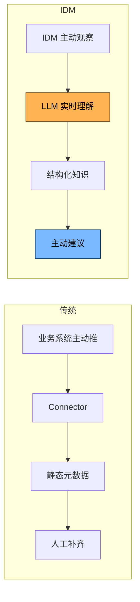
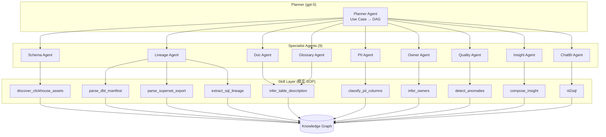
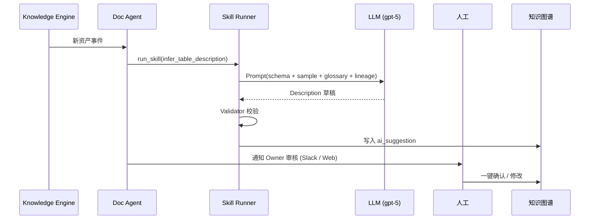
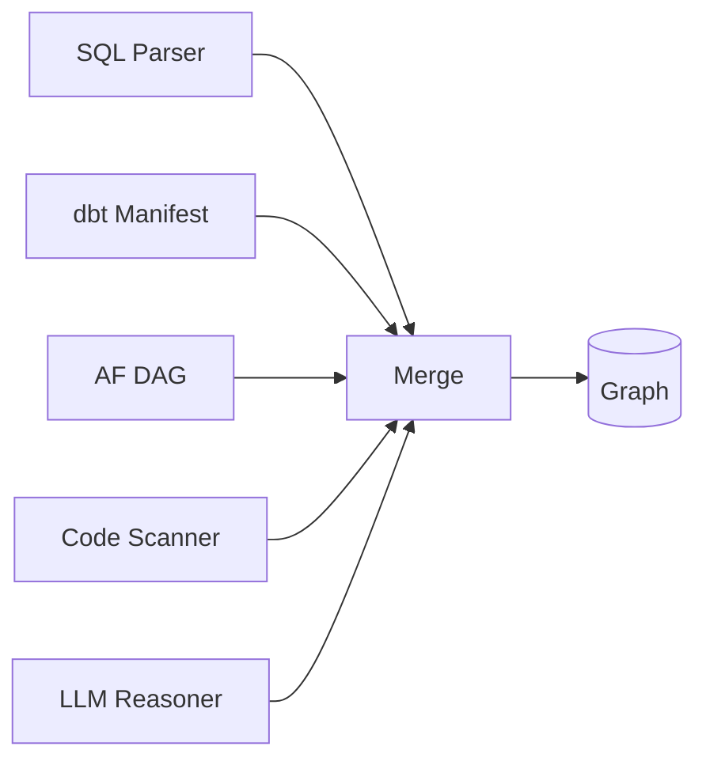
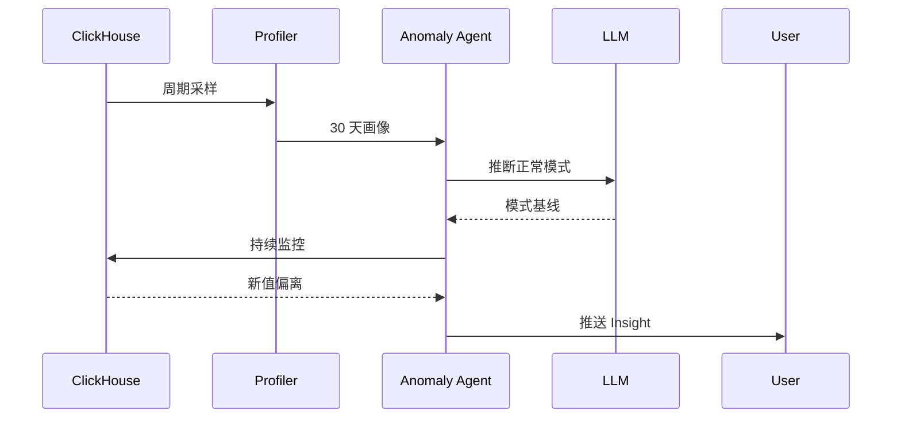
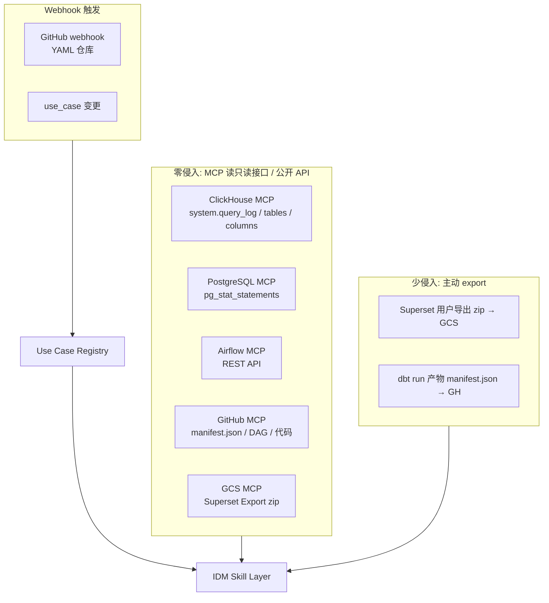
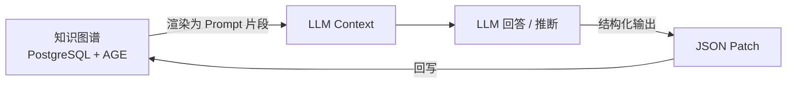
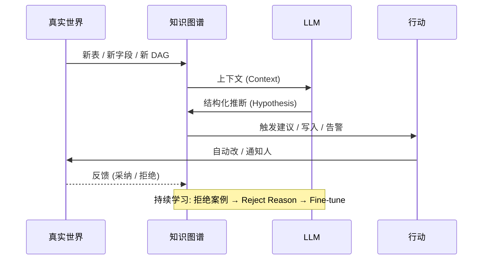
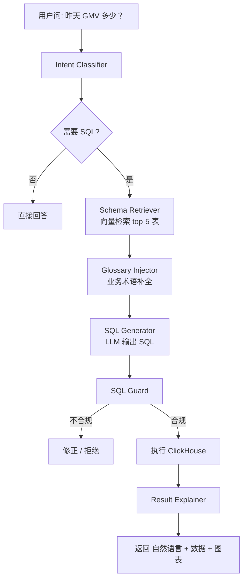
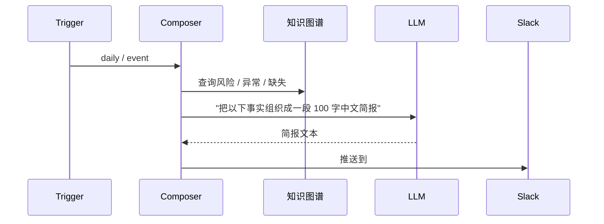

# IDM — AI 驱动的核心设计

> 📌 **实现前先读**: [AGENT_INSTRUCTIONS.md](../AGENT_INSTRUCTIONS.md) — 宪法级摘要, 含 5 大原则 / 1+9 Agent / Skill 规范 / 5 大绝对不能做 / 关键 ADR。

> 解决一个根本问题：
> **传统元数据平台为何 80% 时间在做 Connector 适配，而数据团队仍然得不到一个真正可用的「数据大脑」？**
> 本文给出 IDM 的回答：**MCP-First 零侵入 + LLM 主动观察 + LLM 主动理解 + LLM 主动建议 + Skills 稳定执行**。

---

## 目录

- [1. 传统元数据平台为何失效](#1-传统元数据平台为何失效)
- [2. AI 驱动的核心思想](#2-ai-驱动的核心思想)
- [3. 核心 Agent 设计 (1+9 模式)](#3-核心-agent-设计-19-模式)
- [4. Zero-Touch: MCP 观察层](#4-zero-touch-mcp-观察层)
- [5. Schema-as-Prompt：让 LLM 理解资产](#5-schema-as-prompt让-llm-理解资产)
- [6. 知识图谱与 LLM 的双向循环](#6-知识图谱与-llm-的双向循环)
- [7. NL2SQL：安全 + 智能的查询代理](#7-nl2sql安全--智能的查询代理)
- [8. 主动 Insight：从「目录」到「顾问」](#8-主动-insight从目录到顾问)
- [9. 评估与护栏](#9-评估与护栏)
- [10. 失败模式与应对](#10-失败模式与应对)

---

## 1. 传统元数据平台为何失效

### 1.1 三个根本痛点

| 痛点 | 现象 | 根因 |
| --- | --- | --- |
| **集成成本** | 80+ Connector，每接一个系统要 1~4 周 | 平台要求业务系统主动「告诉它」 |
| **数据静态** | 元数据采集 = 一周一次 ETL | 没有实时流；变更难追踪 |
| **价值单薄** | 有了目录但不知道「哪个资产重要」「谁该治理」 | 只采集结构化信息，缺语义、缺推理 |

### 1.2 一个隐喻

> 传统平台像一个**问卷系统**：
> 「请每个系统填写一份自我介绍」→ 80% 的人懒得写，填的也常常过时。
>
> IDM 想做的是**一位坐在产线旁的资深数据工程师**：
> 他不需要你填表；他看你的代码、你的 SQL、你的查询日志、你的 dbt 文件，就能告诉你
> 「这张表里 `user_email` 是 PII，应该打 Tag」「`orders_daily` 实际上周一开始没人查了，可以归档」。

---

## 2. AI 驱动的核心思想

### 2.1 三个转变



| 传统 | IDM |
| --- | --- |
| 业务系统主动 push | IDM **MCP 主动观察** (零侵入) |
| 结构化 ETL | LLM **实时理解** |
| 人工补 Description | Agent **主动建议** |
| 静态目录 | **主动 Insight** 推送 |
| 写 Connector | 自建 MCP Server 5~50 行 |

### 2.2 五大设计原则

1. **MCP-First, Zero-Touch** — 零侵入, 标准协议, IDM 是 MCP Client
2. **UseCase-as-Config** — 业务团队只交付 1 份 YAML
3. **Agent-Orchestrated** — 1 Planner + 9 Specialist Agent
4. **Skills-Stable** — 标准化 SOP, 可测试, 可重放, 不直接调 LLM
5. **AI in the Loop, Human in the Lead** — LLM 先做, 人审核; 不替代人

---

## 3. 核心 Agent 设计 (1+9 模式)

> 详细设计见 [agent-orchestration.md](./agent-orchestration.md)。本文给概览。



### 3.1 Doc Generator Agent → Skill: infer_table_description

**目标**：自动为每张表/列写高质量 Description

**输入**：
- 表名、列名、类型
- dbt 注释（如有）
- 5~20 条 sample row（来自 CH `SELECT ... LIMIT 20`）
- 上下游血缘中的「邻居」

**流程**：


**Prompt 模板 (示例)**：
```text
你是一位资深数据工程师。请根据以下信息为这张 ClickHouse 表写一段不超过 80 字的中文业务描述。

【表名】shop.orders_daily
【列】order_id (String), user_id (String), gmv (Decimal(18,2)), order_date (Date)
【sample 5 行】...
【dbt 注释】无
【血缘上游】Kafka: orders (来自 order-service)
【血缘下游】dashboard: GMV_Daily, model: churn_v2
【相关业务术语】Glossary: GMV (成交总额)
【公司知识】KPI 定义文档片段: ...
```

### 3.2 Lineage Reasoner Agent

**目标**：把「机器能直接解析的」 + 「需要推理的」血缘都补全

**两类血缘**：

| 类型 | 示例 | 解析方式 |
| --- | --- | --- |
| **显式** | `INSERT INTO t1 SELECT ... FROM t2` | SQL Parser (sqlglot) |
| **显式** | dbt `ref('orders')` | manifest.json |
| **显式** | Airflow `op1 >> op2` | DAG API |
| **隐式** | Looker View 引用了某张表 | LLM 解析 LookML |
| **隐式** | 同名字段在不同表里 | LLM 推断 + 业务术语匹配 |
| **隐式** | Notebook 用 pandas read 某文件 | 代码扫描 |



### 3.3 Anomaly Detector Agent

**目标**：**不写规则**，让 LLM 帮你建基线 + 检测漂移

**做法**：
1. 收集 30 天 Profiler 历史 (CH `system.parts` / 自己采样)
2. 让 LLM 推断「这张表的 `gmv` 在每周一会显著升高」— 周期模式
3. 实时比对，触发异常 → Agent 自查 + 通知



### 3.4 Owner Recommender Agent

**目标**：自动建议资产 Owner（避免「人人无主」）

**信号**：
- Airflow DAG 的 owner 字段
- Git `git blame` 最近 5 个 committer
- dbt Model 注释
- Query log 频次 Top-N user
- **LLM 综合推断**

### 3.5 NL2SQL Agent

**目标**：自然语言 → 准确、可审计、限权的 SQL

详见 [§7](#7-nl2sql安全--智能的查询代理)

---

## 4. Zero-Touch: MCP 观察层

### 4.1 三类观察方式 (MCP-First)



### 4.2 ClickHouse 观察详细设计

> 不在业务路径上做 ETL, 全部通过 MCP Server 走旁路。

```sql
-- 通过 clickhouse MCP 调: tool=list_query_log
-- 后端实际执行
SELECT
  event_time,
  user,
  query_kind,
  query,
  tables,
  columns
FROM system.query_log
WHERE event_time > now() - INTERVAL 5 MINUTE
  AND type != 'QueryStart'
ORDER BY event_time DESC
LIMIT 500;
```

**MCP Server 调用 (Skill 内部)**:

```yaml
mcp_calls:
  - name: tail_query_log
    tool: clickhouse.list_query_log
    args: { lookback: "INTERVAL 5 MINUTE" }
```

### 4.3 业务应用 SDK (可选)

> IDM 不绑死, 业务零侵入; 愿意主动推送的, 可以用:

```python
from idm_sdk import track_dataset

@track_dataset(domain="sales", tier="critical")
def build_orders_daily():
    # 业务函数被自动登记到 IDM
    ...
```

> **重要**：SDK 是**可选**的；缺它业务也能跑。IDM 不绑死。

---

## 5. Schema-as-Prompt：让 LLM 理解资产

### 5.1 知识图谱 = LLM 的「长期记忆」



### 5.2 上下文构造 (Context Builder)

**每次 Agent 调用前**，构造如下结构化 prompt：

```text
[角色]
你是 IDM 平台的资深数据工程师,负责 [domain] 域。

[资产]
- 资产 A: shop.orders_daily (Owner: alice@)
  - 描述: ...
  - 关键列: order_id, gmv, order_date
  - 血缘上游: Kafka: orders
  - 血缘下游: dashboard: GMV_Daily
  - 质量: row_count_avg=120k, today=89k ⚠️

[任务]
检测今日 `gmv` 异常下降的原因。
要求: 输出 JSON { "hypothesis": str, "evidence": list[str] }
```

### 5.3 防止 Prompt 爆炸

- **Top-K 检索**：只取与当前任务相关的 5~20 个节点
- **分层摘要**：超过 1000 节点的图 → 先 LLM 摘要成 10 段
- **Token 预算**：单次 prompt ≤ 8k tokens，超出则分级 summary

---

## 6. 知识图谱与 LLM 的双向循环



**关键**：
- LLM 输出始终是**结构化 JSON Patch**，可被审计 / 回滚
- 拒绝 / 接受 → 进 `feedback` 表 → 未来优化 prompt / fine-tune

---

## 7. NL2SQL：安全 + 智能的查询代理

### 7.1 端到端流程



### 7.2 SQL Guard (强约束)

```python
ALLOWED_KEYWORDS = {"SELECT", "WITH", "FROM", "WHERE", "GROUP", "ORDER", "LIMIT", "JOIN"}
FORBIDDEN = {"INSERT","UPDATE","DELETE","DROP","ALTER","TRUNCATE","ATTACH","DETACH","KILL"}

def guard(sql: str) -> tuple[bool, str]:
    parsed = sqlglot.parse_one(sql, dialect="clickhouse")
    if not isinstance(parsed, exp.Select):
        return False, "Only SELECT allowed"
    # 禁函数
    for f in parsed.find_all(exp.Anonymous):
        if f.name.lower() in {"url","file","input","s3","remote"}:
            return False, f"Forbidden function {f.name}"
    # 强制 LIMIT
    if not parsed.args.get("limit"):
        parsed.set("limit", exp.Limit(expression=exp.Literal.number(1000)))
    return True, parsed.sql(dialect="clickhouse")
```

### 7.3 准确度提升机制

| 机制 | 作用 |
| --- | --- |
| **Few-shot 库** | 高频问句 → 人工确认的 SQL 作为示例 |
| **历史 Query 检索** | 「类似问题」的 SQL 直接复用 |
| **Schema 约束生成** | Prompt 中只列**相关表**的列 |
| **自检 (Self-Critique)** | LLM 跑 SQL 描述, 确认无歧义再返 |
| **Feedback Loop** | 用户改写 → 校正 → 写回 Few-shot |

---

## 8. 主动 Insight：从「目录」到「顾问」

### 8.1 三个层次的 Insight

| 层次 | 时机 | 形式 | 例子 |
| --- | --- | --- | --- |
| **实时** | 事件触发 | 通知 | `dashboard: GMV_Daily 数据延迟 2h` |
| **每日** | 09:00 推送 | 简报 | Top 5 异常 / Top 5 Owner 缺失 / 趋势 |
| **周/月** | 周一 09:00 | 报告 PDF | 健康分 / 治理成熟度 / 资产增长 |

### 8.2 Insight Composer Agent



---

## 9. 评估与护栏

### 9.1 评估指标

| 指标 | 测量 |
| --- | --- |
| **文档采纳率** | Agent 建议被人工确认的比例 |
| **血缘准确率** | 自动血缘 vs 人工抽样 |
| **NL2SQL 准确率** | 「能跑」+ 「结果正确」 比例 |
| **Anomaly Precision** | 告警中真实异常比例 |
| **Owner 命中率** | 推荐 Owner 命中真实 Owner 比例 |
| **MTTR for data issue** | 数据问题发现到解决时间 |

### 9.2 护栏 (Guardrails)

| 风险 | 护栏 |
| --- | --- |
| LLM 幻觉 | Schema 强约束 + 输出 JSON Schema 校验 |
| 误改元数据 | 写操作全部进 `pending` 状态，**人确认后才生效** |
| LLM 泄露敏感数据 | 送 LLM 前 PII Masking |
| 误执行破坏性 SQL | SQL Guard + 只读账号 + 强制 LIMIT |
| 误告警 | 告警去重 + 抑制 + Owner 反馈学习 |

---

## 10. 失败模式与应对

| 失败 | 表现 | 应对 |
| --- | --- | --- |
| **LLM 不可用** | Agent 全部停滞 | 退化到规则模式 + 缓存 + 异步重试 |
| **Schema 剧变** | 实体消歧失效 | Entity Resolver 加阈值 + 人工仲裁 |
| **业务不配合** | 没有 OTEL / 没有 Manifest | 不强求；用「Observe, Don't Integrate」降级 |
| **数据量爆炸** | PG 单表过大 | 按 tenant_id 分表 + 冷数据归档到 GCS |
| **LLM 成本失控** | Token 费用飙升 | Context 预算 + Embedding 缓存 + 错峰批处理 |
| **人不愿意用** | 建议被一直接拒绝 | 持续展示价值 (Insight) + 治理 KPI 关联 |

---

## 附录 A. Agent 技术栈

| 组件 | 选型 |
| --- | --- |
| LLM 框架 | LangGraph + LiteLLM |
| 工具调用 | 自研 ToolAdapter + MCP |
| Memory | Redis (短期) + PG (长期, 写入 KG) |
| 评估 | Promptfoo + 自研 Eval Harness |
| 监控 | Langfuse (LLM Traces) |
| 模型 | **GPT-5 主力 + DeepSeek V3/R1 备选 + Qwen2.5 32B 本地兜底** (经 LiteLLM 统一路由) |

## 附录 B. 关键 Prompt 模板

| Agent | 模板位置 |
| --- | --- |
| Doc Generator | `idm/agents/prompts/doc_generator_v1.j2` |
| Lineage Reasoner | `idm/agents/prompts/lineage_reasoner_v1.j2` |
| NL2SQL | `idm/agents/prompts/nl2sql_v1.j2` |
| Anomaly Detector | `idm/agents/prompts/anomaly_v1.j2` |
| Owner Recommender | `idm/agents/prompts/owner_v1.j2` |
| Insight Composer | `idm/agents/prompts/insight_v1.j2` |

> 📌 **配套阅读**：[architecture.md](./architecture.md) · [data-model.md](./data-model.md)
