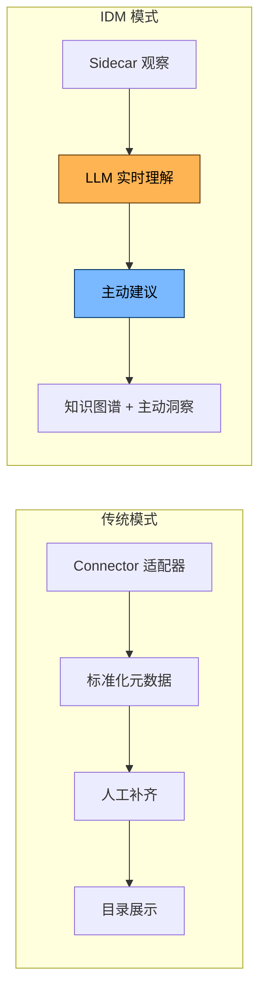
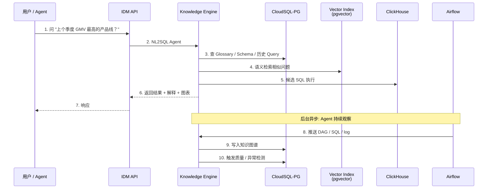
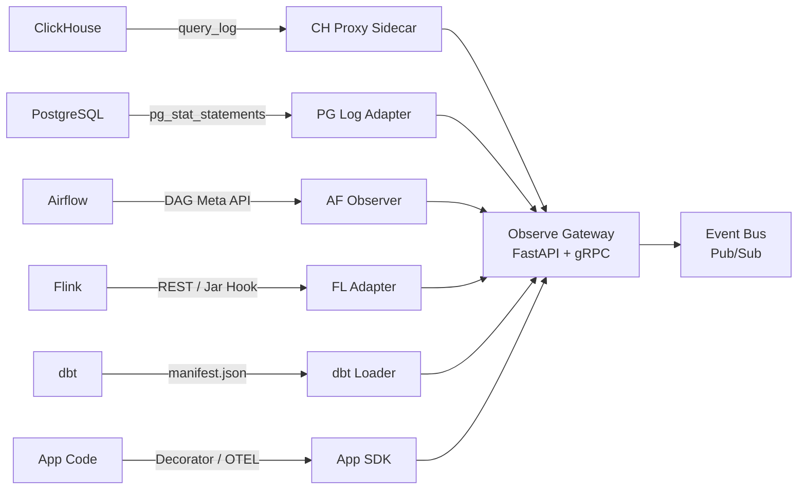
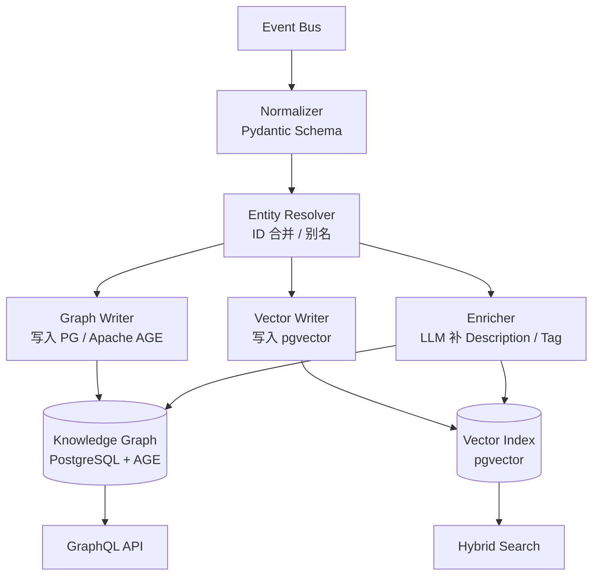
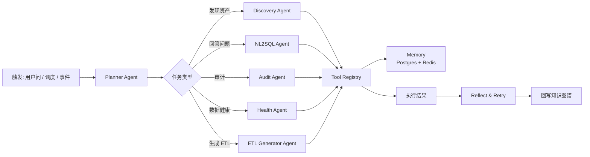
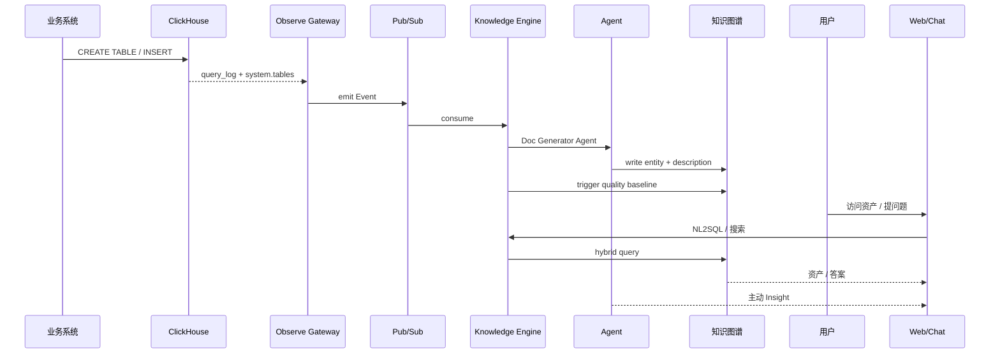
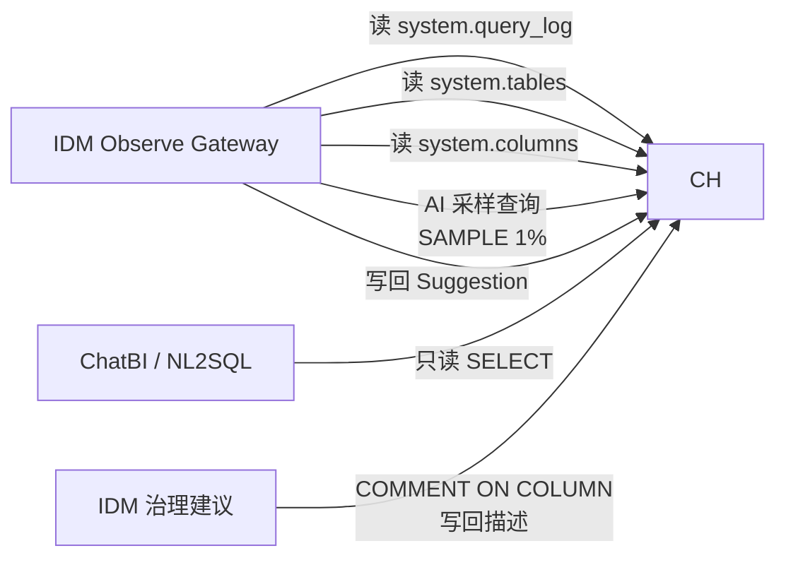

# IDM — AI-Driven Data Management Platform · 总体架构设计

> **IDM (Intelligent Data Mesh)**: AI 驱动的数据管理平台
> 借鉴 DataHub / OpenMetadata 的设计思想，**全栈自研**、**AI Native**、**Agent-First**
> 适配现有技术栈：GCP (GKE / CloudSQL-PG / GCS) + Airflow + Flink + React + Python + TypeScript + ClickHouse (GCE) + Superset

---

## 目录

- [1. 愿景与设计原则](#1-愿景与设计原则)
- [2. 与传统元数据平台的根本区别](#2-与传统元数据平台的根本区别)
- [3. 总体架构总览](#3-总体架构总览)
- [4. 五大核心子系统](#4-五大核心子系统)
- [5. 技术栈映射](#5-技术栈映射)
- [6. 数据流：端到端生命周期](#6-数据流端到端生命周期)
- [7. 与现有栈的集成](#7-与现有栈的集成)
- [8. 安全与多租户](#8-安全与多租户)
- [9. 关键设计决策 (ADR 摘要)](#9-关键设计决策-adr-摘要)
- [10. 文档导航](#10-文档导航)

---

## 1. 愿景与设计原则

### 1.1 一句话愿景

> **让 LLM 成为数据团队的「第一位数据工程师」**
> — 它主动观察、主动理解、主动发现、主动治理；
> 人只需要审核、确认、纠偏。

### 1.2 设计原则

| 原则 | 含义 |
| --- | --- |
| **AI-First** | 一切元数据采集 / 治理 / 文档 / 血缘，**默认由 Agent 完成**，人仅做兜底 |
| **Observe, Don't Integrate** | 通过 **Side-car / 日志旁路 / Query Hook** 观察系统，**不要求业务系统改造** |
| **Single Source of Truth** | 唯一的元数据知识图谱 (Knowledge Graph) 描述全部资产 |
| **Composable Agent** | 每个能力 = 一个独立 Agent；复杂任务 = Agent 编排 |
| **Cloud-Native & Decoupled** | 全部跑在 GKE，无状态服务、事件驱动、可独立伸缩 |
| **Schema-as-Code** | 实体 / 关系 / 质量规则都是声明式，可被 LLM 读取和编辑 |
| **Audit by Default** | 所有 Agent 行为可追溯、可回滚、可解释 |

### 1.3 我们要解决的真实问题

```
❌  DataHub / OpenMetadata 模式: 给每个系统写 Connector → 80% 时间做适配器
✅  IDM 模式: 部署一个 LLM Agent + Sidecar → 自动从日志 / Query / Schema 自我学习
```

---

## 2. 与传统元数据平台的根本区别

| 维度 | DataHub / OpenMetadata | **IDM (我们)** |
| --- | --- | --- |
| 数据采集 | 80+ Connector **主动拉** 或 **被动接** | **Sidecar / Hook 旁路** + **LLM 主动嗅探** |
| 接入新数据源 | 写 Connector 适配器 | 配置 **Generic Observer** (监听 SQL / log / schema) |
| 文档生成 | LLM 后置生成 | LLM **前瞻** 参与建模 (读 dbt / migration / 设计文档) |
| 血缘 | SQL Parser + Job log | **多模态融合**: SQL + Airflow DAG + dbt + 业务注释 + **LLM 推断** |
| 质量 | 内置断言规则 | **AI 推断 + 自动建议** 异常基线 / 模式漂移 |
| 治理 | 人工打标 / 所有权 | **Agent 自动建议 Owner / Tag / Classification** + 人工一键确认 |
| 搜索 | 倒排 / 关键词 | **混合检索**: 向量 + 关键词 + 图遍历 |
| 价值交付 | 资产目录 | **数据知识图谱 + 主动洞察** (今日数据健康 / 风险 / 机会) |



---

## 3. 总体架构总览

### 3.1 一张全景图

```mermaid
flowchart TB
    subgraph 数据与计算层 (Existing)
        DS1[(ClickHouse<br/>GCE)]
        DS2[(CloudSQL<br/>PostgreSQL)]
        DS3[(GCS<br/>Data Lake)]
        AR[Airflow<br/>on GKE]
        FK[Flink<br/>Job Cluster]
        SP[Superset<br/>on GKE]
        APP[业务应用<br/>Python/TS/Go]
    end

    subgraph IDM 观察层 (Sidecar / Hook)
        SC1[Query Sidecar<br/>拦截 CH / PG / Airflow SQL]
        SC2[Schema Watcher<br/>监听 DDL / dbt / migration]
        SC3[Lineage Hook<br/>Airflow / Flink / dbt]
        SC4[Log Tailing<br/>FluentBit → Pub/Sub]
    end

    subgraph IDM AI 核心 (GKE)
        OBS[Observe Gateway<br/>FastAPI + gRPC]
        KE[Knowledge Engine<br/>LLM Agents + Vector + Graph]
        AG[Agent Orchestrator<br/>LangGraph]
        AS[Asset Service<br/>资产 CRUD + GraphQL]
        QS[Query Service<br/>NL2SQL + SQL Guard]
        QL[Quality Engine<br/>AI + Rule]
        GO[Governance Service<br/>Owner / Tag / Policy]
        GQL[GraphQL Federation]
    end

    subgraph IDM 智能交付
        UI[React + Antd<br/>Web Console]
        CHAT[ChatBI<br/>自然语言入口]
        MCP[IDM MCP Server<br/>供 Claude / Cursor 接入]
        INS[Daily Insight<br/>推送 Slack/Email]
    end

    APP --> SC1
    DS1 --> SC1
    DS2 --> SC1
    AR --> SC3
    FK --> SC3
    SP --> SC4
    SC1 --> OBS
    SC2 --> OBS
    SC3 --> OBS
    SC4 --> OBS
    OBS --> KE
    KE --> AG
    KE --> AS
    AS --> GQL
    GO --> GQL
    QL --> GQL
    QS --> GQL
    GQL --> UI
    GQL --> CHAT
    GQL --> MCP
    AG --> INS
    AG --> AS
    AS --> AR
    AS --> FK
```

### 3.2 控制流 vs 数据流



---

## 4. 五大核心子系统

### 4.1 Observe Gateway (观察网关)

**职责**：零侵入 / 少侵入采集元数据



**关键设计**：
- 不在 DB 上跑 ETL 拉取
- ClickHouse → 配置 `query_log` 旁路；PostgreSQL → `pgaudit` + `pg_stat_statements`
- Airflow → 周期拉 DAG (无侵入)
- 业务应用 → 提供 **可选的 Python Decorator** 主动推送

### 4.2 Knowledge Engine (知识引擎)

**职责**：把观察到的元数据 → 结构化知识图谱 + 向量索引



**关键 Agent**：
- **Entity Resolver Agent**：合并重复表 / 列名 (LLM 辅助消歧)
- **Doc Generator Agent**：基于 schema + sample + dbt 注释生成 Description
- **Glossary Mapper Agent**：把 column 自动关联到业务术语
- **Lineage Reasoner Agent**：用 LLM 推断隐式血缘 (e.g. Looker View 间接引用)

### 4.3 Agent Orchestrator (Agent 编排)

**职责**：复杂任务 = 多个 Agent 协作



**技术**：LangGraph + 自研 Tool Adapter (对接 Airflow / Flink / ClickHouse / dbt)

### 4.4 Asset & Governance Service (资产 & 治理服务)

**职责**：CRUD + 业务能力

| 模块 | 能力 |
| --- | --- |
| **Asset Service** | 资产 CRUD / 版本 / Tag / Owner / Domain / Glossary |
| **Quality Engine** | 异常检测 / 断言 / 自动基线 (LLM 推断) |
| **Governance Service** | Policy / RBAC / 审计 / 通知 |
| **Insight Service** | 每日推送 Top Risk / Owner 缺失 / 漂移检测 |
| **Query Service** | NL2SQL 执行 (带 guardrail) / Query 历史 |

### 4.5 Delivery Layer (交付层)

| 入口 | 形态 | 作用 |
| --- | --- | --- |
| **Web Console** | React + Antd + Vite | 资产目录、Glossary、Quality Dashboard、Chat |
| **ChatBI** | Web + Slack / Lark / Teams | 自然语言查数据 |
| **MCP Server** | stdio / SSE | 供 Claude / Cursor / 任何 MCP 客户端使用 |
| **Daily Insight** | 邮件 / Slack | 每日数据健康报告 |
| **Webhook / API** | REST + GraphQL | 集成到内部系统 |

---

## 5. 技术栈映射

| 层 | 现有栈 | IDM 选型 | 用途 |
| --- | --- | --- | --- |
| 容器编排 | GKE | **GKE** | 全量 IDM 服务 |
| 关系存储 | CloudSQL-PG | **CloudSQL-PG + Apache AGE** | 元数据 / 知识图谱 / 审计 |
| 对象存储 | GCS | **GCS** | 大文件 / dbt manifest / 样本 / 日志归档 |
| 数仓 | ClickHouse (GCE) | **ClickHouse** | 数据画像 / Profiler 样本 / Query 历史 |
| 事件总线 | (无) | **GCP Pub/Sub** | 观察事件流 |
| 调度 | Airflow | **Airflow** | IDM 自身的周期任务 + 复用现有 DAG 监听 |
| 流处理 | Flink | **Flink** | 实时血缘 / 实时质量 |
| 前端 | React | **React 18 + Antd + Vite** | Web Console + ChatBI |
| 后端 | Python | **Python 3.11 + FastAPI** | 主服务 |
| LLM 编排 | LangChain | **LangGraph + LiteLLM** | Agent 编排 / 多模型路由 |
| LLM 模型 | (规划) | **Vertex AI (Gemini) + 本地 Ollama (Qwen/Llama) 双轨** | 文档生成 / NL2SQL / 推断 |
| 向量索引 | (无) | **pgvector** (起步) → Qdrant (扩展) | Embedding 检索 |
| 报告 | Superset | **Superset** | 数据洞察 / 质量趋势 |
| 监控 | (GCP) | **Cloud Monitoring + OpenTelemetry** | Trace / Metric / Log |
| 鉴权 | (GCP IAM) | **OIDC (Google Workspace SSO) + RBAC** | 用户/权限 |
| CI/CD | (GCP) | **Cloud Build + ArgoCD** | GitOps |

---

## 6. 数据流：端到端生命周期

### 6.1 资产从「出生」到「治理」



### 6.2 资产全生命周期

| 阶段 | AI 自动做 | 人工做 |
| --- | --- | --- |
| **发现** | 嗅探 / 监听 / 抓 schema | 确认接入范围 |
| **建模** | 自动归一化 / Entity Resolver | 业务术语挂接 |
| **文档** | 写 Description / Tag / Owner 建议 | 一键确认 |
| **血缘** | 解析 SQL / DAG / dbt + LLM 推断 | 补充业务注释 |
| **质量** | 自动建议断言 / 推断基线 / 漂移检测 | 调整阈值 |
| **治理** | 风险评级 / 分类分级建议 | 审批敏感数据 |
| **退役** | 检测低频访问 / 提示归档 | 确认 |

---

## 7. 与现有栈的集成

### 7.1 与 ClickHouse 集成 (核心)



**关键点**：
- 不在业务路径上做 ETL / 拉数
- 仅在 IDM 内部用 ClickHouse 存画像 (Profile、Query 样本) — **是 ClickHouse 内部自己的数据** vs IDM 元数据 (Postgres)
- 利用 CH 的 `SAMPLE` 做轻量 Profiler

### 7.2 与 Airflow 集成

- **被动观察**：周期拉 `airflow/api/v1/dags` + `task_instances`
- **主动触发**：通过 `airflow dags trigger` 让 IDM 派发的 ETL 自动跑
- **生成 DAG**：ETL Generator Agent 输出 Python DAG，自动 commit 到 Airflow 仓库 (GitOps)

### 7.3 与 Flink 集成

- **被动观察**：Flink REST API 拉 Job 状态 + 自定义 Hook
- **主动提交**：通过 Flink Gateway 提交 AI 推断出的实时任务

### 7.4 与 Superset 集成

- 嵌入到 Superset Dashboard: 通过 iframe + JWT
- 同步 Chart 元数据到 IDM (供血缘分析)
- 复用 Superset 做 IDM 内部趋势图 (Quality Trend)

### 7.5 与 dbt 集成

- 解析 `manifest.json` + `catalog.json`
- 把 dbt Model / Test / Source / Doc 全部映射到 IDM Asset
- 双向：IDM Tag → dbt Model 注释 (反向同步)

---

## 8. 安全与多租户

| 维度 | 设计 |
| --- | --- |
| **认证** | Google Workspace SSO (OIDC) + Service Account (M2M) |
| **授权** | RBAC + ABAC (基于 Tag / Domain) |
| **租户** | 起步单租户；模型预留 `tenant_id` |
| **LLM 安全** | 敏感数据脱敏 → LLM；审计 LLM 调用 |
| **SQL Guard** | ChatBI 只允许 SELECT，强制 LIMIT，禁函数黑名单 |
| **审计** | 所有写操作 + LLM 调用进 `audit_log` 表 |
| **数据驻留** | Vertex AI 可选 EU Region；本地 LLM 兜底 |

---

## 9. 关键设计决策 (ADR 摘要)

| # | 决策 | 选择 | 理由 |
| --- | --- | --- | --- |
| ADR-001 | 元数据存储 | **CloudSQL-PG + Apache AGE** | 复用现有 PG；图查询用 AGE，避免引入 Neo4j |
| ADR-002 | 事件总线 | **GCP Pub/Sub** | 复用 GCP 生态，免运维 |
| ADR-003 | 向量索引 | **pgvector 起步** | 与 PG 同实例；规模大再迁 Qdrant |
| ADR-004 | LLM 编排 | **LangGraph + LiteLLM** | 成熟、可观测、多模型 |
| ADR-005 | 采集方式 | **Sidecar / Hook 旁路** | 不要求业务改造；与传统 Connector 并存 |
| ADR-006 | 知识建模 | **借鉴 OM JSON Schema + DataHub Aspect 混合** | 兼得灵活性与规范性 |
| ADR-007 | 前端框架 | **React 18 + Antd + Vite** | 复用现有 |
| ADR-008 | 部署平台 | **GKE** | 全部 IDM 服务在 GKE；ClickHouse 保留 GCE |
| ADR-009 | Agent 框架 | **自研 Agent SDK + LangGraph 编排** | 关键 Agent 自研，可控可审计 |
| ADR-010 | 数据格式 | **Parquet + Iceberg on GCS** | 大样本 / 长期归档 |

---

## 10. 文档导航

- [ai-driven-design.md](./ai-driven-design.md) — AI 驱动的核心设计（与传统 push 集成的根本区别）
- [data-model.md](./data-model.md) — 知识图谱 / 实体模型 / 向量索引
- [deployment.md](./deployment.md) — GKE 部署 / Helm / GitOps / 资源清单
- [roadmap.md](./roadmap.md) — 季度里程碑 / P0-P3 优先级

> 📌 **配套阅读**：[platform/datahub.md](../platform/datahub.md) · [platform/openmetadata.md](../platform/openmetadata.md) · [platform/comparison.md](../platform/comparison.md)
