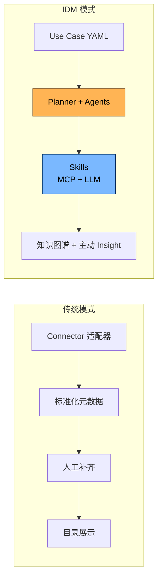
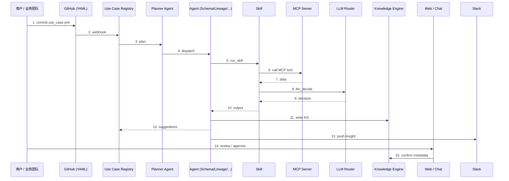
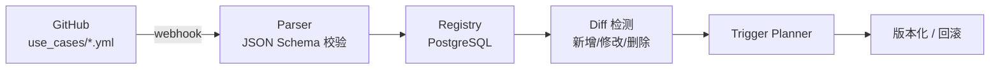
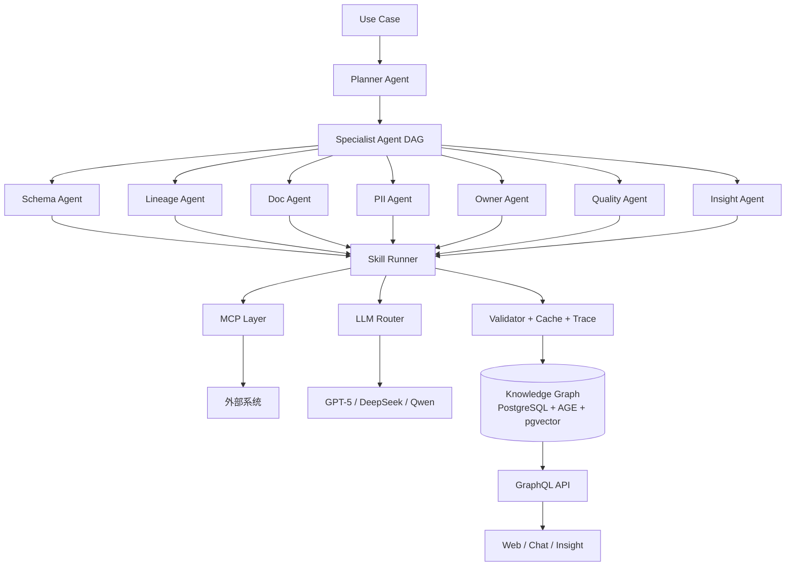
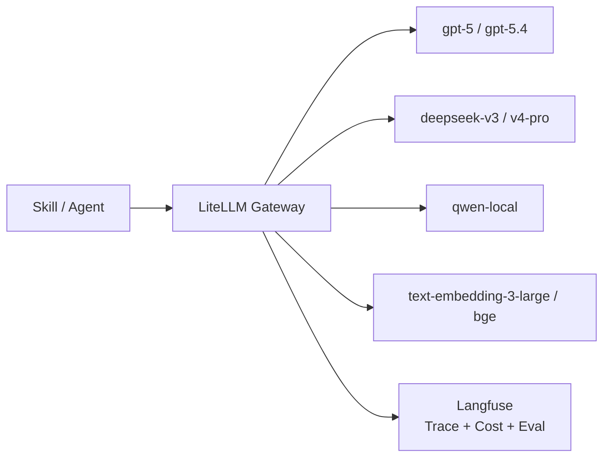
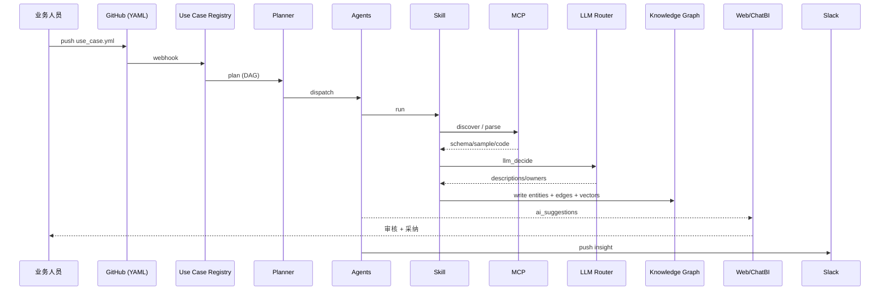
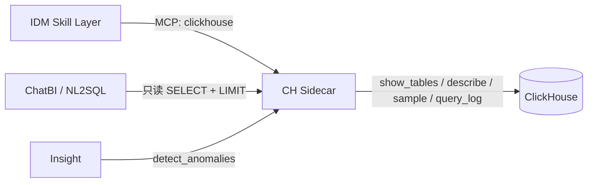

# IDM — AI-Driven Data Management Platform · 总体架构设计

> 📌 **实现前先读**: [AGENT_INSTRUCTIONS.md](../AGENT_INSTRUCTIONS.md) — 包含 5 大原则 / 1+9 Agent / Skill 规范 / LLM 路由 / 绝对不能做 的"宪法"级摘要, 5 分钟内可读完。

> **IDM (Intelligent Data Mesh)**: AI 驱动的数据管理平台
> **MCP-First / UseCase-as-Config / Agent-Orchestrated / Skills-Stable**
> **零侵入** 适配现有技术栈：GCP (GKE / CloudSQL-PG / GCS) + Airflow + Flink + React + Python + TypeScript + ClickHouse (GCE) + Superset
> 主线 LLM：GPT-5（可平滑升级到 GPT-5.4），备选 DeepSeek V3（可平滑升级到 V4 Pro），本地 Qwen 兜底

---

## 目录

- [1. 愿景与设计原则](#1-愿景与设计原则)
- [2. 与传统元数据平台的根本区别](#2-与传统元数据平台的根本区别)
- [3. 总体架构总览](#3-总体架构总览)
- [4. 三大支柱（MCP / UseCase / Agent-Skill）](#4-三大支柱mcp--usecase--agent-skill)
- [5. 五大核心子系统](#5-五大核心子系统)
- [6. 技术栈映射](#6-技术栈映射)
- [7. 数据流：端到端生命周期](#7-数据流端到端生命周期)
- [8. 与现有栈的集成](#8-与现有栈的集成)
- [9. 安全与多租户](#9-安全与多租户)
- [10. 关键设计决策 (ADR 摘要)](#10-关键设计决策-adr-摘要)
- [11. 文档导航](#11-文档导航)

---

## 1. 愿景与设计原则

### 1.1 一句话愿景

> **让 LLM 成为数据团队的「第一位数据工程师」**
> — 业务人员写 1 份 YAML, Agent 接管剩下的全部 (发现 / 理解 / 血缘 / 文档 / 质量 / 预警);
> 原系统 0 改动。

### 1.2 七大设计原则

| # | 原则 | 含义 |
| --- | --- | --- |
| 1 | **MCP-First** | 所有外部系统走 Model Context Protocol；IDM 是 MCP **Client**, 不是 Connector 写手 |
| 2 | **UseCase-as-Config** | 业务团队只交付 1 份 YAML/JSON, 描述"治理什么", 不写代码 |
| 3 | **Agent-Orchestrated** | 1 Planner + 9 Specialist Agent 协作, 任何复杂任务 = DAG(Agent → Skill) |
| 4 | **Skills-Stable** | Agent 用 **Skill** (SOP) 调 MCP + LLM; Skill 标准化、可测试、可重放 |
| 5 | **Zero-Touch Integration** | 原系统 0 改动; 通过 MCP / 公开 API / Superset export 即可接入 |
| 6 | **Knowledge Graph as Truth** | 唯一元数据: PostgreSQL 关系 + Apache AGE 图 + pgvector 向量 |
| 7 | **Cloud-Native & Decoupled** | 全 GKE, 无状态, 事件驱动, 可独立伸缩 |

### 1.3 我们要解决的真实问题

```text
❌  DataHub / OpenMetadata 模式: 给每个系统写 Connector → 80% 时间做适配器
❌  传统 "全栈 push" 模式:    业务系统装 SDK / 改代码 / 推数据 → 治理项目失败
✅  IDM 模式: 1 份 YAML + MCP 旁路 + Agent 主动观察 → 业务不动, 治理自动跑
```

---

## 2. 与传统元数据平台的根本区别

| 维度 | DataHub / OpenMetadata | **IDM (我们)** |
| --- | --- | --- |
| 数据采集 | 80+ Connector 主动拉 / 被动接 | **MCP Server** 标准协议; **零侵入** 旁路 |
| 接入新数据源 | 写 Connector 适配器 | 自建 / 复用 MCP Server (5~50 行) |
| 业务配置 | 元数据 YAML/JSON | **Use Case YAML** (含业务上下文 + 分析任务) |
| 文档生成 | LLM 后置生成 | LLM **前瞻** 参与建模 (读 dbt / migration / 设计文档) |
| 血缘 | SQL Parser + Job log | **多模态融合**: SQL + dbt + Airflow + Superset + **LLM 推断** |
| 质量 | 内置断言规则 | **AI 推断 + 自动建议** 异常基线 / 模式漂移 |
| 治理 | 人工打标 / 所有权 | **Agent 自动建议 Owner / Tag / PII** + 人工一键确认 |
| 搜索 | 倒排 / 关键词 | **混合检索**: 向量 + 关键词 + 图遍历 |
| 价值交付 | 资产目录 | **知识图谱 + 主动洞察** (今日数据健康 / 风险 / 机会) |
| 稳定性 | - | **Skill Spec + Validator + Eval Harness** 三层保障 |



---

## 3. 总体架构总览

### 3.1 一张全景图

```mermaid
flowchart TB
    subgraph 业务与数据层 (Existing, 零改动)
        DS1[(ClickHouse<br/>GCE)]
        DS2[(CloudSQL<br/>PostgreSQL)]
        DS3[(GCS<br/>Data Lake)]
        AR[Airflow<br/>on GKE]
        FK[Flink<br/>Job Cluster]
        SP[Superset<br/>on GKE]
        GH[GitHub<br/>代码仓]
        APP[业务应用<br/>Python/TS/Go]
    end

    subgraph MCP 协议层 (标准接口)
        M1[clickhouse MCP]
        M2[github MCP]
        M3[gcs MCP]
        M4[superset_export MCP]
        M5[airflow MCP]
        M6[slack/lark MCP]
        M7[postgres MCP]
        MX[...更多 MCP]
    end

    subgraph IDM 核心 (GKE)
        UC[Use Case Registry<br/>YAML 仓库监听]
        PL[Planner Agent<br/>gpt-5]
        AG[Specialist Agents<br/>Schema/Lineage/Doc/PII/Owner/Quality/Insight/ChatBI]
        SK[Skills Layer<br/>Skill Spec + Runner]
        KE[Knowledge Engine<br/>PG + AGE + pgvector]
        AS[Asset Service<br/>GraphQL API]
        GO[Governance Service]
        QL[Quality Engine]
        CH[ChatBI Service]
    end

    subgraph LLM 路由层
        LR[LiteLLM Gateway]
        L1[gpt-5 / gpt-5.4]
        L2[deepseek-v3 / v4-pro]
        L3[qwen-local]
        LF[Langfuse<br/>Trace + Eval]
    end

    subgraph 交付层
        UI[React + ag-grid<br/>Web Console]
        CB[ChatBI]
        IN[Insight 推送<br/>Slack/Email/Jira]
        EX[MCP Server (IDM self)<br/>供 Claude/Cursor 接入]
    end

    DS1 & DS2 & AR & FK & SP & GH & DS3 & APP --> M1 & M2 & M3 & M4 & M5 & M6 & M7
    M1 & M2 & M3 & M4 & M5 & M6 & M7 --> SK
    UC --> PL
    PL --> AG
    AG --> SK
    SK --> KE
    SK --> LR
    LR --> L1 & L2 & L3
    LR --> LF
    KE --> AS
    GO & QL & CH --> AS
    AS --> UI
    AS --> CB
    AS --> IN
    AS --> EX
```

### 3.2 控制流 vs 数据流



---

## 4. 三大支柱（MCP / UseCase / Agent-Skill）

### 4.1 支柱一：MCP 协议层 (Zero-Touch)

**所有外部系统通过 MCP 抽象**, IDM 内部永远不直连。

- 内置 MCP Server 10+: `clickhouse` / `github` / `gcs` / `superset_export` / `airflow` / `slack` / `lark` / `confluence` / `jira` / `postgres`
- 三种部署模式: Sidecar (贴近 CH) / In-Pod (无状态) / Remote SSE (跨网络)
- 用户自建 5~50 行即可接入新系统, IDM 注册一份配置即生效

### 4.2 支柱二：Use Case YAML (业务入口)

每个 use case 一份 YAML, 描述"管什么 + 怎么管":

```yaml
id: shop-orders-daily
version: 1
sources: [clickhouse, github, superset_export]
analysis: [discover, lineage, doc, pii, owner, quality]
deliverables: { knowledge_graph: true, insights: [slack] }
```

> **业务团队只交付 YAML**, 不写代码, 不集成 SDK。

### 4.3 支柱三：Agent + Skill (执行内核)

- **Planner Agent** (gpt-5) → 把 Use Case 拆为 DAG
- **9 个 Specialist Agent** → Schema / Lineage / Doc / PII / Owner / Quality / Insight / ChatBI
- **Skill Spec** (YAML) → 描述"具体怎么把一件事做对" (MCP calls + LLM calls + Validators)
- **Skill Runner** → 标准化执行器, 负责重试 / 缓存 / 校验 / 可观测
- **Eval Harness** → 评估 + 门禁 + Few-shot 自动维护, 保证稳定

详见: [mcp-first-architecture.md](./mcp-first-architecture.md) · [agent-orchestration.md](./agent-orchestration.md) · [skills-design.md](./skills-design.md) · [use-case-spec.md](./use-case-spec.md)

---

## 5. 五大核心子系统

### 5.1 Use Case Registry (业务配置中心)



**关键能力**:
- Webhook 监听 YAML 仓库变更
- 校验 + Diff + 版本化
- 提供 GraphQL 给前端浏览

### 5.2 Agent Orchestrator + Knowledge Engine (AI 核心)



**9 个 Specialist Agent (详)**:

| Agent | 任务 | 主 LLM | 详见 |
| --- | --- | --- | --- |
| **Schema** | 发现 Table/Column/Sample | deepseek-v3 | walkthrough §5.1 |
| **Lineage** | SQL + dbt + Airflow + Superset 血缘 | deepseek-v3 + sqlglot | walkthrough §5.2~5.4 |
| **Doc** | Table/Column Description | gpt-5 | skills-design §11 |
| **PII** | 自动敏感字段分类 | gpt-5 | skills-design §11 |
| **Owner** | 推断 Owner / Steward | gpt-5 | skills-design §11 |
| **Quality** | 异常检测 + 基线 | deepseek-reasoner | insight-alerting §9 |
| **Insight** | 推送 Slack/Email/Jira | gpt-5 | insight-alerting §8 |
| **ChatBI** | NL2SQL | gpt-5 | chatbi-design §5 |

### 5.3 MCP Layer (协议层)

| MCP Server | 调用方 | 部署 |
| --- | --- | --- |
| `clickhouse` | Schema / Quality / ChatBI | GCE sidecar (贴近 CH) |
| `github` | Lineage / Owner / Code Analysis | IDM pod (stdin) |
| `gcs` | Superset Export / Big File | IDM pod |
| `superset_export` | Lineage (BI → Table) | IDM pod |
| `airflow` (via github) | Lineage | IDM pod |
| `slack` / `lark` | Insight 推送 | IDM pod |
| `confluence` / `jira` | 知识 + 工单 | IDM pod |
| `postgres` | 元数据查询 | IDM pod |
| 自建 (如 `lark_bitable`) | 业务接入 | 用户侧 / IDM pod |

详见: [mcp-server-guide.md](./mcp-server-guide.md)

### 5.4 LLM Gateway (统一路由)



**路由策略**:
- **主力**: gpt-5 (强规划 + 高质量)
- **备选**: deepseek-v3 (中文 / 长文 / 成本)
- **兜底**: qwen-local (合规 / 敏感数据)
- **推理**: deepseek-reasoner (复杂归因)
- **Embedding**: text-embedding-3-large + bge 双轨

详见: [llm-router.md](./llm-router.md)

### 5.5 Delivery Layer (交付层)

| 入口 | 形态 | 作用 |
| --- | --- | --- |
| **Web Console** | React 18 + Vite + **ag-grid Community** + 公司 UX | 资产目录 / 血缘 / 建议审核 / Quality / Chat |
| **ChatBI** | Web + 嵌入式 | 自然语言问数 |
| **MCP Server (IDM self)** | stdio / SSE | 供 Claude / Cursor 接入 (反向) |
| **Daily Insight** | Slack / Lark / Email | 每日数据健康 / 风险简报 |
| **Webhook / API** | GraphQL + REST | 集成到内部系统 |

**前端原则**: **不引 antd / material ui**, 用 **ag-grid Community** + 自研 **IDM UI Kit** (复用公司 Design Token)。详见 [frontend-design.md](./frontend-design.md)

---

## 6. 技术栈映射

| 层 | 现有栈 | IDM 选型 | 用途 |
| --- | --- | --- | --- |
| 容器编排 | GKE | **GKE** | 全量 IDM 服务 |
| 关系存储 | CloudSQL-PG | **CloudSQL-PG + Apache AGE + pgvector** | 元数据 / 知识图谱 / 向量 |
| 对象存储 | GCS | **GCS** | 大文件 / Superset Export / dbt manifest / 样本 |
| 数仓 | ClickHouse (GCE) | **ClickHouse** | 数据画像 / Profiler 样本 / Query 历史 |
| 事件总线 | (无) | **GCP Pub/Sub** | 观察事件流 / Agent 触发 |
| 调度 | Airflow | **Airflow** | IDM 自身的周期任务 + 复用现有 DAG 监听 |
| 流处理 | Flink | **Flink** | 实时血缘 / 实时质量 (可选) |
| 前端 | React | **React 18 + Vite + ag-grid Community + 公司 UX Kit** | Web Console + ChatBI |
| 后端 | Python | **Python 3.12 + FastAPI + LangGraph** | 主服务 / Agent 编排 |
| LLM 编排 | - | **LangGraph + LiteLLM + Langfuse** | Agent 编排 / 多模型路由 / 可观测 |
| LLM 模型 | (规划) | **GPT-5 (主力) + DeepSeek V3 (备选) + Qwen (本地) + Embedding 双轨** | 文档 / NL2SQL / 推断 |
| MCP 协议 | - | **mcp-python-sdk (官方) + 自研 MCP Server** | 连接外部系统的标准接口 |
| Skill 执行 | - | **自研 Skill Runner + Spec** | MCP + LLM + Validator 标准化 |
| Eval Harness | - | **自研** + Langfuse Eval | 自动回归 / 门禁 / Few-shot |
| 报告 | Superset | **Superset** | 数据洞察 / 质量趋势 (导出 + 嵌入) |
| 监控 | (GCP) | **Cloud Monitoring + OpenTelemetry + Langfuse** | Trace / Metric / Log |
| 鉴权 | (GCP IAM) | **OIDC (Google Workspace SSO) + RBAC** | 用户/权限 |
| CI/CD | (GCP) | **Cloud Build + ArgoCD** | GitOps |

---

## 7. 数据流：端到端生命周期

### 7.1 资产从「出生」到「治理」



### 7.2 资产全生命周期

| 阶段 | AI 自动做 | 人工做 |
| --- | --- | --- |
| **声明** | 写 1 份 YAML, 提交到 GitHub | 业务确认范围 |
| **发现** | 通过 MCP 嗅探 Schema / Code / BI | 调整过滤条件 |
| **建模** | Agent 自动归一化 / Entity Resolver | 业务术语挂接 |
| **文档** | 写 Description / Tag / Owner / PII 建议 | 一键确认 |
| **血缘** | 解析 SQL / dbt / DAG / Superset + LLM 推断 | 补充业务注释 |
| **质量** | 自动建议断言 / 推断基线 / 漂移检测 | 调整阈值 |
| **治理** | 风险评级 / 分类分级 / 异常告警 | 审批敏感数据 |
| **退役** | 检测低频访问 / 提示归档 | 确认 |

---

## 8. 与现有栈的集成

### 8.1 与 ClickHouse 集成 (核心)



**关键点**:
- 0 业务侵入: 不装 SDK, 不改 CH 配置
- MCP Server 强制 LIMIT, 禁 DML
- 内部用 CH 存画像 (Profile / Query 样本)

### 8.2 与 GitHub 集成

- 解析 dbt manifest / Airflow DAG / 应用代码
- 推断 Lineage / Owner / Code 注释
- Webhook 监听仓库变更, 触发 Planner

### 8.3 与 Airflow 集成

- 通过 GitHub MCP 解析 DAG (无侵入)
- 也可用 Airflow MCP 直连 (双向, 但非必须)

### 8.4 与 Superset 集成

- 通过 GCS MCP 读 Superset 导出的 dashboard zip
- 解析 Dataset / Chart / Dashboard, 建立 BI → Table 血缘
- ChatBI 可一键把结果保存回 Superset

### 8.5 与 Flink 集成

- Flink REST API 拉 Job 状态 + 自定义 Hook
- 通过 MCP 抽象

### 8.6 与 dbt 集成

- 解析 `manifest.json` + `catalog.json`
- 把 dbt Model / Test / Source / Doc 全部映射到 IDM Asset

---

## 9. 安全与多租户

| 维度 | 设计 |
| --- | --- |
| **认证** | Google Workspace SSO (OIDC) + Service Account (M2M) |
| **授权** | RBAC + ABAC (基于 Tag / Domain) |
| **租户** | 起步单租户; 模型预留 `tenant_id` |
| **LLM 安全** | 敏感数据脱敏 → LLM; PII 强制走本地 Qwen; 审计 LLM 调用 |
| **SQL Guard** | ChatBI 只允许 SELECT, 强制 LIMIT, 禁函数黑名单; 5 层防护 |
| **审计** | 所有写操作 + LLM 调用 + MCP 调用 → `audit_log` |
| **数据驻留** | 本地 LLM 兜底; 海外业务可指定 GPT-5 EU region |
| **MCP 鉴权** | 只读账号 + IP allowlist + PAT + mTLS; Least Privilege |

---

## 10. 关键设计决策 (ADR 摘要)

| # | 决策 | 选择 | 理由 |
| --- | --- | --- | --- |
| ADR-001 | 元数据存储 | **CloudSQL-PG + Apache AGE** | 复用现有 PG; 图查询用 AGE, 避免引入 Neo4j |
| ADR-002 | 事件总线 | **GCP Pub/Sub** | 复用 GCP 生态, 免运维 |
| ADR-003 | 向量索引 | **pgvector** | 与 PG 同实例; 规模大再迁 Qdrant |
| ADR-004 | LLM 编排 | **LangGraph + LiteLLM + Langfuse** | 成熟 / 可观测 / 多模型 |
| ADR-005 | 接入方式 | **MCP-First (零侵入)** | 替换传统 Sidecar/Connector; 自建 MCP 即可 |
| ADR-006 | 知识建模 | **借鉴 OM JSON Schema + DataHub Aspect 混合** | 兼得灵活性与规范性 |
| ADR-007 | 前端 | **React 18 + Vite + ag-grid Community + 公司 UX** | **不引 antd/material**; 复用公司设计 |
| ADR-008 | 部署平台 | **GKE** | 全部 IDM 服务在 GKE; ClickHouse 保留 GCE |
| ADR-009 | Agent 框架 | **LangGraph 编排 + 自研 Specialist Agent + Skill** | 关键 Agent 自研, 可控可审计 |
| ADR-010 | Skill 稳定性 | **Spec + Runner + Validator + Eval Harness** | 三层保障, 避免 LLM 直接执行的不可控 |
| ADR-011 | LLM 模型 | **GPT-5 主力 + DeepSeek V3 备选 + Qwen 本地兜底** | 质量 / 成本 / 合规三角平衡 |
| ADR-012 | 业务配置 | **Use Case YAML** | 一份即声明场景, 业务自助 |
| ADR-013 | 评估 | **离线 Gold + 在线 Judge + 用户反馈** | 三层闭环, 防止退化 |
| ADR-014 | 数据格式 | **Parquet + Iceberg on GCS** | 大样本 / 长期归档 |

---

## 11. 文档导航

### 11.1 核心设计 (必读)

- [agent-orchestration.md](./agent-orchestration.md) — 1+9 Agent 协作 / Planner 状态机 / Reflection / Guardrails
- [mcp-first-architecture.md](./mcp-first-architecture.md) — MCP-First 架构 / UseCase / Agent 三大支柱
- [skills-design.md](./skills-design.md) — Skill Spec / Runner / Validator / 调度并行
- [use-case-spec.md](./use-case-spec.md) — Use Case YAML/JSON 规范
- [walkthrough.md](./walkthrough.md) — 端到端 demo (ClickHouse + GitHub + Superset)
- [ai-driven-design.md](./ai-driven-design.md) — AI 驱动的核心设计

### 11.2 子系统详细设计

- [data-model.md](./data-model.md) — 知识图谱 / ER / 向量索引
- [llm-router.md](./llm-router.md) — LLM 路由 / 缓存 / 成本 / PII
- [frontend-design.md](./frontend-design.md) — ag-grid Community + IDM UI Kit
- [mcp-server-guide.md](./mcp-server-guide.md) — 自建 MCP Server 完整教程
- [insight-alerting.md](./insight-alerting.md) — Insight 决策 / 告警 / SLO
- [chatbi-design.md](./chatbi-design.md) — NL2SQL / 5 层安全
- [eval-harness.md](./eval-harness.md) — 评估体系 / 门禁 / Few-shot

### 11.3 运营与实施

- [deployment.md](./deployment.md) — GKE 部署 / Helm / GitOps / 资源清单
- [roadmap.md](./roadmap.md) — 季度里程碑 / P0-P3 优先级
- [stack-decisions.md](./stack-decisions.md) — 技术选型决策

### 11.4 调研

- [platform/datahub.md](../platform/datahub.md) · [platform/openmetadata.md](../platform/openmetadata.md) · [platform/comparison.md](../platform/comparison.md)
