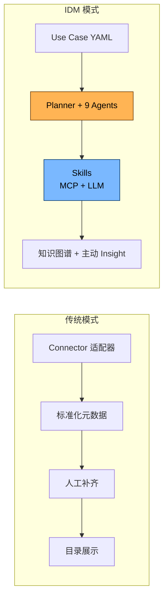
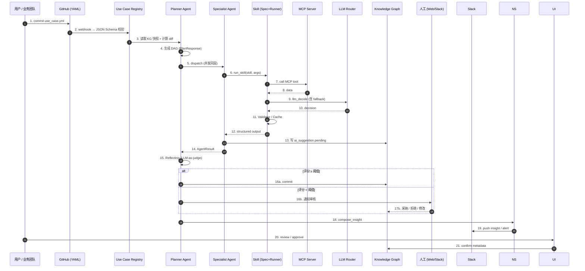
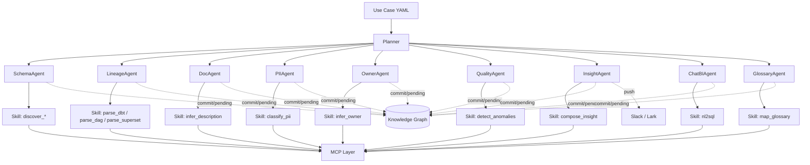
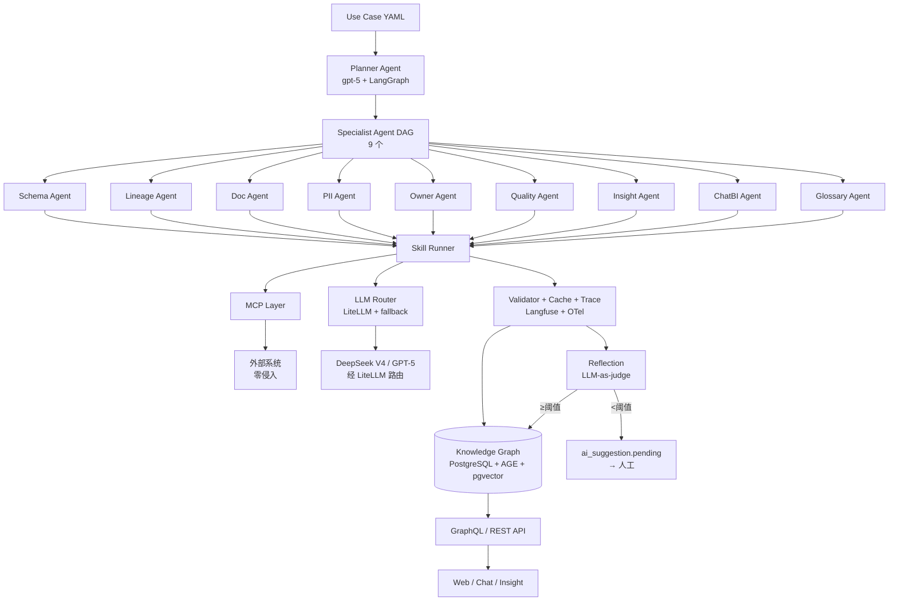
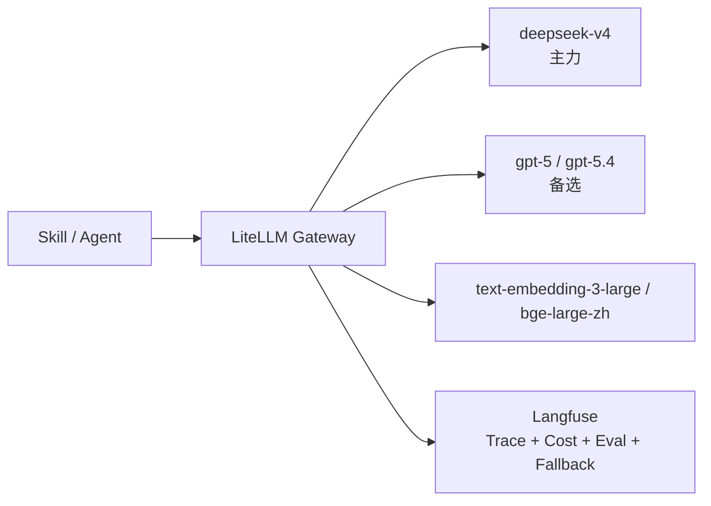
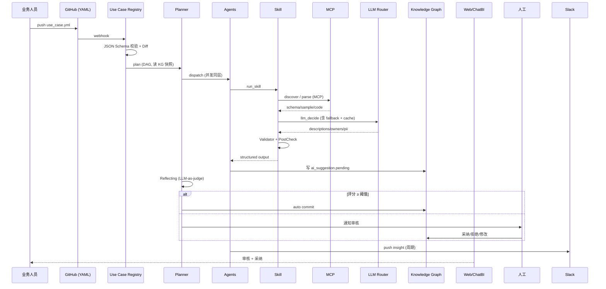
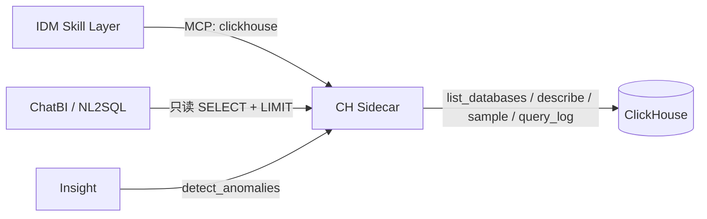

# IDM — AI-Driven Data Management Platform · 总体架构设计

> 📌 **实现前先读**: [AGENT_INSTRUCTIONS.md](../AGENT_INSTRUCTIONS.md) — 包含 5 大原则 / 1+9 Agent / Skill 规范 / LLM 路由 / 绝对不能做 的"宪法"级摘要, 5 分钟内可读完。
>
> **详细分论**：[mcp-first-architecture.md](./mcp-first-architecture.md) · [agent-orchestration.md](./agent-orchestration.md) · [skills-design.md](./skills-design.md) · [use-case-spec.md](./use-case-spec.md) · [ai-driven-design.md](./ai-driven-design.md) · [llm-router.md](./llm-router.md) · [data-model.md](./data-model.md) · [eval-harness.md](./eval-harness.md)
>
> **IDM (Intelligent Data Mesh)**: AI 驱动的数据管理平台
> **MCP-First / UseCase-as-Config / Agent-Orchestrated / Skills-Stable / AI-in-the-Loop**
> **零侵入** 适配现有技术栈：GCP (GKE / CloudSQL-PG / GCS) + Airflow + Flink + React + Python + TypeScript + ClickHouse (GCE) + Superset
> 主线 LLM：DeepSeek V4（主力），备选 GPT-5（可平滑升级到 GPT-5.4）

---

## 目录

- [1. 愿景与设计原则](#1-愿景与设计原则)
- [2. 与传统元数据平台的根本区别](#2-与传统元数据平台的根本区别)
- [3. 总体架构总览](#3-总体架构总览)
- [4. 三大支柱 + 五原则（MCP / UseCase / Agent-Skill）](#4-三大支柱--五原则mcp--usecase--agent-skill)
- [5. 五大核心子系统](#5-五大核心子系统)
  - [5.1 Use Case Registry](#51-use-case-registry-业务配置中心)
  - [5.2 Agent Orchestrator + Knowledge Engine](#52-agent-orchestrator--knowledge-engine-ai-核心)
  - [5.3 MCP Layer](#53-mcp-layer-协议层)
  - [5.4 LLM Gateway](#54-llm-gateway-统一路由)
  - [5.5 Delivery Layer](#55-delivery-layer-交付层)
  - [**5.6 触发与 Re-scan 子系统 (M1.5 新增)**](#56-触发与-re-scan-子系统-m15-新增--平台自己的主动脉)
  - [**5.7 语义增强子系统 (M2.x 新增 — 让数据资产"会说话")**](#57-语义增强子系统-m2x-新增--让数据资产会说话)
- [6. 技术栈映射](#6-技术栈映射)
- [7. 数据流：端到端生命周期](#7-数据流端到端生命周期)
- [8. 与现有栈的集成](#8-与现有栈的集成)
- [9. 安全与多租户](#9-安全与多租户)
- [10. 关键设计决策 (ADR 摘要)](#10-关键设计决策-adr-摘要)
- [11. 文档导航](#11-文档导航)

---

## 1. 愿景与设计原则

### 1.1 一句话愿景

> **让 LLM 成为数据团队的「第一位数据工程师」**
> — 业务人员只交付 1 份 YAML, Agent 接管剩下的全部 (发现 / 理解 / 血缘 / 文档 / 质量 / 预警);
> 原系统 **0 改动**。

### 1.2 五大设计原则 (Must Follow)

| # | 原则 | 含义 | 反面 |
| --- | --- | --- | --- |
| 1 | **MCP-First, Zero-Touch** | 所有外部系统走 Model Context Protocol；IDM 是 MCP **Client**，不是 Connector 写手 | 写 Connector / 让业务装 SDK |
| 2 | **UseCase-as-Config** | 业务团队只交付 1 份 YAML/JSON, 不写代码 | 写元数据 ETL / 多份配置 |
| 3 | **Agent-Orchestrated (1+9)** | 1 Planner + 9 Specialist Agent；任务 = DAG(Agent → Skill) | 大单体 LLM / 散落脚本 |
| 4 | **Skills-Stable** | Agent 用 **Skill (SOP)** 调 MCP + LLM；Skill **可测试、可重放、有 Eval** | 让 LLM 直接调 MCP / 直接生成 SQL |
| 5 | **AI in the Loop, Human in the Lead** | LLM 写建议 → `ai_suggestion.pending` → 人工一键确认才生效 | 让 LLM 自动改生产元数据 / 自动写业务系统 |

### 1.3 三个"绝不" (Zero-Touch 红线)

| 绝不 | 含义 |
| --- | --- |
| **绝不改造现有系统** | ClickHouse / Airflow / Flink / Superset / GitHub 0 改动 |
| **绝不嵌入业务路径** | 没有 SDK 必须引入，没有 Agent 必须 co-locate |
| **绝不依赖 push 集成** | 业务系统无需主动推数据给 IDM；IDM 主动通过 MCP 拉 |

### 1.4 五大"绝对不能做" (Top 5 Forbidden)

1. ❌ **不要**让 LLM 直接调 MCP tool — 必须经 Skill Spec
2. ❌ **不要**自动写业务系统 (CH/PG 写表) — 走 `ai_suggestion` 审核流
3. ❌ **不要**在 Skill 里硬编码 prompt — 用 Jinja 模板 + Spec 渲染
4. ❌ **不要**跨 Specialist Agent 直接互调 — 全走知识图谱
5. ❌ **不要**把 Antd 引入前端 — 用 ag-grid Community + IDM UI Kit

### 1.5 我们要解决的真实问题

```text
❌  DataHub / OpenMetadata 模式: 给每个系统写 Connector → 80% 时间做适配器
❌  传统 "全栈 push" 模式:    业务系统装 SDK / 改代码 / 推数据 → 治理项目失败
✅  IDM 模式: 1 份 YAML + MCP 旁路 + Agent 主动观察 → 业务不动, 治理自动跑
```

---

## 2. 与传统元数据平台的根本区别

| 维度 | DataHub / OpenMetadata | **IDM (我们)** |
| --- | --- | --- |
| 数据采集 | 80+ Connector 主动拉 / 被动接 | **MCP Server** 标准协议；**零侵入** 旁路 |
| 接入新数据源 | 写 Connector 适配器 | 自建 / 复用 MCP Server (5~50 行) |
| 业务配置 | 元数据 YAML/JSON | **Use Case YAML** (含业务上下文 + 分析任务) |
| 文档生成 | LLM 后置生成 | LLM **前瞻** 参与建模 (读 dbt / migration / 设计文档) |
| 血缘 | SQL Parser + Job log | **多模态融合**: SQL + dbt + Airflow + Superset + **LLM 推断** |
| 质量 | 内置断言规则 | **AI 推断 + 自动建议** 异常基线 / 模式漂移 |
| 治理 | 人工打标 / 所有权 | **Agent 自动建议 Owner / Tag / PII** + 人工一键确认 |
| 搜索 | 倒排 / 关键词 | **混合检索**: 向量 + 关键词 + 图遍历 |
| 价值交付 | 资产目录 | **知识图谱 + 主动洞察** (今日数据健康 / 风险 / 机会) |
| 稳定性 | - | **Skill Spec + Runner + Validator + Eval Harness** 三层保障 |

### 2.1 从"问卷系统"到"产线旁的数据工程师"

> 传统平台像一个**问卷系统**：「请每个系统填写一份自我介绍」→ 80% 的人懒得写，填的也常常过时。
>
> IDM 想做的是**一位坐在产线旁的资深数据工程师**：他不需要你填表；他看你的代码、SQL、查询日志、dbt 文件，就能告诉你「这张表里 `user_email` 是 PII，应该打 Tag」「`orders_daily` 实际上周一开始没人查了，可以归档」。



---

## 3. 总体架构总览

### 3.1 一张全景图 (MCP-First · UseCase · Agent+Skill)

```mermaid
flowchart TB
    subgraph 业务与数据层 (Existing, 零改动)
        DS1[(ClickHouse<br/>GCE)]
        DS2[(CloudSQL<br/>PostgreSQL)]
        DS3[(GCS<br/>Data Lake)]
        AR[Airflow<br/>on GKE]
        FK[Flink<br/>Job Cluster]
        SP[Superset<br/>on GKE]
        GH[GitHub<br/>代码仓]
        APP[业务应用<br/>Python/TS/Go]
        AF[dbt manifest<br/>+ 设计文档]
    end

    subgraph MCP 协议层 (标准接口 / Sidecar · In-Pod · Remote SSE)
        M1[clickhouse MCP]
        M2[github MCP]
        M3[gcs MCP]
        M4[superset_export MCP]
        M5[airflow MCP]
        M6[flink MCP]
        M7[postgres MCP]
        M8[slack / lark MCP]
        M9[notion / confluence / jira MCP]
        M0[idm-self MCP<br/>反向暴露给 Claude/Cursor]
        MX[...更多 MCP]
    end

    subgraph IDM 核心 (GKE)
        UC[Use Case Registry<br/>YAML 仓库监听 + JSON Schema 校验]
        PL[Planner Agent<br/>gpt-5 · LangGraph · DAG]
        AG[Specialist Agents ×9<br/>Schema/Lineage/Doc/PII<br/>Owner/Quality/Insight/ChatBI/Glossary]
        SK[Skills Layer<br/>Spec + Runner + Validator + Cache]
        KE[Knowledge Engine<br/>PG + AGE + pgvector]
        AS[Asset Service<br/>FastAPI + GraphQL]
        QL[Query Service<br/>NL2SQL + 5层Guard]
        NS[Notify Service<br/>Slack/Lark/Email/Webhook]
    end

    subgraph LLM 路由层
        LR[LiteLLM Gateway]
        L1[deepseek-v4<br/>主力]
        L2[gpt-5 / gpt-5.4<br/>备选]
        L3[text-embedding-3-large<br/>Embedding]
        LF[Langfuse<br/>Trace + Cost + Eval]
    end

    subgraph 交付层
        UI[React 18 + Vite<br/>ag-grid Community + IDM UI Kit<br/>资产/血缘/审核/质量/Chat]
        CB[ChatBI]
        IN[Insight 推送<br/>Slack/Lark/Email/Jira]
        EX[MCP Server (IDM self)<br/>供 Claude/Cursor 接入]
    end

    DS1 & DS2 & AR & FK & SP & GH & DS3 & APP & AF --> M1 & M2 & M3 & M4 & M5 & M6 & M7 & M8 & M9
    M1 & M2 & M3 & M4 & M5 & M6 & M7 & M8 & M9 --> SK
    UC --> PL
    PL --> AG
    AG --> SK
    SK --> KE
    SK --> LR
    LR --> L1 & L2 & L3 & L4
    LR --> LF
    KE --> AS
    QL & NS --> AS
    AS --> UI
    AS --> CB
    AS --> IN
    AS --> EX
```

### 3.2 控制流 vs 数据流 (Planner 状态机视角)



**状态机**：`Ingest → PlanReady → PlanGenerated → Executing → Reflecting → Commit | HumanGate | Replan`

---

## 4. 三大支柱 + 五原则 (MCP / UseCase / Agent-Skill)

### 4.1 支柱一：MCP 协议层 (Zero-Touch)

**所有外部系统通过 MCP 抽象**, IDM 内部永远不直连。

```mermaid
flowchart TB
    subgraph A[Sidecar (贴近数据源)]
        A1[IDM Pod] --> A2[CH MCP Sidecar] --> A3[(ClickHouse)]
    end
    subgraph B[In-Pod (无状态服务)]
        B1[IDM Pod] --> B2[github/gcs/slack MCP<br/>同容器]
    end
    subgraph C[Remote SSE (跨网络)]
        C1[IDM Pod] -.HTTP/SSE.-> C2[Remote MCP Server]
    end
```

- **内置 MCP Server 11+**：`clickhouse` / `github` / `gcs` / `superset_export` / `airflow` / `flink` / `postgres` / `slack` / `lark` / `notion` / `confluence` / `jira` / `dbt` / **`idm-self`**
- **三种部署模式**: Sidecar (贴近 CH) / In-Pod (无状态) / Remote SSE (跨网络)
- **优先复用**社区 / 官方 MCP；缺失 → 写一个 5~50 行的 MCP wrapper
- **反向暴露**：`idm-self` MCP 供 Claude / Cursor / 业务 Bot 接入

详见: [mcp-server-guide.md](./mcp-server-guide.md) · [mcp-first-architecture.md](./mcp-first-architecture.md)

### 4.2 支柱二：Use Case YAML (业务入口)

每个 use case 一份 YAML, 描述"管什么 + 怎么管"：

```yaml
id: shop-orders-daily            # 唯一 (kebab-case)
version: 1
description: 订单宽表治理
owners: [alice@example.com]      # 必填, 人工兜底

sources:                          # 通过哪些 MCP 拉数据
  - { id: ch-prod, type: clickhouse, mcp: clickhouse,
      config: { host: ch.example.com, database: shop } }

context:                          # 业务上下文 (Agent 读)
  flow_diagram: |                 # mermaid / 文字
    Kafka → Airflow → CH → Superset
  glossary: [{ term: GMV, definition: 成交总额 }]
  tags: [sales, tier-1]

analysis:                         # 需要 Agent 干什么
  - { task: discover_assets,  agent: schema }
  - { task: extract_lineage,  agent: lineage,  depends_on: [discover_assets] }
  - { task: generate_docs,    agent: doc,      depends_on: [discover_assets] }
  - { task: classify_pii,     agent: pii,      depends_on: [discover_assets] }
  - { task: suggest_owners,   agent: owner,    depends_on: [discover_assets] }
  - { task: detect_anomalies, agent: quality,  schedule: "0 9 * * *" }

deliverables:
  knowledge_graph: { entities: [table, column, dashboard, pipeline] }
  insights: [{ channel: slack, target: "#data-stewards",
               trigger: [anomaly_detected, owner_missing] }]
  api_expose: true

guardrails:                       # 安全 / 限权
  llm: { allow: true, data_masking: true }
  sql: { readonly: true, max_rows: 1000 }
```

> **业务团队只交付 YAML**, 不写代码, 不集成 SDK。
> 写完 `git commit` → IDM 自动监听 → Planner 自动调度 → 全程不需写代码。

详见: [use-case-spec.md](./use-case-spec.md)

### 4.3 支柱三：Agent + Skill (执行内核)

**绝对不**让 LLM 直接调 MCP、**绝对不**让 Planner 直接写 SQL。
**永远**走：`Planner → Agent → Skill → MCP`。



| 组件 | 职责 | 实现 |
| --- | --- | --- |
| **Planner Agent** (deepseek-v4) | 把 Use Case 拆为 DAG；状态机：Ingest→PlanReady→Executing→Reflecting→Commit/HumanGate | LangGraph 风格 |
| **9 个 Specialist Agent** | 单一领域专家 | Schema / Lineage / Doc / PII / Owner / Quality / Insight / ChatBI / Glossary |
| **Skill Spec (YAML)** | 描述"具体怎么把一件事做对" (MCP calls + LLM calls + Validators) | Spec + Jinja 渲染 |
| **Skill Runner** | 标准化执行器, 负责重试 / 缓存 / 校验 / 可观测 | 自研 |
| **Eval Harness** | 评估 + 门禁 + Few-shot 自动维护 | Gold Snapshot + LLM-as-judge |

详见: [agent-orchestration.md](./agent-orchestration.md) · [skills-design.md](./skills-design.md)

---

## 5. 五大核心子系统

### 5.1 Use Case Registry (业务配置中心)

```mermaid
flowchart LR
    A[GitHub<br/>use_cases/{prod,staging}/] -->|webhook| B[Parser<br/>JSON Schema 校验]
    B --> C[Registry<br/>PostgreSQL]
    C --> D[Diff 检测<br/>新增/修改/删除]
    D --> E[Trigger Planner]
    E --> F[版本化 / 回滚]
```

**关键能力**:
- Webhook 监听 YAML 仓库变更
- JSON Schema 校验 + Diff + 版本化 (`version` 字段)
- 提供 GraphQL 给前端浏览

### 5.2 Agent Orchestrator + Knowledge Engine (AI 核心)



**9 个 Specialist Agent (完整清单)**:

| # | Agent | 任务 | 主 LLM | 典型 Skill | 详见 |
| --- | --- | --- | --- | --- | --- |
| 1 | **Schema** | 发现 Table/Column/Sample | deepseek-v4 | `discover_clickhouse_assets` | walkthrough §5.1 |
| 2 | **Lineage** | SQL + dbt + Airflow + Superset 血缘 | deepseek-v4 + sqlglot | `parse_dbt_manifest`, `parse_superset_export`, `extract_sql_lineage` | walkthrough §5.2~5.4 |
| 3 | **Doc** | Table/Column Description | deepseek-v4 | `infer_table_description` | skills-design §11 |
| 4 | **PII** | 自动敏感字段分类 | deepseek-v4 (PII 先 mask) | `classify_pii_columns` | skills-design §11 |
| 5 | **Owner** | 推断 Owner / Steward | deepseek-v4 | `infer_owners` | skills-design §11 |
| 6 | **Quality** | 异常检测 + 基线 | gpt-5 (复杂归因) | `detect_anomalies`, `run_quality_check` | insight-alerting §9 |
| 7 | **Insight** | 推送 Slack/Email/Jira | deepseek-v4 | `compose_insight` | insight-alerting §8 |
| 8 | **ChatBI** | NL2SQL + 5层 Guard | gpt-5 (NL2SQL 强推理) | `nl2sql` | chatbi-design §5 |
| 9 | **Glossary** | 业务术语挂接 | deepseek-v4 | `map_glossary`, `enrich_glossary` | skills-design §11 |

> **原则**：Planner 拆任务, 每个 Specialist 只做自己的领域, **不跨界调用**; 跨域数据全靠知识图谱。

### 5.3 MCP Layer (协议层)

| MCP Server | 类型 | 来源 | 主要 Tool | 部署 |
| --- | --- | --- | --- | --- |
| `clickhouse` | clickhouse | 社区 / 官方 | `list_databases`, `show_tables`, `describe_table`, `sample`, `list_query_log` | GCE Sidecar (贴近 CH) |
| `github` | github | @modelcontextprotocol/server-github | `search_code`, `get_file_contents`, `list_commits`, `git_blame` | IDM pod (官方) |
| `gcs` | file | 官方 | `list_objects`, `read_object` | IDM pod |
| `superset_export` | superset | 自研 (基于 export) | `load_dashboard`, `parse_chart_sql`, `extract_dataset_ref` | IDM pod |
| `airflow` | airflow | 自研 REST wrapper | `list_dags`, `get_task`, `get_xcom` | IDM pod |
| `flink` | flink | 自研 REST wrapper | `list_jobs`, `get_job_plan` | IDM pod |
| `postgres` | postgres | 社区 (crystaldba/postgres-mcp) | `list_schemas`, `describe_table`, `run_select` | IDM pod |
| `slack` | slack | 官方 | `send_message`, `list_channels` | IDM pod |
| `lark` | lark | 官方 | `send_message`, `read_doc` | IDM pod |
| `notion` | notion | 官方 | `search_pages`, `read_page` | IDM pod |
| `confluence` | confluence | 官方 | `search_pages`, `read_page` | IDM pod |
| `jira` | jira | 官方 | `create_issue`, `update_issue` | IDM pod |
| `dbt` | dbt | 自研 (基于 manifest) | `read_manifest`, `read_catalog` | IDM pod |
| **`idm-self`** | 自定义 | **IDM 自身暴露** (供外部 Agent 查询 KG) | `query_asset`, `search_lineage`, `list_ai_suggestion` | IDM pod |
| 自建 (如 `lark_bitable`) | 业务 | 用户侧 5~50 行 | 自定义 | 用户侧 / IDM pod |

**部署模式**：

```mermaid
flowchart TB
    subgraph A[Sidecar (贴近数据源, 低延迟)]
        A1[IDM Pod] --> A2[CH MCP Sidecar] --> A3[(ClickHouse)]
    end
    subgraph B[In-Pod (无状态服务, github/gcs/slack)]
        B1[IDM Pod] --> B2[github MCP<br/>同容器]
    end
    subgraph C[Remote SSE (跨网络, 业务内网)]
        C1[IDM Pod] -.HTTP/SSE.-> C2[Remote MCP Server]
    end
```

> **重要原则**：IDM 优先使用**社区 / 官方 MCP**；缺失 → 写一个 200 行内的 MCP wrapper，不直接调系统 API。

详见: [mcp-server-guide.md](./mcp-server-guide.md) · [mcp-first-architecture.md](./mcp-first-architecture.md)

### 5.4 LLM Gateway (统一路由)



**路由策略**：

```python
def pick_model(task: dict) -> str:
    if task.get("contains_pii"):                   return "deepseek-v4"      # PII 一律先 mask 再送 v4
    if task.get("estimated_input_tokens", 0) > 60_000: return "deepseek-v4" # 长文
    if task.get("requires_reasoning"):             return "gpt-5"           # 复杂
    if task.get("language", "zh") in ("zh",):      return "deepseek-v4"     # 中文
    return "deepseek-v4"                           # 默认主力
```

| 任务 | 默认 | 备选 |
| --- | --- | --- |
| Planner / Schema / Lineage / Doc / Owner / Insight / Glossary | **deepseek-v4** | gpt-5 |
| PII 列推断 (mask 后) | **deepseek-v4** | gpt-5 |
| 复杂归因 / NL2SQL 强推理 / Code Review | **gpt-5** | deepseek-v4 |
| 批量回填 (>5k) | **deepseek-v4** | gpt-5 |
| Embedding | text-embedding-3-large | bge-large-zh |

**降级链**: `deepseek-v4 → gpt-5`, LiteLLM 自动 fallback + 客户端熔断 (PII 一律先 mask 再送 v4)

详见: [llm-router.md](./llm-router.md)

### 5.5 Delivery Layer (交付层)

| 入口 | 形态 | 作用 |
| --- | --- | --- |
| **Web Console** | React 18 + Vite + **ag-grid Community** + **IDM UI Kit** + ECharts + ReactFlow | 资产目录 / 血缘 / 建议审核 / Quality / Chat |
| **ChatBI** | Web + 嵌入式 (Slack / Lark Bot) | 自然语言问数 (5 层 SQL Guard) |
| **MCP Server (IDM self)** | stdio / SSE | 供 Claude / Cursor 接入 (反向) |
| **Daily Insight** | Slack / Lark / Email | 每日数据健康 / 风险简报 |
| **Webhook / API** | GraphQL (主) + REST (Webhook) | 集成到内部系统 |

**前端原则**: **不引 antd / material ui**, 用 **ag-grid Community** + 自研 **IDM UI Kit** (复用公司 Design Token)。详见 [frontend-design.md](./frontend-design.md)

### 5.6 触发与 Re-scan 子系统 (M1.5 新增 — 平台自己的"主动脉")

> 资产/血缘是"活的", 上游 GCS / Flink / ClickHouse / Superset 每天都在变。
> IDM 提供 2 套 **业务级 + 系统级** 入口, 让"重新扫描"成为平台一等公民, 不是 LLM ad-hoc 行为。

```mermaid
flowchart LR
    subgraph 业务级[业务入口: Use Case 视角]
        UC1[POST /use-cases/{id}/trigger] -->|加载 YAML| O1[analyze_data_pipeline]
        UC2[POST /use-cases/{id}/rescan] -->|alias| O1
        UC3[POST /use-cases/{id}/stages/{n}/trigger] -->|过滤| O1
    end
    subgraph 系统级[系统入口: 资源视角]
        S1[POST /scan/asset {source_type, ...}] --> O2[discover_gcs_assets / discover_clickhouse_assets / parse_superset_dashboard]
    end
    subgraph 底层[底层 Skill]
        O1 --> SK1[discover_gcs_assets]
        O1 --> SK2[parse_flink_job / parse_mex_io]
        O1 --> SK3[discover_clickhouse_assets]
        O2 --> SK1
        O2 --> SK3
    end
    SK1 --> UP[upsert: assets / lineage]
    SK2 --> UP
    SK3 --> UP
```

**关键设计**:

| 维度 | 业务级 (`/use-cases/{id}/*`) | 系统级 (`/scan/asset`) |
| --- | --- | --- |
| **触发方** | 业务人员 / UI / CronJob | 平台 / 运维 / ChatOps |
| **参数** | use case YAML (含 sources) | source_type + bucket / database |
| **范围** | 整个 6 阶段管道 (按 use case) | 单一数据源 (GCS/CH/Superset) |
| **依赖** | 必须先有 use case | 不需要 use case |
| **典型场景** | "我改了 YAML 帮我跑一次" / "整条管道 re-scan" | "刚接了一个新 GCS bucket" / "CH 恢复了" |
| **幂等** | ✅ (asset / lineage upsert) | ✅ |
| **超时** | 单 skill 30s, 总时长由 client 控制 | 同左 |

**入口选择决策树**:

```
我要 re-scan ...
├── 业务上"按 use case 跑" (业务人员/UI)
│   ├── 全 6 阶段     → POST /use-cases/{id}/trigger
│   ├── 整条 idempotent → POST /use-cases/{id}/rescan
│   └── 只某一阶段    → POST /use-cases/{id}/stages/{n}/trigger
├── 资源级"按 source_type 跑" (平台/运维)
│   ├── GCS bucket   → POST /scan/asset  {source_type: gcs, bucket: ...}
│   ├── ClickHouse   → POST /scan/asset  {source_type: clickhouse, database: ...}
│   ├── Superset     → POST /scan/asset  {source_type: superset_export, service_name: ...}
│   └── 全部资源     → POST /scan/asset  {source_type: all}
└── CI / Cron
    └── ./scripts/rescan_pipeline.sh --full
        ./scripts/rescan_pipeline.sh --stage 5
        ./scripts/bootstrap.sh           (全量 bootstrap)
```

**幂等保证**:
- 所有 Skill 走 `discover_*` (upsert by `fqn`) / `parse_*` (upsert by `(upstream, downstream, transform_type)`)
- 多次调用结果一致, 适合周期任务
- 失败 stage 不影响后续 stage (`analyze_data_pipeline` 内部 try/except + `stage_results` 记录)

**降级 / 故障处理**:
- 单 MCP 不可达 → 该 stage 报错, 其他 stage 继续
- 整条管道全失败 → `summary.coverage_pct < 50%` 时, AI Suggestion 提"pipeline broken" 告警
- LLM 路由 → 走 `deepseek-v4 → gpt-5` fallback (PII 先 mask)

**为什么是"系统功能"而非"Ad-hoc LLM 行为"**:
1. **可预测**: 同样的 use case, 同样的输入, 同样的输出 (LLM 不参与主流程, 只参与 enrich)
2. **可观测**: 每次 trigger 输出 `duration_ms` / `coverage_pct` / `stage_results`
3. **可调度**: CronJob / CI 直接调, 不依赖 LLM availability
4. **可审计**: `ai_skill_runs` 表记录每次调用 (M3.5+)
5. **可回放**: 资产/血缘 全部以 `fqn` 索引, 重新跑结果一致

**实现位置**:
- 路由: `apps/api/src/idm_api/routers/use_case_trigger.py` + `routers/scan.py`
- 脚本: `trigger_pipeline_demo.py` (M1.5 改为调新端点)
- BDD: `tests/bdd/features/use_case_trigger.feature` (5 个 scenario)

### 5.7 语义增强子系统 (M2.x 新增 — 让数据资产"会说话")

> **问题**: 资产 / 血缘 / 列 — 在 KG 里都是干瘪的 FQN 和字段名, LLM 用不上。
> **目标**: 让 **每张表 / 每列 / 每条血缘边** 都有 **自然语言描述**, LLM 零样本可用。
>
> 详见 [data-model.md §7](./data-model.md#7-语义增强子层-m2x-新增--semantic-enrichment) · [data-pipeline-lineage.md §4.3](./data-pipeline-lineage.md#43-m2x-新增-列级血缘--语义描述-semantic-enrichment) · [skills-design.md §X](./skills-design.md)

```mermaid
flowchart LR
    subgraph 输入[输入信号]
        S1[表/列/样本数据<br/>Table name + Columns + Sample values]
        S2[血缘边<br/>transform_type + component + sql]
        S3[外部知识<br/>Glossary terms + PII class]
    end

    subgraph 启发[启发式规则 (零 LLM 调用)]
        H1[列名模式匹配<br/>e.g. *_id → PK/FK<br/>email → PII 邮箱]
        H2[值模式匹配<br/>e.g. ISO 国家码, 11 位手机]
        H3[组件描述模板<br/>e.g. airflow_task → "由 Airflow DAG X 的 task Y 复制"]
    end

    subgraph LLM[LLM 兜底 (当规则置信度 < 0.8)]
        L1[infer_table_description<br/>profile=cheap]
        L2[infer_column_descriptions<br/>profile=cheap]
        L3[infer_lineage_descriptions<br/>profile=cheap]
    end

    subgraph 输出[输出 (M2.x 增强)]
        O1[table_asset.description<br/>+ description_source<br/>+ description_rationale]
        O2[column_asset.description<br/>+ description_source<br/>+ description_rationale]
        O3[table_lineage.description<br/>+ column_lineage.description<br/>+ column_lineage.transform_expression]
        O4[ai_suggestion (待人工 review)]
    end

    S1 --> H1
    S1 --> H2
    S2 --> H3
    S1 --> L1
    S1 --> L2
    S2 --> L3
    S3 --> L1
    S3 --> L2

    H1 --> O2
    H2 --> O2
    H3 --> O3
    L1 --> O1
    L2 --> O2
    L3 --> O3

    L1 --> O4
    L2 --> O4
    L3 --> O4
```

#### 5.7.1 三大能力

| 能力 | Skill (M2.x 新增) | 输入 | 输出 |
| --- | --- | --- | --- |
| **表描述推断** | `infer_table_description` (增强) | table_ids[] | `table_asset.description` + `ai_suggestion` |
| **列描述推断** (新) | `infer_column_descriptions` (新) | table_ids[] | `column_asset.description` + `ai_suggestion` |
| **列级血缘** (新) | `infer_column_lineage` (新) + `lineage_to_column` (新) | use_case / table_pair | `column_lineage` 边 (含 transform_expression) |
| **组件级血缘描述** (新) | `infer_lineage_descriptions` (新) | lineage_id / table_pair | `table_lineage.description` + `column_lineage.description` |

#### 5.7.2 三层输入信号 + 权重

| 层级 | 占比 | 来源 | 用途 |
| --- | --- | --- | --- |
| **规则层 (零 LLM)** | 70% | 列名模式 / 数据类型 / 样本值 / PII 分类 / 组件模板 | 命中即用, 高置信度 (≥0.85) |
| **LLM 兜底层** | 25% | DeepSeek V4 cheap profile | 规则未命中, LLM 补全 |
| **人工审核层** | 5% | `ai_suggestion` 待审 | AI 推断的所有结果都先入 suggestion, 人工一键 confirm |

#### 5.7.3 关键设计决策

| 决策 | 选 A | 选 B | IDM 选 | 理由 |
| --- | --- | --- | --- | --- |
| **推断时机** | 同步 (写 KG 时立即推断) | 异步 (后台 batch) | **异步 + 按需** | 不阻塞 6 阶段管道; 用 `infer_*_descriptions` skill 单独触发 |
| **存储形式** | description 直接覆盖 | description + `ai_suggestion` 双写 | **双写** | AI in the Loop — 人工可 review, 拒绝即生效 |
| **列级血缘来源** | 全部调 LLM 推断 | SQL parser 静态 + LLM 兜底 | **静态优先** | SQL parser 准确率 100% (e.g. sqlglot), 节约 LLM token |
| **描述长度** | 50 字 | 200 字 | **30-120 字 (按层级)** | 表: 60-120, 列: 30-60, 血缘: 20-50 |
| **PII 脱敏** | description 含真实值 | description 只描述"类型" | **只描述类型** | 合规优先 (e.g. "包含 11 位手机号" 而非 "13800138000") |
| **置信度阈值** | 全部接受 | 全人工 review | **≥ 0.7 直接写, < 0.7 入 suggestion** | 平衡效率与准确率 |

#### 5.7.4 6 阶段管道样例 (M2.x 增强前后对比)

| 资产/边 | M1.5 (无 description) | M2.x (有 description) |
| --- | --- | --- |
| `gcs://company-raw/orders/2026/06/orders-20260608.csv` | (无) | "原始订单数据 (2026-06-08), 包含订单编号、用户、金额、商品等字段, 一行 = 一个订单" |
| `clickhouse-prod.shop.stg_orders` | (无) | "订单预处理临时表, 来自 Airflow etl_orders_daily 的中间落盘, 字段经类型转换" |
| `clickhouse-prod.shop.fct_orders_risk_daily` | (无) | "订单风险事实表 (天粒度), 一行 = 一个用户 × 一天, 包含日风险分汇总" |
| 列 `risk_score` | (无) | "风险评分 (0-1), 由 MEX 模型 risk_score_v2 派生, 值越大风险越高" |
| 列 `user_id` | (无) | "用户 ID, 关联 dim_users 表, UInt64 类型" |
| 边 `gcs-orders → stg_orders` | `transform=airflow_task, conf=0.95` | "由 Airflow DAG `etl_orders_daily` 的 task `preprocess_orders` 复制到下游" |
| 边 `model-input/orders → model-output/risk` | `transform=mex_model, conf=0.85` | "MEX 黑盒模型 `risk_score_v2` 派生表达式 `model.predict_proba([amount, age, ...])`" |
| 边 `fct_orders_risk_daily.risk_score → superset.dashboard.1.risk_trend` | (无列级血缘) | 列级血缘: `risk_score` 由 `risk_score` 透传, transform=`passthrough`, source=`superset_query` |

#### 5.7.5 LLM 视角: 描述前后查询质量对比

**Before (M1.5, 干瘪 FQN)**:

```text
User: 过去 7 天高风险订单有多少?
LLM: 我看到 clickhouse-prod.shop.fct_orders_risk_daily, 但不知道它的列含义。能否告诉我 risk_score / day 字段是干嘛的?
User: risk_score 是 0-1 风险分, day 是日期, risk_level 是 high/medium/low。
LLM: SELECT day, count(*) FROM fct_orders_risk_daily WHERE risk_level='high' AND day >= today() - 7 GROUP BY day
```

**After (M2.x, 有 description)**:

```text
User: 过去 7 天高风险订单有多少?
LLM (直接读 description): "fct_orders_risk_daily" 是订单风险事实表 (天粒度), 一行 = 一个用户 × 一天,
   包含 risk_score (0-1 风险分) 和 risk_level (high/medium/low) 字段。
SQL: SELECT day, count(DISTINCT user_id) FROM fct_orders_risk_daily
     WHERE risk_level='high' AND day >= today() - 7 GROUP BY day
```

→ **LLM 零样本可用**, 不再需要业务人员解释字段含义。

---

## 6. 技术栈映射

| 层 | 现有栈 | IDM 选型 | 用途 |
| --- | --- | --- | --- |
| 容器编排 | GKE | **GKE Autopilot** (asia-east1) | 全量 IDM 服务 (ns: idm-core/ai/web/mcp/jobs) |
| 关系存储 | CloudSQL-PG | **CloudSQL PG 14 HA + Apache AGE + pgvector + pgcrypto + pg_trgm** | 元数据 / 知识图谱 / 向量 |
| 对象存储 | GCS | **GCS `idm-artifacts`** | 大文件 / Superset Export / dbt manifest / 样本 |
| 数仓 | ClickHouse (GCE) | **ClickHouse 3 节点 Replication + Keeper** | 数据画像 / Profiler 样本 / Query 历史 (TTL 180d) |
| 事件总线 | (无) | **GCP Pub/Sub `idm-events`** | 观察事件流 / Agent 触发 |
| 调度 | Airflow | **Airflow** | IDM 自身的周期任务 + 复用现有 DAG 监听 |
| 流处理 | Flink | **Flink** | 实时血缘 / 实时质量 (可选) |
| 缓存 | (无) | **Memorystore Redis HA** | Agent 短期 memory / 去重 / LLM cache / Quota |
| 前端 | React | **React 18 + Vite + ag-grid Community + ECharts + ReactFlow + 公司 UX Kit** | Web Console + ChatBI |
| 后端 | Python | **Python 3.12 + FastAPI + LangGraph + Pydantic v2** | 主服务 / Agent 编排 |
| LLM 编排 | - | **LangGraph + LiteLLM + Langfuse** | Agent 编排 / 多模型路由 / 可观测 / Eval |
| LLM 模型 | (规划) | **DeepSeek V4 (主力) + GPT-5 (备选) + GPT-5.4 (升级) + Embedding 双轨** (PII 一律先 mask 再送 v4) | 文档 / NL2SQL / 推断 / 质量归因 |
| MCP 协议 | - | **mcp-python-sdk (官方) + 自研 MCP Server** | 连接外部系统的标准接口 |
| Skill 执行 | - | **自研 Skill Runner + Spec (YAML + Jinja)** | MCP + LLM + Validator 标准化 |
| Eval Harness | - | **自研** + Langfuse Eval | Gold Snapshot / LLM-as-judge / 用户反馈 |
| 报告 | Superset | **Superset** | 数据洞察 / 质量趋势 (导出 + 嵌入) |
| 监控 | (GCP) | **Cloud Monitoring + OpenTelemetry + Langfuse + Prometheus/Grafana** | Trace / Metric / Log |
| 鉴权 | (GCP IAM) | **OIDC (Google Workspace SSO) + RBAC + ABAC** | 用户/权限 |
| 密钥 | (GCP) | **Secret Manager** | LLM API Key / DB Pass / PAT |
| CI/CD | (GCP) | **Cloud Build + Artifact Registry + ArgoCD (GitOps)** | |
| 数据格式 | Parquet | **Parquet + Iceberg on GCS** | 大样本 / 长期归档 |

---

## 7. 数据流：端到端生命周期

### 7.1 资产从「出生」到「治理」



### 7.2 资产全生命周期

| 阶段 | AI 自动做 | 人工做 |
| --- | --- | --- |
| **声明** | 写 1 份 YAML, 提交到 GitHub | 业务确认范围 + 填 owners |
| **发现** | 通过 MCP 嗅探 Schema / Code / BI | 调整过滤条件 (scope) |
| **建模** | Agent 自动归一化 / Entity Resolver | 业务术语挂接 |
| **文档** | 写 Description / Tag / Owner / PII 建议 | 一键确认 (`ai_suggestion.approve`) |
| **血缘** | 解析 SQL / dbt / DAG / Superset + LLM 推断 | 补充业务注释 |
| **质量** | 自动建议断言 / 推断基线 / 漂移检测 | 调整阈值 |
| **治理** | 风险评级 / 分类分级 / 异常告警 | 审批敏感数据 |
| **退役** | 检测低频访问 / 提示归档 | 确认 (status: archived) |

### 7.3 决策与预警

| 场景 | Agent 决策 | 是否需要人 |
| --- | --- | --- |
| 出现新表 | 自动入库 + 生成 Doc 草稿 | Doc 草稿需人确认 |
| Owner 缺失 | 推断并建议 | 需人确认 |
| PII 列出现 | 自动打 PII Tag + 通知 | 自动 + 告警 |
| 数据量突降 | 推断原因 (上游延迟 / ETL 失败) | 告警 + 建议方案 |
| 血缘断裂 | 推断上下游 + 建议修复 | 需人确认 |
| Superset Dashboard 引用未登记表 | 提示补登 | 自动补登 + 通知 |

详见: [insight-alerting.md](./insight-alerting.md)

---

## 8. 与现有栈的集成

### 8.1 与 ClickHouse 集成 (核心)



**关键点**:
- 0 业务侵入: 不装 SDK, 不改 CH 配置
- MCP Server 强制 LIMIT, 禁 DML (5 层 SQL Guard)
- 内部用 CH 存画像 (Profile / Query 样本) — `idm_internal` 库

### 8.2 与 GitHub 集成

- 通过官方 `github` MCP: `search_code` / `get_file_contents` / `list_commits` / `git_blame`
- 解析 dbt manifest / Airflow DAG / 应用代码 → 推断 Lineage / Owner / Code 注释
- Webhook 监听仓库变更, 触发 Planner

### 8.3 与 Airflow 集成

- 通过自研 `airflow` MCP (REST wrapper), 0 改动
- 也可通过 GitHub MCP 间接解析 DAG (无侵入)

### 8.4 与 Superset 集成

- 通过 GCS MCP 读 Superset 导出的 dashboard zip / YAML
- 解析 Dataset / Chart / Dashboard, 建立 BI → Table 血缘
- ChatBI 可一键把结果保存回 Superset

### 8.5 与 Flink 集成

- Flink REST API 拉 Job 状态 + Plan
- 通过自研 `flink` MCP 抽象, 实时血缘 / 算子拓扑

### 8.6 与 dbt 集成

- 自研 `dbt` MCP 解析 `manifest.json` + `catalog.json`
- 把 dbt Model / Test / Source / Doc 全部映射到 IDM Asset
- 通过 `parse_dbt_manifest` Skill 注入知识图谱

### 8.7 与业务系统集成 (反向)

- **IDM 自身暴露** `idm-self` MCP Server, 供外部 Agent (Claude / Cursor / 业务 Bot) 查询元数据 / 血缘 / 建议

---

## 9. 安全与多租户

| 维度 | 设计 |
| --- | --- |
| **认证** | Google Workspace SSO (OIDC) + Service Account (M2M) |
| **授权** | RBAC + ABAC (基于 Tag / Domain) |
| **租户** | 起步单租户; 模型预留 `tenant_id` |
| **LLM 安全** | 敏感数据脱敏 → LLM; PII 强制走DeepSeek V4; 审计 LLM 调用 |
| **SQL Guard (5 层)** | 1) 解析为 SELECT  2) 禁 DML 关键字  3) 禁危险函数  4) 强制 LIMIT  5) 只读账号 |
| **审计** | 所有写操作 + LLM 调用 + MCP 调用 → `audit_log` |
| **数据驻留** | 本地 LLM 兜底; 海外业务可指定 GPT-5 EU region |
| **MCP 鉴权** | 只读账号 + IP allowlist + PAT + mTLS; Least Privilege |
| **护栏 (Plan 阶段拦截)** | forbidden_skills / cost_budget / forbidden_tools / require_approval / require_pii_safe |
| **前端安全** | **不引入 antd**; ag-grid Community + IDM UI Kit + 公司 Design Token |

---

## 10. 关键设计决策 (ADR 摘要)

| # | 决策 | 选择 | 理由 |
| --- | --- | --- | --- |
| ADR-001 | 元数据存储 | **CloudSQL-PG + Apache AGE** | 复用现有 PG; 图查询用 AGE, 避免引入 Neo4j |
| ADR-002 | 事件总线 | **GCP Pub/Sub** | 复用 GCP 生态, 免运维 |
| ADR-003 | 向量索引 | **pgvector** | 与 PG 同实例; 规模大再迁 Qdrant |
| ADR-004 | LLM 编排 | **LangGraph + LiteLLM + Langfuse** | 成熟 / 可观测 / 多模型 |
| ADR-005 | 接入方式 | **MCP-First (零侵入)** | 替换传统 Sidecar/Connector; 自建 MCP 即可 |
| ADR-006 | 知识建模 | **借鉴 OM JSON Schema + DataHub Aspect 混合** | 兼得灵活性与规范性 |
| ADR-007 | 前端 | **React 18 + Vite + ag-grid Community + IDM UI Kit + ECharts + ReactFlow** | **不引 antd/material**; 复用公司设计 |
| ADR-008 | 部署平台 | **GKE Autopilot** | 全部 IDM 服务在 GKE; ClickHouse 保留 GCE |
| ADR-009 | Agent 框架 | **LangGraph 编排 + 1 Planner + 9 自研 Specialist + Skill** | 关键 Agent 自研, 可控可审计 |
| ADR-010 | Skill 稳定性 | **Spec + Runner + Validator + Eval Harness** | 三层保障, 避免 LLM 直接执行的不可控 |
| ADR-011 | LLM 模型 | **GPT-5 主力 + DeepSeek V4 备选 + GPT-5 推理 + DeepSeek V4 PII 后送 deepseek-v4** | 质量 / 成本 / 合规三角平衡 |
| ADR-012 | 业务配置 | **Use Case YAML** | 一份即声明场景, 业务自助 |
| ADR-013 | 评估 | **离线 Gold + 在线 Judge + 用户反馈** | 三层闭环, 防止退化 |
| ADR-014 | 数据格式 | **Parquet + Iceberg on GCS** | 大样本 / 长期归档 |
| ADR-015 | Skill 与 LLM 边界 | **LLM 不直接调 MCP / 不直接写 SQL** | 必经 Skill Spec; 标准化 + 可重放 |
| ADR-016 | AI 介入模式 | **AI in the Loop, Human in the Lead** | 写建议 → `ai_suggestion.pending` → 人工一键确认才生效 |

### 10.1 失败模式 (Top 5) + 应对

| 失败 | 应对 |
| --- | --- |
| **LLM 不可用** | LiteLLM 自动 fallback: gpt-5 → deepseek-v4 → deepseek-v4 (PII 先 mask) |
| **PII 误送云端** | 强制 mask + 走 deepseek-v4 (PII 先 mask) + 审计 |
| **CH 大查询影响生产** | 只读账号 + SAMPLE + 时间窗 + 强制 LIMIT + 5 层 SQL Guard |
| **LLM 成本失控** | Context 预算 + Embedding Cache + 错峰批处理 + 月预算告警 ($2k→$3k 自动降级) |
| **建议被持续拒绝** | Few-shot 强化 + 反馈回写 + Insight 价值外显 |

---

## 11. 文档导航

### 11.1 核心设计 (必读)

- [mcp-first-architecture.md](./mcp-first-architecture.md) — MCP-First 架构 / UseCase / Agent 三大支柱 (本文件思想源头)
- [agent-orchestration.md](./agent-orchestration.md) — 1+9 Agent 协作 / Planner 状态机 / Reflection / Guardrails
- [skills-design.md](./skills-design.md) — Skill Spec / Runner / Validator / 调度并行
- [use-case-spec.md](./use-case-spec.md) — Use Case YAML/JSON 规范 (字段 / 模板 / 6 套真实场景)
- [ai-driven-design.md](./ai-driven-design.md) — AI 驱动的核心设计 (Schema-as-Prompt / 双向循环 / NL2SQL)
- [walkthrough.md](./walkthrough.md) — 端到端 demo (ClickHouse + GitHub + Superset)

### 11.2 子系统详细设计

- [data-model.md](./data-model.md) — 知识图谱 / ER / AGE / pgvector / `ai_suggestion` 流
- [llm-router.md](./llm-router.md) — LLM 路由 / 缓存 / 成本 / PII / Fallback
- [frontend-design.md](./frontend-design.md) — ag-grid Community + IDM UI Kit + ECharts + ReactFlow
- [mcp-server-guide.md](./mcp-server-guide.md) — 自建 MCP Server 完整教程
- [insight-alerting.md](./insight-alerting.md) — Insight 决策 / 告警 / SLO
- [chatbi-design.md](./chatbi-design.md) — NL2SQL / 5 层安全
- [eval-harness.md](./eval-harness.md) — 评估体系 / 门禁 / Few-shot
- [stack-decisions.md](./stack-decisions.md) — 技术选型决策

### 11.3 运营与实施

- [deployment.md](./deployment.md) — GKE 部署 / Helm / GitOps / 资源清单
- [roadmap.md](./roadmap.md) — 季度里程碑 / P0-P3 优先级

### 11.4 调研

- [platform/datahub.md](../platform/datahub.md) · [platform/openmetadata.md](../platform/openmetadata.md) · [platform/comparison.md](../platform/comparison.md)

---

> 📌 **一句话总结**:
> **IDM = 1 份 YAML + MCP 旁路 + 1+9 Agent + Skill SOP + GPT-5/DeepSeek/deepseek-v4 + ag-grid + 知识图谱 + 人工 in-the-loop**
> 业务 0 改动, 治理全自动。
