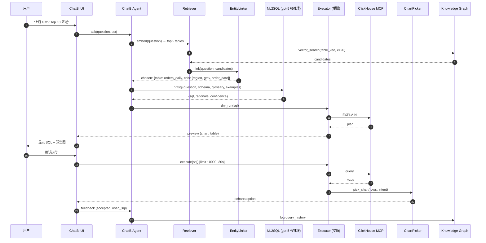
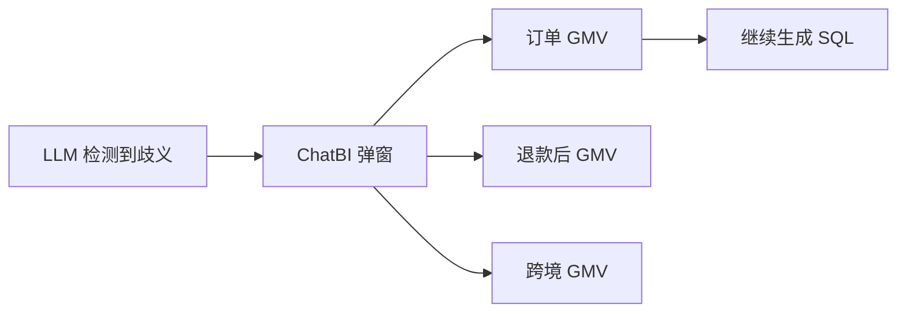
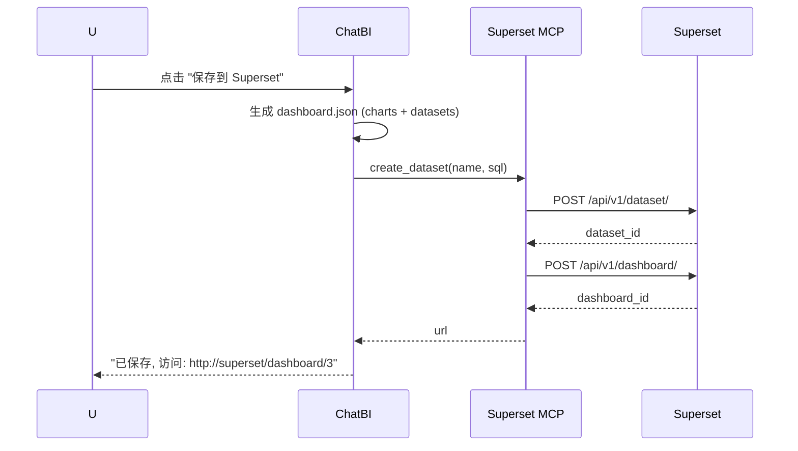

# IDM — ChatBI 设计 (NL2SQL + 智能问答)

> 让业务人员用自然语言查询, 但 SQL / 血缘 / 权限全在治理下
> 利用 IDM 知识图谱做表召回与列消歧
> 一次问 → 多轮 → 可执行 → 可保存为 Dashboard

---

## 目录

- [1. 目标与边界](#1-目标与边界)
- [2. 总体流程](#2-总体流程)
- [3. 阶段 1：表召回 (Retrieval)](#3-阶段-1表召回-retrieval)
- [4. 阶段 2：实体链接与消歧](#4-阶段-2实体链接与消歧)
- [5. 阶段 3：SQL 生成](#5-阶段-3sql-生成)
- [6. 阶段 4：执行 + 权限 + 安全](#6-阶段-4执行--权限--安全)
- [7. 阶段 5：可视化与洞察](#7-阶段-5可视化与洞察)
- [8. 阶段 6：多轮对话](#8-阶段-6多轮对话)
- [9. Skill：nl2sql](#9-skillnl2sql)
- [10. Skill：chart_picker](#10-skillchart_picker)
- [11. 前端 ChatBI 组件](#11-前端-chatbi-组件)
- [12. 评估与质量](#12-评估与质量)
- [13. 安全与 PII 防护](#13-安全与-pii-防护)
- [14. 保存为 Dashboard](#14-保存为-dashboard)
- [15. 与已有 BI 平台协同](#15-与已有-bi-平台协同)

---

## 1. 目标与边界

| 能做 | 不能做 |
| --- | --- |
| 自然语言问数 | DML / DDL |
| 自动选表 + 生成 SQL | 跨账号未授权访问 |
| 自动出图、保存到 BI | 写生产数据 |
| 给出业务解读 | 替代业务决策 |
| 多轮追问 | 100% 准确 (必须留确认) |

**核心原则**: **默认安全 + 默认解释 + 默认可改**。
任何生成的 SQL 都不直接执行, 先预览 + 解释; 任何结果都附"为什么"。

---

## 2. 总体流程



---

## 3. 阶段 1：表召回 (Retrieval)

### 3.1 多路召回

| 通道 | 方法 | 优势 |
| --- | --- | --- |
| **向量** | `pgvector.cosine(embedding(question), table.description_vec + table.fqn_vec)` | 模糊匹配 |
| **关键词 (BM25)** | 表名/列名全文索引 | 精确名称 |
| **图遍历** | 从业务域 (tag/glossary) → 关联表 | 业务上下文 |
| **历史** | 同用户/同部门历史问句 → 用过的表 | 偏好 |
| **权限** | 用户可见域 → 过滤 | 安全 |

### 3.2 召回代码

```python
async def retrieve(question: str, user: User, k: int = 20) -> list[dict]:
    qvec = await embed(question)

    # 向量
    vec_hits = await kg.query("""
      SELECT fqn, description,
             1 - (description_vec <=> $1) AS score_v
      FROM table_asset
      WHERE tier IN ('critical','important') OR owner_team = ANY($2)
      ORDER BY description_vec <=> $1
      LIMIT 50
    """, qvec, user.allowed_teams)

    # 关键词
    kw_hits = await kg.query("""
      SELECT fqn, ts_rank(description_tsv, plainto_tsquery($1)) AS score_k
      FROM table_asset
      WHERE description_tsv @@ plainto_tsquery($1)
      LIMIT 30
    """, question)

    # 图：glossary 命中
    graph_hits = await kg.query("""
      SELECT t.fqn
      FROM glossary_term g
      JOIN term_binding b ON b.term_id = g.id
      JOIN table_asset  t ON t.id = b.asset_id
      WHERE g.name ILIKE ANY($1)
    """, [f"%{kw}%" for kw in extract_terms(question)])

    # 合并 + RRF
    return rrf_merge([vec_hits, kw_hits, graph_hits], k=k)
```

### 3.3 RRF 合并

```python
def rrf_merge(lists, k=60, topn=20):
    scores = Counter()
    items  = {}
    for lst in lists:
        for rank, it in enumerate(lst, 1):
            scores[it["fqn"]] += 1 / (k + rank)
            items[it["fqn"]]   = it
    return [items[f] for f, _ in scores.most_common(topn)]
```

---

## 4. 阶段 2：实体链接与消歧

**问题**: 「GMV」到底指订单 GMV / 退款后 GMV / 跨境 GMV?

```python
async def link(question: str, candidates: list[dict], user: User) -> dict:
    prompt = f"""
    用户问题: {question}
    候选表:
    {render_candidates(candidates)}
    业务术语表:
    {render_glossary(user.tenant)}
    请选出最相关的一张表, 并指明使用的列.
    若有歧义, 列出歧义项并给出推荐.
    输出 JSON: {{
      "chosen_fqn": str,
      "columns": [str],
      "ambiguity": [{{"term":str, "options": [str], "recommend": str}}] | null
    }}
    """
    return await llm.complete(model="gpt-5", messages=[...], output_type="json", schema=...)
```

**歧义交互**:



---

## 5. 阶段 3：SQL 生成

### 5.1 Prompt 模板

```text
# System
你是 ClickHouse SQL 专家. 你的任务: 基于 Schema + 术语, 把自然语言问题转为可执行 SQL.

# Rules
1. 仅 SELECT / WITH / SHOW / DESCRIBE / EXPLAIN.
2. 必加 LIMIT, 默认 1000.
3. 列名 / 表名 / 数据库 用反引号.
4. 时间字段:
   - 若用户说 "今天/昨天/上月", 转 toDate / toStartOfMonth.
   - 若用户说 "近 7 天", 用 now() - INTERVAL 7 DAY.
5. 字符串字段比较忽略大小写: lower(col) = lower(val).
6. PII 字段禁止在 SELECT 出现 (系统已过滤).
7. 数字/金额聚合时考虑单位.

# 用户问题
{{ question }}

# 已选表 & 列
{{ chosen.fqn }} → {{ chosen.columns }}

# 完整 Schema (节选)
{{ schema_text }}

# 业务术语
{{ glossary }}

# 历史类似问题 (top 3, 仅供参考)
{{ similar_qa }}

# 输出
返回 JSON:
{ "sql": str, "rationale": str, "risk_notes": [str], "alternatives": [str] }
```

### 5.2 输出示例

```json
{
  "sql": "SELECT region, sum(gmv) AS gmv_total\nFROM `shop`.`orders_daily`\nWHERE order_date >= toStartOfMonth(now() - INTERVAL 1 MONTH)\n  AND order_date <  toStartOfMonth(now())\nGROUP BY region\nORDER BY gmv_total DESC\nLIMIT 1000",
  "rationale": "上月 = (月初, 上月初), 按 region 汇总 GMV, 倒序.",
  "risk_notes": [
    "region 字段在 ClickHouse 是 LowCardinality(String), 已加反引号.",
    "若用户无权访问 shop.orders_daily, 需降级到聚合视图."
  ],
  "alternatives": [
    "若想看份额: 加 total / sum(gmv) OVER ()"
  ]
}
```

### 5.3 SQL 校验

```python
import sqlglot

def lint_sql(sql: str, dialect: str = "clickhouse") -> list[str]:
    issues = []
    parsed = sqlglot.parse_one(sql, dialect=dialect)
    if any(k in parsed.sql(dialect=dialect).lower() for k in ["insert","update","delete","drop","alter","truncate","create"]):
        issues.append("FORBIDDEN_DML")
    if parsed.args.get("limit") is None:
        issues.append("MISSING_LIMIT")
    for t in parsed.find_all(sqlglot.exp.Column):
        if not t.table:
            issues.append(f"AMBIGUOUS_COLUMN: {t.name}")
    return issues
```

---

## 6. 阶段 4：执行 + 权限 + 安全

### 6.1 三层防护

| 层 | 检查 | 不通过处理 |
| --- | --- | --- |
| **L1 SQL 静态** | 禁 DML / 必 LIMIT / 禁函数黑名单 | 拒绝 + 建议 |
| **L2 权限** | 表 / 列 / 行级 | 过滤列 / 行 / 拒绝 |
| **L3 EXPLAIN** | ClickHouse `EXPLAIN AST` | 显示物理计划给用户 |
| **L4 PII** | 字段 `pii_class != none` | 自动 mask / 二次确认 |
| **L5 配额** | 用户/部门 token 预算 | 限速 / 告警 |

```python
async def safe_execute(sql, user):
    issues = lint_sql(sql)
    if "FORBIDDEN_DML" in issues: return Err("DML 禁止")
    if "MISSING_LIMIT" in issues: sql += " LIMIT 1000"

    plan = await ch_mcp.call("explain", {"sql": sql, "format": "AST"})
    if plan["estimated_rows"] > 1_000_000:
        return Warn("行数 > 1M, 建议加 WHERE")

    fqns = parse_tables(sql)
    if not all(await perm.check_table(u, f) for u, f in zip(...)):  return Err("权限不足")

    cols = parse_columns(sql)
    pii_cols = [c for c in cols if c["pii_class"] != "none"]
    if pii_cols: sql = mask_pii(sql, pii_cols)

    result = await ch_mcp.call("query", {"sql": sql, "timeout": 30})
    return Ok(result)
```

### 6.2 行级权限

```sql
-- 用户的 region 白名单
SELECT region FROM user_region_grant WHERE user = $1
```

```python
# 注入行过滤
if user.region_filter:
    sql = wrap_region_filter(sql, user.region_filter)
```

---

## 7. 阶段 5：可视化与洞察

```python
async def visualize(rows, intent, sql) -> dict:
    if not rows: return {"type":"empty", "text":"无数据"}

    # 让 LLM 选图
    option = await llm.complete(
        model="gpt-5",
        messages=[
            {"role":"system","content": CHART_SYS},
            {"role":"user",  "content": f"intent={intent}\nrows={rows[:5]}\nsql={sql}"}
        ],
        output_type="json",
        schema={"type": str, "option": dict, "title": str, "insight": str}
    )

    return {
        "type": option["type"],          # bar / line / pie / table / map
        "option": option["option"],      # echarts option
        "title":  option["title"],
        "insight": option["insight"]
    }
```

**图表选择规则**:

| 意图 | 图表 |
| --- | --- |
| compare | bar |
| trend | line |
| proportion | pie / treemap |
| ranking | bar (横) |
| distribution | histogram / box |
| geo | map |
| detail | table |
| 关系 | sankey / graph |

---

## 8. 阶段 6：多轮对话

**Memory 结构**:

```python
class ChatTurn:
    user:   str           # "上月 GMV Top 10 区域"
    agent:  str           # sql + chart + insight
    fqns:   list[str]     # 用到的表
    sql:    str
    chart:  dict
    feedback: bool

class ChatState(BaseModel):
    session_id: str
    user: str
    history: list[ChatTurn] = []
    last_fqns: list[str] = []     # 默认承接
    last_filters: dict = {}        # 过滤条件累加
```

**指代消解**:

```text
Q1: "上月 GMV Top 10 区域"  → SQL1: agg region by gmv
Q2: "改成同比"              → SQL2: 加 (gmv, gmv_yoy), WHERE same period last year
                            → 自动承接 last_fqns=orders_daily, filters=order_date range
```

**代码片段**:

```python
async def rewrite(question, state):
    return await llm.complete(model="gpt-5", messages=[
        {"role":"system","content": REWRITE_SYS},
        {"role":"user","content": json.dumps({
            "history": state.history[-3:],
            "question": question
        })}
    ], output_type="json", schema={
        "expanded_question": str,
        "inherited_filters": dict,
        "needs_new_table": bool
    })
```

---

## 9. Skill：nl2sql

```yaml
# skills/specs/nl2sql.yml
skill: nl2sql
version: 1
input_schema:
  type: object
  required: [question]
  properties:
    question:    { type: string }
    use_case:    { type: string }
    user:        { type: string }
    history:     { type: array,  items: { type: object } }
    glossary:    { type: array,  items: { type: object } }
mcp_calls:
  - name: retrieve
    tool: kg.vector_search
    args: { query: "{{ input.question }}", k: 20 }
  - name: schema_lookup
    tool: kg.query
    args: { sql: "SELECT * FROM table_asset WHERE fqn = ANY({{ steps.retrieve.result.fqns }})" }
  - name: perm_check
    tool: idm.perm.check
    args: { user: "{{ input.user }}", fqns: "{{ steps.retrieve.result.fqns }}" }
  - name: examples
    tool: kg.vector_search
    args: { query: "{{ input.question }}", collection: nl2sql_examples, k: 3 }
llm_calls:
  - name: rewrite
    model: gpt-5
    prompt: "Refine question with history:\n{{ input.history }}\nQ: {{ input.question }}"
  - name: link
    model: gpt-5
    prompt: "Choose table & columns from candidates:\n{{ steps.retrieve.result }}"
  - name: generate_sql
    model: gpt-5
    prompt: |
      Generate ClickHouse SQL.
      Question: {{ steps.rewrite.result }}
      Schema:   {{ steps.schema_lookup.result }}
      Glossary: {{ input.glossary }}
      Examples: {{ steps.examples.result }}
  - name: lint
    model: gpt-5
    prompt: "Check SQL: {{ steps.generate_sql.result.sql }}\nIssues: {{ lint_result }}"
post_validators:
  - id: sql_safe
    rule: "no_dml + has_limit + pii_safe"
  - id: confidence_ok
    rule: "confidence >= 0.6"
side_effects:
  write_to_kg: { entity: query_history, target: all }
```

---

## 10. Skill：chart_picker

```yaml
skill: chart_picker
input_schema:
  type: object
  required: [rows, intent]
  properties:
    rows:   { type: array }
    intent: { type: string }
    sql:    { type: string }
llm_calls:
  - name: pick
    model: gpt-5
    prompt: |
      数据 (前 5 行): {{ input.rows | tojson }}
      用户意图: {{ input.intent }}
      选最合适的图表类型, 输出 echarts option (JSON).
      同时给 1~2 句业务解读.
    output_schema:
      type: object
      properties:
        type:    { type: string }      # bar / line / pie / ...
        title:   { type: string }
        option:  { type: object }      # echarts option
        insight: { type: string }
```

---

## 11. 前端 ChatBI 组件

```tsx
// pages/ChatBI/ChatPanel.tsx
import { useState } from "react";
import { ChatBubble, CodeBlock, ChartView, SqlPreview, FeedbackBar } from "./components";

export const ChatPanel = () => {
  const [messages, setMessages] = useState<Message[]>([]);
  const [input, setInput] = useState("");

  const ask = async () => {
    const userMsg = { role: "user", text: input };
    setMessages(m => [...m, userMsg]);
    setInput("");

    const res = await api.chatbi(input);   // 流式
    setMessages(m => [...m, { role: "agent", ...res }]);
  };

  return (
    <div className={styles.chat}>
      <div className={styles.stream}>
        {messages.map((m, i) => <Bubble key={i} m={m} />)}
      </div>
      <Composer value={input} onChange={setInput} onSend={ask} />
    </div>
  );
};
```

**Bubble 组件**:

```tsx
const Bubble = ({ m }) => {
  if (m.role === "user") return <UserBubble text={m.text} />;
  return (
    <AgentBubble>
      <Markdown text={m.summary} />
      {m.sql   && <SqlPreview sql={m.sql} rationale={m.rationale} />}
      {m.chart && <ChartView option={m.chart} />}
      {m.data  && <DataTable rows={m.data} />}
      {m.ambiguity && <AmbiguityPicker items={m.ambiguity} />}
      <FeedbackBar msgId={m.id} />
    </AgentBubble>
  );
};
```

**流式返回 (SSE)**:

```python
# backend/api/chatbi.py
from fastapi import FastAPI
from fastapi.responses import StreamingResponse

@app.post("/chatbi/stream")
async def stream(q: str):
    async def gen():
        async for chunk in chatbi_agent.stream(q):
            yield f"data: {json.dumps(chunk)}\n\n"
    return StreamingResponse(gen(), media_type="text/event-stream")
```

---

## 12. 评估与质量

### 12.1 Eval Set

```jsonl
# eval/chatbi/queries.jsonl
{"q": "上月 GMV Top 10 区域", "expected_fqn": "shop.orders_daily", "expected_sql_contains": ["region", "sum(gmv)"]}
{"q": "近 7 天 DAU",          "expected_fqn": "shop.user_event",   "expected_sql_contains": ["uniq(user_id)", "toDate"]}
...
```

### 12.2 指标

| 指标 | 描述 | 目标 |
| --- | --- | --- |
| **Table Recall@5** | 正确表进 top5 | ≥ 0.92 |
| **Table Recall@1** | 正确表排第一 | ≥ 0.80 |
| **SQL Exec** | 生成的 SQL 可执行 | ≥ 0.95 |
| **Result Match** | 行集合等于 gold | ≥ 0.75 |
| **User Accept** | 用户不修改直接采纳 | ≥ 0.65 |
| **Latency P95** | 端到端 | ≤ 5s |

### 12.3 LLM-as-judge

```python
JUDGE = """
你是评审员. 对比模型 SQL 与 Gold SQL, 给出 0~1 分.
- 0: 完全不同 / 错表
- 0.5: 同表但有条件错
- 0.8: 同表条件同, 仅 LIMIT 等细节差
- 1.0: 等价

模型 SQL: {pred}
Gold SQL:  {gold}
用户问题: {q}
"""
```

### 12.4 回归测试

```bash
python -m idm.eval.chatbi --queries eval/chatbi/queries.jsonl --model gpt-5 --report
```

---

## 13. 安全与 PII 防护

| 风险 | 防护 |
| --- | --- |
| 用户问出 PII | 自动 mask 字段 (`email` → `***@***`) |
| 用户问出别人数据 | 行级权限 (region / dept) |
| 慢查询拖垮生产 | EXPLAIN + 拒绝 > 1M 行 |
| 注入 | 静态 lint + LLM re-check |
| Token 滥用 | 配额 |
| 错误知识 | NL2SQL 必须基于 schema, 不允许"猜" |

**PII 渲染**:

```tsx
{m.data?.map(row => (
  <tr>{columns.map(c =>
    c.pii_class !== "none"
      ? <td><MaskTag>{row[c.name]}</MaskTag></td>
      : <td>{row[c.name]}</td>
  )}</tr>
))}
```

---

## 14. 保存为 Dashboard



**Generated JSON 模板**:

```json
{
  "title": "上月 GMV Top 10 区域",
  "datasets": [{
    "table_name": "chatbi_gmv_top10_region",
    "sql": "SELECT region, sum(gmv) AS gmv_total FROM `shop`.`orders_daily` WHERE ..."
  }],
  "charts": [{
    "viz_type": "bar",
    "slice_name": "GMV Top 10 区域",
    "metrics":  ["gmv_total"],
    "groupby":  ["region"],
    "order_desc": true
  }]
}
```

---

## 15. 与已有 BI 平台协同

| 流程 | 说明 |
| --- | --- |
| **ChatBI → Superset** | 一键保存为 dashboard (用 superset_export MCP 路径反推回 API) |
| **Superset → ChatBI** | 已存在 dashboard 反向问数 (解析 export → 还原查询意图) |
| **双向** | 用户在 Superset 看到图表, "我想改 SQL", 跳 ChatBI 修改 |

> **零侵入**: 不修改 Superset 任何代码, 用 API + export 文件即可双向。

---

## 附录 A. 一次完整 Ask 的 Trace (Langfuse)

```
chatbi.ask
├─ retrieve              0.18s   (pgvector)  0 LLM
├─ schema_lookup         0.05s   (pg)
├─ perm_check            0.01s   (policy)
├─ examples_retrieve     0.12s   (pgvector)
├─ rewrite               0.40s   (gpt-5)    300 tok
├─ link                  0.60s   (gpt-5)    450 tok
├─ generate_sql          1.20s   (gpt-5)    900 tok
├─ lint                  0.05s   (sqlglot)
├─ explain               0.30s   (CH)
├─ execute               0.85s   (CH)
├─ pick_chart            0.55s   (gpt-5)    600 tok
└─ persist               0.05s   (pg)
                        ─────
                        total 4.36s  $0.013
```

## 附录 B. ChatBI 反对话清单 (Do & Don't)

✅ **Do**:
- "上月 GMV Top 10 区域"
- "北京 + 上海 上月的用户留存"
- "和上月相比, 哪些区域下滑 > 20%"

❌ **Don't (自动转交工单)**:
- "把用户表所有数据给我"
- "删除 orders_daily"
- "把 region 字段类型改成 String"  (DDL)

---

> 📌 **配套阅读**：[agent-orchestration.md](./agent-orchestration.md) · [skills-design.md](./skills-design.md) · [mcp-first-architecture.md](./mcp-first-architecture.md) · [insight-alerting.md](./insight-alerting.md) · [frontend-design.md](./frontend-design.md) · [eval-harness.md](./eval-harness.md)
