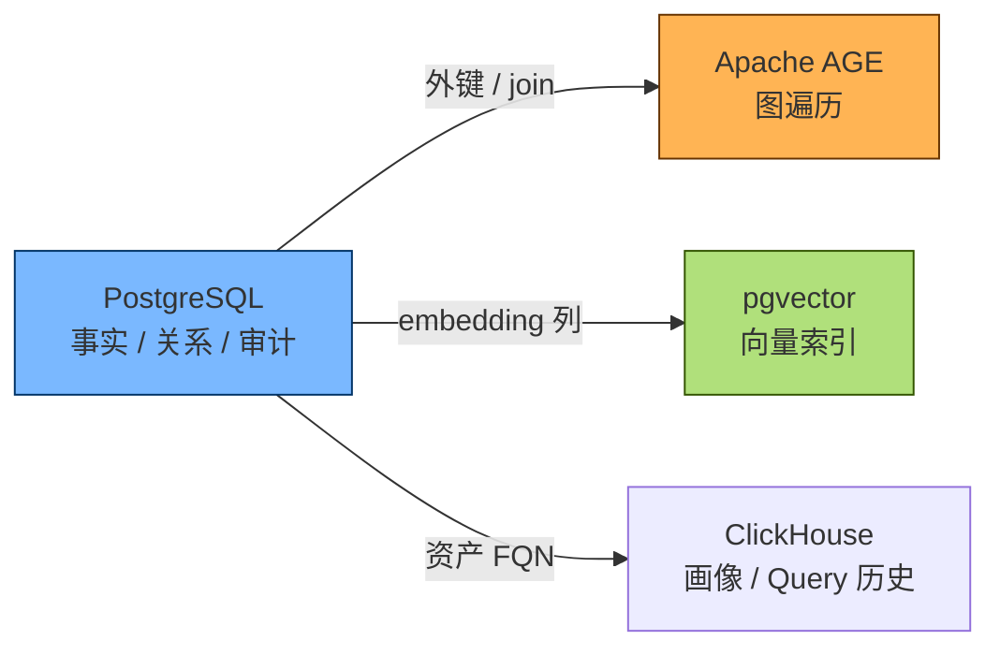
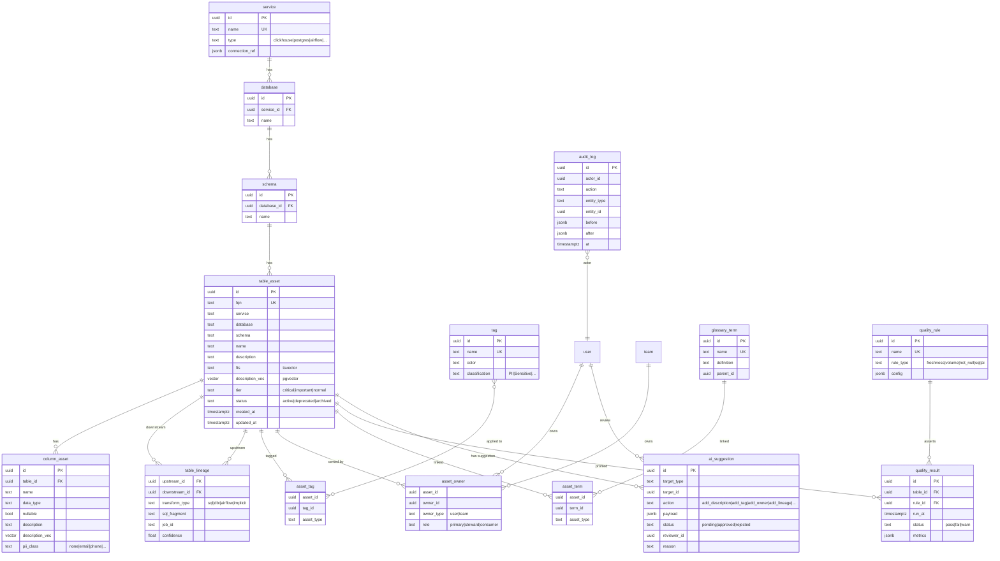
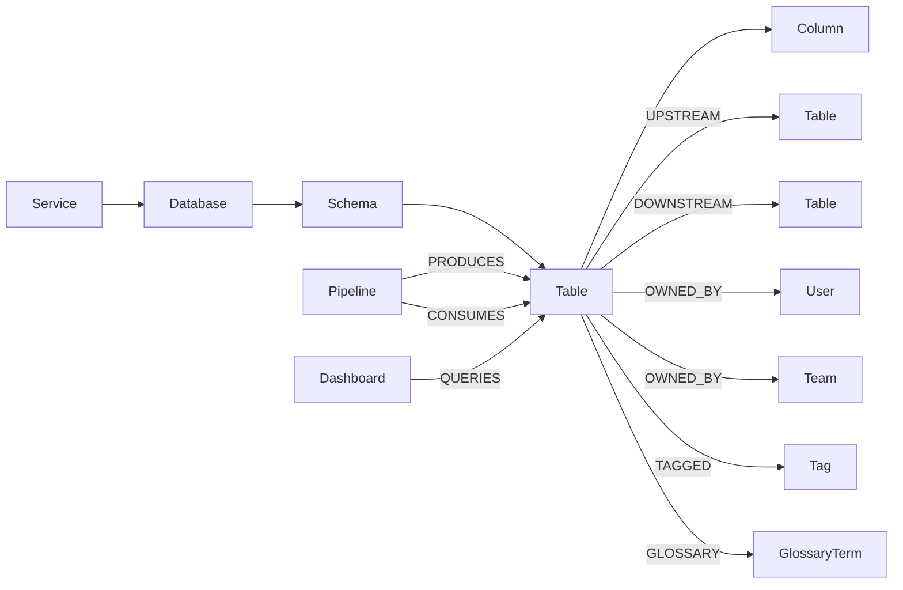

# IDM — 数据模型与知识图谱设计

> IDM 的「数据大脑」由三层组成：
> **1) 关系型事实层 (PostgreSQL)** — 资产 / 标签 / 血缘 / 审计
> **2) 图查询层 (PostgreSQL + Apache AGE)** — 关系遍历 / 影响分析
> **3) 向量层 (pgvector)** — 语义检索 / RAG
> 本文给出 ER、Graph Schema、向量索引设计与查询样例。

---

## 目录

- [1. 总体设计思路](#1-总体设计思路)
- [2. 关系型 ER 模型 (PostgreSQL)](#2-关系型-er-模型-postgresql)
- [3. 图模型 (Apache AGE)](#3-图模型-apache-age)
- [4. 向量索引 (pgvector)](#4-向量索引-pgvector)
- [5. ClickHouse 镜像表（数据画像 / Query 样本）](#5-clickhouse-镜像表数据画像--query-样本)
- [6. 关键 SQL 与 Cypher 样例](#6-关键-sql-与-cypher-样例)
- [7. 演进路线](#7-演进路线)

---

## 1. 总体设计思路

### 1.1 三层一体的知识图谱



| 层 | 存什么 | 怎么查 |
| --- | --- | --- |
| **PG 关系层** | 资产 / 标签 / Owner / Policy / 审计 | SQL (强类型) |
| **AGE 图层** | 资产 ↔ 资产 / 资产 ↔ 业务术语 / 资产 ↔ Pipeline | Cypher (遍历) |
| **pgvector** | Description / Sample 行的 Embedding | ANN (语义) |
| **ClickHouse** | 大表 Profiler / Query 历史 / 异常指标 | 高吞吐分析 |

### 1.2 命名约定

- **资产 FQN**: `<service>.<database>.<schema>.<table>` 全小写
- **URN**: `urn:idm:<entity>:<service>:<fqn>#<version>`
- **ID**: 全表 `id UUID DEFAULT gen_random_uuid()`
- **时间**: 全表 `created_at / updated_at` 强制带

---

## 2. 关系型 ER 模型 (PostgreSQL)

### 2.1 全景 ER 图



### 2.2 关键 DDL (节选)

```sql
CREATE EXTENSION IF NOT EXISTS pgcrypto;
CREATE EXTENSION IF NOT EXISTS age;
CREATE EXTENSION IF NOT EXISTS vector;
CREATE EXTENSION IF NOT EXISTS pg_trgm;

CREATE TABLE service (
  id            UUID PRIMARY KEY DEFAULT gen_random_uuid(),
  name          TEXT UNIQUE NOT NULL,
  type          TEXT NOT NULL,
  connection    JSONB NOT NULL,
  created_at    TIMESTAMPTZ NOT NULL DEFAULT now()
);

CREATE TABLE table_asset (
  id            UUID PRIMARY KEY DEFAULT gen_random_uuid(),
  fqn           TEXT UNIQUE NOT NULL,
  service       TEXT NOT NULL,
  database      TEXT NOT NULL,
  schema        TEXT NOT NULL,
  name          TEXT NOT NULL,
  description   TEXT,
  tier          TEXT NOT NULL DEFAULT 'normal',
  status        TEXT NOT NULL DEFAULT 'active',
  description_vec vector(1024),         -- text-embedding-3 / bge-large
  fts           tsvector GENERATED ALWAYS AS (
                  setweight(to_tsvector('simple', coalesce(name,'')), 'A') ||
                  setweight(to_tsvector('simple', coalesce(description,'')), 'B')
               ) STORED,
  created_at    TIMESTAMPTZ NOT NULL DEFAULT now(),
  updated_at    TIMESTAMPTZ NOT NULL DEFAULT now()
);
CREATE INDEX idx_table_asset_fts ON table_asset USING GIN(fts);
CREATE INDEX idx_table_asset_vec ON table_asset USING hnsw (description_vec vector_cosine_ops);

CREATE TABLE column_asset (
  id            UUID PRIMARY KEY DEFAULT gen_random_uuid(),
  table_id      UUID NOT NULL REFERENCES table_asset(id) ON DELETE CASCADE,
  name          TEXT NOT NULL,
  data_type     TEXT NOT NULL,
  nullable      BOOLEAN NOT NULL DEFAULT true,
  description   TEXT,
  pii_class     TEXT NOT NULL DEFAULT 'none',
  description_vec vector(1024),
  ordinal       INT NOT NULL,
  UNIQUE(table_id, name)
);

CREATE TABLE table_lineage (
  upstream_id     UUID NOT NULL REFERENCES table_asset(id) ON DELETE CASCADE,
  downstream_id   UUID NOT NULL REFERENCES table_asset(id) ON DELETE CASCADE,
  transform_type  TEXT NOT NULL,
  sql_fragment    TEXT,
  job_id          TEXT,
  confidence      REAL NOT NULL DEFAULT 1.0,
  created_at      TIMESTAMPTZ NOT NULL DEFAULT now(),
  PRIMARY KEY (upstream_id, downstream_id, transform_type, job_id)
);
CREATE INDEX idx_lineage_down ON table_lineage(downstream_id);
CREATE INDEX idx_lineage_up   ON table_lineage(upstream_id);

CREATE TABLE ai_suggestion (
  id           UUID PRIMARY KEY DEFAULT gen_random_uuid(),
  target_type  TEXT NOT NULL,
  target_id    UUID NOT NULL,
  action       TEXT NOT NULL,
  payload      JSONB NOT NULL,
  rationale    TEXT,
  status       TEXT NOT NULL DEFAULT 'pending',
  reviewer_id  UUID,
  reason       TEXT,
  created_at   TIMESTAMPTZ NOT NULL DEFAULT now(),
  decided_at   TIMESTAMPTZ
);
CREATE INDEX idx_ai_sug_pending ON ai_suggestion(status) WHERE status = 'pending';
```

---

## 3. 图模型 (Apache AGE)

### 3.1 图 Schema



### 3.2 AGE 节点 / 边创建

```sql
-- 初始化图
SELECT create_graph('idm');

-- 节点
SELECT * FROM cypher('idm', $$
  CREATE (t:Table {
    id: '8e0a...', fqn: 'shop.orders_daily',
    service: 'clickhouse', tier: 'critical'
  })
  RETURN t
$$) AS (t agtype);

-- 血缘边
SELECT * FROM cypher('idm', $$
  MATCH (a:Table {fqn:'shop.orders_raw'}),
        (b:Table {fqn:'shop.orders_daily'})
  CREATE (a)-[:UPSTREAM {transform:'dbt', job:'daily_etl', conf:0.98}]->(b)
  RETURN a,b
$$) AS (a agtype, b agtype);
```

### 3.3 影响分析查询 (Cypher)

```cypher
-- 找某张表的所有下游 (3 层)
MATCH (a:Table {fqn:'shop.orders_raw'})-[:UPSTREAM*1..3]->(b:Table)
RETURN DISTINCT b.fqn AS downstream
LIMIT 100;

-- 找敏感数据 (PII) 的所有下游
MATCH (a:Table)-[:UPSTREAM*1..5]->(b:Table)
WHERE EXISTS {
  MATCH (a)-[:HAS_COLUMN]->(c:Column)
  WHERE c.pii_class <> 'none'
}
RETURN a.fqn AS source, b.fqn AS downstream
```

### 3.4 PG ↔ AGE 一致性

- 关系表 (PG) 是 **真源** (system of record)
- AGE 是 **派生视图** (materialized by 触发器 / 异步 ETL)
- 写 PG → 触发器同步到 AGE
- 读 AGE → 提供遍历能力
- 避免双向写

---

## 4. 向量索引 (pgvector)

### 4.1 Embedding 维度

| 用途 | 模型 | 维度 |
| --- | --- | --- |
| 资产 / 列 / 文档 | `text-embedding-3-large` 或 `bge-large-zh` | 1024 |
| 代码 (dbt / SQL) | `text-embedding-3-large` | 1024 |
| 历史 Query | `bge-large-zh` | 1024 |

### 4.2 索引策略

```sql
-- 资产描述向量
CREATE INDEX idx_table_vec ON table_asset
  USING hnsw (description_vec vector_cosine_ops)
  WITH (m = 16, ef_construction = 64);

-- 列描述向量
CREATE INDEX idx_column_vec ON column_asset
  USING hnsw (description_vec vector_cosine_ops);
```

### 4.3 混合检索

```sql
-- 关键词 + 向量 (RRF)
WITH q AS (
  SELECT $1::vector AS v
),
kw AS (
  SELECT id, ts_rank(fts, plainto_tsquery($2)) AS s
  FROM table_asset
  WHERE fts @@ plainto_tsquery($2)
  ORDER BY s DESC LIMIT 50
),
sem AS (
  SELECT id, 1 - (description_vec <=> q.v) AS s
  FROM table_asset, q
  ORDER BY description_vec <=> q.v
  LIMIT 50
),
rrf AS (
  SELECT id, SUM(1.0 / (60 + rnk)) AS score
  FROM (
    SELECT id, ROW_NUMBER() OVER (ORDER BY s DESC) AS rnk FROM kw
    UNION ALL
    SELECT id, ROW_NUMBER() OVER (ORDER BY s DESC) AS rnk FROM sem
  ) t
  GROUP BY id
)
SELECT ta.*, rrf.score
FROM rrf JOIN table_asset ta USING (id)
ORDER BY rrf.score DESC
LIMIT 20;
```

---

## 5. ClickHouse 镜像表（数据画像 / Query 样本）

IDM 在 ClickHouse 上**只存自己关心的画像数据**，不与业务混库：

```sql
-- 数据库
CREATE DATABASE idm_internal;

-- 资产画像
CREATE TABLE idm_internal.asset_profile (
  asset_fqn      String,
  profiled_at    DateTime,
  row_count      UInt64,
  byte_size      UInt64,
  distinct_count Map(String, UInt64),
  null_count     Map(String, UInt64),
  min_max        Map(String, String),
  sample_values  Map(String, String)
) ENGINE = MergeTree
  PARTITION BY toYYYYMM(profiled_at)
  ORDER BY (asset_fqn, profiled_at);

-- Query 历史
CREATE TABLE idm_internal.query_history (
  event_time  DateTime,
  user        String,
  query       String,
  tables      Array(String),
  columns     Array(String),
  duration_ms UInt32,
  rows        UInt64,
  source      LowCardinality(String)  -- 'airflow' | 'superset' | 'app'
) ENGINE = MergeTree
  PARTITION BY toYYYYMM(event_time)
  ORDER BY (event_time, user)
  TTL event_time + INTERVAL 180 DAY;

-- 质量指标
CREATE TABLE idm_internal.quality_metrics (
  asset_fqn    String,
  metric_name  LowCardinality(String),
  ts           DateTime,
  value        Float64
) ENGINE = MergeTree
  ORDER BY (asset_fqn, metric_name, ts);
```

---

## 6. 关键 SQL 与 Cypher 样例

### 6.1 资产全景 (PG)

```sql
-- 某域下所有 critical 表
SELECT t.fqn, t.tier, t.description, u.email AS owner
FROM table_asset t
LEFT JOIN asset_owner ao ON ao.asset_id = t.id AND ao.role = 'primary'
LEFT JOIN "user" u ON u.id = ao.owner_id
WHERE t.tier = 'critical' AND t.status = 'active';
```

### 6.2 血缘影响 (AGE)

```sql
SELECT * FROM cypher('idm', $$
  MATCH p = (a:Table {fqn:'shop.orders_raw'})-[:UPSTREAM*1..3]->(b:Table)
  RETURN b.fqn, length(p) AS depth
$$) AS (fqn agtype, depth agtype);
```

### 6.3 混合检索 (PG + pgvector)

见 [§4.3](#43-混合检索)

### 6.4 待审 AI 建议

```sql
SELECT *
FROM ai_suggestion
WHERE status = 'pending'
ORDER BY created_at DESC
LIMIT 50;
```

---

## 7. 演进路线

| 阶段 | 模型 | 存储 |
| --- | --- | --- |
| **M1 (Q1)** | 资产 / 列 / 标签 / Owner | PG 单实例 |
| **M2 (Q2)** | + 知识图谱 (AGE) | PG + AGE |
| **M3 (Q3)** | + 向量检索 (pgvector) | PG + pgvector |
| **M4 (Q4)** | + 多租户分库 | CloudSQL Sharding |
| **M5 (Q5+)** | 冷数据归档 (Iceberg on GCS) | Iceberg + BigQuery external |

---

## 附录 A. 命名 & 字段规范

| 字段 | 类型 | 说明 |
| --- | --- | --- |
| `id` | UUID | 主键，统一 `gen_random_uuid()` |
| `fqn` | TEXT | 资产 FQN，全小写、点分 |
| `*_vec` | vector(N) | Embedding |
| `status` | TEXT | 枚举字符串 (强校验由应用层) |
| `created_at / updated_at` | TIMESTAMPTZ | 强制 |

## 附录 B. 重要不变量

- **资产 FQN 全局唯一**
- **列 ordinal 唯一**
- **Owner 至少有 1 个 (或显式 `unowned`)**
- **Tag 应用前必须存在 (FK)**
- **AuditLog 不可删改** (使用 `pg_temporal` 或 append-only)

---

> 📌 **配套阅读**：[architecture.md](./architecture.md) · [ai-driven-design.md](./ai-driven-design.md) · [deployment.md](./deployment.md)
