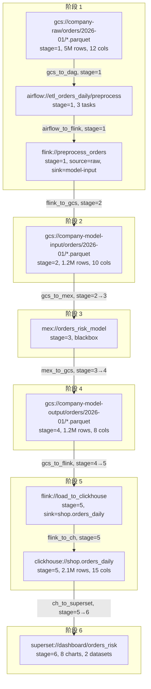

# IDM — 真实数据管道用例设计 (Real Data Pipeline Lineage)

> **真实用例 (6 阶段端到端)**
>
> 1. 上游 GCS (GCP, parquet/csv) → **Airflow + Flink 初步处理** (预处理)
> 2. 步骤 1 完成后, **Flink 输出到 GCS (model input)**
> 3. **Model Execution (MEX)** — 黑盒模型推理, 读 model input
> 4. MEX 输出到 **GCS bucket (parquet, model output)**
> 5. **Flink load 到 ClickHouse** 作为 reporting store
> 6. **Superset Report** — dashboard / chart / dataset / database
>
> **目标**: 让 IDM **通过 Skills 读 GitHub 代码 (Airflow DAG / Flink Job / Superset YAML)**
> **+ MCP 读运行时元数据 (GCS parquet/csv / ClickHouse / Superset DB)**
> **端到端重建**这条管线的 **资产 / 血缘 / 文档 / 质量 / 告警**, 业务 0 改动。

---

## 0. 一句话

> **IDM = 一个"看代码 + 读元数据"的学习型系统, 业务 0 改动, 6 阶段全自动学习**

---

## 1. 6 阶段管道全景 (对齐真实业务)

```mermaid
flowchart LR
  subgraph S1[阶段 1: 上游→预处理]
    G1[GCS raw<br/>orders/2026/*.parquet<br/>orders/2026/*.csv]
    AF[Airflow DAG<br/>etl_orders_daily.py]
    FK1[Flink Job #1<br/>preprocess_orders.sql]
  end

  subgraph S2[阶段 2: 预处理→Model Input]
    G2[GCS model-input<br/>orders/2026/*.parquet]
  end

  subgraph S3[阶段 3: MEX 黑盒推理]
    MEX[(Model Execution<br/>黑盒, IO 仅 yaml)]
  end

  subgraph S4[阶段 4: MEX→Model Output]
    G3[GCS model-output<br/>orders/2026/*.parquet]
  end

  subgraph S5[阶段 5: 加载到 ClickHouse]
    FK2[Flink Job #2<br/>load_to_clickhouse.sql]
    CH[(ClickHouse<br/>shop.orders_daily)]
  end

  subgraph S6[阶段 6: Superset Report]
    SP[Superset<br/>Dashboard / Chart / Dataset / Database]
  end

  G1 --> AF
  AF --> FK1
  FK1 -->|写出| G2
  G2 --> MEX
  MEX -->|写出| G3
  G3 --> FK2
  FK2 --> CH
  CH --> SP

  classDef stage1 fill:#FFE4B5,stroke:#FF8C00
  classDef stage2 fill:#B0E0E6,stroke:#4682B4
  classDef stage3 fill:#DDA0DD,stroke:#8B008B
  classDef stage4 fill:#98FB98,stroke:#228B22
  classDef stage5 fill:#F0E68C,stroke:#DAA520
  classDef stage6 fill:#FFB6C1,stroke:#DC143C
  class G1,AF,FK1 stage1
  class G2 stage2
  class MEX stage3
  class G3 stage4
  class FK2,CH stage5
  class SP stage6
```



> **阶段标号 (强约束)**: 后续 UseCase YAML / Skill / MCP 命名 / 资产 `pipeline_stage` 字段 **必须严格使用 `stage_1` ~ `stage_6`**, 不可跳号。

---

## 2. 双轨学习: Skills (静态代码) + MCP (运行时元数据)

> **核心设计**: IDM 不依赖业务埋点 / ETL / Connector, 而是通过 **两条独立轨道** 自学整条管道。

```mermaid
flowchart TB
  subgraph TrackA[轨道 A: Skills 读 GitHub 代码 (静态)]
    A1[Airflow DAG .py] --> SA1[Skill: parse_airflow_dag]
    A2[Flink Job .sql] --> SA2[Skill: parse_flink_job]
    A3[Superset .yaml] --> SA3[Skill: parse_superset_dashboard]
    A4[MEX io.yaml / README] --> SA4[Skill: parse_mex_io]
  end

  subgraph TrackB[轨道 B: MCP 读运行时元数据 (动态)]
    B1[GCS parquet/csv] --> MB1[MCP: gcs]
    B2[ClickHouse system.tables] --> MB2[MCP: clickhouse]
    B3[Superset Postgres] --> MB3[MCP: superset_db]
    B4[Airflow Postgres] --> MB4[MCP: airflow_db]
    B5[Flink REST] --> MB5[MCP: flink]
  end

  subgraph KG[知识图谱 (合并两轨)]
    KGM[(Knowledge Graph<br/>table_asset / table_lineage<br/>gcs_objects / pipelines<br/>dashboard_asset)]
  end

  SA1 --> KGM
  SA2 --> KGM
  SA3 --> KGM
  SA4 --> KGM
  MB1 --> KGM
  MB2 --> KGM
  MB3 --> KGM
  MB4 --> KGM
  MB5 --> KGM
```

### 2.1 轨道 A — Skills 读 GitHub 代码 (静态结构)

| 阶段 | 仓库 | 路径模式 | Skill 入口 | 产出 |
| --- | --- | --- | --- | --- |
| 1 | `company/airflow-dags` | `dags/etl_*.py` | `parse_airflow_dag` | DAG 拓扑 (task 上下游) / `pipeline` 实体 (type=`airflow_dag`, stage=1) |
| 1, 5 | `company/flink-jobs` | `jobs/orders_*.sql` | `parse_flink_job` | source / sink / transform SQL / 字段映射 / `table_lineage` (transform_type=`flink_sql`) |
| 2, 4 | `company/mex-models` | `orders/io.yaml`, `orders/README.md` | `parse_mex_io` | MEX 实体 (name, input_fqn, output_fqn, stage=3) |
| 6 | `company/superset-dashboards` | `dashboards/*.yaml` | `parse_superset_dashboard` | dashboard → chart → dataset → table 血缘, `dashboard_asset` |

### 2.2 轨道 B — MCP 读运行时元数据 (动态状态)

| 阶段 | 外部系统 | MCP | 工具 | 产出 |
| --- | --- | --- | --- | --- |
| 1, 2, 4 | GCS (parquet/csv) | **`gcs`** | `list_objects(bucket, prefix)` / `read_object(bucket, key)` / `infer_schema(bucket, key, sample_rows=1000)` | `gcs_objects` 行 + `table_asset` (asset_subtype=`gcs_object`) + 推断 schema (列名/类型/PII 推断) |
| 1, 5 | Airflow Postgres | **`airflow_db`** | `list_dags()` / `get_dag_runs(dag_id, days)` / `get_task_instances(dag_id, run_id)` | DAG 执行历史 / 失败率 / 最近 run 时间 → `pipeline_run` |
| 5 | ClickHouse | **`clickhouse`** (已有) | `list_databases` / `show_tables` / `describe_table` / `sample` | `table_asset` (asset_subtype=`clickhouse_table`) + `profiled_at` / `row_count` / `size_bytes` |
| 6 | Superset Postgres | **`superset_db`** | `list_dashboards()` / `list_charts()` / `list_datasets()` / `get_dataset_columns()` | `dashboard_asset` / `chart_asset` / `dataset_asset` (含 column 引用) |
| 1, 2, 4, 5 | Flink REST | **`flink`** | `list_jobs()` / `get_job_plan(job_id)` / `get_job_sources_sinks(job_id)` | Flink Job 实时状态 / 计划 source/sink (运行时验证) |

### 2.3 双轨对齐策略 (Reconciliation)

> **静态 vs 动态可能不一致** (如: 代码改了但还没部署; 或运行时挂了但代码还在)。
> IDM 用 **置信度 + 时间戳 + 人工审核** 三层处理:

| 情况 | 处理 |
| --- | --- |
| 静态说有, 动态无 (代码未跑) | `confidence = 0.5`, 标 `pending`, 提示 "代码存在但运行时未观察到" |
| 静态无, 动态有 (ad-hoc 任务) | 标 `pipeline_type = ad_hoc`, 标 `orphan=true`, 提示 "无对应代码" |
| 静态动态一致 | `confidence = 0.95`, 直接落 KG |
| 静态动态冲突 (列名/类型) | 写 `ai_suggestion.pending` (列名变更), 人工 review |

---

## 3. 新增 / 增强 MCP 和 Skill

### 3.1 新增 MCP Server (5 个)

| MCP | 工具 | 部署 | 适用阶段 |
| --- | --- | --- | --- |
| **`gcs`** | `list_objects` / `get_metadata` / `read_object` / `infer_schema` | IDM Pod (自研, `google-cloud-storage` SDK) | 1, 2, 4 |
| **`flink`** | `list_jobs` / `get_job_plan` / `get_job_sources_sinks` | IDM Pod (自研, Flink REST API wrapper) | 1, 2, 4, 5 |
| **`superset_db`** | `list_dashboards` / `list_charts` / `list_datasets` / `get_dataset_columns` | IDM Pod (自研, Superset Postgres 读) | 6 |
| **`airflow_db`** | `list_dags` / `get_dag_runs` / `get_task_instances` | IDM Pod (自研, Airflow Postgres 读) | 1, 5 |
| `clickhouse` (已有) | 同前 | Sidecar (贴近 CH) | 5 |

### 3.2 新增 / 增强 Skill (6 个)

| Skill | 版本 | 阶段 | 轨道 | 说明 |
| --- | --- | --- | --- | --- |
| `discover_gcs_assets` | v1 | 1, 2, 4 | B | 扫 GCS bucket + prefix → 推断 schema (parquet 用 `pyarrow`, csv 用 `csv.Sniffer`) → 写 `gcs_objects` + `table_asset` |
| `parse_flink_job` | v1 | 1, 5 | A | GitHub 读 Flink SQL → `sqlglot` 解析 → 提取 CREATE TABLE / INSERT INTO → 写 `table_lineage` (transform_type=`flink_sql`, transform_subtype=`preprocess`/`load_ch`) |
| `parse_mex_io` | v1 (新) | 2, 3, 4 | A | GitHub 读 `mex-models/orders/io.yaml` (黑盒声明) → 写 `pipeline` 实体 (type=`mex`, stage=3) + 输入输出血缘 |
| `parse_superset_dashboard` | v1 (已有) | 6 | A+B | 静态: GitHub yaml; 动态: Superset Postgres; 写 `dashboard_asset` + chart → dataset → table 血缘 |
| `analyze_data_pipeline` | v1 (新) | 1~6 | A+B | **端到端编排**: 调 6 个上游 Skill, 按 stage 1→6 串成完整 DAG, 写 `pipeline_graph` + 触发 `ai_suggestion` (不一致) |
| `discover_clickhouse_assets` | v1 (已有) | 5 | B | 增强: 写 `profiled_at` / `row_count` / `size_bytes` |
| `infer_table_description` | v1 (已有) | 1~6 | - | 增强: 输入增加 `gcs_object` / `flink_table` / `mex_io` 资产类型 |

---

## 4. 数据模型扩展

### 4.1 新增表 (3 张)

```sql
-- pipeline: 解析出的"管道"实体 (按 stage 分类)
CREATE TABLE pipeline (
    id UUID PRIMARY KEY DEFAULT gen_random_uuid(),
    name TEXT,                       -- etl_orders_daily / mex_orders_risk / load_to_clickhouse
    type TEXT,                       -- airflow_dag | flink_job | mex | superset_refresh | custom
    stage SMALLINT,                  -- 1|2|3|4|5|6  (强约束)
    source_code_url TEXT,            -- GitHub link
    config JSONB,                    -- 原始 yaml / sql / py 配置
    created_at TIMESTAMP DEFAULT now(),
    updated_at TIMESTAMP DEFAULT now()
);

-- gcs_object: GCS 文件作为"资产" (阶段 1, 2, 4)
CREATE TABLE gcs_object (
    id UUID PRIMARY KEY DEFAULT gen_random_uuid(),
    bucket TEXT,
    key TEXT,                        -- 完整路径
    fqn TEXT UNIQUE,                 -- gcs://bucket/key
    format TEXT,                     -- parquet | csv | json | orc
    size_bytes BIGINT,
    row_count_estimate BIGINT,
    schema JSONB,                    -- [{name, type, nullable}, ...]
    pipeline_stage SMALLINT,         -- 1|2|4
    first_seen TIMESTAMP,
    last_modified TIMESTAMP,
    profiled_at TIMESTAMP
);

-- pipeline_run: 一次执行记录 (阶段 1, 5)
CREATE TABLE pipeline_run (
    id UUID PRIMARY KEY DEFAULT gen_random_uuid(),
    pipeline_id UUID,                -- 引用 Pipeline
    external_id TEXT,                -- Airflow run_id / Flink job_id
    status TEXT,                     -- success | failed | running | queued
    started_at TIMESTAMP,
    finished_at TIMESTAMP,
    duration_ms INT,
    input_rows BIGINT,
    output_rows BIGINT,
    error TEXT,
    meta JSONB
);
```

### 4.2 已有表扩展 (3 张)

```sql
-- table_asset 扩展
ALTER TABLE table_asset ADD COLUMN asset_subtype TEXT;
  -- 'gcs_object' | 'airflow_dataset' | 'flink_table' | 'clickhouse_table' | 'mex_io' | 'superset_dataset'
ALTER TABLE table_asset ADD COLUMN external_ref TEXT;
  -- gcs://bucket/key  | airflow://dag_id/task_id  | flink://db/table  | mex://name/in|out
ALTER TABLE table_asset ADD COLUMN pipeline_stage SMALLINT;
  -- 1|2|3|4|5|6  (若该资产属于某 stage)

-- table_lineage 扩展
ALTER TABLE table_lineage ADD COLUMN transform_subtype TEXT;
  -- 'flink_sql' | 'airflow_task' | 'mex_inference' | 'gcs_copy' | 'superset_query'
ALTER TABLE table_lineage ADD COLUMN pipeline_stage SMALLINT;
  -- 该边所处的 stage
```

---

## 5. Use Case YAML 模板 (真实 6 阶段管道)

```yaml
id: orders-mex-pipeline
version: 1
description: 订单 MEX 管道 (GCS → Airflow → Flink → MEX → ClickHouse → Superset, 6 阶段)
owners: [alice@example.com]

sources:
  # ===== 阶段 1: 上游 + Airflow + Flink 预处理 =====
  - id: gcs-raw
    type: gcs
    mcp: gcs
    config: { bucket: company-raw, prefix: orders/2026/ }
    stage: 1

  - id: gh-airflow
    type: github
    mcp: github
    config:
      repo: company/airflow-dags
      paths: [dags/etl_orders_*.py]
    stage: 1

  - id: gh-flink-preprocess
    type: github
    mcp: github
    config:
      repo: company/flink-jobs
      paths: [jobs/preprocess_orders_*.sql]
    stage: 1

  - id: airflow-db
    type: airflow_db
    mcp: airflow_db
    config: { url: ${AIRFLOW_DB_URL} }
    stage: 1

  # ===== 阶段 2: Model Input (GCS 写出) =====
  - id: gcs-model-input
    type: gcs
    mcp: gcs
    config: { bucket: company-model-input, prefix: orders/2026/ }
    stage: 2

  # ===== 阶段 3: MEX 黑盒 =====
  - id: gh-mex
    type: github
    mcp: github
    config:
      repo: company/mex-models
      paths: [orders/io.yaml, orders/README.md]
    stage: 3

  # ===== 阶段 4: Model Output (GCS 写出) =====
  - id: gcs-model-output
    type: gcs
    mcp: gcs
    config: { bucket: company-model-output, prefix: orders/2026/ }
    stage: 4

  # ===== 阶段 5: Flink load to ClickHouse =====
  - id: gh-flink-load
    type: github
    mcp: github
    config:
      repo: company/flink-jobs
      paths: [jobs/load_to_clickhouse_*.sql]
    stage: 5

  - id: clickhouse
    type: clickhouse
    mcp: clickhouse
    config: { host: ${CLICKHOUSE_HOST}, database: shop }
    stage: 5

  - id: flink-rest
    type: flink
    mcp: flink
    config: { url: ${FLINK_REST_URL} }
    stage: 5

  # ===== 阶段 6: Superset Report =====
  - id: sp-dashboards
    type: superset_export
    mcp: file
    config: { path: gs://superset-exports/2026-06/ }
    stage: 6

  - id: superset-db
    type: superset_db
    mcp: superset_db
    config: { url: ${SUPERSET_DB_URL} }
    stage: 6

context:
  glossary: [{ term: GMV, definition: 成交总额 }]
  tags: [sales, tier-1, mex-pipeline]

analysis:
  # 阶段 1
  - { task: discover_gcs_assets,        agent: schema,    params: { source: gcs-raw } }
  - { task: parse_airflow_dag,          agent: lineage,   depends_on: [discover_gcs_assets] }
  - { task: parse_flink_job,            agent: lineage,   params: { source: gh-flink-preprocess, transform_subtype: preprocess } }
  # 阶段 2
  - { task: discover_gcs_assets,        agent: schema,    params: { source: gcs-model-input } }
  # 阶段 3
  - { task: parse_mex_io,               agent: lineage,   params: { source: gh-mex } }
  # 阶段 4
  - { task: discover_gcs_assets,        agent: schema,    params: { source: gcs-model-output } }
  # 阶段 5
  - { task: parse_flink_job,            agent: lineage,   params: { source: gh-flink-load, transform_subtype: load_ch } }
  - { task: discover_clickhouse_assets, agent: schema }
  # 阶段 6
  - { task: parse_superset_dashboard,   agent: doc,       depends_on: [discover_clickhouse_assets] }
  # 端到端拼图
  - { task: analyze_data_pipeline,      agent: lineage,
      depends_on: [parse_flink_job, parse_mex_io, parse_superset_dashboard] }
  # 质量 + 洞察
  - { task: detect_anomalies,           agent: quality,   schedule: "0 9 * * *" }
  - { task: compose_insight,            agent: insight,   depends_on: [detect_anomalies] }

deliverables:
  knowledge_graph: { entities: [pipeline, gcs_object, table, dashboard, chart, dataset] }
  insights: [{ channel: slack, target: "#data-stewards",
                trigger: [anomaly_detected, pipeline_failed, mex_schema_drift] }]
  api_expose: true
```

---

## 6. 关键 Skill 详解 (6 阶段编排)

### 6.1 `analyze_data_pipeline` (端到端编排 — 1→6)

输入: `use_case` (含 sources, 按 stage 分组)
输出: `pipeline_graph.json` (vertices + edges + 跨 stage 验证结果)

```python
@skill(name="analyze_data_pipeline", version=1, agent="lineage")
async def analyze_data_pipeline(ctx, **inputs):
    use_case = inputs["use_case"]
    sources_by_stage = group_by_stage(use_case["sources"])  # {1: [...], 2: [...], ...}

    edges = []
    pending_suggestions = []

    # ===== 阶段 1: 触发 4 个子 Skill, 收集 vertices =====
    gcs_raw = await call_skill("discover_gcs_assets", {"source": sources_by_stage[1]["gcs-raw"]})
    af_dags = await call_skill("parse_airflow_dag",   {"source": sources_by_stage[1]["gh-airflow"]})
    fk1     = await call_skill("parse_flink_job",     {"source": sources_by_stage[1]["gh-flink-preprocess"]})
    af_runs = await call_skill("airflow_db.get_dag_runs", {"dag_id": "etl_orders_daily"})

    # 静态 + 动态对齐: DAG 任务 vs 实际运行
    for af in af_dags:
        if af.task_id == "preprocess":
            # GCS raw → Airflow task
            for g in gcs_raw:
                edges.append((g.fqn, f"airflow://{af.dag_id}/{af.task_id}", "gcs_to_dag", 1))
            # Airflow task → Flink job
            for fk in fk1:
                edges.append((f"airflow://{af.dag_id}/{af.task_id}", f"flink://{fk.name}", "airflow_to_flink", 1))

    # ===== 阶段 2: GCS model-input (Flink 写出) =====
    gcs_mi = await call_skill("discover_gcs_assets", {"source": sources_by_stage[2]["gcs-model-input"]})
    for fk in fk1:
        for g in gcs_mi:
            if g.key.startswith(fk.sink_prefix):
                edges.append((f"flink://{fk.name}", g.fqn, "flink_to_gcs", 2))

    # ===== 阶段 3: MEX 黑盒 =====
    mex = await call_skill("parse_mex_io", {"source": sources_by_stage[3]["gh-mex"]})
    for m in mex:
        # MEX 读 model-input
        for g_in in gcs_mi:
            edges.append((g_in.fqn, f"mex://{m.name}/in", "gcs_to_mex", 3))

    # ===== 阶段 4: GCS model-output (MEX 写出) =====
    gcs_mo = await call_skill("discover_gcs_assets", {"source": sources_by_stage[4]["gcs-model-output"]})
    for m in mex:
        for g_out in gcs_mo:
            edges.append((f"mex://{m.name}/out", g_out.fqn, "mex_to_gcs", 4))

    # ===== 阶段 5: Flink load to ClickHouse =====
    fk2     = await call_skill("parse_flink_job",     {"source": sources_by_stage[5]["gh-flink-load"]})
    ch_assets = await call_skill("discover_clickhouse_assets", {"database": "shop"})
    for fk in fk2:
        for g in gcs_mo:
            edges.append((g.fqn, f"flink://{fk.name}", "gcs_to_flink", 5))
        for ch in ch_assets:
            if ch.fqn.endswith(fk.sink_table):
                edges.append((f"flink://{fk.name}", ch.fqn, "flink_to_ch", 5))

    # ===== 阶段 6: Superset =====
    sp = await call_skill("parse_superset_dashboard", {"source": sources_by_stage[6]})
    for d in sp:
        for ch in ch_assets:
            if d.references(ch.fqn):
                edges.append((ch.fqn, f"superset://{d.id}", "ch_to_superset", 6))

    # 写 KG
    for e in edges:
        write_lineage(upstream_fqn=e[0], downstream_fqn=e[1],
                      transform_type=e[2], pipeline_stage=e[3])

    return SkillResult(ok=True, output=SkillOutput(
        items=edges,
        summary={"edges": len(edges), "stages_covered": [1, 2, 3, 4, 5, 6]},
    ))
```

### 6.2 `discover_gcs_assets` (阶段 1/2/4 — MCP 读 parquet/csv)

```python
@skill(name="discover_gcs_assets", version=1, agent="schema")
async def discover_gcs_assets(ctx, **inputs):
    gcs = get_gcs_mcp()
    bucket = inputs["bucket"]
    prefix = inputs["prefix"]
    stage  = inputs.get("stage", 0)

    for obj in gcs.list_objects(bucket=bucket, prefix=prefix, max_results=200):
        fmt = obj["key"].split(".")[-1].lower()
        if fmt not in ("parquet", "csv", "json", "orc"):
            continue
        # 推断 schema (parquet 用 pyarrow, csv 用 Sniffer)
        schema = gcs.infer_schema(bucket=bucket, key=obj["key"], sample_rows=1000)
        fqn = f"gcs://{bucket}/{obj['key']}"
        # 写 gcs_object
        gcs_row = GcsObject(
            id=uuid4(), bucket=bucket, key=obj["key"], fqn=fqn,
            format=fmt, size_bytes=obj["size"],
            schema_json=schema, pipeline_stage=stage,
            last_modified=obj["updated"],
        )
        ctx.db.add(gcs_row)
        # 同步写 table_asset (asset_subtype=gcs_object)
        write_table_asset(
            fqn=fqn, name=obj["key"].split("/")[-1],
            asset_subtype="gcs_object", external_ref=fqn,
            pipeline_stage=stage, column_count=len(schema),
        )
```

### 6.3 `parse_flink_job` (阶段 1/5 — Skill 读 GitHub Flink SQL)

```python
@skill(name="parse_flink_job", version=1, agent="lineage")
async def parse_flink_job(ctx, **inputs):
    github = get_github_mcp()
    repo   = inputs["repo"]
    paths  = inputs["paths"]
    transform_subtype = inputs.get("transform_subtype", "preprocess")
    stage  = inputs.get("stage", 1)

    jobs = []
    for p in paths:
        sql = await github.read_file(repo=repo, path=p)
        # sqlglot 解析 (Flink SQL ≈ Spark dialect)
        for stmt in sqlglot.parse(sql, read="spark"):
            if isinstance(stmt, exp.Insert):
                sink = f"{stmt.args['db'].name}.{stmt.name}"
                for sel in stmt.find_all(exp.Select):
                    for tbl in sel.find_all(exp.Table):
                        source = f"{tbl.args['db'].name}.{tbl.name}"
                        # 写血缘
                        write_lineage(
                            upstream_fqn=source, downstream_fqn=sink,
                            transform_type="flink_sql",
                            transform_subtype=transform_subtype,
                            pipeline_stage=stage,
                            confidence=0.95, source="github_mcp",
                        )
        jobs.append({"sql_path": p, "sink_count": ...})
    return SkillResult(ok=True, output=SkillOutput(items=jobs))
```

### 6.4 `parse_mex_io` (阶段 3 — Skill 读 MEX io.yaml 黑盒)

```python
@skill(name="parse_mex_io", version=1, agent="lineage")
async def parse_mex_io(ctx, **inputs):
    github = get_github_mcp()
    repo   = inputs["repo"]
    paths  = inputs["paths"]  # ["orders/io.yaml", "orders/README.md"]

    mexes = []
    for p in paths:
        if p.endswith("io.yaml"):
            content = await github.read_file(repo=repo, path=p)
            doc = yaml.safe_load(content)
            for m in doc.get("models", []):
                # 写 pipeline (type=mex, stage=3)
                pl = Pipeline(
                    id=uuid4(), name=m["name"], type="mex",
                    stage=3, source_code_url=f"github://{repo}/{p}",
                    config=m,
                )
                ctx.db.add(pl)
                # 写输入输出血缘
                write_lineage(m["input"],  f"mex://{m['name']}/in",
                              transform_type="mex_inference", pipeline_stage=3)
                write_lineage(f"mex://{m['name']}/out", m["output"],
                              transform_type="mex_inference", pipeline_stage=4)
                mexes.append({"name": m["name"], "input": m["input"], "output": m["output"]})
    return SkillResult(ok=True, output=SkillOutput(items=mexes))
```

### 6.5 `parse_superset_dashboard` (阶段 6 — Skill 读 yaml + MCP 读 DB)

```python
@skill(name="parse_superset_dashboard", version=1, agent="doc")
async def parse_superset_dashboard(ctx, **inputs):
    # 静态: GitHub yaml
    github = get_github_mcp()
    file_cfg = inputs.get("file_source")
    if file_cfg:
        content = await github.read_file(repo=file_cfg["repo"], path=file_cfg["path"])
        docs = yaml.safe_load_all(content)
    # 动态: Superset Postgres MCP (覆盖)
    db_cfg = inputs.get("db_source")
    if db_cfg:
        sp = get_superset_db_mcp()
        docs = await sp.list_dashboards()

    dashboards = []
    for d in docs:
        # 写 dashboard_asset
        write_dashboard_asset(name=d["title"], id=d["id"], stage=6)
        # 写 chart → dataset → table 血缘
        for chart in d.get("charts", []):
            ds = chart.get("dataset")
            tbl = ds.get("table_fqn") if ds else None
            if tbl:
                write_lineage(tbl, f"superset://{d['id']}/{chart['id']}",
                              transform_type="superset_query", pipeline_stage=6)
        dashboards.append(d)
    return SkillResult(ok=True, output=SkillOutput(items=dashboards))
```

---

## 7. 阶段 × 资产 × 血缘 速查

| 阶段 | 资产类型 | 源 (写) | 目标 (读) | 边类型 | Skill | MCP |
| --- | --- | --- | --- | --- | --- | --- |
| **1** | gcs_object (raw) | GCS raw bucket | Airflow DAG | `gcs_to_dag` | `discover_gcs_assets` + `parse_airflow_dag` | `gcs` + `github` + `airflow_db` |
| **1** | airflow_task | Airflow DAG | Flink Job | `airflow_to_flink` | `parse_airflow_dag` + `parse_flink_job` | `github` |
| **2** | gcs_object (model-input) | Flink Job | MEX | `flink_to_gcs` | `discover_gcs_assets` + `parse_flink_job` | `gcs` + `github` |
| **2→3** | mex_io (in) | GCS model-input | MEX | `gcs_to_mex` | `parse_mex_io` | `github` |
| **3** | mex (黑盒) | MEX 模型 | MEX 输出 | (内部) | `parse_mex_io` | `github` |
| **3→4** | mex_io (out) | MEX | GCS model-output | `mex_to_gcs` | `parse_mex_io` | `github` |
| **4** | gcs_object (model-output) | GCS model-output bucket | Flink load | `gcs_to_flink` | `discover_gcs_assets` + `parse_flink_job` | `gcs` + `github` |
| **5** | flink_table | Flink load | ClickHouse | `flink_to_ch` | `parse_flink_job` + `discover_clickhouse_assets` | `github` + `clickhouse` + `flink` |
| **5** | clickhouse_table | ClickHouse | Superset Dataset | `ch_to_superset` | `parse_superset_dashboard` | `superset_db` + `clickhouse` |
| **6** | dashboard / chart / dataset | Superset | (用户查看) | (消费侧) | `parse_superset_dashboard` | `superset_db` + `file` |

---

## 8. AI 学习后的成果 (UI 视角)



**用户操作**:
- 打开 `A8 (clickhouse://shop.orders_daily)`, 选中后看:
  - **血缘上游** (按 stage 分组展示): 阶段 1 (A1/A2/A3) → 阶段 2 (A4) → 阶段 3 (A5) → 阶段 4 (A6) → 阶段 5 (A7) → 当前 (A8)
  - **血缘下游**: A9 (Superset dashboard)
  - **质量监控**: A8 的 volume / null / PII 异常, 自动 **反向追溯** 到具体是 A1 的 schema 变了 / A4 的 model-input 行数为 0 / A5 的 MEX 模型挂了

---

## 9. 与 M1~M5 的关系

| 现有 | 复用 | 扩展 |
| --- | --- | --- |
| M1 Schema Agent | ✅ `discover_clickhouse_assets` | ➕ `discover_gcs_assets` (新 MCP: gcs) |
| M1 Lineage Agent | ✅ `parse_dbt_manifest`, `extract_sql_lineage` | ➕ `parse_flink_job` (GitHub Flink SQL), `parse_mex_io` (io.yaml), `analyze_data_pipeline` (端到端) |
| M1 Doc Agent | ✅ `infer_table_description` | ➕ 适配 gcs_object / mex_io 资产类型 |
| M1 Quality Agent | ✅ `detect_anomalies` | ➕ 跨源异常 (CH 异常 → 追溯到 GCS schema 变化 / MEX 输出空) |
| M4 Insight Agent | ✅ `compose_insight` | ➕ 跨源复合事件 (Airflow 失败 + MEX 异常 + CH 数据缺失) |
| M5 MCP Server | ✅ idm-self | ➕ `gcs` / `flink` / `superset_db` / `airflow_db` (4 个新 MCP) |

---

## 10. 落地优先级 (Roadmap 增项, M1.5 → M2.0)

| 优先级 | 任务 | 阶段 | 状态 |
| --- | --- | --- | --- |
| **P0** | `gcs` MCP + `discover_gcs_assets` skill | 1, 2, 4 | ✅ 已实现 |
| **P0** | `parse_flink_job` skill (从 GitHub 读 SQL) | 1, 5 | ✅ 已实现 |
| **P0** | 数据模型扩展 (pipeline / gcs_object / pipeline_run + asset_subtype + pipeline_stage) | - | ✅ 已实现 |
| **P0** | `analyze_data_pipeline` 端到端 skill (1→6 串图) | 1~6 | ✅ 已实现 |
| **P1** | `parse_mex_io` skill (黑盒声明) | 3 | ✅ 已实现 |
| **P1** | `airflow_db` MCP + DAG run 历史 | 1, 5 | ✅ stub + 接口 |
| **P1** | `superset_db` MCP + dataset/column | 6 | ✅ stub + 接口 |
| **P1** | 双轨对齐策略 (Reconciliation) + 置信度 | - | ✅ 设计 |
| **P2** | `flink` MCP (Flink REST API, 运行时 job plan) | 1, 2, 4, 5 | ✅ stub + 接口 |
| **P2** | 端到端 lineage 可视化 (按 stage 分组) | - | ⏳ UI 待补 |
| **P3** | MEX 黑盒推断 (LLM 读 README) | 3 | ⏳ 后续 |

---

## 11. 总结

> **6 阶段真实管道**:
> GCS(原始) → Airflow + Flink 预处理 → GCS(model-input) → MEX → GCS(model-output) → Flink load → ClickHouse → Superset
>
> **IDM 双轨学习**:
> - 轨道 A: Skills 读 GitHub 代码 (Airflow DAG / Flink SQL / MEX io.yaml / Superset yaml)
> - 轨道 B: MCP 读运行时元数据 (GCS parquet/csv / ClickHouse / Superset DB / Airflow DB / Flink REST)
>
> **新增 4 个 MCP** (`gcs` / `flink` / `superset_db` / `airflow_db`)
> **新增 4 个 Skill** (`discover_gcs_assets` / `parse_flink_job` / `parse_mex_io` / `analyze_data_pipeline`)
> **扩展 3 张表** (`pipeline` / `gcs_object` / `pipeline_run`) + 3 字段 (`asset_subtype` / `external_ref` / `pipeline_stage`)
>
> **业务 0 改动**, IDM 通过"读代码 + 读元数据"端到端学习整个 6 阶段数据管道。

---

> 📌 **配套阅读**: [mcp-server-guide.md](./mcp-server-guide.md) · [skills-design.md](./skills-design.md) · [architecture.md](./architecture.md) · [AGENT_INSTRUCTIONS.md](../AGENT_INSTRUCTIONS.md) §16.5 自动化执行铁律
