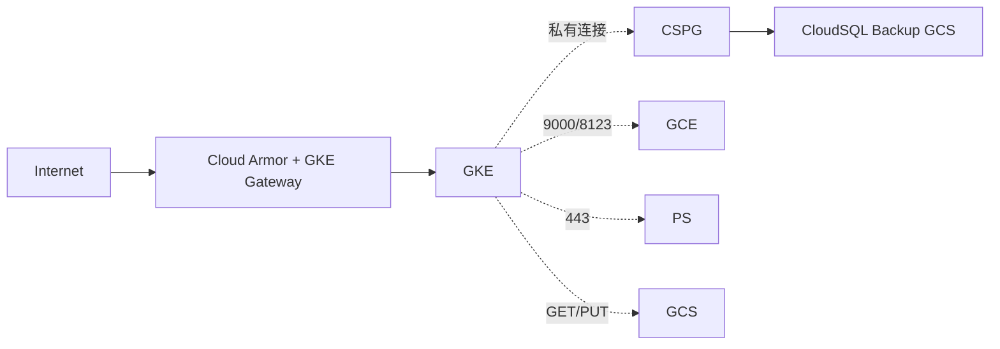
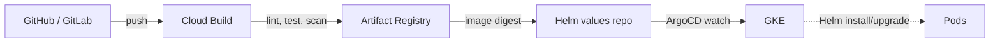

# IDM — 部署架构 (GKE + GCE ClickHouse)

> 📌 **实现前先读**: [AGENT_INSTRUCTIONS.md](../AGENT_INSTRUCTIONS.md) §10 (部署) — GKE 命名空间 / ClickHouse GCE / Secret / GitOps。

> IDM 全部服务跑在 **GKE**，**ClickHouse** 保留在 **GCE**（性能/磁盘选择更灵活）
> CI/CD 走 **Cloud Build → Artifact Registry → ArgoCD (GitOps)**
> 监控 **Cloud Monitoring + Cloud Logging + OpenTelemetry**

---

## 目录

- [1. 总体部署视图](#1-总体部署视图)
- [2. GKE 集群设计](#2-gke-集群设计)
- [3. 命名空间与服务拆分](#3-命名空间与服务拆分)
- [4. ClickHouse (GCE) 部署](#4-clickhouse-gce-部署)
- [5. 存储与依赖](#5-存储与依赖)
- [6. 网络与安全](#6-网络与安全)
- [7. CI/CD](#7-cicd)
- [8. 监控 / 日志 / 追踪](#8-监控--日志--追踪)
- [9. 资源清单与成本估算](#9-资源清单与成本估算)
- [10. DR / 备份 / 升级](#10-dr--备份--升级)

---

## 1. 总体部署视图

```mermaid
flowchart TB
    subgraph GCP[GCP Project: idm-prod]
        subgraph GKE[GKE Cluster: idm-prod]
            NS1[ns: idm-core<br/>API, GraphQL, Agent]
            NS2[ns: idm-ai<br/>LangGraph, LLM Workers]
            NS3[ns: idm-web<br/>React Console]
            NS4[ns: idm-obs<br/>Observe Gateway]
            NS5[ns: idm-jobs<br/>Airflow, CronJob]
            NS6[ns: idm-mcp<br/>MCP Server]
        end
        GCE1[GCE: idm-clickhouse<br/>3 节点 Replication]
        CSPG[(CloudSQL PG<br/>+ AGE + pgvector)]
        GCS[(GCS<br/>idm-artifacts / idm-samples)]
        PS[Pub/Sub<br/>idm-events]
        SE[Secret Manager]
        CM[Cloud Monitoring]
        CL[Cloud Logging]
    end
    subgraph External
        U[User / Browser]
        LK[Slack / Lark / Teams]
        AR[Airflow (已有)]
        FL[Flink (已有)]
        SP[Superset (已有)]
    end

    U -->|HTTPS| GKE
    GKE --> CSPG
    GKE --> GCS
    GKE --> PS
    GKE --> GCE1
    GCE1 --> CSPG
    GKE --> AR
    GKE --> FL
    GKE --> SP
    GKE --> SE
    GKE --> CM
    GKE --> CL
    GKE --> LK
```

---

## 2. GKE 集群设计

### 2.1 集群规格

| 项 | 选型 |
| --- | --- |
| 模式 | **GKE Autopilot** (推荐) 或 Standard |
| 节点池 | `e2-standard-4` (默认) / `n2-standard-8` (LLM) |
| 版本 | GKE 最新稳定版 (1.30+) |
| 区域 | `asia-east1` / `asia-northeast1` (多区域备灾) |
| 网络 | VPC Native, Private Cluster, Cloud NAT |
| 工作负载身份 | **Workload Identity** 绑定 GCP SA |

### 2.2 推荐 Autopilot 起步

```bash
gcloud container clusters create-auto idm-prod \
  --region=asia-east1 \
  --network=idm-vpc \
  --subnetwork=idm-subnet \
  --enable-private-nodes \
  --enable-master-authorized-networks \
  --release-channel=regular \
  --workload-pool=idm-prod.svc.id.goog
```

### 2.3 入口

- **GKE Gateway** (推荐) / **Ingress NGINX** (简单)
- 全站 HTTPS，证书由 **Google-managed SSL**
- 域名：`idm.example.com` `api.idm.example.com` `chat.idm.example.com`

---

## 3. 命名空间与服务拆分

| Namespace | 部署 | 副本 | 资源 (request) |
| --- | --- | --- | --- |
| `idm-core` | `idm-api` (FastAPI, GraphQL) | 2~6 HPA | 500m / 1Gi |
| `idm-core` | `idm-graphql` (federation) | 2~4 HPA | 500m / 1Gi |
| `idm-ai` | `idm-agent-orchestrator` (LangGraph) | 2~4 | 1000m / 2Gi |
| `idm-ai` | `idm-llm-worker` (批量推断) | 2~10 | 1000m / 2Gi |
| `idm-web` | `idm-console` (React static + nginx) | 2~4 | 100m / 128Mi |
| `idm-obs` | `idm-observe-gateway` (CH/PG/AF hook) | 1~2 | 500m / 1Gi |
| `idm-jobs` | Airflow (`airflow-webserver`, `scheduler`, `worker`) | 各 1~2 | 500m / 1Gi |
| `idm-jobs` | IDM CronJob (Quality / Profiler / Insight) | 0/1 | 200m / 512Mi |
| `idm-mcp` | `idm-mcp-server` | 1~2 | 500m / 1Gi |

### 3.1 Helm Chart 结构 (示例)

```text
charts/
├── idm-api/
├── idm-console/
├── idm-agent/
├── idm-observe/
├── idm-mcp/
├── idm-cron/
└── umbrella/        # 顶层依赖管理
```

### 3.2 HPA 关键指标

```yaml
metrics:
  - type: Resource
    resource:
      name: cpu
      target:
        type: Utilization
        averageUtilization: 70
  - type: Pods
    pods:
      metric:
        name: idm_queue_depth   # 自定义 metric
      target:
        type: AverageValue
        averageValue: "30"
```

---

## 4. ClickHouse (GCE) 部署

### 4.1 实例规格 (3 节点 Replication)

| 节点 | 规格 | 磁盘 |
| --- | --- | --- |
| ch-1 | `n2-standard-8` (8 vCPU, 32 GB) | `pd-ssd` 1TB x 2 (RAID) |
| ch-2 | 同上 | 同上 |
| ch-3 | 同上 | 同上 |

- OS: **Ubuntu 22.04 LTS**
- ClickHouse: `23.x` LTS
- 复制: **ReplicatedMergeTree** + **ZooKeeper (3 节点小 VM)** 或 **ClickHouse Keeper**
- 监听: 内部 IP:9000 / 9004 / 8123

### 4.2 网络

- 节点在 **同一内部子网**
- 防火墙: 仅 GKE 节点 CIDR 可访问 9000/8123
- 关闭公网访问

### 4.3 安装脚本 (节选)

```bash
# 安装 ClickHouse
sudo apt-get install -y apt-transport-https ca-certificates curl gnupg
curl -fsSL 'https://packages.clickhouse.com/rpm/lts/repodata/repomd.xml.key' | sudo gpg --dearmor -o /usr/share/keyrings/clickhouse-keyring.gpg
echo "deb [signed-by=/usr/share/keyrings/clickhouse-keyring.gpg] https://packages.clickhouse.com/deb stable main" | sudo tee /etc/apt/sources.list.d/clickhouse.list
sudo apt-get update
sudo DEBIAN_FRONTEND=noninteractive apt-get install -y clickhouse-server clickhouse-client

# 启用 Keeper
sudo apt-get install -y clickhouse-keeper
```

### 4.4 IDM 观察接入

```sql
-- 启用 query_log
<query_log>
  <database>system</database>
  <table>query_log</table>
  <flush_interval_milliseconds>7500</flush_interval_milliseconds>
</query_log>

-- 为 IDM 创建只读账号
CREATE USER idm_observer IDENTIFIED BY '...';
GRANT SELECT ON system.* TO idm_observer;
GRANT SELECT ON idm_internal.* TO idm_observer;
```

---

## 5. 存储与依赖

| 类型 | 选型 | 用途 |
| --- | --- | --- |
| 关系 | **CloudSQL PG 14** HA (1 主 1 读 + 自动 failover) | 元数据 / AGE / pgvector |
| 对象 | **GCS** bucket `idm-artifacts` | dbt manifest / 样本 / 文档 |
| 列存 | **ClickHouse (GCE)** | 画像 / Query 历史 / 质量指标 |
| 消息 | **Pub/Sub** topic `idm-events` | 观察事件流 |
| 缓存 | **Memorystore for Redis** (HA) | Agent 短期 memory / 去重 |
| 密钥 | **Secret Manager** | LLM API Key / DB Pass |
| 配置 | **ConfigMap + ArgoCD** | Helm values |

### 5.1 CloudSQL PG 关键参数

```ini
shared_buffers = 8GB
work_mem = 64MB
maintenance_work_mem = 2GB
effective_cache_size = 24GB
max_parallel_workers = 8
# 启用扩展
shared_preload_libraries = 'age,vector'
```

---

## 6. 网络与安全



| 措施 | 实施 |
| --- | --- |
| **公网入口** | Cloud Armor WAF + 速率限制 |
| **mTLS** | 内部服务间 Istio Sidecar (可选) |
| **Workload Identity** | K8s SA → GCP SA 映射 |
| **VPC-SC** | 防数据外泄 (敏感项目) |
| **CMEK** | CloudSQL / GCS 用 CMEK 加密 |
| **审计** | Cloud Audit Logs → 归档到 GCS |

### 6.1 Service Account 矩阵

| K8s SA | GCP SA | 权限 |
| --- | --- | --- |
| `idm-api` | `idm-api@project.iam` | cloudsql.client, secretmanager.secretAccessor, pubsub.publisher |
| `idm-obs` | `idm-obs@project.iam` | pubsub.publisher, storage.objectCreator |
| `idm-ai` | `idm-ai@project.iam` | secretmanager.secretAccessor (LLM API Key 由 Secret Manager 统一托管, LiteLLM 经内部 Service 调用) |
| `idm-cron` | `idm-cron@project.iam` | cloudsql.client, pubsub.subscriber |

---

## 7. CI/CD

### 7.1 流水线



### 7.2 Cloud Build 步骤

```yaml
# cloudbuild.yaml (节选)
steps:
  - name: gcr.io/cloud-builders/docker
    args: [build, -t $REGION-docker.pkg.dev/$PROJECT/idm/idm-api:$SHORT_SHA, ./backend]
  - name: gcr.io/cloud-builders/docker
    args: [push, $REGION-docker.pkg.dev/$PROJECT/idm/idm-api:$SHORT_SHA]
  - name: gcr.io/cloud-builders/gcloud
    args: [artifacts, versions, update, --package=idm-api, --version=$SHORT_SHA]
```

### 7.3 ArgoCD App (示例)

```yaml
apiVersion: argoproj.io/v1alpha1
kind: Application
metadata:
  name: idm-api
  namespace: argocd
spec:
  project: idm
  source:
    repoURL: https://github.com/yourorg/idm-helm
    path: charts/idm-api
    targetRevision: main
    helm:
      values: |
        image:
          tag: <SHORT_SHA>
  destination:
    server: https://kubernetes.default.svc
    namespace: idm-core
  syncPolicy:
    automated: { prune: true, selfHeal: true }
```

---

## 8. 监控 / 日志 / 追踪

### 8.1 三大支柱

| 维度 | 工具 |
| --- | --- |
| **Metric** | Cloud Monitoring (PromQL) |
| **Log** | Cloud Logging + Log-based Metric |
| **Trace** | OpenTelemetry → Cloud Trace |
| **LLM Trace** | Langfuse (自托管 on GKE) |

### 8.2 关键 SLO

| 服务 | SLO |
| --- | --- |
| `idm-api` P95 | < 300ms |
| `idm-graph` 查询 P95 | < 500ms |
| ChatBI 端到端 P95 | < 5s |
| 摄取事件处理延迟 | < 1 min |
| 知识图谱 freshness | < 5 min |

### 8.3 告警示例

```yaml
# Alert: API 5xx 飙升
displayName: "idm-api 5xx rate > 1% for 5m"
conditions:
  - displayName: 5xx rate
    conditionThreshold:
      filter: metric.type="loadbalancing.googleapis.com/https/request_count"
              AND resource.label.service_name="idm-api"
              AND metric.response_code_class="5xx"
      comparison: COMPARISON_GT
      thresholdValue: 0.01
      duration: 300s
```

---

## 9. 资源清单与成本估算 (中型生产)

| 资源 | 规格 | 月成本 (USD) |
| --- | --- | --- |
| GKE Autopilot (8~16 vCPU 平均) | - | ~$400 |
| CloudSQL PG HA (8 vCPU, 32GB) | db-custom-2-16384 | ~$700 |
| ClickHouse 3 节点 (8 vCPU, 32GB, 1TB SSD) | 3 x n2-standard-8 + SSD | ~$1,000 |
| Pub/Sub | 1 GB/日 | ~$5 |
| Memorystore Redis HA | 2 GB | ~$80 |
| GCS (1 TB) | Standard | ~$25 |
| LLM (GPT-5 主力 + DeepSeek 备选 + Qwen 本地) | 1M tokens/日 | ~$300 |
| Cloud Build / 分钟 | - | ~$50 |
| Cloud Logging (50 GB) | - | ~$25 |
| **合计** | - | **~$2,600/月** |

> 起步可砍半：单节点 CH / Autopilot 2~4 vCPU / 不开 Redis HA → 约 $1,200/月

---

## 10. DR / 备份 / 升级

### 10.1 备份

| 资源 | 策略 |
| --- | --- |
| CloudSQL | 自动每日全量 + PITR，保留 30 天 |
| ClickHouse | `BACKUP ... TO S3` 每日异地 (GCS) |
| GCS | 版本控制 + 跨区域复制 |
| K8s | Helm + Git 仓库即"备份" |

### 10.2 灾备 (RTO/RPO)

| 场景 | RTO | RPO |
| --- | --- | --- |
| 单 Pod 失败 | 30s (HPA) | 0 |
| 单 Node 失败 | 1 min | 0 |
| CloudSQL 主备切换 | 60s | < 10s |
| Region 故障 | 30 min | 1h (异步复制) |

### 10.3 升级

- **GKE**: Release channel (regular) 自动升级 control plane；node 滚动升级
- **ClickHouse**: 灰度 1→2 节点，先升从再升主
- **PostgreSQL**: minor 跟随 CloudSQL 自动；major 走维护窗口
- **应用**: 滚动 + ArgoCD 自动 sync；DB 迁移用 Liquibase / Alembic

---

## 附录 A. 一键部署脚本 (伪)

```bash
# 创建集群
gcloud container clusters create-auto idm-prod --region=asia-east1

# 创建 CloudSQL
gcloud sql instances create idm-pg \
  --database-version=POSTGRES_14 \
  --tier=db-custom-4-16384 \
  --availability-type=REGIONAL \
  --root-password=$(openssl rand -base64 32)

# 创建 GCS
gsutil mb -l asia-east1 gs://idm-artifacts

# 创建 Pub/Sub
gcloud pubsub topics create idm-events

# 安装 ArgoCD
kubectl create namespace argocd
kubectl apply -n argocd -f https://raw.githubusercontent.com/argoproj/argo-cd/stable/manifests/install.yaml

# 部署 IDM (GitOps)
kubectl apply -f apps/idm-umbrella.yaml
```

---

> 📌 **配套阅读**：[architecture.md](./architecture.md) · [data-model.md](./data-model.md) · [roadmap.md](./roadmap.md)
