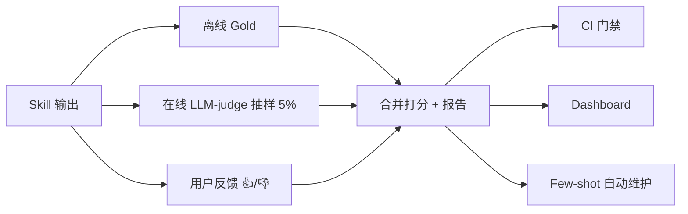
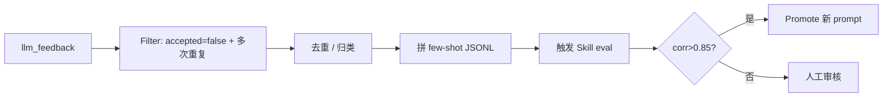
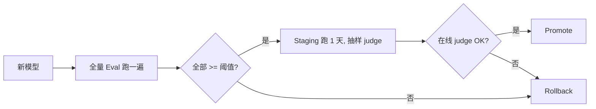
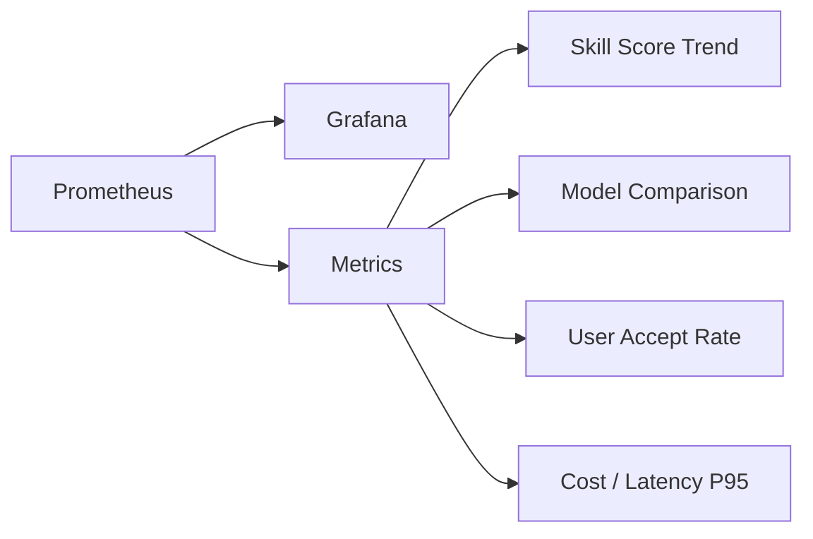
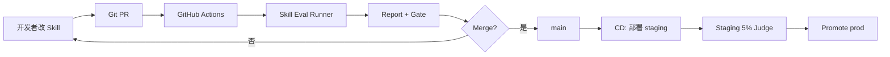

# IDM — Skill 评估体系 (Eval Harness)

> 保证 LLM-driven 的 IDM **不会因为 prompt 改动、模型升级、Schema 变化而退化**
> 三层评估: 离线 Gold / 在线 LLM-as-judge / 用户反馈
> 配套 Auto-Regression / 模型升级门禁 / Few-shot 自动维护

---

## 目录

- [1. 评估目标](#1-评估目标)
- [2. 三层评估总览](#2-三层评估总览)
- [3. Skill 评估通用接口](#3-skill-评估通用接口)
- [4. Gold Snapshot 体系](#4-gold-snapshot-体系)
- [5. Skill 自带 Eval 段](#5-skill-自带-eval-段)
- [6. LLM-as-judge 模板](#6-llm-as-judge-模板)
- [7. 用户反馈回流](#7-用户反馈回流)
- [8. 自动化回归](#8-自动化回归)
- [9. 模型升级门禁](#9-模型升级门禁)
- [10. Few-shot 自动维护](#10-few-shot-自动维护)
- [11. Dashboard & SLO](#11-dashboard--slo)
- [12. 与 Skills / Agent / CI 集成](#12-与-skills--agent--ci-集成)
- [13. 自带 Skill Eval 模板](#13-自带-skill-eval-模板)

---

## 1. 评估目标

| 目标 | 指标 | 目标值 |
| --- | --- | --- |
| **质量不退化** | 关键 Skill 准确率 | ≥ 0.85 |
| **升级可控** | 模型/Prompt 改 → 自动知道能不能上 | 100% gate |
| **反馈闭环** | 用户标误报 → 自动进 few-shot | < 1 天生效 |
| **可解释** | 每次低分都给出原因 | 100% |
| **CI 友好** | 跑一次 < 10 min, 产出 markdown | ✅ |

---

## 2. 三层评估总览



| 层 | 触发 | 频次 | 用途 |
| --- | --- | --- | --- |
| **离线 Gold** | CI / 定时 | 每次 PR / 每周 | 拦截退化, 拦门禁 |
| **在线 Judge** | 真实流量 | 5% 抽样 | 发现 Gold 覆盖不到的问题 |
| **用户反馈** | UI 👍/👎 | 实时 | 业务真实偏好, 进训练集 |

---

## 3. Skill 评估通用接口

```python
# idm/eval/types.py
class EvalCase(BaseModel):
    id: str
    skill: str
    input: dict
    gold: dict                      # 期望输出
    rubric: dict | None = None      # 评分细则
    tags: list[str] = []

class EvalResult(BaseModel):
    case_id: str
    skill: str
    pred: dict
    score: float                    # 0~1
    sub_scores: dict
    issues: list[str]
    latency_ms: int
    tokens: int
    cost: float

class EvalReport(BaseModel):
    skill: str
    total: int
    passed: int
    avg_score: float
    per_case: list[EvalResult]
    p50_latency: float
    total_cost: float
    markdown: str
```

**统一执行器**:

```python
# idm/eval/runner.py
class SkillEvalRunner:
    def __init__(self, skill: str, model: str | None = None, judge_model: str = "gpt-5"):
        # judge_model 默认 gpt-5 (评分需要强推理); model 走默认 deepseek-v4
        self.skill = skill
        self.model = model
        self.judge_model = judge_model

    async def run(self, cases: list[EvalCase], parallel: int = 5) -> EvalReport:
        sem = asyncio.Semaphore(parallel)
        results = await asyncio.gather(*[self._one(c, sem) for c in cases])
        return self._report(results)

    async def _one(self, c: EvalCase, sem):
        async with sem:
            pred = await self._run_skill(c)
            score, issues = await self._judge(c, pred)
            return EvalResult(case_id=c.id, skill=self.skill,
                              pred=pred, score=score, sub_scores={},
                              issues=issues, latency_ms=..., tokens=..., cost=...)

    async def _run_skill(self, c):
        # 用 FakeMCP / 真实数据 跑 skill
        return await skill_runner(SKILLS[c.skill], input=c.input, ctx={"mock": True})

    async def _judge(self, c, pred) -> tuple[float, list[str]]:
        if c.rubric and "exact" in c.rubric:
            return (1.0 if c.gold == pred else 0.0), []
        prompt = build_judge_prompt(c, pred, self.judge_model)
        return await judge_llm(prompt)
```

---

## 4. Gold Snapshot 体系

### 4.1 数据组织

```text
skills/
└── specs/
    └── infer_table_description.yml
└── eval/
    ├── cases.jsonl
    ├── gold/
    │   ├── case-001.gold.json
    │   └── ...
    └── snapshots/
        └── 2025-06-01__gpt-5__v3.1.0/
            ├── result.json
            └── report.md
```

### 4.2 Gold 字段 (infer_table_description 示例)

```json
// eval/gold/case-001.gold.json
{
  "case_id": "case-001",
  "skill": "infer_table_description",
  "input": {
    "fqn": "shop.orders_daily",
    "columns": [
      {"name":"order_id","type":"String"},
      {"name":"user_id","type":"String"},
      {"name":"gmv","type":"Decimal(18,2)"},
      {"name":"order_date","type":"Date"}
    ],
    "sample": [...],
    "glossary": [{"term":"GMV","def":"成交总额"}]
  },
  "gold": {
    "description_contains": ["订单","GMV","汇总"],
    "max_length": 80,
    "tone": "business"
  },
  "rubric": {
    "type": "rubric_v1",
    "weights": {
      "accuracy":    0.4,
      "specificity": 0.3,
      "length":      0.1,
      "fluency":     0.2
    },
    "judge_model": "gpt-5"
  },
  "tags": ["smoke", "zh"]
}
```

### 4.3 用 Pydantic 约束 output

```python
class DescOut(BaseModel):
    description: str = Field(..., max_length=80)
```

> **强结构** (JSON Schema) → 用 exact 比较; **弱结构** (自由文本) → LLM judge。

### 4.4 Case 来源

| 来源 | 例子 | 比例 |
| --- | --- | --- |
| 真实流量人工标注 | 线上某表, 历史采纳的 description | 60% |
| 反例 (用户标误报) | llm_feedback | 20% |
| 合成 | 用 GPT-5 生成"应当" | 15% |
| 安全/边界 | "空表 / 1000 列" | 5% |

---

## 5. Skill 自带 Eval 段

在 Skill Spec 内嵌 eval 定义, **Skill 提交时即带测试**:

```yaml
# skills/specs/infer_table_description.yml
skill: infer_table_description
version: 1
input_schema: { ... }
mcp_calls:   [ ... ]
llm_calls:   [ ... ]
post_validators: [ ... ]

eval:
  fixtures:
    - name: "shop.orders_daily"
      file: ./fixtures/orders_daily.json
  cases:
    - id: t-orders-1
      input_fixture: shop.orders_daily
      gold: { contains: ["订单","GMV"], max_len: 80 }
    - id: t-orders-2
      input_fixture: shop.orders_daily
      overrides: { language: en }
      gold: { contains: ["order","GMV"], max_len: 100 }
  pass_criteria:
    avg_score: 0.85
    min_score: 0.7
    max_cost_per_case_usd: 0.05
```

**Runner 自动读 eval 段** → 单元测试 + 集成测试一次完成。

---

## 6. LLM-as-judge 模板

### 6.1 通用 Judge

```python
JUDGE_TEMPLATE = """
你是严格的数据治理审核员. 评估预测结果质量, 0~1 分.
- {rubric_text}

# 用户输入
{input}
# 预测输出
{pred}
# 期望输出 (gold)
{gold}

请按 {rubric_weights} 维度分别打分, 加权求和, 输出 JSON:
{ "score": float, "sub_scores": {dim: float}, "issues": [str], "rationale": str }
"""
```

### 6.2 Skill 专用 Judge

| Skill | Judge 重点 |
| --- | --- |
| **infer_table_description** | 准确性 / 具体性 / 长度 / 流畅 |
| **classify_pii_columns** | 严格不漏报 (召回优先) |
| **infer_owners** | 信号来源一致性 |
| **detect_anomalies** | 严重度合理 / 不假报 |
| **nl2sql** | 同表 / 同条件 / 同粒度 |
| **compose_insight** | 标题吸引 / 行动建议具体 |

### 6.3 Judge 校准

> **Judge 自身也需校准**:
> 准备 200 条人类标注, 跑 Judge, 看与人类的相关性。

```python
async def calibrate_judge():
    pairs = await db.query("SELECT pred, gold, human_score FROM judge_calibration")
    for p in pairs:
        j = await judge_llm(render(p))
        corr = np.corrcoef([j["score"] for p in pairs], [p.human_score for p in pairs])[0,1]
    return corr
# 目标 Pearson >= 0.85
```

---

## 7. 用户反馈回流

### 7.1 UI 反馈组件

```tsx
const FeedbackBar = ({ msgId }) => (
  <div className={styles.fb}>
    <button onClick={() => api.feedback(msgId, true, null)}>👍 有用</button>
    <button onClick={() => api.feedback(msgId, false, prompt("哪里有问题?"))}>👎 不准</button>
    {role === "steward" && <button onClick={edit}>✏️ 修改建议</button>}
  </div>
);
```

### 7.2 数据入库

```sql
CREATE TABLE llm_feedback (
    id          UUID PRIMARY KEY,
    skill       TEXT,
    run_id      UUID,
    case_key    TEXT,             -- fqn / question / ...
    pred        JSONB,
    new_payload JSONB,            -- 用户修改后
    accepted    BOOLEAN,
    reason      TEXT,
    user_email  TEXT,
    created_at  TIMESTAMPTZ DEFAULT now()
);
```

### 7.3 反馈→Few-shot 流水线



---

## 8. 自动化回归

### 8.1 GitHub Action

```yaml
# .github/workflows/skill-eval.yml
name: Skill Eval
on:
  pull_request:
    paths: ['idm/skills/**', 'idm/eval/**']
  schedule: { cron: "0 6 * * 1" }   # 每周一

jobs:
  eval:
    runs-on: ubuntu-latest
    strategy:
      matrix: { skill: [infer_table_description, classify_pii_columns, infer_owners, nl2sql, compose_insight] }
    steps:
      - uses: actions/checkout@v4
      - uses: actions/setup-python@v5
        with: { python-version: "3.12" }
      - run: pip install -e .[eval]
      - run: python -m idm.eval.cli run --skill ${{ matrix.skill }} --model gpt-5 --report
      - uses: actions/upload-artifact@v4
        with: { name: eval-${{ matrix.skill }}, path: reports/ }
      - name: Check gate
        run: python -m idm.eval.cli gate --min-score 0.85 --max-regress 0.02
```

### 8.2 报告 Markdown (自动)

```text
# Skill Eval — infer_table_description
- Date: 2025-06-06
- Model: gpt-5
- Cases: 86

## Summary
- Avg score: **0.91** ✅
- Pass rate: 96% (>= 0.7)
- P50 latency: 1.4s
- Cost: $0.18

## Regressions vs main
| Case | Old | New | Δ |
| --- | --- | --- | --- |
| t-orders-2 | 0.92 | 0.95 | +0.03 |
| t-empty-1  | 0.50 | 0.62 | +0.12 |
| t-long-1   | 0.88 | 0.78 | **-0.10** ⚠️ |

## Failures
- t-long-1: description 89 字, 超 80 字限制
```

### 8.3 Gate (PR 阻塞)

```python
def gate(report: EvalReport, baseline: EvalReport, cfg):
    if report.avg_score < cfg.min_avg:
        raise GateFail(f"avg {report.avg_score} < {cfg.min_avg}")
    if (report.avg_score - baseline.avg_score) < -cfg.max_regress:
        raise GateFail(f"regress {(report.avg_score - baseline.avg_score):+.2f}")
    return True
```

---

## 9. 模型升级门禁



```bash
# 升级 gpt-5 → gpt-5.4
python -m idm.eval.cli run --all --model gpt-5.4 --baseline gpt-5 --gate
# 自动产出 diff report
# 若通过, 自动推 staging 配置
```

```bash
# 验证 deepseek-v4 (主力) baseline
python -m idm.eval.cli run --all --model deepseek-v4 --baseline gpt-5 --gate
```

**预算门禁**: 若新模型 cost > 1.5x 老模型, 强制要求新模型 avg_score > 老模型 + 0.05 才放行。

---

## 10. Few-shot 自动维护

### 10.1 Few-shot 来源

| 来源 | 优先级 |
| --- | --- |
| 用户采纳 (高评分) | 100 |
| 业务专家标注 | 90 |
| 反例修正后采纳 | 70 |
| 离线 Eval 通过 | 30 |

### 10.2 选择算法 (MMR)

```python
def select_few_shots(candidates, target_question, k=5, lambda_=0.6):
    """Maximal Marginal Relevance: 既要相关, 又要多样"""
    selected = []
    while len(selected) < k:
        best, best_score = None, -1
        for c in candidates:
            if c in selected: continue
            rel  = cosine(qvec(c.question), qvec(target_question))
            div  = min(cosine(qvec(c.question), qvec(s.question)) for s in selected) if selected else 0
            score = lambda_ * rel + (1 - lambda_) * div
            if score > best_score: best, best_score = c, score
        selected.append(best)
    return selected
```

### 10.3 周期性刷新

```python
# 每天凌晨跑一次
@scheduler.cron("0 3 * * *")
async def refresh_few_shots():
    for skill in SKILLS.values():
        shots = await build_few_shots(skill, k=5)
        await s3.put(f"few_shots/{skill.name}.jsonl", "\n".join(shots))
        log.info(f"refreshed few_shots for {skill.name}: {len(shots)} examples")
```

---

## 11. Dashboard & SLO



| 指标 | 公式 | SLO |
| --- | --- | --- |
| **Skill Score** | `avg(judge_score)` 7d | ≥ 0.85 |
| **Accept Rate** | `accepted / total` 7d | ≥ 0.65 |
| **Judge-Human Corr** | Pearson(judge, human) | ≥ 0.85 |
| **Cost per use case** | `total_cost / uc_count` | ≤ $0.5 |
| **Eval Coverage** | skills with cases / total | 100% |
| **Eval Freshness** | days since last eval | ≤ 7 |

---

## 12. 与 Skills / Agent / CI 集成



| 触发点 | 行为 |
| --- | --- |
| **改 `skills/specs/*.yml`** | 跑该 skill eval |
| **改 `prompts/*.txt`** | 跑引用它的所有 skill |
| **升级模型** | 全 skill 全量 eval |
| **合并到 main** | 仅 smoke (5 cases) |
| **定时** | 全量 |

---

## 13. 自带 Skill Eval 模板

### 13.1 infer_table_description

```jsonl
{"id":"orders-1","input":{"fqn":"shop.orders_daily","columns":[{"name":"gmv","type":"Decimal(18,2)"},{"name":"order_date","type":"Date"}],"sample":[{"gmv":"199.00","order_date":"2025-01-15"}],"glossary":[{"term":"GMV","def":"成交总额"}]},"gold":{"contains":["订单","GMV"],"max_len":80}}
{"id":"orders-2","input":{...},"gold":{...}}
```

### 13.2 nl2sql (跨方言)

```jsonl
{"id":"q-1","input":{"question":"上月 GMV Top 10 区域","dialect":"clickhouse"},"gold":{"fqn":"shop.orders_daily","must_contain":["region","sum(gmv)","LIMIT"]}}
{"id":"q-2","input":{"question":"北京昨天新用户数","dialect":"clickhouse"},"gold":{"fqn":"shop.user_event","must_contain":["uniq","region"]}}
```

### 13.3 classify_pii

```jsonl
{"id":"p-1","input":{"columns":[{"name":"user_email","type":"String"}]},"gold":{"user_email":"email"}}
{"id":"p-2","input":{"columns":[{"name":"id_card","type":"String"}]},"gold":{"id_card":"id_card"}}
```

---

## 附录 A. CLI 速查

```bash
# 跑单个 skill
python -m idm.eval.cli run --skill infer_table_description --model gpt-5

# 跑全部
python -m idm.eval.cli run --all

# 门禁
python -m idm.eval.cli gate --baseline reports/main.json --current reports/pr.json

# 添加 case
python -m idm.eval.cli add --skill nl2sql --file cases.jsonl

# 模型升级
python -m idm.eval.cli upgrade --from gpt-5 --to gpt-5.4

# 校准 judge
python -m idm.eval.cli calibrate --judge gpt-5
```

## 附录 B. 数据存储

```text
s3://idm-eval/
  ├── snapshots/
  │   └── 2025-06-06__gpt-5__infer_table_description/
  │       ├── result.json
  │       └── report.md
  ├── few_shots/
  │   ├── infer_table_description.jsonl
  │   ├── nl2sql.jsonl
  │   └── ...
  └── baselines/
      └── infer_table_description__gpt-5.json
```

## 附录 C. 与 Langfuse 联动

```python
# idm/eval/runner.py
async def _one(self, c):
    with langfuse_context(name=c.skill, tags=["eval"]) as ctx:
        pred = await self._run_skill(c)
        score, issues = await self._judge(c, pred)
        ctx.score(name="skill_score", value=score, comment=";".join(issues))
        return EvalResult(...)
```

> 所有 Eval Trace 都在 Langfuse, 配合生产 trace 一起分析。

---

> 📌 **配套阅读**：[skills-design.md](./skills-design.md) · [agent-orchestration.md](./agent-orchestration.md) · [llm-router.md](./llm-router.md) · [insight-alerting.md](./insight-alerting.md) · [chatbi-design.md](./chatbi-design.md) · [walkthrough.md](./walkthrough.md)
