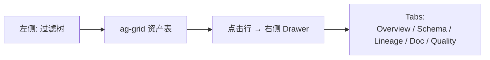

# IDM — 前端架构 (ag-grid Community + 公司 UX)

> 不引 Antd / Material UI
> 用 ag-grid Community 做大表格, 用自研 IDM UI Kit 复用公司设计系统
> 整体保持轻量、可控、Token 化

---

## 目录

- [1. 选型再确认](#1-选型再确认)
- [2. 总体技术栈](#2-总体技术栈)
- [3. 目录结构](#3-目录结构)
- [4. IDM UI Kit 组件清单](#4-idm-ui-kit-组件清单)
- [5. ag-grid Community 实战](#5-ag-grid-community-实战)
- [6. 关键页面设计](#6-关键页面设计)
- [7. 主题与 Token](#7-主题与-token)
- [8. 状态管理 / 数据获取](#8-状态管理--数据获取)
- [9. 性能优化](#9-性能优化)
- [10. 可访问性 / i18n](#10-可访问性--i18n)
- [11. 与后端的契约](#11-与后端的契约)

---

## 1. 选型再确认

| 决定 | 说明 |
| --- | --- |
| **不引 Antd** | 公司有专用 UX / UI 设计系统 |
| **不引 Material UI / Chakra** | 同上 |
| **ag-grid Community** (免费) | 表格/过滤/虚拟滚动第一梯队 |
| **自研 IDM UI Kit** | 复用公司 Design Token |
| **Vite + React 18 + TS** | 维持现有栈 |

---

## 2. 总体技术栈

| 层 | 选型 | 理由 |
| --- | --- | --- |
| 框架 | React 18 + TypeScript | 保持 |
| 构建 | Vite | 快 |
| 路由 | React Router v6 | 简单 |
| 数据 | TanStack Query (React Query) | 缓存 / 失效 / 后台刷新 |
| 状态 | Zustand (轻) | 不用 Redux |
| 表格 | **ag-grid-community** | 关键页面 |
| 图表 | ECharts (for Apache) | 丰富、稳定 |
| 血缘图 | ReactFlow | 已有 |
| 代码高亮 | react-syntax-highlighter | 轻量 |
| Markdown 渲染 | react-markdown + remark-gfm | AI 描述展示 |
| WebSocket | 原生 | 实时通知 / Insight |
| 表单 | react-hook-form + zod | 轻量 |
| 测试 | Vitest + React Testing Library |  |
| 主题 | CSS Variables + 公司 Token |  |

> **零 Antd / 零 Material**：所有"基础控件"由 IDM UI Kit 自研或包装原生。

---

## 3. 目录结构

```text
idm-console/
├── public/
├── src/
│   ├── main.tsx
│   ├── App.tsx
│   ├── router.tsx
│   ├── pages/
│   │   ├── Home/
│   │   ├── AssetList/
│   │   ├── AssetDetail/
│   │   ├── Lineage/
│   │   ├── Glossary/
│   │   ├── Suggestions/
│   │   ├── Quality/
│   │   ├── Insights/
│   │   ├── ChatBI/
│   │   └── UseCaseEditor/
│   ├── components/                     # 业务组件
│   │   ├── AssetTable/
│   │   ├── AssetDetail/
│   │   ├── LineageGraph/
│   │   ├── SuggestionDrawer/
│   │   ├── ChatPanel/
│   │   └── ...
│   ├── ui-kit/                         # 自研基础组件
│   │   ├── Button/
│   │   ├── Card/
│   │   ├── Tag/
│   │   ├── Input/
│   │   ├── Select/
│   │   ├── Modal/
│   │   ├── Drawer/
│   │   ├── Tabs/
│   │   ├── Toast/
│   │   ├── Empty/
│   │   └── Spinner/
│   ├── styles/
│   │   ├── tokens.css                  # 公司 design token
│   │   ├── global.css
│   │   └── ag-grid-theme.css
│   ├── api/
│   │   ├── graphql.ts                  # Apollo Client
│   │   ├── rest.ts
│   │   └── ws.ts
│   ├── hooks/
│   ├── stores/                         # zustand
│   ├── utils/
│   └── types/
├── package.json
├── tsconfig.json
├── vite.config.ts
└── Dockerfile
```

---

## 4. IDM UI Kit 组件清单

> 每个组件 ≈ 80~150 行 TSX + 1 个 CSS Module

### 4.1 Button

```tsx
// ui-kit/Button/Button.tsx
import styles from "./Button.module.css";
import classNames from "classnames";

type Variant = "primary" | "ghost" | "danger" | "link";
type Size = "sm" | "md" | "lg";

export interface ButtonProps extends React.ButtonHTMLAttributes<HTMLButtonElement> {
  variant?: Variant;
  size?: Size;
  loading?: boolean;
  icon?: React.ReactNode;
}

export const Button: React.FC<ButtonProps> = ({
  variant = "primary", size = "md", loading, icon, children, ...rest
}) => (
  <button
    className={classNames(styles.btn, styles[variant], styles[size])}
    disabled={loading || rest.disabled}
    {...rest}
  >
    {loading ? <Spinner size="sm" /> : icon}
    {children}
  </button>
);
```

### 4.2 Tag (替代 Antd Tag, 支持 4 色)

```tsx
export const Tag: React.FC<{ color: ColorKey; children: React.ReactNode }> = ({ color, children }) => (
  <span className={classNames(styles.tag, styles[color])}>{children}</span>
);
```

### 4.3 Drawer (右侧详情栏)

```tsx
export const Drawer: React.FC<{ open: boolean; onClose: () => void;
  title: string; children: React.ReactNode; width?: number }> = ...
```

### 4.4 Tabs

```tsx
export const Tabs: React.FC<{
  items: { key: string; label: string; content: React.ReactNode }[];
  activeKey: string; onChange: (k: string) => void;
}> = ...
```

### 4.5 全套

| 组件 | 关键 props |
| --- | --- |
| `Button` | variant, size, loading, icon |
| `Card` | title, extra, hoverable |
| `Tag` | color: success / warning / danger / info / neutral |
| `Input` | prefix/suffix, error |
| `Select` | searchable, multi, async |
| `Modal` | size, confirm, footer |
| `Drawer` | side, width |
| `Tabs` | type: line / card |
| `Toast` | top-right stack |
| `Empty` | illustration, action |
| `Spinner` | size, tip |
| `Pagination` | pageSize, total |
| `Tooltip` | placement |
| `Badge` | dot, count |

> 总量约 1500 行 TSX, 1~2 周可完成。

---

## 5. ag-grid Community 实战

### 5.1 安装

```bash
npm i ag-grid-community ag-grid-react
```

### 5.2 主题

```css
/* styles/ag-grid-theme.css */
@import "ag-grid-community/styles/ag-grid.css";
@import "ag-grid-community/styles/ag-theme-quartz.css";

:root {
  --ag-foreground-color: var(--color-fg-default);
  --ag-background-color: var(--color-bg-default);
  --ag-header-foreground-color: var(--color-fg-muted);
  --ag-header-background-color: var(--color-bg-subtle);
  --ag-odd-row-background-color: var(--color-bg-default);
  --ag-row-hover-color: var(--color-bg-hover);
  --ag-selected-row-background-color: var(--color-primary-50);
  --ag-border-color: var(--color-border-default);
  --ag-font-family: var(--font-sans);
  --ag-row-height: 40px;
  --ag-header-height: 44px;
}
```

### 5.3 资产列表 (核心页面)

```tsx
// pages/AssetList/AssetList.tsx
import { AgGridReact } from "ag-grid-react";
import { useMemo } from "react";
import { useQuery } from "@tanstack/react-query";
import { Tag, Tier } from "@/ui-kit";
import { fetchAssets } from "@/api/rest";

const tierColor = { critical: "danger", important: "warning", normal: "neutral" } as const;

export const AssetList = () => {
  const { data = [] } = useQuery({ queryKey: ["assets"], queryFn: fetchAssets });

  const columnDefs = useMemo(() => [
    {
      field: "fqn", headerName: "资产 FQN", filter: "agTextColumnFilter",
      width: 360, pinned: "left",
      cellRenderer: (p: any) => <a href={`/assets/${p.data.id}`}>{p.value}</a>
    },
    {
      field: "tier", headerName: "等级", filter: "agSetColumnFilter",
      width: 100,
      cellRenderer: (p: any) => <Tag color={tierColor[p.value]}>{p.value}</Tag>
    },
    {
      field: "owner", headerName: "Owner", filter: "agTextColumnFilter", width: 180
    },
    {
      field: "doc_status", headerName: "文档", width: 110,
      cellRenderer: (p: any) => p.value === "complete" ? "✅" : "⚠️"
    },
    {
      field: "pii_tags", headerName: "PII", width: 110,
      cellRenderer: (p: any) => p.value?.length
        ? <Tag color="warning">{p.value.length}</Tag> : "—"
    },
    {
      field: "row_count", headerName: "行数", type: "numericColumn",
      valueFormatter: (p: any) => p.value?.toLocaleString(), width: 130
    },
    {
      field: "size", headerName: "大小", type: "numericColumn",
      valueFormatter: (p: any) => formatBytes(p.value), width: 120
    },
    {
      field: "updated_at", headerName: "更新", width: 170,
      valueFormatter: (p: any) => new Date(p.value).toLocaleString()
    }
  ], []);

  return (
    <div className="ag-theme-quartz" style={{ height: "calc(100vh - 200px)" }}>
      <AgGridReact
        rowData={data}
        columnDefs={columnDefs}
        defaultColDef={{
          resizable: true, sortable: true, filter: true,
          floatingFilter: true
        }}
        pagination
        paginationPageSize={50}
        paginationPageSizeSelector={[20, 50, 100, 200]}
        rowSelection="single"
        onRowClicked={(e) => location.assign(`/assets/${e.data.id}`)}
        getRowId={(p) => p.data.id}
      />
    </div>
  );
};
```

### 5.4 建议审核表 (Drawer 详情)

```tsx
// pages/Suggestions/Suggestions.tsx
const colDefs = [
  { field: "created_at", headerName: "时间", width: 170,
    valueFormatter: p => new Date(p.value).toLocaleString() },
  { field: "target_fqn", headerName: "资产", flex: 1, filter: true },
  { field: "action", headerName: "动作", width: 130 },
  { field: "agent", headerName: "Agent", width: 130 },
  { field: "confidence", headerName: "置信度", width: 110,
    cellRenderer: p => <Tag color={p.value > 0.8 ? "success" : p.value > 0.5 ? "warning" : "neutral"}>
      {(p.value * 100).toFixed(0)}%
    </Tag>
  },
  { field: "status", headerName: "状态", width: 110,
    cellRenderer: p => <Tag color={p.value === "pending" ? "warning" : "info"}>{p.value}</Tag> }
];
```

### 5.5 ag-grid 关键能力使用清单

| 能力 | 用法 |
| --- | --- |
| 过滤 | `agTextColumnFilter`, `agNumberColumnFilter`, `agSetColumnFilter` |
| 排序 | `sortable: true` |
| 虚拟滚动 | 默认 |
| 列固定 | `pinned: 'left' / 'right'` |
| 列分组 | `children` |
| 自定义渲染 | `cellRenderer` |
| 弹窗编辑 | `cellEditor: 'agSelectCellEditor'` |
| 树形 | `treeData: true` (Glossary) |
| 主从 | `masterDetail: true` (资产→列) |
| 服务端分页 | `serverSideStoreType: 'partial'` |
| 导出 CSV | `api.exportDataAsCsv()` |

> Community 版没有 Excel 导出 / 透视表 / 列分组菜单 — 但 IDM 用不到。

---

## 6. 关键页面设计

### 6.1 资产目录



### 6.2 资产详情 Drawer

```tsx
<Drawer open={open} onClose={onClose} title={asset.fqn} width={720}>
  <Tabs items={[
    { key: "overview",   label: "概览",   content: <Overview /> },
    { key: "schema",     label: "Schema", content: <SchemaTable columns={asset.columns} /> },
    { key: "lineage",    label: "血缘",   content: <LineageGraph fqn={asset.fqn} /> },
    { key: "doc",        label: "文档",   content: <DocView asset={asset} /> },
    { key: "quality",    label: "质量",   content: <QualityMetrics fqn={asset.fqn} /> }
  ]} />
</Drawer>
```

### 6.3 血缘图 (ReactFlow)

```tsx
<LineageGraph fqn={asset.fqn} depth={3} />
// 自动从 IDM GraphQL: lineage(fqn, depth)
```

### 6.4 ChatBI

```tsx
<ChatPanel
  schema={candidateTables}
  onSend={async (q) => {
    const r = await chatbi(q);
    return { sql: r.sql, result: r.result, chart: <EChart option={r.chartOption} /> };
  }}
/>
```

### 6.5 Use Case 编辑器 (YAML)

```tsx
<UseCaseEditor
  value={yamlText}
  onChange={setYamlText}
  schema={useCaseJsonSchema}      // 实时校验
  onSubmit={async (yaml) => api.saveUseCase(yaml)}
  onDryRun={async () => api.dryRun(yaml)}
/>
```

> YAML 编辑用 Monaco Editor (有 schema 校验 / 自动补全)。

---

## 7. 主题与 Token

```css
/* styles/tokens.css (从公司 design system 引入) */
:root {
  --color-bg-default: #fff;
  --color-bg-subtle:  #f7f8fa;
  --color-bg-hover:   #f0f4fa;
  --color-fg-default: #1f2328;
  --color-fg-muted:   #5a6273;
  --color-border-default: #e5e7eb;
  --color-primary: #2c6cf0;
  --color-primary-50: #eaf1ff;
  --color-success: #16a34a;
  --color-warning: #d97706;
  --color-danger:  #dc2626;
  --font-sans: "Inter", "PingFang SC", "Microsoft YaHei", sans-serif;
  --space-1: 4px;
  --space-2: 8px;
  --space-3: 12px;
  --space-4: 16px;
  --radius-md: 6px;
  --shadow-sm: 0 1px 2px rgba(0,0,0,.06);
}

[data-theme="dark"] {
  --color-bg-default: #0f1115;
  --color-bg-subtle:  #1a1d24;
  --color-fg-default: #e4e7eb;
  /* ... */
}
```

> **从公司 design system 导出 token 文件**, IDM 全部组件用变量。

---

## 8. 状态管理 / 数据获取

### 8.1 TanStack Query

```tsx
const { data, isLoading, refetch } = useQuery({
  queryKey: ["asset", fqn],
  queryFn: () => api.getAsset(fqn),
  staleTime: 30_000
});
```

### 8.2 GraphQL (Apollo)

```tsx
const { data } = useQuery(GET_ASSET, { variables: { fqn } });
```

### 8.3 WebSocket (实时)

```tsx
// hooks/useInsightStream.ts
useEffect(() => {
  const ws = new WebSocket(WS_URL);
  ws.onmessage = (e) => {
    const insight = JSON.parse(e.data);
    queryClient.setQueryData(["insights"], (old) => [insight, ...old]);
  };
  return () => ws.close();
}, []);
```

### 8.4 Zustand (UI 状态)

```ts
// stores/useUI.ts
export const useUI = create<{
  theme: "light" | "dark";
  toggleTheme: () => void;
}>(set => ({
  theme: "light",
  toggleTheme: () => set(s => ({ theme: s.theme === "light" ? "dark" : "light" }))
}));
```

---

## 9. 性能优化

| 维度 | 措施 |
| --- | --- |
| **表格** | ag-grid 虚拟滚动 + 服务端分页 |
| **大列表** | 虚拟列表 (react-window) |
| **图表** | ECharts 增量更新 / 按需引入 |
| **打包** | Vite lazy import + 分包 |
| **缓存** | TanStack Query staleTime |
| **GraphQL** | 字段按需取, 避免 N+1 |
| **WebSocket** | 节流, 合并推送 |
| **Re-render** | React.memo / useMemo / useCallback |

---

## 10. 可访问性 / i18n

| 项 | 方案 |
| --- | --- |
| **i18n** | react-i18next, 中英文 |
| **无障碍** | 全部交互元素 `aria-*`, 焦点环 |
| **键盘** | ag-grid 支持, 自研组件 Tab 序 |
| **暗色** | 主题切换 |

---

## 11. 与后端的契约

| 渠道 | 用途 |
| --- | --- |
| **GraphQL** | 主要: 资产 / 血缘 / 建议 / Insight |
| **REST** | Use Case CRUD, Skill 调用, 文件上传 |
| **WebSocket** | 实时 Insight / 建议通知 / 任务状态 |
| **MCP (IDM self)** | 外部 Agent 调 IDM (可选) |

```graphql
# 核心查询
type Query {
  asset(fqn: String!): Asset
  assets(filter: AssetFilter, page: Page): AssetConnection!
  lineage(fqn: String!, depth: Int = 3): LineageGraph!
  suggestions(status: SuggestionStatus = PENDING): [Suggestion!]!
  insights(limit: Int = 20): [Insight!]!
  useCases: [UseCase!]!
}

type Mutation {
  approveSuggestion(id: ID!, note: String): Suggestion!
  rejectSuggestion(id: ID!, reason: String!): Suggestion!
  saveUseCase(yaml: String!): UseCase!
  dryRunUseCase(yaml: String!): DryRunResult!
}
```

---

## 附录 A. 严禁引入的依赖

| 库 | 原因 |
| --- | --- |
| **antd / ant-design** | 公司 UX 体系冲突 |
| **@mui/material** | 同上 |
| **@chakra-ui/react** | 同上 |
| **@mantine/core** | 同上 |
| **element-plus** | 同上 |
| **ag-grid-enterprise** | 收费 |
| **react-data-grid** | 弱于 ag-grid community |

## 附录 B. 可引入的"轻量库"

| 库 | 用途 |
| --- | --- |
| `classnames` | class 合并 |
| `dayjs` | 时间 |
| `numeral` / `d3-format` | 数字格式化 |
| `react-syntax-highlighter` | SQL/YAML 高亮 |
| `echarts` / `echarts-for-react` | 图表 |
| `reactflow` | 血缘图 |
| `@tanstack/react-query` | 数据 |
| `zustand` | 状态 |
| `react-router-dom` | 路由 |
| `react-hook-form` + `zod` | 表单 |
| `react-i18next` | i18n |
| `@monaco-editor/react` | YAML/SQL 编辑 |

---

> 📌 **配套阅读**：[stack-decisions.md](./stack-decisions.md) · [mcp-first-architecture.md](./mcp-first-architecture.md) · [walkthrough.md](./walkthrough.md)
