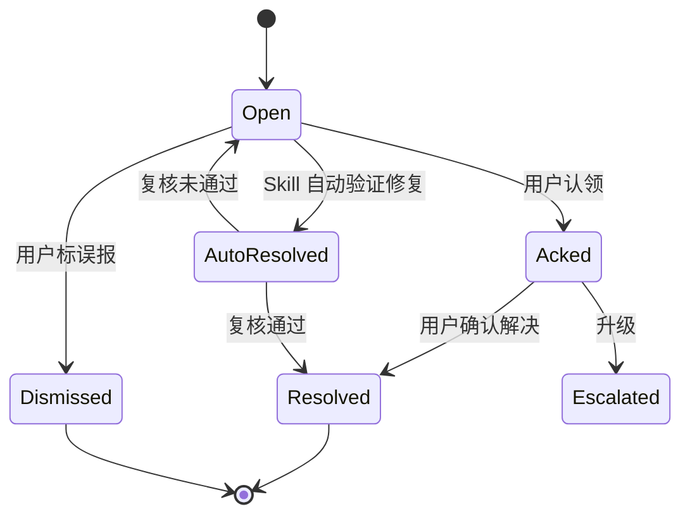
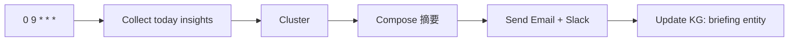
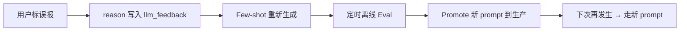

# IDM — Insight 决策与告警设计

> 把"AI 发现的洞察"变成"业务能行动的信号"
> 包含：Insight 分类、决策规则、降噪、多渠道推送、行动闭环、SLO

---

## 目录

- [1. Insight 定义](#1-insight-定义)
- [2. Insight 分类矩阵](#2-insight-分类矩阵)
- [3. Insight 数据模型](#3-insight-数据模型)
- [4. 决策引擎（规则 + LLM）](#4-决策引擎规则--llm)
- [5. 降噪与去重](#5-降噪与去重)
- [6. 多渠道推送](#6-多渠道推送)
- [7. 行动闭环](#7-行动闭环)
- [8. Skill：compose_insight](#8-skillcompose_insight)
- [9. Skill：detect_anomalies](#9-skilldetect_anomalies)
- [10. Skill：daily_briefing](#10-skilldaily_briefing)
- [11. 排程与配额](#11-排程与配额)
- [12. SLO 与可观测](#12-slo-与可观测)
- [13. 反例与误报处理](#13-反例与误报处理)
- [14. KPI](#14-kpi)

---

## 1. Insight 定义

> **Insight = AI 主动发现的、对业务或治理有价值的信号。**

与「事件 / 日志」区别:

| 维度 | 事件 | Insight |
| --- | --- | --- |
| 来源 | 原始系统日志 | AI 推理 + KG 上下文 |
| 结构 | 自由 | 分类化、有元数据 |
| 价值 | 中性 | 业务/治理动作 |
| 消费者 | 工程师 | Owner / Steward / 业务 |

---

## 2. Insight 分类矩阵

| 大类 | 子类 | 严重度 | 默认动作 |
| --- | --- | --- | --- |
| **数据质量** | `row_anomaly` / `null_spike` / `distribution_shift` / `freshness_lag` | low/med/high/critical | Slack 频道 + 自动创建工单 |
| **资产变更** | `new_table` / `new_column` / `table_dropped` / `schema_break` | info/warn | Slack `#data-stewards` |
| **血缘** | `lineage_broken` / `upstream_owner_missing` / `downstream_unused` | warn | 通知相关 owner |
| **合规** | `pii_unmasked` / `pii_in_unexpected_column` / `pii_exported_to_external` | high/critical | 即时告警 Owner + SecOps |
| **成本** | `table_never_queried` / `materialization_redundant` / `storage_explosion` | info/warn | 优化建议 |
| **协作** | `owner_missing` / `doc_stale` / `description_low_quality` | info | 待办, 静默推送 |
| **使用** | `high_cardinality_unused_index` / `slow_query_regression` | warn | 工程师评审 |
| **业务** | `gmv_drop_7d` / `region_anomaly` / `new_dashboard_without_owner` | med/high | Owner + 业务群 |

> 严重度 → 渠道 → 频率 → 是否静默，全部用规则映射。

---

## 3. Insight 数据模型

```sql
CREATE TABLE insight (
    id           UUID PRIMARY KEY,
    type         TEXT NOT NULL,            -- row_anomaly, pii_unmasked, ...
    severity     TEXT NOT NULL,            -- info/warn/high/critical
    use_case_id  TEXT,
    targets      JSONB,                    -- [{kind:'table', fqn:'...'}, ...]
    summary      TEXT NOT NULL,            -- 60 字一句话
    detail       TEXT,                     -- 多行详细
    evidence     JSONB,                    -- [{kind:'chart', url:'...'}, {kind:'sql', sql:'...'}]
    hypothesis   TEXT,                     -- LLM 推断根因
    metrics      JSONB,                    -- { baseline: 120k, current: 89k, delta: -26% }
    confidence   NUMERIC(3,2),             -- 0~1
    status       TEXT DEFAULT 'open',      -- open / acked / resolved / dismissed
    assignee     TEXT,
    created_at   TIMESTAMPTZ DEFAULT now(),
    dedup_key    TEXT,                     -- 用于降噪
    UNIQUE (dedup_key, created_at::date)   -- 同 dedup 一天一条
);

CREATE INDEX ON insight (type, status, created_at DESC);
CREATE INDEX ON insight (use_case_id);
```

---

## 4. 决策引擎（规则 + LLM）

### 4.1 决策表

```yaml
# config/insight_policies.yaml
policies:
  - id: row_anomaly_critical
    when: { type: row_anomaly, severity: critical }
    then: { channels: [slack_im, jira],  throttle: 1h,  assignee: owner }
  - id: pii_unmasked_any
    when: { type: pii_unmasked, severity: any }
    then: { channels: [slack_im, secops_webhook, jira], throttle: 5m, assignee: owner, page_secops: true }
  - id: lineage_broken
    when: { type: lineage_broken }
    then: { channels: [slack_channel],  throttle: 1d,  assignee: inferred_owner }
  - id: daily_briefing
    when: { type: any, scheduled: daily_briefing }
    then: { channels: [email_digest],  throttle: 1d }
```

### 4.2 LLM 决策 (根因)

```python
# idm/insight/decision.py
async def decide_hypothesis(ctx: dict) -> str:
    return await llm.complete(
        model="deepseek-reasoner",   # 复杂归因
        messages=[
            {"role":"system","content": HYP_SYS},
            {"role":"user",   "content": render(ctx)}
        ],
        output_type="text",
        cache_key=["hypo", hash_ctx(ctx)]
    )

HYP_SYS = """
你是 SRE / 数据治理 工程师. 基于以下证据, 给出最可能的根因 (一句话, <= 40 字).
- 避免编造
- 若证据不足, 说 "证据不足, 建议..."
"""
```

---

## 5. 降噪与去重

### 5.1 dedup_key 设计

| Insight Type | dedup_key |
| --- | --- |
| row_anomaly | `fqn + metric_name` |
| pii_unmasked | `fqn + column + pii_class` |
| owner_missing | `fqn` |
| doc_stale | `fqn` |
| new_table | `fqn` |
| lineage_broken | `fqn + relation` |
| daily_briefing | `use_case_id + date` |

### 5.2 静默窗口

```python
class Throttler:
    def __init__(self, redis):
        self.r = redis
    async def allow(self, key, window_sec: int) -> bool:
        v = await self.r.get(key)
        if v: return False
        await self.r.setex(key, window_sec, "1")
        return True
```

### 5.3 聚类（多 Insight 合并）

```python
async def cluster(insights: list[dict]) -> list[dict]:
    """同一现象多目标 → 一条 summary"""
    by_key = groupby(insights, key=lambda x: (x["type"], x["hypothesis"]))
    return [
        {
            **group[0],
            "summary": f"{len(group)} 个 {type_} 出现同一根因: {hyp}",
            "targets": list(merge_targets(g["targets"] for g in group))
        }
        for (type_, hyp), group in by_key.items()
    ]
```

---

## 6. 多渠道推送

```mermaid
flowchart LR
    I[Insight] --> R[Router]
    R --> S1[Slack 频道]
    R --> S2[Slack DM]
    R --> S3[Email 摘要]
    R --> S4[Jira / 工单]
    R --> S5[PagerDuty]
    R --> S6[Webhook (自建系统)]
    R --> S7[Web Toast]
    R --> S8[Lark / 飞书]
```

**Channel Plugin 接口**:

```python
class Channel(Protocol):
    name: str
    async def send(self, insight: dict, recipient: str, ctx: dict) -> dict: ...

class SlackChannel:
    name = "slack"
    async def send(self, insight, recipient, ctx):
        blocks = render_blocks(insight)
        return await slack_client.chat_postMessage(channel=recipient, blocks=blocks)

class JiraChannel:
    name = "jira"
    async def send(self, insight, recipient, ctx):
        return await jira.create_issue(project=recipient, **to_issue(insight))
```

**Slack 卡片 Block 示例**:

```json
{
  "blocks": [
    { "type": "header", "text": {"type":"plain_text","text":"🟡 数据健康告警 · shop.orders_daily"} },
    { "type": "section", "text": {"type":"mrkdwn","text":"今日 row_count **89,200** (基线 120k, ↓26%)"}},
    { "type": "section", "text": {"type":"mrkdwn","text":"*推测根因*：上游 Kafka 延迟"}} ,
    { "type": "actions", "elements": [
      {"type":"button","text":{"type":"plain_text","text":"查看图表"},"url":"https://idm.example.com/insights/ins-001"},
      {"type":"button","text":{"type":"plain_text","text":"认领"},"value":"ack:ins-001"},
      {"type":"button","text":{"type":"plain_text","text":"误报"},"value":"dismiss:ins-001"}
    ]}
  ]
}
```

---

## 7. 行动闭环



**Action 回调**:

```python
# WebSocket / Slack interactive payload 路由
@app.post("/actions/insight")
async def handle_action(payload):
    action = payload["actions"][0]
    if action["value"].startswith("ack:"):
        await insight.ack(action["value"][4:], user=payload.user)
    elif action["value"].startswith("dismiss:"):
        await insight.dismiss(action["value"][8:], reason=payload.reason, user=payload.user)
        await feedback.record(insight_id=..., user=False)  # 反例进训练集
```

---

## 8. Skill：compose_insight

```yaml
# skills/specs/compose_insight.yml
skill: compose_insight
version: 1
input_schema:
  type: object
  required: [insight_ids, audience]
  properties:
    insight_ids: { type: array, items: { type: string } }
    audience: { type: string, enum: [channel, dm, email] }
    style: { type: string, enum: [concise, detailed], default: concise }
    language: { type: string, default: zh }
mcp_calls:
  - name: get_insights
    tool: kg.query
    args: { sql: "SELECT * FROM insight WHERE id = ANY({{ input.insight_ids }})" }
  - name: get_context
    tool: kg.query
    args: { sql: "SELECT * FROM asset WHERE fqn = ANY(SELECT DISTINCT jsonb_path_query(targets, '$.fqn') FROM insight WHERE id = ANY({{ input.insight_ids }}))" }
llm_calls:
  - name: compose
    model: deepseek-v3
    prompt: |
      把以下 insight 渲染为 {{ input.style }} 的 {{ input.language }} 消息:
      {{ steps.get_insights.result }}
      关联资产: {{ steps.get_context.result }}
      受众: {{ input.audience }}
      要求:
      - 标题 < 30 字
      - 关键数据加粗
      - 给一个行动建议
post_validators:
  - id: no_pii_in_message
    rule: "no_pii_leak_in_text"
  - id: length_ok
    rule: "len(text) < 1200"
```

---

## 9. Skill：detect_anomalies

```yaml
# skills/specs/detect_anomalies.yml
skill: detect_anomalies
version: 1
input_schema:
  type: object
  required: [fqn, metrics]
  properties:
    fqn: { type: string }
    metrics: { type: array, items: { type: string } }  # row_count, null_rate, distinct_count
    baseline_days: { type: integer, default: 30 }
    sensitivity: { type: string, enum: [low, medium, high], default: medium }
mcp_calls:
  - name: profile
    tool: clickhouse.query
    args:
      sql: |
        SELECT toDate(ts) d,
               count()        c,
               countDistinct({{ item }}) ddc,
               avg(toFloat64OrNull({{ item }})) avgv
        FROM {{ input.fqn }}
        WHERE ts >= now() - INTERVAL {{ input.baseline_days }} DAY
        GROUP BY d ORDER BY d
      for_each: "{{ input.metrics }}"
llm_calls:
  - name: detect
    model: deepseek-reasoner
    for_each: "{{ steps.profile.result }}"
    prompt: |
      你看以下时序数据 (30 天, 最近 1 天为 today).
      sensitivity = {{ input.sensitivity }} (low: >3σ, medium: >2σ, high: >1.5σ)
      序列: {{ item }}
      输出 JSON: { "is_anomaly": bool, "severity": "low|med|high|critical",
                  "delta_pct": number, "hypothesis": "≤40 字" }
post_validators:
  - id: bounded
    rule: "0 <= confidence <= 1"
side_effects:
  write_to_kg: { entity: insight, target: anomalies }
  notify: { channel: slack, audience: "owner", throttle: "1h" }
```

---

## 10. Skill：daily_briefing



```yaml
skill: daily_briefing
schedule: "0 9 * * *"
mcp_calls:
  - name: todays
    tool: kg.query
    args: { sql: "SELECT * FROM insight WHERE created_at::date = current_date" }
llm_calls:
  - name: compose
    model: gpt-5
    prompt: |
      基于今日 insight 写一份简报 (200 字), 包含:
      - 今日发生了什么 (3 条)
      - 谁需要关注 (Owner 列表)
      - 一句话建议
notify:
  channels: [email_digest, slack_channel]
  audience: owners
```

---

## 11. 排程与配额

| 任务 | 频率 | 默认时间 |
| --- | --- | --- |
| detect_anomalies (核心资产) | 每日 | 09:00 |
| detect_anomalies (重要) | 每周 | 周一 09:00 |
| detect_anomalies (一般) | 每月 | 月初 |
| daily_briefing | 每日 | 09:30 |
| weekly_briefing | 每周 | 周一 10:00 |
| owner_stale_check | 每周 | 周三 |
| lineage_check | 每周 | 周日 02:00 |
| pii_audit | 每月 | 月末 |

```python
# idm/scheduler/cron.py
class CronScheduler:
    JOBS = [
        ("detect_anomalies:tier-1", "0 9 * * *"),
        ("daily_briefing",          "30 9 * * *"),
        ("weekly_briefing",         "0 10 * * 1"),
        ("pii_audit",               "0 2 1 * *"),
    ]
    async def tick(self):
        due = [j for j, spec in self.JOBS if cron.match(spec, now())]
        for j in due:
            await self.run(j)
```

**配额**:

| 频道 | 单 use case 上限 | 全局上限 |
| --- | --- | --- |
| Slack | 5 / 天 | 200 / 小时 |
| Email | 1 / 天 | 50 / 小时 |
| Jira | 3 / 周 | 30 / 天 |
| PagerDuty | 1 / 周 | 5 / 月 |

---

## 12. SLO 与可观测

| SLO | 指标 | 目标 |
| --- | --- | --- |
| **Insight 准确率** | (人工认 ack) / 总推送 | ≥ 70% |
| **误报率** | (人工标 dismiss) / 总推送 | ≤ 20% |
| **响应时延** | 数据发生 → 推送 | P95 ≤ 10 min |
| **覆盖率** | 核心资产被监测比例 | 100% |
| **可处理** | 单条 insight 中位处理时间 | ≤ 2 day |
| **零误杀** | critical PII / row drop 误报率 | ≤ 5% |

**可观测**:

```promql
# 准确率
sum(rate(insight_status_total{status="resolved"}[7d]))
/
sum(rate(insight_status_total[7d]))

# 误报率
sum(rate(insight_status_total{status="dismissed"}[7d]))
/
sum(rate(insight_status_total[7d]))
```

---

## 13. 反例与误报处理



**数据表**:

```sql
CREATE TABLE insight_feedback (
    insight_id  UUID,
    user_email  TEXT,
    accepted    BOOLEAN,
    reason      TEXT,
    new_payload JSONB,            -- 用户修改后的版本
    created_at  TIMESTAMPTZ DEFAULT now()
);
```

**自动重训**:

```python
# idm/eval/insight_feedback.py
async def rebuild_few_shots():
    fb = await db.query("SELECT * FROM insight_feedback WHERE accepted = false")
    examples = [{"input": x.input, "wrong": x.payload, "right": x.new_payload} for x in fb]
    await s3.put("few_shots/insight.jsonl", "\n".join(json.dumps(e) for e in examples))
    # 触发 LLM Eval Harness 复测
    await eval.run(skill="compose_insight", snapshot=examples)
```

---

## 14. KPI

| 维度 | KPI |
| --- | --- |
| **效率** | 自动发现 issue 数量 / 周, 平均响应时长 |
| **质量** | 准确率, 误报率, 漏报率 |
| **覆盖率** | 受监测资产比例, 核心资产被覆盖率 |
| **协作** | 人均认领 / 解决数, 平均处理时长 |
| **价值** | 业务动作数 (issue created, PII masked, table dropped) |
| **成本** | 每月 LLM / channel 成本 |

**Dashboard 截图位置**: `idm-console/src/pages/Insights/KpiCards.tsx`

---

## 附录 A. Insight 模板速查

| 模板 | 用途 |
| --- | --- |
| `insight/row_anomaly.md` | 行数 / 总量异常 |
| `insight/pii_unmasked.md` | 敏感字段暴露 |
| `insight/owner_missing.md` | 资产无人认领 |
| `insight/lineage_broken.md` | 血缘断链 |
| `insight/daily_briefing.md` | 每日简报 |
| `insight/cost_explosion.md` | 成本飙升 |
| `insight/quality_regression.md` | 质量回归 |

## 附录 B. 与 KPI 系统对接

```python
# 推送 KPI 事件
from idm.events import emit
await emit("insight.created", {"id": ins.id, "type": ins.type, "severity": ins.severity})
await emit("insight.acknowledged", {"id": ins.id, "ttm_min": ttm})
```

---

> 📌 **配套阅读**：[agent-orchestration.md](./agent-orchestration.md) · [skills-design.md](./skills-design.md) · [walkthrough.md](./walkthrough.md) · [llm-router.md](./llm-router.md) · [mcp-first-architecture.md](./mcp-first-architecture.md) · [eval-harness.md](./eval-harness.md)
