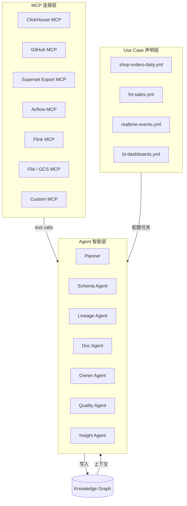
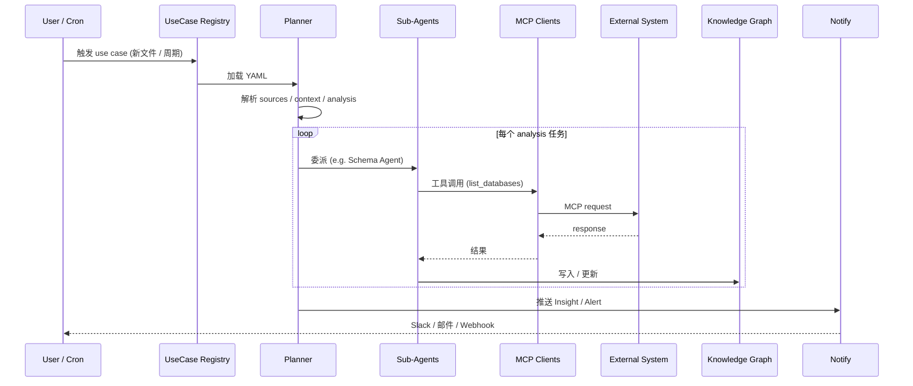
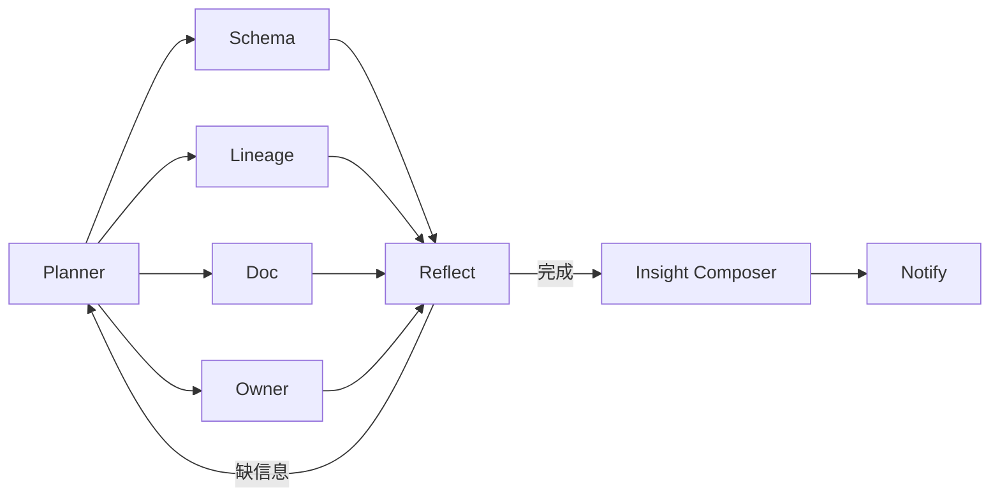
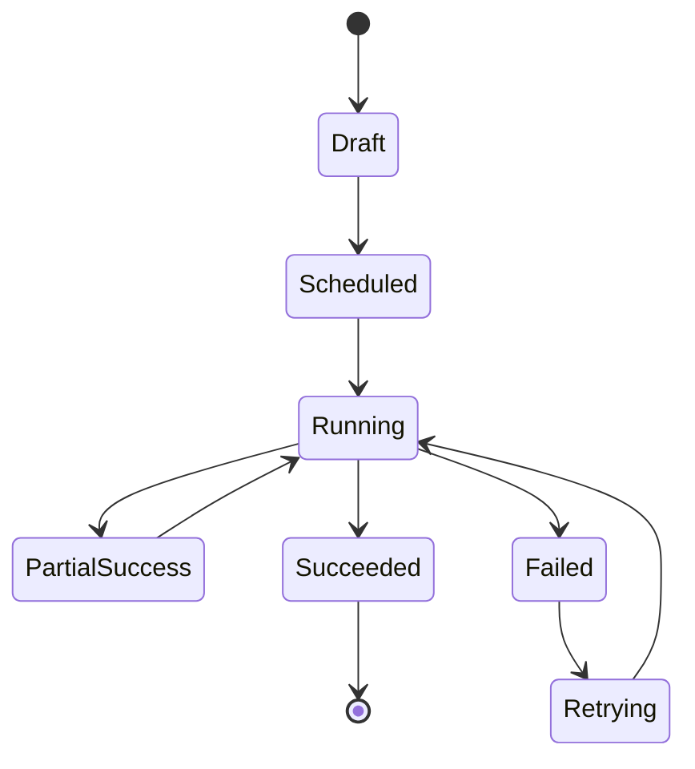
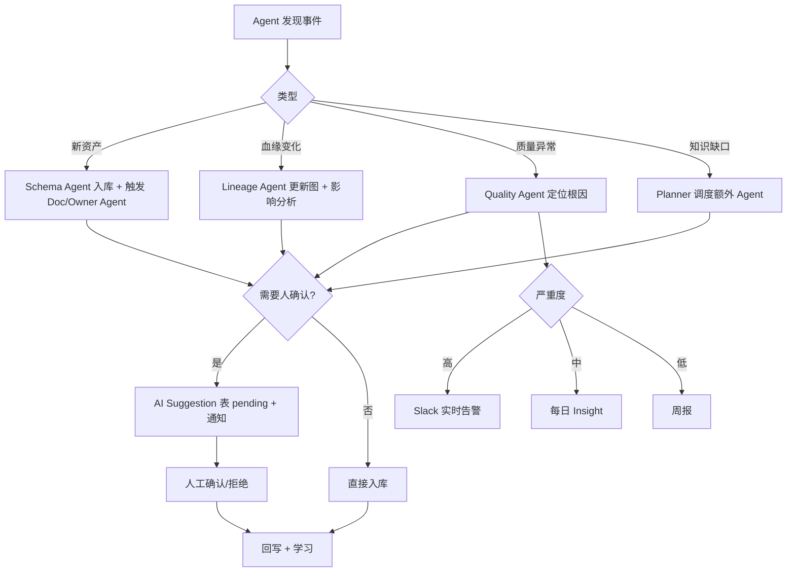
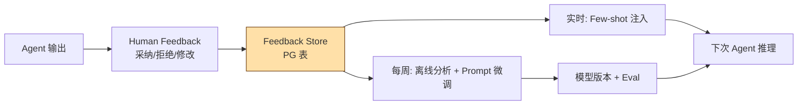

# IDM — MCP-First / 声明式 / Zero-Touch 架构

> **核心理念 (再升级)**
> IDM 不部署 Sidecar、不要求任何系统改造、不嵌入业务路径
> 全部通过 **MCP (Model Context Protocol)** 拉起外部系统的能力
> 每个 use case = 一份 YAML / JSON，描述「连接什么、读什么、怎么分析」
> Agent 全自动完成采集 → 理解 → 推理 → 决策 → 预警

---

## 目录

- [1. 重新定义 IDM 的形态](#1-重新定义-idm-的形态)
- [2. 与上一版设计的关键差异](#2-与上一版设计的关键差异)
- [3. 三大支柱：MCP / Use Case / Agent](#3-三大支柱mcp--use-case--agent)
- [4. 总体架构](#4-总体架构)
- [5. 数据源接入矩阵 (MCP 视角)](#5-数据源接入矩阵-mcp-视角)
- [6. Use Case 声明式建模](#6-use-case-声明式建模)
- [7. Agent 工具调用 (Function Calling) 设计](#7-agent-工具调用-function-calling-设计)
- [8. 知识图谱与状态管理](#8-知识图谱与状态管理)
- [9. 决策与预警](#9-决策与预警)
- [10. 持续学习与记忆](#10-持续学习与记忆)
- [11. 部署形态](#11-部署形态)
- [12. 与现有栈的关系](#12-与现有栈的关系)

---

## 1. 重新定义 IDM 的形态

### 1.1 三个「绝不」

| 绝不 | 含义 |
| --- | --- |
| **绝不改造现有系统** | ClickHouse / Airflow / Flink / Superset / GitHub 0 改动 |
| **绝不嵌入业务路径** | 没有 SDK 必须引入、没有 Agent 必须 co-locate |
| **绝不依赖 push 集成** | 业务系统无需主动推数据给 IDM；IDM 主动通过 MCP 拉 |

### 1.2 一个「全包」

> **IDM = 智能体 (Agents) + 协议 (MCP) + 声明 (Use Case) + 记忆 (Knowledge Graph)**

```mermaid
flowchart LR
    A[外部系统<br/>ClickHouse / GitHub / Superset / Airflow / Flink / ...] -->|MCP 协议<br/>(只读 + 工具调用)| B[IDM 平台]
    B -->|Use Case YAML| C[Agent 集群]
    C -->|拉取 / 解析 / 推理 / 写回 KG| D[知识图谱<br/>PostgreSQL + AGE + pgvector]
    C -->|Insight / 告警| E[Slack / 邮件 / Web]
    style A fill:#E0F7FA,stroke:#006064
    style B fill:#FFB454,stroke:#663300,color:#000
    style C fill:#7AB8FF,stroke:#003366,color:#000
```

### 1.3 一句话价值

> **业务团队只需要写一份 YAML 告诉 IDM「我有哪些资产、用什么代码、流程图怎么连」**
> IDM 通过 MCP 调通所有外部系统，让 Agent 自己跑完全部分析、生成所有元数据、发现所有问题。

---

## 2. 与上一版设计的关键差异

| 维度 | 旧设计 (Observe Gateway) | **新设计 (MCP-First)** |
| --- | --- | --- |
| 接入方式 | 自研 Sidecar / Hook / 旁路采集 | **复用 / 接入已有 MCP Server** |
| 业务侵入 | 低 (需配置旁路) | **零** (只读) |
| 元数据载体 | 自建采集器 | **Use Case YAML** 声明 |
| 协议 | 自研 gRPC | **MCP 标准化** |
| 决策 | 规则 + LLM | **Agent 工具调用 MCP** |
| 适用范围 | 自有数据栈 | **任何支持 MCP 的系统** |
| Superset 集成 | 需自研 API 适配 | **读 export 出的 dashboard JSON/YAML** |
| GitHub 集成 | git clone + 解析 | **GitHub MCP** (file/grep/PR) |
| ClickHouse 集成 | 旁路 system.query_log | **ClickHouse MCP** (SELECT / DESCRIBE) |

---

## 3. 三大支柱：MCP / Use Case / Agent



### 3.1 MCP (Model Context Protocol) — IDM 的「手和眼」

- 标准化协议 (Anthropic 开源，类似 LSP for AI)
- 每个 MCP Server 暴露 **Tools / Resources / Prompts** 三类能力
- IDM 内部 Agent 通过 **MCP Client** 调用它们
- 不存在 → IDM 退化为 **File MCP** (读本地 / GCS 导出文件)

### 3.2 Use Case YAML — IDM 的「契约」

每个 use case 描述：

```yaml
use_case: <name>
sources: <MCP 接入哪些系统>
context: <代码、流程图、文档>
analysis: <需要 Agent 完成的任务>
deliverables: <输出：资产 / 血缘 / 文档 / 告警>
```

详见 [use-case-spec.md](./use-case-spec.md)

### 3.3 Agent — IDM 的「大脑」

- 内置一组**通用 Agent**：Schema / Lineage / Doc / Owner / Quality / Insight
- 任意 Use Case 都通过**组合 Agent** 完成
- 所有 Agent 通过 MCP 工具调用外部系统
- 所有产出写入知识图谱 (PG + AGE + pgvector)

---

## 4. 总体架构

### 4.1 端到端架构图

```mermaid
flowchart TB
    subgraph External[外部世界 - Zero Touch]
        E1[(ClickHouse<br/>MCP Server)]
        E2[(GitHub<br/>MCP Server)]
        E3[(Superset<br/>Export JSON/YAML)]
        E4[(Airflow<br/>MCP Server)]
        E5[(Flink<br/>REST MCP)]
        E6[(dbt Manifest<br/>GCS / Repo)]
        E7[(业务 README<br/>设计文档)]
    end

    subgraph IDM[IDM 平台 - GKE]
        subgraph MCPL[MCP Client Layer]
            C1[CH MCP Client]
            C2[GH MCP Client]
            C3[File MCP Client]
            C4[AF MCP Client]
            C5[FL MCP Client]
        end
        subgraph UseCases[Use Case Registry]
            U1[.../shop-orders-daily.yml]
            U2[.../fct-sales.yml]
            U3[.../realtime-events.yml]
        end
        subgraph AgentCore[Agent Core]
            PL[Planner / LangGraph]
            SA[Schema Agent]
            LA[Lineage Agent]
            DA[Doc Agent]
            OA[Owner Agent]
            QA[Quality Agent]
            IA[Insight Agent]
        end
        subgraph Services[核心服务]
            AS[Asset Service<br/>FastAPI + GraphQL]
            KS[Knowledge Service<br/>PG + AGE + pgvector]
            QS[Query Service<br/>NL2SQL + Guard]
            NS[Notify Service<br/>Slack / 邮件 / Webhook]
            MS[MCP Server<br/>供外部 Agent 调用 IDM]
        end
        subgraph Web[Web Console]
            W1[React 18 + Vite<br/>ag-grid Community<br/>+ IDM UI Kit (自研)]
            W2[ChatBI / Insight 面板]
        end
    end

    External --> MCPL
    UseCases --> PL
    PL --> SA & LA & DA & OA & QA & IA
    SA & LA & DA & OA & QA & IA -->|MCP tool call| MCPL
    SA & LA & DA & OA & QA & IA --> KS
    AS --> KS
    QS --> KS
    NS --> KS
    KS --> W1
    KS --> W2
    KS --> MS
    style PL fill:#FFB454,stroke:#663300,color:#000
    style SA fill:#7AB8FF,stroke:#003366,color:#000
    style LA fill:#7AB8FF,stroke:#003366,color:#000
```

### 4.2 一个 Use Case 的运行时序



---

## 5. 数据源接入矩阵 (MCP 视角)

| 数据源 | MCP Server | 能力 (Tool) | IDM 用法 |
| --- | --- | --- | --- |
| **ClickHouse** | clickhouse-mcp (官方/社区) | `list_databases`, `describe_table`, `run_select`, `show_query_log` | 资产发现 / 画像采样 / Query 历史 |
| **GitHub** | @modelcontextprotocol/server-github | `search_code`, `get_file_contents`, `list_commits`, `get_pr`, `search_repos` | 读 dbt / Airflow DAG / 业务代码 / PR 关联 |
| **Superset** | 自建 (基于 export) | `load_dashboard`, `parse_chart_sql`, `extract_dataset_ref` | 解析 dashboard JSON → 抽取 dataset / SQL |
| **Airflow** | 自建 (REST wrap) | `list_dags`, `get_task`, `get_xcom` | DAG 拓扑 / Task 输入输出 / 血缘 |
| **Flink** | 自建 (REST wrap) | `list_jobs`, `get_job_plan` | 实时血缘 / 算子拓扑 |
| **dbt** | 文件 MCP | `read_manifest`, `read_catalog` | Model / Test / Source / Doc |
| **PostgreSQL** | postgres-mcp | `list_schemas`, `describe_table`, `run_select` | 元数据 / 业务表 (无需 ETL) |
| **GCS** | @modelcontextprotocol/server-gcs | `list_objects`, `read_object` | Superset export / 大文件 |
| **Notion / Lark Doc** | 官方 MCP | `search_pages`, `read_page` | 业务知识库 / 设计文档 |
| **Slack** | 官方 MCP | `list_channels`, `post_message` | 通知 + 反向摄取讨论 |
| **内部系统** | 自建 MCP Server | 自定义 tool | IDM 提供 MCP SDK |

> **重要原则**：IDM 优先使用**社区 / 官方 MCP**；缺失 → 写一个 200 行内的 MCP wrapper，不直接调系统 API。

### 5.1 ClickHouse MCP 适配示例

```python
# idm/mcp_clients/clickhouse.py
from mcp import ClientSession
import os

class ClickHouseMCP:
    def __init__(self):
        self.session = ClientSession(
            command="docker", args=["run", "-i", "--rm",
                "-e", f"CLICKHOUSE_HOST={os.environ['CH_HOST']}",
                "mcp/clickhouse"]
        )

    async def list_databases(self): ...
    async def describe_table(self, db: str, table: str): ...
    async def sample(self, db: str, table: str, limit: int = 20): ...
    async def run_select(self, sql: str, limit: int = 1000): ...
```

---

## 6. Use Case 声明式建模

> 完整规范见 [use-case-spec.md](./use-case-spec.md)

### 6.1 一个最小可用样例

```yaml
# use_cases/shop-orders-daily.yml
id: shop-orders-daily
version: 1
description: 电商订单核心链：上游 Kafka → ETL → ClickHouse 宽表 → Superset Dashboard

sources:
  - id: ch-prod
    type: clickhouse
    mcp: clickhouse
    config: { host: ch.example.com, database: shop }

  - id: gh-warehouse
    type: github
    mcp: github
    config: { repo: company/dwh, branch: main }

  - id: superset-export
    type: superset_export
    mcp: file
    config: { path: gs://superset-exports/2025-01/ }

context:
  flow_diagram: |
    Kafka(orders) → Airflow(etl_orders) → ClickHouse(orders_daily) → Superset(Dashboard GMV)
  code_refs:
    - path: dags/etl_orders.py
      purpose: Airflow DAG 定义
    - path: models/orders_daily.sql
      purpose: dbt Model, 包含 SQL 逻辑
    - path: docs/business/orders.md
      purpose: 业务术语表

analysis:
  - task: discover_assets
    agent: schema
    params: { include_views: true, profile_sample_size: 100 }
  - task: extract_lineage
    agent: lineage
    params: { from: [dbt_manifest, airflow_dag, superset_charts] }
  - task: generate_docs
    agent: doc
    params: { tone: business, language: zh, min_confidence: 0.7 }
  - task: suggest_owners
    agent: owner
    params: { signals: [git_blame, dbt_meta, airflow_owner] }
  - task: detect_anomalies
    agent: quality
    schedule: "0 9 * * *"
    params: { baseline_days: 30, sensitivity: medium }

deliverables:
  knowledge_graph: true
  insights:
    - channel: slack
      target: "#data-stewards"
      trigger: anomaly_detected
  api_expose: true
```

> **YAML 一次声明，IDM 全程搞定**：从 ClickHouse 拉 schema → 读 GitHub 代码 → 解析 Superset export → 跨源拼装血缘 → 写文档 → 推 Slack。

---

## 7. Agent 工具调用 (Function Calling) 设计

### 7.1 Agent 看到的工具集合

```python
# Schema Agent 可用工具
TOOLS_SCHEMA = [
    mcp_clickhouse.list_databases,
    mcp_clickhouse.describe_table,
    mcp_clickhouse.sample,
    mcp_github.search_code,
    mcp_github.get_file_contents,
    mcp_file.read_object,
    idm.kg.query_graph,
    idm.kg.upsert_entity,
    idm.llm.embed,
]

# Lineage Agent
TOOLS_LINEAGE = [
    mcp_github.search_code,
    mcp_file.read_object,
    mcp_clickhouse.run_select,        # 验证 SQL 假设
    idm.kg.query_graph,
    idm.kg.add_relationship,
    idm.llm.reason,                   # 推断隐式血缘
]
```

### 7.2 Agent Prompt 模板 (节选)

```text
[角色]
你是 IDM 的 Schema Agent。你的任务是基于 Use Case "{{use_case.id}}"，通过 MCP 工具
发现并建模所有相关资产。

[可用工具]
{{tools_list}}

[上下文]
- 数据源: {{use_case.sources}}
- 已知资产: {{kg.assets_matching(use_case)}}
- 流程图: {{use_case.context.flow_diagram}}

[输出]
请按 JSON Schema 输出 assets[]，每项包含:
  fqn, type, description (草稿), columns[], tags[], owner_suggestion
```

### 7.3 跨 Agent 协作 (LangGraph)



---

## 8. 知识图谱与状态管理

### 8.1 数据落点

| 数据 | 存储 | 来源 Agent |
| --- | --- | --- |
| 资产 / 标签 / Owner | PG 关系表 | Schema / Doc / Owner Agent |
| 关系 (血缘 / 引用) | PG + Apache AGE | Lineage Agent |
| Embedding / 文档 | PG + pgvector | Doc Agent |
| 任务状态 / 决策 / 告警 | PG + Redis | Planner / Notify |
| 大文件 (Superset export) | GCS | File MCP |
| 审计 / LLM Trace | PG (append-only) | 全员 |

### 8.2 任务状态机



---

## 9. 决策与预警

### 9.1 决策树



### 9.2 典型决策 (Agent 自动)

| 场景 | Agent 决策 | 是否需要人 |
| --- | --- | --- |
| 出现新表 | 自动入库 + 生成 Doc 草稿 | Doc 草稿需人确认 |
| Owner 缺失 | 推断并建议 | 需人确认 |
| PII 列出现 | 自动打 PII Tag + 通知 | 自动 + 告警 |
| 数据量突降 | 推断原因 (上游延迟 / ETL 失败) | 告警 + 建议方案 |
| 血缘断裂 | 推断上下游 + 建议修复 | 需人确认 |
| Superset Dashboard 引用未登记表 | 提示补登 | 自动补登 + 通知 |

---

## 10. 持续学习与记忆



- **短期记忆**：Redis 存当前 Use Case 上下文
- **长期记忆**：知识图谱 (KG) + Feedback Store
- **模型记忆**：每周用 Feedback 微调 Prompt / Fine-tune
- **可解释性**：所有 Agent 决策 → `decision_audit` 表 (who/what/why/evidence)

---

## 11. 部署形态

> IDM 全部在 GKE，外部系统 0 改动

```mermaid
flowchart LR
    subgraph GKE
        IDM[IDM 核心<br/>FastAPI + LangGraph]
        MC[IDM MCP Server<br/>对外暴露]
    end
    subgraph 外部系统 (Zero Touch)
        CH[ClickHouse MCP]
        GH[GitHub MCP]
        SP[Superset<br/>Export JSON]
        AF[Airflow MCP]
    end
    IDM -->|MCP 调| CH
    IDM -->|MCP 调| GH
    IDM -->|File MCP 读| SP
    IDM -->|MCP 调| AF
    MC -->|被外部 Agent 调| EX[Claude / Cursor / 业务 Bot]
```

- **GKE** → 跑 IDM 全部服务 (MCP Clients, Agent Core, Knowledge Service, Web)
- **GCE** → ClickHouse (与 IDM 隔离)
- **MCP Server** → 可由 IDM 自身提供 (供 Claude/Cursor 反向使用 IDM 的元数据查询能力)

---

## 12. 与现有栈的关系

| 现有栈 | 角色 | 改动 |
| --- | --- | --- |
| **ClickHouse (GCE)** | 数据源 (MCP Server) | **0 改动**（起一个 MCP wrapper） |
| **CloudSQL PG** | IDM 自己的存储 (KG) | 新建 schema |
| **GCS** | 存 Superset export / dbt manifest / 样本 | 新建 bucket |
| **Airflow** | 数据源 (MCP Server) | **0 改动**（起一个 REST MCP wrapper） |
| **Flink** | 数据源 (MCP Server) | **0 改动**（起一个 REST MCP wrapper） |
| **Superset** | 数据源 (export 解析) | **0 改动**（用户从 UI 导出 JSON 即可） |
| **GitHub** | 数据源 (官方 MCP) | **0 改动** |
| **DeepSeek V4 / GPT-5** | LLM 推理 (LiteLLM 网关统一; 仅 2 个生产模型) | 新建 |

> IDM 真正意义上是 **「外挂在企业数据栈旁边的智能层」**。

---

## 附录 A. 完整 Use Case 目录 (示例)

```text
idm/use_cases/
├── shop-orders-daily.yml          # 订单宽表
├── fct-sales.yml                  # 销售事实表
├── realtime-events.yml            # 实时事件流
├── bi-dashboards.yml              # BI Dashboard 盘点
├── ml-feature-store.yml           # ML 特征平台
└── _templates/
    ├── clickhouse-only.yml
    ├── github-only.yml
    └── superset-only.yml
```

## 附录 B. 决策记录 (Roadmap)

| 决策 | 选择 | 理由 |
| --- | --- | --- |
| 主协议 | **MCP** | 标准化 / 生态 / 零侵入 |
| 主配置 | **YAML** | 人可读 + LLM 可读 + GitOps 友好 |
| Agent 框架 | **LangGraph + LiteLLM** | 成熟 + 可观测 |
| 知识存储 | **PG + AGE + pgvector** | 单栈统一 |
| LLM | **DeepSeek V4 主力 + GPT-5 备选** (经 LiteLLM; 仅 2 个生产模型; PII 一律先 mask 再送) | 质量 / 成本 三角平衡 |
| 推送 | **Slack 优先 + Lark 后续** | 国内使用率高 |

---

> 📌 **配套阅读**：[use-case-spec.md](./use-case-spec.md) · [walkthrough.md](./walkthrough.md) · [ai-driven-design.md](./ai-driven-design.md) · [deployment.md](./deployment.md)
