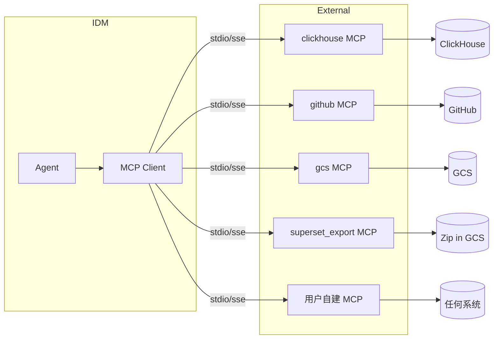

# IDM — MCP 适配 & 自定义 MCP Server 指南

> IDM 是一个 MCP Client, 通过 MCP 协议 "读" 外部系统
> 内部封装常用 MCP Server (ClickHouse / GitHub / GCS / Superset Export / Airflow)
> 也支持用户自建 MCP Server, **0 改动接入新系统**

---

## 目录

- [1. MCP 在 IDM 中的角色](#1-mcp-在-idm-中的角色)
- [2. 内置 MCP Server 清单](#2-内置-mcp-server-清单)
- [3. 部署模式](#3-部署模式)
- [4. IDM 内部 MCP Client](#4-idm-内部-mcp-client)
- [5. Use Case YAML 中如何引用](#5-use-case-yaml-中如何引用)
- [6. 官方 MCP Server 速查 (现成用)](#6-官方-mcp-server-速查-现成用)
- [7. 自建 MCP Server 教程 (以「ClickHouse」为例)](#7-自建-mcp-server-教程-以-clickhouse为例)
- [8. 进阶：自建 MCP Server (以「Lark/飞书」为例)](#8-进阶自建-mcp-server-以lark飞书为例)
- [9. 鉴权与安全](#9-鉴权与安全)
- [10. 健康检查 / 限流 / 重试](#10-健康检查--限流--重试)
- [11. 自定义 MCP Server 注册到 IDM](#11-自定义-mcp-server-注册到-idm)
- [12. 测试与 Mock](#12-测试与-mock)
- [13. 常见问题](#13-常见问题)

---

## 1. MCP 在 IDM 中的角色



**核心原则**:
- IDM **永远不直接连业务系统** (避免 SDK / Agent 装到业务端)
- 所有数据源 / 触发器 / 输出渠道, 都通过 MCP Server 抽象
- 用户用 YAML 引用 MCP, **不写代码**

---

## 2. 内置 MCP Server 清单

| MCP Server | 工具 (Tools) | 资源 (Resources) | 部署 |
| --- | --- | --- | --- |
| **clickhouse** | `list_databases`, `show_tables`, `describe_table`, `query`, `sample`, `explain`, `get_query_log_top_users` | - | GCE sidecar |
| **github** | `get_file_contents`, `search_code`, `list_tree`, `get_commits`, `get_pr_diff`, `get_blame` | - | IDM pod |
| **gcs** | `list_objects`, `read_object`, `stat_object` | - | IDM pod |
| **superset_export** | `list_exports`, `read_export`, `parse_dashboards`, `parse_charts`, `parse_datasets` | - | IDM pod |
| **airflow** (via GitHub) | `parse_dag`, `get_dag_runs`, `get_task_instances` | - | 复用 github |
| **lark** (可选) | `send_message`, `get_bitable_rows` | - | IDM pod |
| **slack** (可选) | `send_message`, `get_users` | - | IDM pod |
| **confluence** (可选) | `search_pages`, `get_page`, `create_page` | - | IDM pod |
| **jira** (可选) | `create_issue`, `search_issues` | - | IDM pod |
| **postgres_meta** | `run_query` (只读), `list_databases`, `list_schemas`, `list_tables` | - | IDM pod |

---

## 3. 部署模式

### 3.1 Sidecar (GCE, 贴近 ClickHouse)

```yaml
# ClickHouse 机器上 (或 GCE sidecar 节点)
docker run -d \
  --name mcp-clickhouse \
  -p 7001:7001 \
  -e CLICKHOUSE_HOST=127.0.0.1 \
  -e CLICKHOUSE_PORT=9000 \
  -e CLICKHOUSE_USER=readonly \
  -e CLICKHOUSE_PASSWORD=*** \
  -e MCP_TRANSPORT=sse \
  ghcr.io/idm/mcp-clickhouse:v1
```

### 3.2 IDM In-Pod (无状态, 走 GH / GCS)

```yaml
# idm-deployment.yaml
spec:
  containers:
    - name: idm-orchestrator
      image: idm/orchestrator:v1
    - name: mcp-github
      image: ghcr.io/idm/mcp-github:v1
    - name: mcp-gcs
      image: ghcr.io/idm/mcp-gcs:v1
      env:
        - { name: GCS_SA, valueFrom: { secretKeyRef: { name: gcs, key: sa.json } } }
```

### 3.3 Remote SSE (跨网络)

```yaml
# MCP client config
{
  "mcpServers": {
    "clickhouse-prod": {
      "type": "sse",
      "url":  "https://mcp-clickhouse-prod.example.com/sse",
      "headers": { "Authorization": "Bearer ${MCP_TOKEN}" }
    }
  }
}
```

---

## 4. IDM 内部 MCP Client

```python
# idm/mcp/client.py
from mcp import ClientSession, StdioServerParameters
from mcp.client.stdio import stdio_client
from mcp.client.sse  import sse_client
import os, asyncio, json

class MCPClient:
    def __init__(self, server_name: str, config: dict):
        self.name = server_name
        self.config = config

    async def _open(self):
        if self.config["type"] == "stdio":
            params = StdioServerParameters(
                command=self.config["command"],
                args=self.config.get("args", []),
                env={**os.environ, **(self.config.get("env") or {})}
            )
            self._cm = stdio_client(params)
        else:
            self._cm = sse_client(self.config["url"], headers=self.config.get("headers", {}))
        read, write = await self._cm.__aenter__()
        self.session = await ClientSession(read, write).__aenter__()
        await self.session.initialize()

    async def list_tools(self):
        return (await self.session.list_tools()).tools

    async def call(self, tool: str, args: dict):
        return await self.session.call_tool(tool, arguments=args)

    async def close(self):
        await self._cm.__aexit__(None, None, None)

# 全局注册
REGISTRY: dict[str, MCPClient] = {}
async def get_mcp(name: str):
    if name not in REGISTRY:
        cfg = load_mcp_config(name)
        REGISTRY[name] = MCPClient(name, cfg)
        await REGISTRY[name]._open()
    return REGISTRY[name]
```

```python
# Skill 内部调用
mcp = await get_mcp("clickhouse")
result = await mcp.call("show_tables", {"database": "shop"})
```

---

## 5. Use Case YAML 中如何引用

```yaml
sources:
  - id: ch-prod
    type: clickhouse
    mcp: clickhouse            # ← MCP server 名称
    config: { host: ..., database: shop }

  - id: gh-warehouse
    type: github
    mcp: github
    config: { repo: company/dwh, branch: main }

  - id: sp-export
    type: superset_export
    mcp: gcs                    # ← 底层走 gcs, 由 superset_export skill 解析
    config: { path: gs://superset-exports/2025-01/ }
```

> `mcp` 字段是 MCP server 名称 (在 MCP_REGISTRY 注册), **业务无感**。

---

## 6. 官方 MCP Server 速查 (现成用)

| 系统 | 推荐 Server | 备注 |
| --- | --- | --- |
| ClickHouse | `mcp-clickhouse` (ClickHouse 官方) 或自研 | 官方支持 limited, 建议自研更稳 |
| GitHub | `ghcr.io/github/github-mcp-server` | 官方 |
| Google Cloud (GCS / BigQuery) | `ghcr.io/google-cloud/mcp-storage` | 社区/官方都有 |
| Postgres | `mcp-postgres` / `@modelcontextprotocol/server-postgres` |  |
| S3 | `@modelcontextprotocol/server-aws-kb-retrieval-mcp-server` |  |
| Superset | 自研 (Superset 无官方 MCP) | 推荐自研 |
| Airflow | `mcp-apache-airflow` | 社区 |
| BigQuery | `@ergut/mcp-bigquery-server` | 社区 |
| Slack | `@modelcontextprotocol/server-slack` |  |
| Confluence / Jira | `@atlassian-labs/mcp-server-atlassian` | 官方 |
| Lark / 飞书 | `lark-mcp` | 社区 |
| Figma / Linear / Notion | 均有官方/社区 |  |

> **优先用官方 > 社区 > 自研**。

---

## 7. 自建 MCP Server 教程 (以「ClickHouse」为例)

### 7.1 项目结构

```text
mcp-clickhouse/
├── pyproject.toml
├── README.md
├── src/mcp_clickhouse/
│   ├── __init__.py
│   ├── server.py         # MCP server 入口
│   ├── tools.py          # 工具实现
│   ├── config.py
│   └── client.py         # ClickHouse HTTP client
└── tests/
```

### 7.2 依赖

```toml
# pyproject.toml
[project]
name = "mcp-clickhouse"
version = "0.1.0"
dependencies = [
  "mcp>=1.0",
  "clickhouse-connect",
  "pydantic>=2",
  "tenacity",
]
```

### 7.3 配置

```python
# src/mcp_clickhouse/config.py
from pydantic import BaseModel

class ClickHouseConfig(BaseModel):
    host: str
    port: int = 8443
    database: str = "default"
    user: str
    password: str
    secure: bool = True
    connect_timeout: int = 10
    send_receive_timeout: int = 30
    max_rows: int = 50_000  # 防止全表扫描
```

### 7.4 ClickHouse Client

```python
# src/mcp_clickhouse/client.py
import clickhouse_connect
from .config import ClickHouseConfig

class CHClient:
    def __init__(self, cfg: ClickHouseConfig):
        self.cfg = cfg
        self.cli = clickhouse_connect.get_client(
            host=cfg.host, port=cfg.port,
            user=cfg.user, password=cfg.password,
            secure=cfg.secure, database=cfg.database,
            connect_timeout=cfg.connect_timeout,
            send_receive_timeout=cfg.send_receive_timeout,
        )

    def list_databases(self) -> list[str]:
        rows = self.cli.query("SHOW DATABASES").result_rows
        return [r[0] for r in rows]

    def show_tables(self, database: str) -> list[str]:
        rows = self.cli.query(f"SHOW TABLES FROM `{database}`").result_rows
        return [r[0] for r in rows]

    def describe_table(self, database: str, table: str) -> list[dict]:
        rows = self.cli.query(f"DESCRIBE TABLE `{database}`.`{table}`").result_rows
        return [{"name": r[0], "type": r[1], "default": r[2], "comment": r[3]}
                for r in rows]

    def sample(self, database: str, table: str, limit: int = 50) -> list[dict]:
        rows = self.cli.query(
            f"SELECT * FROM `{database}`.`{table}` LIMIT {limit}"
        ).result_rows
        return [dict(zip(self.describe_table(database, table)[0].keys(), r))
                for r in rows]
```

### 7.5 Tool 实现

```python
# src/mcp_clickhouse/tools.py
from mcp.types import Tool
from .client import CHClient

LIST_DATABASES = Tool(
    name="list_databases",
    description="List all ClickHouse databases visible to the configured user.",
    inputSchema={
        "type": "object",
        "properties": {},
        "required": []
    }
)

SHOW_TABLES = Tool(
    name="show_tables",
    description="List all tables in a ClickHouse database.",
    inputSchema={
        "type": "object",
        "properties": { "database": { "type": "string" } },
        "required": ["database"]
    }
)

# ... 略
```

### 7.6 MCP Server 入口

```python
# src/mcp_clickhouse/server.py
import asyncio, json, os
from mcp.server import Server
from mcp.server.stdio import stdio_server
from mcp.types import Tool, TextContent
from .config import ClickHouseConfig
from .client import CHClient

app = Server("clickhouse")
TOOLS = {}  # name -> {description, schema, handler}

def tool(name, description, schema):
    def deco(fn):
        TOOLS[name] = {"description": description, "schema": schema, "fn": fn}
        return fn
    return deco

@tool("list_databases", "List all databases", {"type": "object", "properties": {}})
def list_databases(args, ch):
    return ch.list_databases()

@tool("show_tables", "List tables in database",
      {"type": "object", "properties": {"database": {"type": "string"}}, "required": ["database"]})
def show_tables(args, ch):
    return ch.show_tables(args["database"])

@tool("describe_table", "Show table schema",
      {"type": "object",
       "properties": {"database": {"type": "string"}, "table": {"type": "string"}},
       "required": ["database", "table"]})
def describe_table(args, ch):
    return ch.describe_table(args["database"], args["table"])

@tool("sample", "Sample N rows",
      {"type": "object",
       "properties": {"database": {"type": "string"}, "table": {"type": "string"},
                      "limit": {"type": "integer", "default": 50}},
       "required": ["database", "table"]})
def sample(args, ch):
    return ch.sample(args["database"], args["table"], args.get("limit", 50))

@tool("query", "Run a read-only query (LIMIT forced)",
      {"type": "object",
       "properties": {"sql": {"type": "string"}, "limit": {"type": "integer", "default": 1000}},
       "required": ["sql"]})
def query(args, ch):
    sql = args["sql"].rstrip(";\n ")
    if "limit" not in sql.lower():
        sql += f" LIMIT {args.get('limit', 1000)}"
    if not sql.lstrip().lower().startswith(("select", "with", "show", "describe", "explain")):
        raise ValueError("Only read-only queries are allowed.")
    return ch.cli.query(sql).result_rows

@app.list_tools()
async def list_tools() -> list[Tool]:
    return [
        Tool(name=n, description=d["description"], inputSchema=d["schema"])
        for n, d in TOOLS.items()
    ]

@app.call_tool()
async def call_tool(name: str, arguments: dict):
    ch = CHClient(ClickHouseConfig(**json.loads(os.environ["CH_CONFIG"])))
    try:
        result = TOOLS[name]["fn"](arguments, ch)
        return [TextContent(type="text", text=json.dumps(result, default=str))]
    finally:
        ch.cli.close()

async def main():
    async with stdio_server() as (r, w):
        await app.run(r, w, app.create_initialization_options())

if __name__ == "__main__":
    asyncio.run(main())
```

### 7.7 启动 & 测试

```bash
# 启动 (stdio)
CH_CONFIG='{"host":"ch.example.com","user":"ro","password":"***"}' \
  python -m mcp_clickhouse.server

# 在 IDM 中配置
# mcp_config.yaml
mcpServers:
  clickhouse:
    type: stdio
    command: python
    args: ["-m", "mcp_clickhouse.server"]
    env:
      CH_CONFIG: '{"host":"ch.example.com","user":"ro","password":"***"}'
```

### 7.8 健康检查

```python
@app.call_tool()
async def call_tool(name, arguments):
    if name == "__ping__":
        return [TextContent(type="text", text="pong")]
    ...
```

---

## 8. 进阶：自建 MCP Server (以「Lark/飞书」为例)

### 8.1 工具

```python
@tool("send_message", "Send a Lark message",
      {"type":"object",
       "properties":{
         "receive_id":{"type":"string"},
         "msg_type":{"type":"string","enum":["text","interactive","post"]},
         "content":{"type":"object"}
       }, "required":["receive_id","msg_type","content"]})
def send_message(args, lark):
    return lark.im.v1.message.create(receive_id=args["receive_id"],
                                     msg_type=args["msg_type"],
                                     content=json.dumps(args["content"]))

@tool("get_bitable_records", "Read bitable rows",
      {"type":"object",
       "properties":{"app_token":{"type":"string"},"table_id":{"type":"string"},
                     "view_id":{"type":"string"},"limit":{"type":"integer"}},
       "required":["app_token","table_id"]})
def get_bitable_records(args, lark):
    return lark.bitable.list_records(args["app_token"], args["table_id"],
                                     args.get("view_id"), args.get("limit", 50))
```

### 8.2 Resources (知识库)

```python
@app.list_resources()
async def list_resources():
    return [Resource(
        uri="lark://docs/business-glossary",
        name="Business Glossary (Lark Doc)",
        mimeType="text/markdown"
    )]

@app.read_resource()
async def read_resource(uri: str) -> list[TextContent]:
    if str(uri) == "lark://docs/business-glossary":
        doc = lark.docs.v1.get("MOKE_dAbc123")
        return [TextContent(type="text", text=doc.content)]
```

> Resources 可让 Agent 在不显式调用 tool 的情况下"读到"业务术语表。

---

## 9. 鉴权与安全

| 模式 | 适用 | 配置 |
| --- | --- | --- |
| **只读账号 + IP allowlist** | ClickHouse / Postgres | 推荐 |
| **OAuth / Token** | GitHub / Slack / Lark | 用 SA Token, rotate 90d |
| **Service Account (JSON)** | GCP GCS / BigQuery | 通过 K8s Secret 注入 |
| **mTLS** | 跨集群 (ClickHouse sidecar) | 自建 CA |
| **Pre-shared key (SSE)** | Remote MCP | header `Authorization: Bearer ...` |

**K8s Secret 注入**:

```yaml
env:
  - { name: CH_CONFIG,
      valueFrom: { secretKeyRef: { name: ch-config, key: json } } }
```

**Least Privilege**:
- ClickHouse 用户只给 `SHOW`, `DESCRIBE`, `SELECT ... LIMIT`
- GitHub PAT 只给 `repo:read`
- GCS SA 只给 `roles/storage.objectViewer` (只读)

---

## 10. 健康检查 / 限流 / 重试

### 10.1 健康检查

```python
# 在 MCP server 中实现
@tool("__ping__", "Health check", {"type":"object","properties":{}})
def ping(args, ch): return {"status": "ok"}
```

> IDM MCP Client 启动时 ping 一次, 失败则不挂载该 server。

### 10.2 限流

```python
# mcp-clickhouse
class RateLimiter:
    def __init__(self, qps: int = 5):
        self.sem = asyncio.Semaphore(qps)
    async def __aenter__(self): await self.sem.acquire()
    async def __aexit__(self, *a): self.sem.release()
```

### 10.3 重试 (IDM Client 侧)

```python
# idm/mcp/client.py
from tenacity import retry, stop_after_attempt, wait_exponential

@retry(stop=stop_after_attempt(3),
       wait=wait_exponential(multiplier=1, min=1, max=10),
       retry=retry_if_exception_type((TimeoutError, ConnectionError)))
async def call(self, tool, args):
    return await self.session.call_tool(tool, arguments=args)
```

---

## 11. 自定义 MCP Server 注册到 IDM

### 11.1 配置文件

```yaml
# config/mcp_servers.yaml
mcpServers:
  clickhouse:
    type: stdio
    command: python
    args: ["-m", "mcp_clickhouse.server"]
    env: { CH_CONFIG: "${CH_CONFIG}" }

  github:
    type: stdio
    command: npx
    args: ["-y", "@modelcontextprotocol/server-github"]
    env: { GITHUB_TOKEN: "${GH_TOKEN}" }

  gcs:
    type: stdio
    command: /usr/local/bin/mcp-gcs
    env: { GOOGLE_APPLICATION_CREDENTIALS: "/secrets/sa.json" }

  clickhouse-prod-remote:
    type: sse
    url:  https://mcp-clickhouse-prod.example.com/sse
    headers: { Authorization: "Bearer ${MCP_TOKEN}" }
```

### 11.2 热加载 (修改不需重启)

```python
# idm/mcp/registry.py
WATCHERS = []

async def watch_config():
    async for event in watch_file("config/mcp_servers.yaml"):
        new_cfg = yaml.safe_load(event.content)
        await reload_registry(new_cfg)
```

### 11.3 在 Use Case 中引用

```yaml
sources:
  - { id: ch-prod, mcp: clickhouse,        config: { ... } }   # 内部 stdio
  - { id: ch-prod-r, mcp: clickhouse-prod-remote, config: { ... } }  # 远程 SSE
```

---

## 12. 测试与 Mock

### 12.1 In-Memory MCP Server (测试用)

```python
# tests/mcp_fake.py
class FakeMCP:
    def __init__(self):
        self.tools = {
            "show_tables": lambda args: ["orders_daily", "users"],
            "describe_table": lambda args: [{"name":"id","type":"String"}]
        }
    async def call(self, tool, args): return self.tools[tool](args)
```

### 12.2 Contract Test

```python
async def test_clickhouse_mcp_contract():
    server = start_mcp("mcp-clickhouse")
    client = MCPClient.from_server(server)
    descs = await client.call("describe_table", {"database":"shop","table":"orders_daily"})
    assert all("name" in d for d in descs)
    await client.close(); await server.stop()
```

### 12.3 Skill 内 Mock

```python
# 在 Skill 测试中替换 MCP
with mock.patch("idm.mcp.registry.get_mcp", return_value=FakeMCP()):
    output = await runner.run(Skill.from_yaml("discover_clickhouse_assets.yml"))
```

---

## 13. 常见问题

| Q | A |
| --- | --- |
| **业务系统不在白名单** | 用户自建 MCP Server, 5 行工具代码, IDM 注册即可 |
| **MCP Server 挂掉** | IDM 自动重试 + 该 use case 任务降级, 不影响其他 use case |
| **跨网络** | 用 Remote SSE 模式, IDM 与 MCP 之间 HTTP/SSE |
| **大表 `SELECT *` 太慢** | MCP Server 强制 LIMIT, IDM 默认 50 |
| **权限过大** | MCP Server 内做白名单 (只 SELECT / 只读) |
| **MCP Server 性能** | 部署 sidecar / 缓存常用工具结果 (TTL 60s) |
| **没有 MCP 的老系统** | 用 `file` MCP + 导出文件, 或 `airflow` MCP 通过 GH 间接读 |

---

## 附录 A. MCP Server 启动矩阵 (一键脚本)

```bash
# 启动 clickhouse MCP (内部 stdio)
pipx run mcp-clickhouse &
# 启动 github MCP (npx)
GITHUB_TOKEN=*** npx -y @modelcontextprotocol/server-github &
# 启动 gcs MCP (binary)
/usr/local/bin/mcp-gcs --sa /secrets/sa.json &

# IDM 启动
idm-orchestrator --mcp-config config/mcp_servers.yaml
```

## 附录 B. MCP Server 性能基线

| Server | 启动 | 内存 | 冷启延迟 | 1000 call/s |
| --- | --- | --- | --- | --- |
| clickhouse (stdio) | 1s | 80 MB | 0.5s | ✅ |
| github (stdio) | 2s | 120 MB | 0.8s | ✅ (API 限速) |
| gcs (stdio) | 1s | 60 MB | 0.4s | ✅ |
| superset_export (stdio) | 1s | 50 MB | 0.2s | ✅ |
| clickhouse (sse) | 1s | 80 MB | 1.0s (含 TCP) | ✅ |

---

> 📌 **配套阅读**：[mcp-first-architecture.md](./mcp-first-architecture.md) · [walkthrough.md](./walkthrough.md) · [skills-design.md](./skills-design.md) · [use-case-spec.md](./use-case-spec.md)
