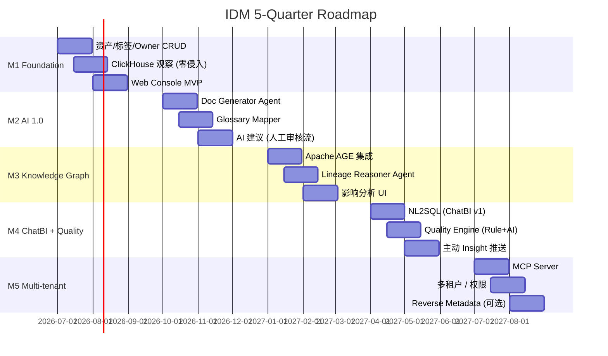
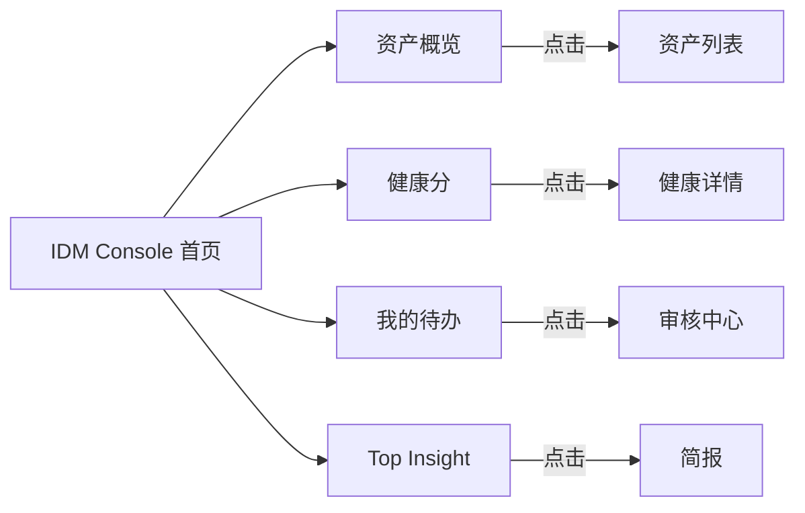

# IDM — 迭代路线图与里程碑

> 从 0 到 1，5 个季度交付一个**生产可用**的 AI 驱动数据管理平台
> 节奏：**季度 1 个大版本**，**月度小迭代**

---

## 目录

- [1. 总体路线](#1-总体路线)
- [2. 季度里程碑](#2-季度里程碑)
- [3. 详细 Sprint 计划 (M1)](#3-详细-sprint-计划-m1)
- [4. 团队建议](#4-团队建议)
- [5. 风险与缓解](#5-风险与缓解)
- [6. 度量指标 (北极星)](#6-度量指标-北极星)

---

## 1. 总体路线

### 1.1 北极星指标

> **数据团队每周花在「找数据 / 理解数据 / 治理数据」的时间** 下降 50%

| 阶段 | 关键指标 |
| --- | --- |
| M1 | 资产接入数、文档覆盖率、Owner 覆盖率 |
| M2 | AI 建议采纳率、Description 自动完成率 |
| M3 | 血缘完整度、血缘查询次数 |
| M4 | ChatBI 准确率、问题平均解决时间、异常发现 MTTR |
| M5 | 多团队自助使用率、Agent 调用次数 |

---

## 2. 季度里程碑

### 2.1 M1 (Q3 2026) — **Foundation**

> 目标：**让数据资产进得来、找得到、看得懂**

| 能力 | 交付 |
| --- | --- |
| 服务接入 | ClickHouse / PG / Airflow 三类 |
| 资产模型 | Table / Column / Tag / Owner / Glossary |
| 零侵入观察 | CH `system.query_log` 采集；Airflow DAG 拉取 |
| 搜索 | 关键词 + 过滤 (PG `tsvector`) |
| Web Console | 资产详情、Glossary、Owner、Tag |

**核心指标**：
- 接入资产 ≥ 200 张表
- 文档覆盖率 ≥ 30%
- Owner 覆盖率 ≥ 50%

### 2.2 M2 (Q4 2026) — **AI 1.0**

> 目标：**让 LLM 开始干正事：写文档、配术语、建议 Owner**

| 能力 | 交付 |
| --- | --- |
| LLM 基础设施 | LangGraph + LiteLLM + Vertex AI |
| Doc Generator | 自动化生成 + 人工审核流 |
| Glossary Mapper | 列名 → 业务术语 |
| Owner Recommender | 综合信号推断 |
| AI 建议中心 | Web UI 待审 → 一键采纳/拒绝 |

**核心指标**：
- 文档覆盖率 ≥ 70%
- AI 建议采纳率 ≥ 40%
- LLM P95 < 4s

### 2.3 M3 (Q1 2027) — **Knowledge Graph**

> 目标：**让 IDM 真正理解「数据流动」**

| 能力 | 交付 |
| --- | --- |
| Apache AGE | 部署 + 同步管道 |
| 血缘采集 | SQL Parser + Airflow + dbt |
| Lineage Reasoner | LLM 推断隐式血缘 |
| 影响分析 | 上游/下游可视化 (3 层) |
| 变更分析 | 评估 SQL 修改的影响面 |

**核心指标**：
- 血缘覆盖率 ≥ 60%
- 影响分析查询 P95 < 1s

### 2.4 M4 (Q2 2027) — **ChatBI + Quality**

> 目标：**人人能问数据，事事能预警**

| 能力 | 交付 |
| --- | --- |
| NL2SQL Agent | 关键词 → SQL (强 guard) |
| ChatBI UI | 自然语言查询 + 图表 |
| 质量引擎 | 规则 + AI 推断基线 |
| Profiler | 自动采样 |
| Insight Composer | 每日简报 |

**核心指标**：
- ChatBI 准确率 ≥ 75% (Top-1)
- 异常告警 Precision ≥ 60%
- 每日 Insight 打开率 ≥ 50%

### 2.5 M5 (Q3 2027) — **Multi-tenant + AI Native**

> 目标：**多团队使用、Agent-First**

| 能力 | 交付 |
| --- | --- |
| MCP Server | Claude / Cursor 接入 |
| 多租户 | 域隔离 + 跨域搜索 |
| Agent 工具市场 | 团队可自定义 Agent |
| 评估体系 | Eval Harness + Dashboard |
| (可选) Reverse Metadata | Tag 写回 ClickHouse |

**核心指标**：
- 使用团队 ≥ 5
- Agent 周调用 ≥ 1000
- 评估覆盖率 ≥ 80%

---

## 3. 详细 Sprint 计划 (M1)

> 6 周 = 3 个 Sprint (2 周 / Sprint)

| Sprint | 任务 | 验收 |
| --- | --- | --- |
| **S1.1** | 立项 / Repo / CI | monorepo + 1 个 hello world API |
| | DB Schema v1 (PG) | 资产/标签/Owner 表 + 迁移 |
| | `idm-api` FastAPI 脚手架 | /health, /assets CRUD |
| **S1.2** | CH Observer (v1) | 5 分钟拉一次 query_log |
| | Schema Watcher | 监听 system.tables 变化 |
| | 资产入库 | 新表自动入 table_asset |
| | 简易 Web | 列表 + 详情 |
| **S1.3** | 全文搜索 | tsvector + RRF |
| | Tag / Owner 编辑 UI | 可改可保存 |
| | Airflow Observer (DAG 拉取) | DAG 入库 |
| | Staging 部署 (GKE) | 跑通端到端 |

**Sprint Demo**：在 GKE 上跑起来，资产自动从测试 CH 拉进来，可搜索、可打标。

---

## 4. 团队建议

| 角色 | M1~M2 | M3~M5 | 备注 |
| --- | --- | --- | --- |
| 后端 / 平台 | 2 | 3 | FastAPI / DB / K8s |
| 前端 | 1 | 1.5 | React / Antd |
| 数据 / Agent | 1 | 2 | LLM / Prompt / 评估 |
| 平台 / SRE | 0.5 | 1 | GKE / 监控 / CI/CD |
| 产品 / 设计 | 0.5 | 0.5 | 兼 |
| **合计** | **5 FTE** | **8 FTE** | |

---

## 5. 风险与缓解

| 风险 | 概率 | 影响 | 缓解 |
| --- | --- | --- | --- |
| **LLM 准确度不达标** | 高 | 高 | Few-shot + Self-Critique + Eval Harness；重要操作必须人工 |
| **业务系统不配合** | 中 | 中 | 零侵入优先；SDK / Hook 渐进 |
| **CH 大查询影响生产** | 中 | 高 | 只读账号 + SAMPLE + 时间窗控制 |
| **CloudSQL PG 性能** | 中 | 中 | HNSW 索引参数调优 + 必要时迁移到 Qdrant |
| **LLM 成本失控** | 中 | 中 | 上下文预算 + 缓存 + 监控告警 |
| **K8s 运维能力不足** | 中 | 中 | 选 Autopilot + ArgoCD；用 GKE Release Channel |
| **安全合规 (PII 出网)** | 高 | 高 | 默认本地 LLM + 敏感数据脱敏 + 审计 |
| **采纳率低** | 高 | 高 | 周报 + Insight + 把 IDM 嵌进工作流 (Slack/Superset) |

---

## 6. 度量指标 (北极星)

### 6.1 北极星

> **每周每位数据从业者通过 IDM 节省的小时数**

### 6.2 一级指标

| 类别 | 指标 |
| --- | --- |
| **覆盖** | 资产数 / 文档覆盖率 / Owner 覆盖率 / 血缘覆盖率 |
| **使用** | DAU / WAU / 搜索次数 / ChatBI 次数 / MCP 调用 |
| **价值** | AI 建议采纳率 / 问题 MTTR / 异常发现 MTTR |
| **健康** | API P95 / 摄取延迟 / 知识图谱新鲜度 |

### 6.3 仪表盘 (示例)

---

## 附录 A. 关键决策点 (Roadmap Gates)

| 节点 | 决策问题 | 不通过怎么办 |
| --- | --- | --- |
| M1 末 | 资产能否自动入库？ | 回退加强 Observer；调整 CH/PG 接入 |
| M2 末 | AI 文档采纳率是否 > 40%？ | 加人工强化；调 prompt；评估换模型 |
| M3 末 | 血缘覆盖率是否 > 60%？ | 加强 SQL Parser；增加 dbt 解析 |
| M4 末 | ChatBI 准确率是否 > 75%？ | 增加 few-shot；调 RAG 召回 |
| M5 末 | 是否有 5+ 团队用？ | 启动内部推广；做培训 |

---

## 附录 B. 季度交付清单 (Checklist)

每个季度末需要交付：

- [ ] Helm chart + 部署文档
- [ ] OpenAPI / GraphQL Schema
- [ ] 用户手册 (Markdown)
- [ ] 关键 Demo 视频
- [ ] 评估报告 (Eval Harness 结果)
- [ ] 安全审查报告
- [ ] 下一季度 OKR

---

> 📌 **配套阅读**：[architecture.md](./architecture.md) · [ai-driven-design.md](./ai-driven-design.md) · [data-model.md](./data-model.md) · [deployment.md](./deployment.md)
