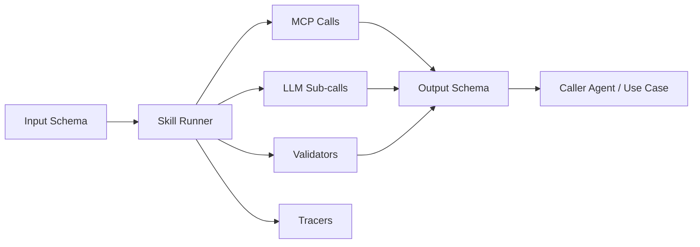
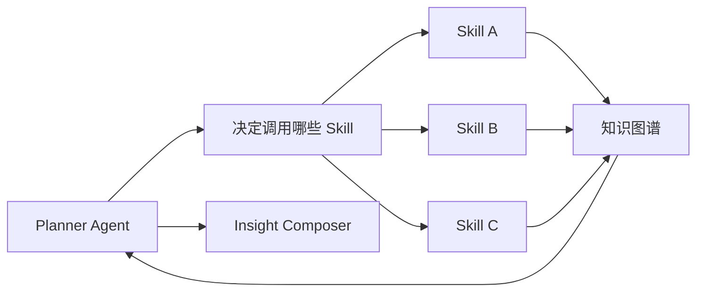
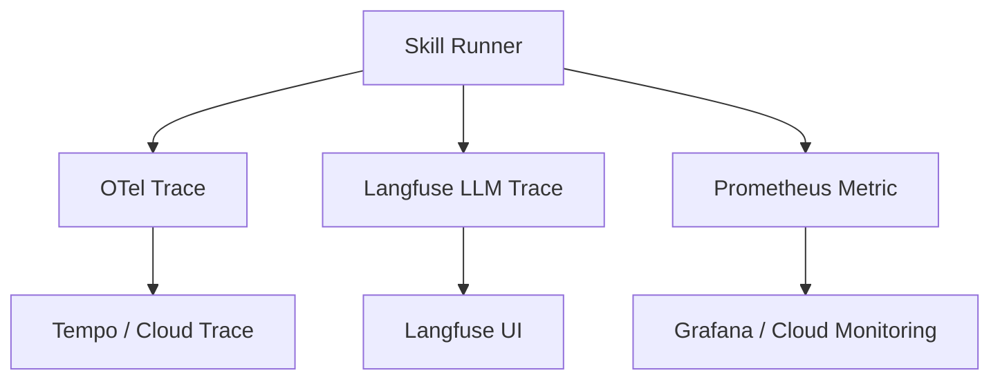
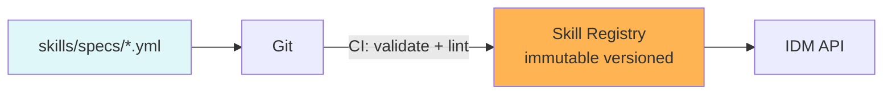

# IDM — Skills 体系设计

> Skills 是 IDM 的**执行原子**
> Agent 用 Skills 组合业务，LLM 用 Skills 输出稳定结果
> 本文给出 Skill 的设计、实现、调度、可观测与演进

---

## 目录

- [1. 为什么需要 Skills](#1-为什么需要-skills)
- [2. Skill = 什么](#2-skill--什么)
- [3. Skill 目录结构](#3-skill-目录结构)
- [4. Skill Spec 详解](#4-skill-spec-详解)
- [5. Skill 执行器 (Runner)](#5-skill执行器-runner)
- [6. Skill 与 Agent 的关系](#6-skill-与-agent-的关系)
- [7. 调度与并行](#7-调度与并行)
- [8. 错误处理与重试](#8-错误处理与重试)
- [9. 可观测与可评估](#9-可观测与可评估)
- [10. Skill 仓库 & 版本管理](#10-skill-仓库--版本管理)
- [11. 内置 Skills 清单](#11-内置-skills-清单)
- [12. 自定义 Skill 教程](#12-自定义-skill-教程)
- [13. 安全与权限](#13-安全与权限)

---

## 1. 为什么需要 Skills

### 1.1 痛点：LLM 直接执行的不可控

```text
Agent: "请帮我解析 Superset dashboard JSON 中的血缘"
LLM  : "好的, 我看了, 它引用了 orders_daily"   ← 漏了 charts[2].sql 引用的 3 张表
LLM  : 返回: { "tables": ["orders_daily"] }       ← 不完整, 不可测试, 不可重放
```

### 1.2 解决：Skills = 标准化执行单元

```text
Agent: "请调用 parse_superset_export skill"
Skill: 跑 json.load → 遍历 dashboards[*].charts[*].sql
       → sqlglot 解析 → 提取所有 table / column
       → 输出结构化 JSON + trace + 校验结果
```

### 1.3 三大收益

| 收益 | 说明 |
| --- | --- |
| **可测试** | 每个 Skill 有 gold snapshot test |
| **可重放** | 同样的输入永远产生同样的输出 (除非 LLM 子调用) |
| **可组合** | 复杂 use case = 多个 Skill 编排 |

---

## 2. Skill = 什么

> **Skill = 一个有版本、有 IO Schema、有 MCP/LLM 步骤、有验证、可执行的 YAML 单元**



---

## 3. Skill 目录结构

```text
idm/skills/
├── specs/                          # YAML 规范
│   ├── discover_clickhouse_assets.yml
│   ├── discover_postgres_assets.yml
│   ├── parse_dbt_manifest.yml
│   ├── parse_airflow_dag.yml
│   ├── parse_superset_export.yml
│   ├── extract_sql_lineage.yml
│   ├── infer_pii_columns.yml
│   ├── infer_table_description.yml
│   ├── infer_owners.yml
│   ├── detect_anomalies.yml
│   ├── run_quality_check.yml
│   ├── compose_insight.yml
│   └── resolve_entity.yml
├── registry.py                     # 加载 + 索引
├── runner.py                       # 执行器
├── validator.py                    # 通用校验
├── tracer.py                       # 接入 Langfuse / OTel
└── eval/                           # 评测
    ├── harness.py
    └── gold/                       # Gold snapshots
        ├── discover_clickhouse_assets.json
        └── ...
```

---

## 4. Skill Spec 详解

### 4.1 完整字段

```yaml
# skills/specs/discover_clickhouse_assets.yml
skill: discover_clickhouse_assets
version: 1
description: 发现 ClickHouse 数据库中的表/视图/列, 生成资产草稿
tags: [schema, clickhouse, v1]

input_schema:
  type: object
  required: [host, database]
  properties:
    host:               { type: string }
    database:           { type: string }
    include_views:      { type: boolean, default: true }
    include_mvs:        { type: boolean, default: true }
    profile_sample_size:{ type: integer, default: 50, maximum: 1000 }
    timeout_sec:        { type: integer, default: 60 }

output_schema:
  type: object
  properties:
    assets:
      type: array
      items:
        type: object
        required: [fqn, type, columns]
        properties:
          fqn:       { type: string }
          type:      { enum: [table, view, materialized_view] }
          engine:    { type: string }
          columns:
            type: array
            items:
              type: object
              required: [name, type]
              properties:
                name:     { type: string }
                type:     { type: string }
                nullable: { type: boolean }
                comment:  { type: string }
          sample:    { type: array, description: "最多 N 行" }
          description: { type: string }
    warnings: { type: array, items: { type: string } }
    trace_id: { type: string }

# 步骤: MCP 工具调用
mcp_calls:
  - name: list_databases
    tool: clickhouse.list_databases
    args: {}
  - name: show_tables
    tool: clickhouse.show_tables
    args: { database: "{{ input.database }}" }
  - name: describe_table
    for_each: "{{ steps.show_tables.result }}"
    tool: clickhouse.describe_table
    args:
      database: "{{ input.database }}"
      table:    "{{ item }}"
  - name: sample_table
    for_each: "{{ steps.show_tables.result }}"
    when: "{{ input.profile_sample_size > 0 }}"
    tool: clickhouse.sample
    args:
      database: "{{ input.database }}"
      table:    "{{ item }}"
      limit:    "{{ input.profile_sample_size }}"

# 步骤: LLM 子调用
llm_calls:
  - name: infer_description
    for_each: "{{ steps.show_tables.result }}"
    when: "{{ steps.describe_table.results[item].columns | length > 0 }}"
    model: gpt-5                      # 默认走 LiteLLM 路由
    fallback_models: [deepseek-v3, qwen-local]
    prompt: |
      你是资深数据工程师. 为表 "{{ item }}" 写一段不超过 60 字的中文业务描述.
      Schema: {{ steps.describe_table.results[item].columns }}
      Sample(最多 5 行): {{ steps.sample_table.results[item] | head(5) }}
    output:
      type: string
    max_tokens: 200
    temperature: 0.2
    cache_key: ["table_description", "{{ input.host }}", "{{ item }}",
                "{{ steps.describe_table.results[item].columns_hash }}"]

# 后置校验
post_validators:
  - id: fqn_unique
    level: error
    rule: "all_assets_have_unique_fqn"
  - id: column_required
    level: error
    rule: "all_assets_have_columns"
  - id: description_min
    level: warning
    rule: "description_length >= 20"
  - id: sample_limit
    level: warning
    rule: "sample_row_count <= input.profile_sample_size"

# 副作用
side_effects:
  write_to_kg: true
  kg_entity_type: table
  upsert_strategy: by_fqn

# 测试
tests:
  - name: smoke
    input: { host: test, database: test_db }
    expected: { assets_min: 1 }
  - name: gold_shop
    input: { host: gold, database: shop, profile_sample_size: 5 }
    snapshot: eval/gold/discover_clickhouse_assets__shop.json
    thresholds:
      assets_count_match: exact
      fqns_match: exact
      description_present: 0.95

# 元数据
author: idm-team
created_at: 2026-06-01
updated_at: 2026-06-01
```

### 4.2 模板变量语法

- `{{ input.xxx }}` — 输入字段
- `{{ steps.<step_name>.result }}` — 上一步结果
- `{{ steps.<step_name>.results[item] }}` — for_each 结果
- `{{ item }}` — 当前循环元素

---

## 5. Skill 执行器 (Runner)

```python
# idm/skills/runner.py
from __future__ import annotations
import json, jinja2, asyncio, time
from typing import Any
from idm.skills.registry import Registry
from idm.mcp_clients import get_client
from idm.llm import LLM
from idm.skills.validator import Validator
from idm.skills.tracer import Tracer
from idm.kg import upsert

class SkillRunner:
    def __init__(self, skill_name: str, input_data: dict, ctx: dict):
        self.spec = Registry.load(skill_name)
        self.input = self._validate_input(input_data, self.spec.input_schema)
        self.ctx = ctx            # { use_case, actor, trace_id }
        self.env = jinja2.Environment()
        self.steps: dict[str, Any] = {"input": self.input}
        self.tracer = Tracer(skill_name, ctx.get("trace_id"))

    async def run(self) -> dict:
        self.tracer.start()
        try:
            await self._run_mcp_calls()
            await self._run_llm_calls()
            self._run_validators()
            output = self._build_output()
            if self.spec.side_effects.write_to_kg:
                await self._write_kg(output)
            self.tracer.finish(output, status="ok")
            return output
        except Exception as e:
            self.tracer.finish(None, status="error", error=str(e))
            raise

    # ---------- MCP ----------
    async def _run_mcp_calls(self):
        for call in self.spec.mcp_calls:
            step_name = call.name
            self.tracer.step_start(step_name)
            try:
                if call.for_each:
                    items = self._render(call.for_each)
                    coros = [self._call_mcp_one(call, item) for item in items]
                    results = await asyncio.gather(*coros, return_exceptions=True)
                    self.steps[step_name] = {
                        "results": dict(zip(items, results)),
                        "errors":  [i for i, r in zip(items, results)
                                    if isinstance(r, Exception)]
                    }
                else:
                    self.steps[step_name] = {
                        "result": await self._call_mcp_one(call, None)
                    }
            finally:
                self.tracer.step_end(step_name)

    async def _call_mcp_one(self, call, item):
        if call.when and not self._render_bool(call.when, item=item):
            return None
        args = self._render_obj(call.args, item=item)
        client_name, method_name = call.tool.split(".")
        client = get_client(client_name)
        method = getattr(client, method_name)
        return await method(**args)

    # ---------- LLM ----------
    async def _run_llm_calls(self):
        for call in self.spec.llm_calls:
            step_name = call.name
            self.tracer.step_start(step_name)
            if call.for_each:
                items = self._render(call.for_each)
                coros = [self._call_llm_one(call, item) for item in items]
                results = await asyncio.gather(*coros, return_exceptions=True)
                self.steps[step_name] = {
                    "results": dict(zip(items, results)),
                    "errors":  [i for i, r in zip(items, results)
                                if isinstance(r, Exception)]
                }
            else:
                self.steps[step_name] = {"result": await self._call_llm_one(call, None)}
            self.tracer.step_end(step_name)

    async def _call_llm_one(self, call, item):
        if call.when and not self._render_bool(call.when, item=item):
            return None
        prompt = self._render(call.prompt, item=item)
        llm = LLM()
        result = await llm.complete(
            model=call.model,
            fallback_models=call.fallback_models,
            prompt=prompt,
            output_type=call.output.type,
            max_tokens=call.max_tokens,
            temperature=call.temperature,
            cache_key=self._render_list(call.cache_key, item=item) if call.cache_key else None,
            trace_ctx={"skill": self.spec.skill, "step": call.name}
        )
        return result

    # ---------- Validators ----------
    def _run_validators(self):
        for v in self.spec.post_validators:
            Validator(self.steps, v).run()
```

---

## 6. Skill 与 Agent 的关系



- **Planner Agent** = LangGraph 上的 reasoning 节点
- **Skill** = 具体执行
- **Agent 不直接调 LLM 写 SQL**，而是调用 `run_quality_check` skill (skill 内部用 LLM)
- **可观测**：Skill 调用是 OTel span，Agent reasoning 是 Langfuse trace

---

## 7. 调度与并行

```python
# Agent 编排示例 (LangGraph)
async def run_use_case(uc):
    # 1. Schema discovery (并行多源)
    schema_results = await asyncio.gather(*[
        run_skill("discover_clickhouse_assets", {"host": s.host, "database": s.database})
        for s in uc.sources if s.type == "clickhouse"
    ])

    # 2. Lineage (依赖 1)
    lineage = await run_skill("extract_lineage",
                              {"assets": schema_results, "from": ["dbt_manifest", "superset_export"]})

    # 3. Doc / Owner / PII (依赖 1, 并行)
    enriched = await asyncio.gather(*[
        run_skill("infer_table_description", {"assets": schema_results}),
        run_skill("infer_owners",            {"assets": schema_results}),
        run_skill("infer_pii_columns",       {"assets": schema_results}),
    ])
```

---

## 8. 错误处理与重试

| 失败 | 处理 |
| --- | --- |
| **单次 LLM 失败** | 自动 fallback (GPT-5 → DeepSeek → Qwen) |
| **MCP 工具不可用** | 跳过该步骤, 记录 warning, 继续 |
| **校验失败 (error)** | 整体标记 partial_success, 不写 KG, 进告警 |
| **校验失败 (warning)** | 写 KG, 但在 UI 显示 ⚠️ |
| **超时** | 标记 timeout, 进 review queue |
| **Gold snapshot diff** | Eval harness 触发回滚该 skill 版本 |

---

## 9. 可观测与可评估

### 9.1 三大观测面



### 9.2 关键 Metric

| 指标 | 标签 |
| --- | --- |
| `idm_skill_invocations_total` | skill, status |
| `idm_skill_duration_seconds`  | skill (histogram) |
| `idm_skill_errors_total`      | skill, error_type |
| `idm_skill_llm_tokens`        | skill, model |
| `idm_skill_cost_usd`          | skill, model |
| `idm_skill_gold_diff_score`   | skill |

### 9.3 Eval Harness

```python
# skills/eval/harness.py
async def run_eval(skill_name: str):
    spec = Registry.load(skill_name)
    suite = spec.tests
    report = []
    for case in suite:
        runner = SkillRunner(skill_name, case.input, ctx={"actor": "eval"})
        output = await runner.run()
        score = compare_with_gold(output, case.snapshot, case.thresholds)
        report.append({"name": case.name, "score": score})
    return aggregate(report)
```

- 每周定时跑 (Airflow DAG)
- 分数下降 → 自动发 PR 警告 / 触发回滚

---

## 10. Skill 仓库 & 版本管理



- **Source of truth** = Git
- **发布 = 推 main 分支**
- **使用方引用 `skill_name@version`**
- **deprecate = 加 `deprecated_since` 字段**

---

## 11. 内置 Skills 清单

| Skill | 类别 | 输入 | 输出 | 主要 MCP |
| --- | --- | --- | --- | --- |
| `discover_clickhouse_assets` | schema | host, db | assets[] | clickhouse |
| `discover_postgres_assets` | schema | host, db | assets[] | postgres |
| `parse_dbt_manifest` | lineage | repo / path | models[], lineage[] | file / github |
| `parse_airflow_dag` | lineage | dag_id | tasks[], deps[] | airflow / github |
| `parse_superset_export` | lineage | path | dashboards[], charts[], lineage[] | file |
| `extract_sql_lineage` | lineage | sql | upstream/downstream | local (sqlglot) |
| `infer_pii_columns` | enrichment | assets | pii_class per column | clickhouse + llm |
| `infer_table_description` | enrichment | assets | description per table | llm |
| `infer_owners` | enrichment | assets | owner suggestions | github + llm |
| `enrich_glossary` | enrichment | assets | glossary links | notion + llm |
| `detect_anomalies` | quality | asset_fqn, window | anomalies[] | clickhouse + local |
| `run_quality_check` | quality | asset, rules | results[] | clickhouse |
| `compose_insight` | delivery | events | markdown / slack | llm |
| `resolve_entity` | dedup | candidates | merged entity | local + llm |
| `classify_classification` | governance | assets | classification | llm |
| `chatbi_nl2sql` | query | question, schema | sql, result | clickhouse |

---

## 12. 自定义 Skill 教程

### 12.1 步骤

1. **复制模板** `cp skills/specs/_template.yml skills/specs/my_skill.yml`
2. **填字段** (input_schema / output_schema / mcp_calls / llm_calls)
3. **写 gold test**: 在 `skills/eval/gold/my_skill.json` 放一份期望输出
4. **本地跑** `python -m idm.skills.eval my_skill`
5. **推到 main** → CI 通过后自动进 registry

### 12.2 最小示例 (10 行)

```yaml
skill: my_minimal_skill
version: 1
description: 演示最简 skill
input_schema:
  type: object
  required: [text]
  properties: { text: { type: string } }
output_schema:
  type: object
  properties: { reversed: { type: string } }
llm_calls:
  - name: reverse
    model: gpt-5
    prompt: "把下列文本反转: {{ input.text }}"
    output: { type: string }
```

---

## 13. 安全与权限

| 维度 | 措施 |
| --- | --- |
| **Skill 调用权限** | RBAC: user / team / service account |
| **MCP 工具权限** | 每个 MCP Server 独立 SA, 最小权限 |
| **LLM 数据脱敏** | 送 LLM 前自动 mask PII (正则 + 列名启发式) |
| **审计** | 每次 Skill 调用进 `skill_audit` 表 |
| **回滚** | 任何 Skill 可一键回滚到上个 version |
| **Dry-run** | `runner.run(dry_run=True)` 不写 KG |

---

> 📌 **配套阅读**：[stack-decisions.md](./stack-decisions.md) · [mcp-first-architecture.md](./mcp-first-architecture.md) · [llm-router.md](./llm-router.md)
