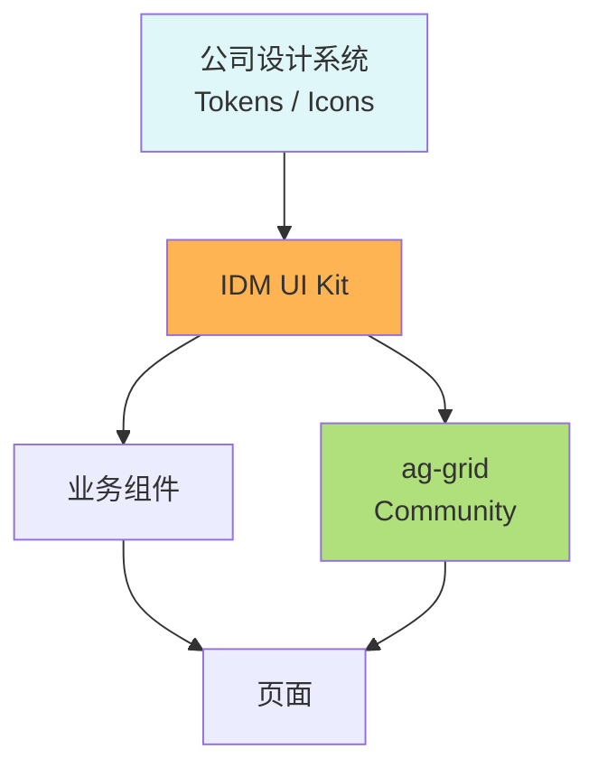
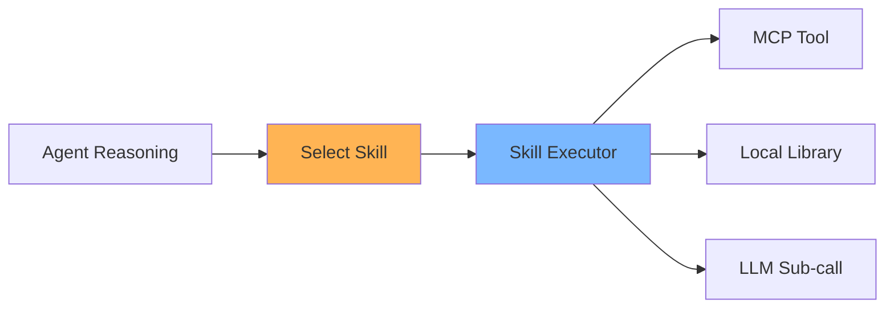
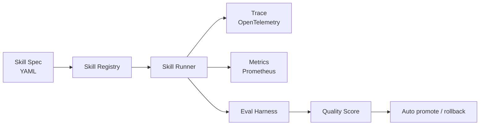

# IDM — 技术选型决策 v2 (LLM / 前端 / Skills)

> 📌 **实现前先读**: [AGENT_INSTRUCTIONS.md](../AGENT_INSTRUCTIONS.md) — 选型总览 + 关键 ADR。

> 落地决策一次说清
> 1) LLM 主力：**GPT-5** + 备选 **DeepSeek**，本地兜底
> 2) 前端：放弃 Antd，**ag-grid Community** + 公司 UX 体系
> 3) **Skills 体系** 保证执行稳定性 (类似 Claude Skills / OpenAI Skills)
> 4) MCP 负责连通所有外部服务

---

## 目录

- [1. LLM 路由：GPT-5 + DeepSeek + 本地](#1-llm-路由gpt-5--deepseek--本地)
- [2. 前端：ag-grid Community + 公司 UX](#2-前端ag-grid-community--公司-ux)
- [3. Skills 体系：执行稳定性的核心保障](#3-skills-体系执行稳定性的核心保障)
- [4. MCP 适配层：连接一切](#4-mcp-适配层连接一切)
- [5. 其他补充选型](#5-其他补充选型)
- [6. 与之前文档的关系](#6-与之前文档的关系)

---

## 1. LLM 路由：GPT-5 + DeepSeek + 本地

### 1.1 三层 LLM 矩阵

```mermaid
flowchart LR
    subgraph L1[主力层 - 云端]
        A1[GPT-5<br/>主力推理]
    end
    subgraph L2[备选层 - 性价比]
        B1[DeepSeek V3 / R1<br/>中文 / 代码 / 长上下文]
    end
    subgraph L3[兜底层 - 离线]
        C1[Qwen2.5 32B (本地 Ollama)<br/>合规 / 内网]
    end

    R[LLM Router] --> A1
    R --> B1
    R --> C1
    style A1 fill:#7AB8FF
    style B1 fill:#FFB454
    style C1 fill:#B0E07B
```

### 1.2 路由策略

| 任务类型 | 首选 | 备选 | 理由 |
| --- | --- | --- | --- |
| **Doc 生成 (高质量中文)** | GPT-5 | DeepSeek V3 | GPT-5 写作自然 |
| **SQL 生成 / 代码理解** | GPT-5 | DeepSeek V3 / R1 | GPT-5 推理强 |
| **PII 分类 / 命名实体** | GPT-5 | DeepSeek V3 |  |
| **大文档摘要 (50k+)** | DeepSeek V3 (long ctx) | GPT-5 | 性价比高 |
| **Embedding** | text-embedding-3-large | bge-large-zh (本地) |  |
| **合规 / 内网数据** | Qwen2.5 32B 本地 | - | 数据不出网 |
| **批量回填 (>1k calls)** | DeepSeek V3 | Qwen2.5 本地 | 成本控制 |
| **失败兜底** | 任意可用 | - | 保证可用性 |

### 1.3 LiteLLM 配置

```yaml
# config/llm_router.yaml
model_list:
  - model_name: gpt-5
    litellm_params:
      model: openai/gpt-5
      api_key: os.environ/OPENAI_API_KEY
      timeout: 60
  - model_name: deepseek-v3
    litellm_params:
      model: deepseek/deepseek-chat
      api_key: os.environ/DEEPSEEK_API_KEY
      api_base: https://api.deepseek.com
      timeout: 60
  - model_name: qwen-local
    litellm_params:
      model: ollama/qwen2.5:32b
      api_base: http://ollama.idm.svc:11434
      timeout: 120

router_settings:
  routing_strategy: simple-shuffle
  num_retries: 3
  timeout: 60
  fallbacks:
    - { gpt-5: [deepseek-v3, qwen-local] }
    - { deepseek-v3: [qwen-local, gpt-5] }
  context_window_fallbacks:
    - { gpt-5: [deepseek-v3] }

litellm_settings:
  drop_params: true
  set_verbose: false
  success_callback: [langfuse]
```

### 1.4 Agent 端调用

```python
from idm.llm import LLM

class DocAgent:
    def __init__(self):
        self.llm = LLM(default="gpt-5",
                       long_ctx="deepseek-v3",
                       private="qwen-local")

    async def generate(self, prompt: str, ctx_tokens: int = 0):
        # 智能选模型
        model = "deepseek-v3" if ctx_tokens > 60_000 else "gpt-5"
        if self.use_case.has_sensitive_data:
            model = "qwen-local"
        return await self.llm.chat(model=model, messages=prompt)
```

### 1.5 成本监控

```python
# LiteLLM + Langfuse 自动记录 token / cost
# 仪表盘:
#   - 每日 $ spend by model / by use_case
#   - Cache hit rate (DeepSeek 启用 prompt cache)
#   - 失败率 + fallback 次数
```

---

## 2. 前端：ag-grid Community + 公司 UX

### 2.1 选型决定

| 项 | 决定 | 理由 |
| --- | --- | --- |
| **不引入** | Antd / Material UI / Chakra | 公司有专用 UX 体系 |
| **采用** | ag-grid **Community** (免费) | 大表格 / 过滤 / 排序 / 虚拟滚动一流 |
| **自研** | IDM UI Kit (基于公司 token) | 复用公司设计系统 |
| **构建** | Vite + React 18 + TypeScript | 保持现有栈 |

### 2.2 组件分层



| 层 | 内容 |
| --- | --- |
| **Tokens** | 颜色 / 间距 / 字号 (来自公司 design system) |
| **IDM UI Kit** | Button / Card / Tag / Input / Modal / Drawer (自研) |
| **ag-grid Community** | AssetTable / LineageTable / QualityTable / SuggestionTable |
| **业务组件** | AssetDetailPanel / LineageGraph / InsightCard |

### 2.3 资产列表 (ag-grid 实战)

```tsx
import { AgGridReact } from "ag-grid-react";
import "ag-grid-community/styles/ag-grid.css";
import "ag-grid-community/styles/ag-theme-quartz.css";

export const AssetTable = ({ data }: { data: Asset[] }) => {
  const columnDefs = [
    { field: "fqn", headerName: "资产 FQN", filter: true, width: 320,
      cellRenderer: (p: any) => <a href={`/assets/${p.data.id}`}>{p.value}</a> },
    { field: "tier", headerName: "等级", filter: true, width: 100,
      cellRenderer: TierTag },
    { field: "owner", headerName: "Owner", filter: true, width: 160 },
    { field: "doc_status", headerName: "文档", width: 100,
      cellRenderer: DocStatus },
    { field: "row_count", headerName: "行数", type: "numericColumn",
      valueFormatter: numFmt, width: 120 },
    { field: "updated_at", headerName: "更新", width: 160 }
  ];

  return (
    <div className="ag-theme-quartz" style={{ height: 600 }}>
      <AgGridReact
        rowData={data}
        columnDefs={columnDefs}
        pagination
        paginationPageSize={50}
        rowSelection="single"
        defaultColDef={{ resizable: true, sortable: true }}
        onRowClicked={(e) => router.push(`/assets/${e.data.id}`)}
      />
    </div>
  );
};
```

### 2.4 IDM UI Kit 最小集 (自研)

```text
src/ui-kit/
├── Button/         (variant: primary/ghost/danger)
├── Card/
├── Tag/            (variant: success/warning/danger/info)
├── Input/          (Text / Number / TextArea)
├── Select/
├── Modal/
├── Drawer/         (详情侧边栏)
├── Tabs/
├── Toast/
├── Empty/
└── Spinner/
```

> 全部按公司设计系统 Token 实现；不依赖 Antd。

### 2.5 关键页面

| 页面 | 主要组件 |
| --- | --- |
| **资产目录** | ag-grid AssetTable + 过滤侧栏 |
| **资产详情** | Tabs(Overview/Schema/Lineage/Doc/Quality) |
| **血缘图** | ReactFlow (已有) |
| **建议审核** | ag-grid SuggestionTable + Drawer 详情 |
| **ChatBI** | ChatPanel + SQL Preview + Chart 渲染 (ECharts) |
| **Insight Dashboard** | 多个 MetricCard + Trend Chart |

---

## 3. Skills 体系：执行稳定性的核心保障

### 3.1 为什么需要 Skills

LLM 直接生成 SQL / 解析代码 → 不稳定 (幻觉 / 格式错误 / 漏字段)
**Skills = 标准化、可测试、可重放的执行单元**



### 3.2 Skill 定义 (类 Claude Skills)

```yaml
# skills/discover_clickhouse_assets.yml
skill: discover_clickhouse_assets
version: 1
description: 发现 ClickHouse 数据库中所有表 / 视图 / 列, 生成资产草稿

input_schema:
  type: object
  required: [host, database]
  properties:
    host:     { type: string }
    database: { type: string }
    include_views: { type: boolean, default: true }
    profile_sample_size: { type: integer, default: 50 }

output_schema:
  type: object
  properties:
    assets:
      type: array
      items:
        type: object
        properties:
          fqn:           { type: string }
          type:          { enum: [table, view, materialized_view] }
          columns:       { type: array }
          sample:        { type: array }
          engine:        { type: string }

mcp_calls:
  - tool: clickhouse.list_databases
  - tool: clickhouse.show_tables
    params: { database: "{{ input.database }}" }
  - tool: clickhouse.describe_table
    params: { database: "{{ input.database }}", table: "{{ step.table }}" }
  - tool: clickhouse.sample
    params:
      database: "{{ input.database }}"
      table: "{{ step.table }}"
      limit: "{{ input.profile_sample_size }}"

llm_calls:
  - name: infer_description
    when: column_count > 0
    model: gpt-5
    prompt: |
      基于以下信息, 为表 {{step.table}} 写 60 字内中文业务描述.
      Schema: {{step.columns}}
      Sample: {{step.sample}}
    output:
      type: string

post_validators:
  - { rule: fqn_unique, level: error }
  - { rule: column_count > 0, level: warning }
  - { rule: description_length >= 20, level: warning }

tests:
  - name: smoke
    input: { host: test, database: test_db }
    expected_assets_min: 1
  - name: gold
    input: { host: gold, database: shop }
    snapshot: tests/gold/discover_clickhouse_assets.json
```

### 3.3 Skill 执行器 (Python)

```python
# idm/skills/runner.py
from idm.skills import registry
from idm.llm import LLM
from idm.mcp_clients import get_client

class SkillRunner:
    def __init__(self, skill_name: str, input_data: dict, use_case: dict):
        self.spec = registry.load(skill_name)
        self.input = input_data
        self.use_case = use_case
        self.context = {"input": input_data, "step": {}, "mcp": {}, "llm": {}}

    async def run(self) -> dict:
        # 1. 执行 MCP calls
        for call in self.spec.mcp_calls:
            client = get_client(call.tool.split(".")[0])
            method = getattr(client, call.tool.split(".")[1])
            params = self._render(call.params)
            self.context["mcp"][call.tool] = await method(**params)

        # 2. 执行 LLM calls
        for call in self.spec.llm_calls:
            if self._should_run(call.when):
                llm = LLM(model=call.model)
                self.context["llm"][call.name] = await llm.complete(
                    self._render(call.prompt)
                )

        # 3. 校验
        for v in self.spec.post_validators:
            self._validate(v)

        # 4. 返回结构化输出
        return self._build_output()
```

### 3.4 内置 Skills (起步)

| Skill 名 | 作用 | 主要工具 |
| --- | --- | --- |
| `discover_clickhouse_assets` | 扫 CH 数据库/表/列 | MCP clickhouse |
| `discover_postgres_assets` | 扫 PG 资产 | MCP postgres |
| `parse_dbt_manifest` | 读 manifest.json, 提取 model/lineage | MCP file/github |
| `parse_airflow_dag` | 解析 DAG 拓扑 | MCP airflow/github |
| `parse_superset_export` | 解析 dashboard JSON, 提取 chart/lineage | MCP file |
| `extract_sql_lineage` | 从 SQL 中抽取血缘 (sqlglot) | Local |
| `infer_pii_columns` | 列名 + sample → PII 分类 | MCP clickhouse + LLM |
| `infer_table_description` | schema + sample → 描述 | LLM |
| `infer_owners` | 综合信号 → Owner 建议 | MCP github/airflow + LLM |
| `detect_anomalies` | 历史画像 → 异常检测 | MCP clickhouse + Local |
| `run_quality_check` | 执行断言 (freshness/volume/...) | MCP clickhouse |
| `compose_insight` | 事件 → 简报 | LLM |
| `resolve_entity` | 实体消歧 / 合并 | Local + LLM |

### 3.5 Skill 版本与可观测



- **每个 Skill 都有版本号 + snapshot test**
- **执行 trace** 全部进 Langfuse
- **Eval Harness** 定期跑 gold snapshot
- **质量分下降** → 自动告警 + 回滚

### 3.6 失败处理

| 失败类型 | 应对 |
| --- | --- |
| Skill 内部异常 | 重试 N 次 → 标记 partial success |
| LLM 输出格式错 | 自动 retry + few-shot 强化 |
| MCP 工具不可用 | 跳过该 skill, 记录 |
| 校验不通过 | 进入 AI Suggestion 人工审核 |

---

## 4. MCP 适配层：连接一切

### 4.1 内置 / 将支持的 MCP Server

| MCP | 类型 | 状态 | 用途 |
| --- | --- | --- | --- |
| `clickhouse` | 自研 / 社区 | ✅ 起步 | 数据库元数据 / 画像 / 样本 |
| `github` | 官方 | ✅ | 代码 / dbt / DAG / PR |
| `gcs` | 官方 | ✅ | 存 Superset export / 大文件 |
| `file` | 自研 | ✅ | 本地 / GCS 读 |
| `postgres` | 社区 | ✅ | 元数据 / 业务表 |
| `airflow` | 自研 wrapper | 🛠 | DAG 拓扑 / Task |
| `flink` | 自研 wrapper | 🛠 | Job plan / 算子 |
| `superset` | 自研 | 🛠 | dashboard export |
| `dbt` | 自研 | 🛠 | manifest / catalog |
| `notion` | 官方 | ✅ | 业务文档 |
| `slack` | 官方 | ✅ | 通知 |
| `lark` | 官方 | ✅ | 通知 (国内) |
| `idm-self` | 自研 | ✅ | 把 IDM 自身能力暴露给外部 Agent |

### 4.2 自研 MCP Server 模板 (200 行)

```python
# mcp_servers/airflow/server.py
from mcp.server import Server, stdio
from airflow_client import Client

app = Server("airflow-mcp")
af = Client(base_url=os.environ["AIRFLOW_URL"],
            auth=(os.environ["AF_USER"], os.environ["AF_PASS"]))

@app.list_tools()
async def list_tools():
    return [
        {"name": "list_dags", "description": "列出所有 DAG"},
        {"name": "get_dag",   "description": "获取 DAG 详情",
         "inputSchema": {"type": "object",
                         "properties": {"dag_id": {"type": "string"}},
                         "required": ["dag_id"]}},
        {"name": "get_task",  "description": "获取 task 输入输出"}
    ]

@app.call_tool()
async def call_tool(name: str, arguments: dict):
    if name == "list_dags":
        dags = af.dags.list()
        return [{"type": "text", "text": json.dumps([d.dag_id for d in dags])}]
    if name == "get_dag":
        dag = af.dags.get(arguments["dag_id"])
        return [{"type": "text", "text": dag.to_json()}]
    # ...

if __name__ == "__main__":
    stdio.run(app)
```

### 4.3 启动方式 (Kubernetes)

```yaml
# helm/idm-mcp-clients/templates/airflow.yaml
apiVersion: apps/v1
kind: Deployment
metadata: { name: idm-mcp-airflow, namespace: idm-mcp }
spec:
  replicas: 1
  template:
    spec:
      containers:
        - name: mcp
          image: idm/mcp-airflow:latest
          env:
            - { name: AIRFLOW_URL, value: http://airflow-webserver.airflow:8080 }
            - { name: AF_USER,    valueFrom: { secretKeyRef: { name: af-creds, key: user } } }
            - { name: AF_PASS,    valueFrom: { secretKeyRef: { name: af-creds, key: pass } } }
```

---

## 5. 其他补充选型

| 层 | 选型 |
| --- | --- |
| **后端框架** | FastAPI + Pydantic v2 (不变) |
| **任务编排** | LangGraph + 自研 Skill Runner |
| **LLM 网关** | LiteLLM (统一 GPT-5 / DeepSeek / Ollama) |
| **LLM 可观测** | Langfuse (自托管) |
| **Embedding** | OpenAI text-embedding-3-large + bge-large-zh (本地) |
| **图存储** | PostgreSQL + Apache AGE (不变) |
| **向量** | pgvector (不变) |
| **事件流** | GCP Pub/Sub (不变) |
| **关系存储** | CloudSQL PG (不变) |
| **对象存储** | GCS (不变) |
| **前端构建** | Vite + React 18 + TypeScript (不变) |
| **前端表格** | ag-grid Community (新) |
| **前端自研** | IDM UI Kit (新, 不引 Antd) |
| **图表** | ECharts (成熟, 不引 Recharts/Antd) |
| **血缘图** | ReactFlow (不变) |
| **SQL 高亮** | react-syntax-highlighter |
| **CI/CD** | Cloud Build + ArgoCD (不变) |
| **监控** | Cloud Monitoring + OpenTelemetry (不变) |

---

## 6. 与之前文档的关系

- [mcp-first-architecture.md](./mcp-first-architecture.md) → 主架构
  - **更新**：LLM 路由从最初规划的 Vertex AI 改为 **GPT-5 主力 + DeepSeek V3 备选 + Qwen2.5 本地兜底**
  - **更新**：前端 Antd 改为 ag-grid + IDM UI Kit
  - **新增**：Skills 体系 (Agent → Skill → MCP)
- [use-case-spec.md](./use-case-spec.md) → YAML 规范 (不变)
- [walkthrough.md](./walkthrough.md) → 端到端演示 (使用本选型)
- [skills-design.md](./skills-design.md) → Skill 详细设计
- [llm-router.md](./llm-router.md) → LLM 路由详细
- [frontend-design.md](./frontend-design.md) → 前端详细

---

> 📌 **配套阅读**：[mcp-first-architecture.md](./mcp-first-architecture.md) · [use-case-spec.md](./use-case-spec.md) · [skills-design.md](./skills-design.md) · [llm-router.md](./llm-router.md) · [frontend-design.md](./frontend-design.md) · [walkthrough.md](./walkthrough.md)
