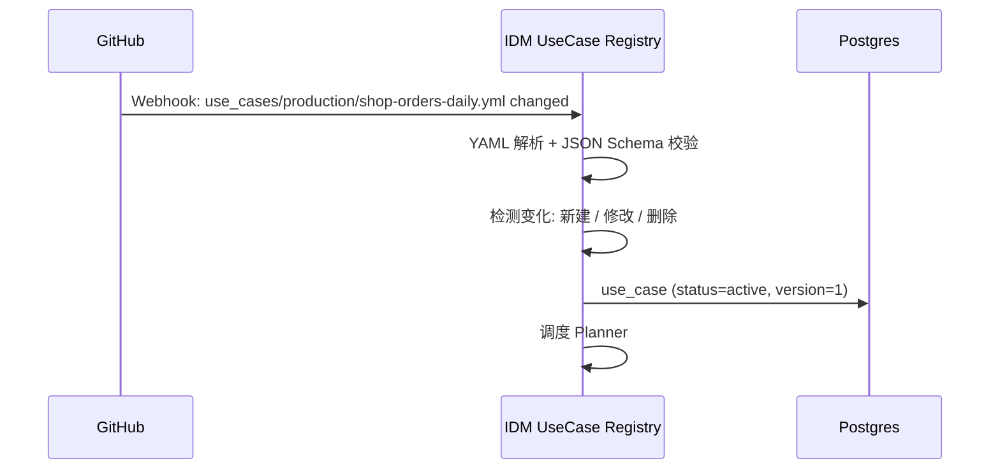
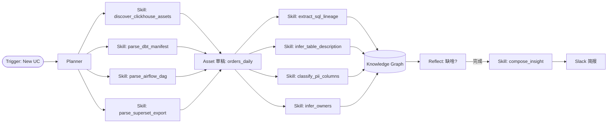
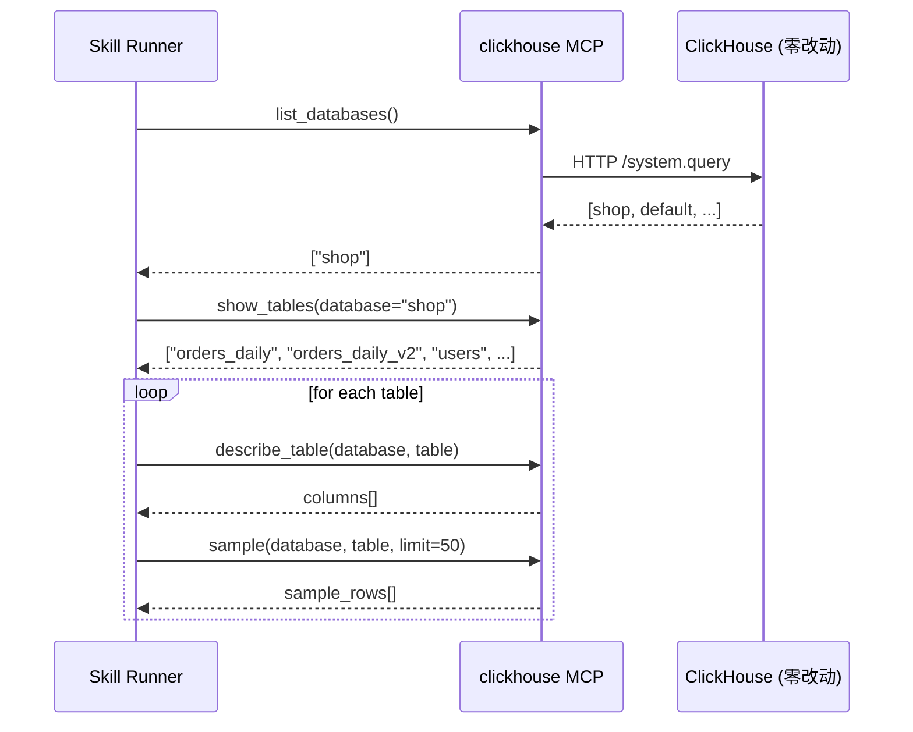
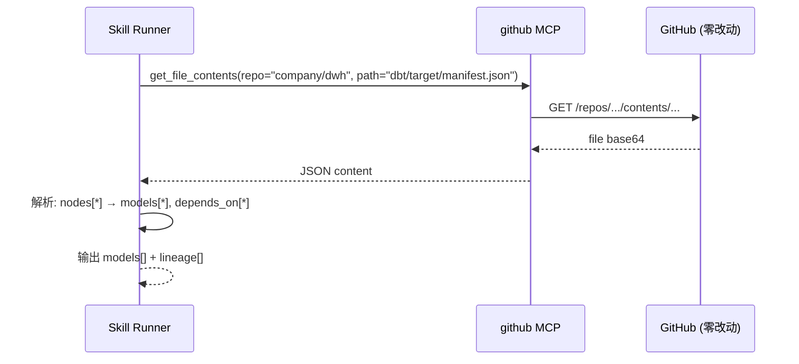
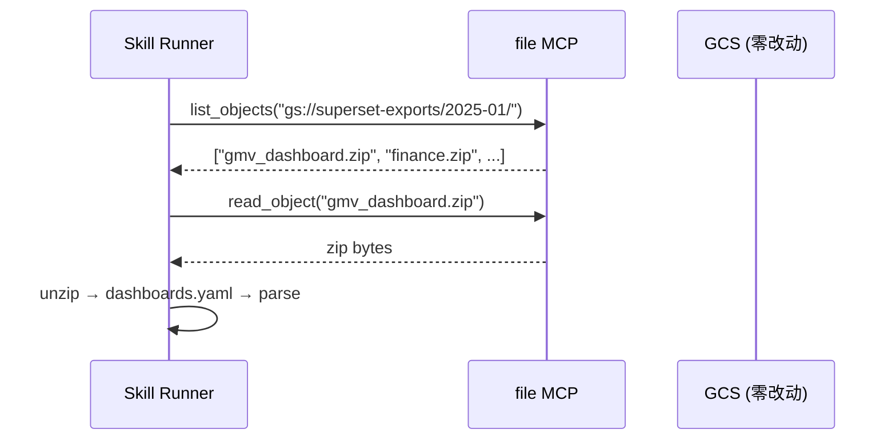
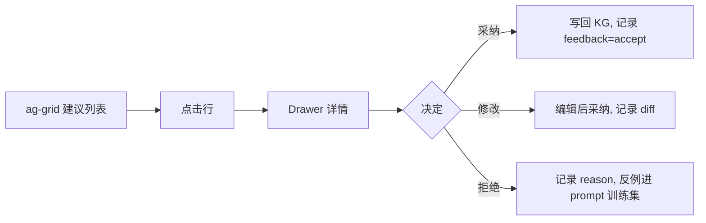
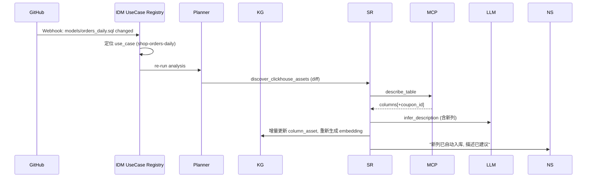
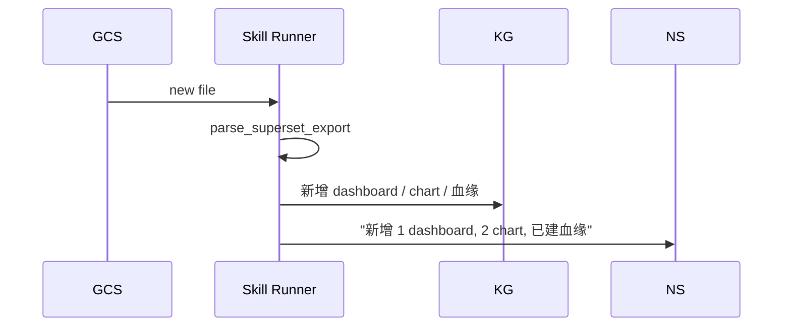
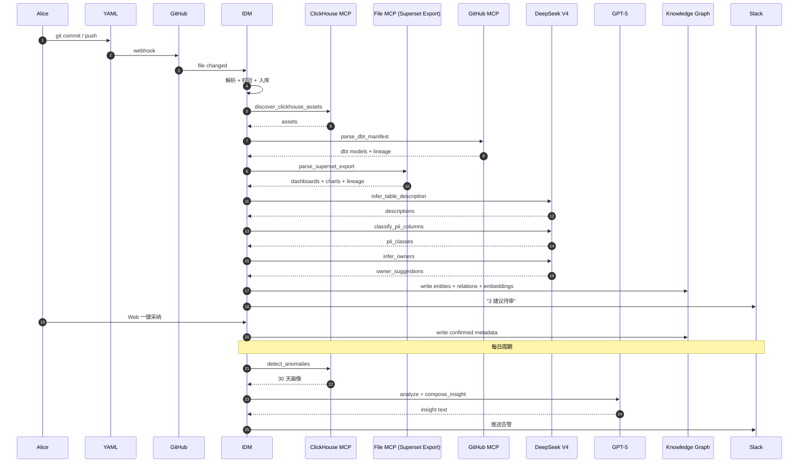

# IDM — 端到端 Walkthrough

> 📌 **实现前先读**: [AGENT_INSTRUCTIONS.md](../AGENT_INSTRUCTIONS.md) §8 (Use Case YAML) + §3 (1+9 Agent) — 跑这个 demo 前先看。

> 一个真实业务 use case, 从 YAML 提交到产出 Insight 的全流程
> 演示: **MCP 调用 + Skills 执行 + DeepSeek V4 决策 + GPT-5 备选 + 知识图谱 + Web 反馈**

---

## 目录

- [1. 场景设定](#1-场景设定)
- [2. 第一步：业务人员写一份 YAML](#2-第一步业务人员写一份-yaml)
- [3. 第二步：IDM 自动加载与解析](#3-第二步idm-自动加载与解析)
- [4. 第三步：Planner 编排 Skill 调用](#4-第三步planner-编排-skill-调用)
- [5. 第四步：Skill 跑通三大数据源](#5-第四步skill-跑通三大数据源)
- [6. 第五步：LLM 决策与知识图谱写入](#6-第五步llm-决策与知识图谱写入)
- [7. 第六步：人机审核循环](#7-第六步人机审核循环)
- [8. 第七步：Insight 推送 + 异常告警](#8-第七步insight-推送--异常告警)
- [9. 第八步：变更驱动的持续演进](#9-第八步变更驱动的持续演进)
- [10. 整个过程零侵入](#10-整个过程零侵入)
- [11. 端到端时延 / 成本示例](#11-端到端时延--成本示例)

---

## 1. 场景设定

| 角色 | 需求 |
| --- | --- |
| **数据团队 Alice** | 治理「订单宽表 orders_daily」, 看清谁在用、谁负责、有没有问题 |
| **数据源 (零改动)** | ClickHouse (生产数据) / GitHub (代码) / Superset (BI) |
| **不要求** | 任何系统装 SDK / 推数据 / 加 hook |

Alice 只做了一件事：在 IDM 仓库写了一份 YAML。

---

## 2. 第一步：业务人员写一份 YAML

> 文件: `idm/use_cases/production/shop-orders-daily.yml`

```yaml
id: shop-orders-daily
version: 1
description: 电商订单核心宽表, 治理 + 血缘 + 质量
owners: [alice@example.com]

sources:
  - id: ch-prod
    type: clickhouse
    mcp: clickhouse
    config: { host: ch.example.com, database: shop }
    scope: { include_tables: ["orders_daily", "orders_daily_v2"] }

  - id: gh-warehouse
    type: github
    mcp: github
    config: { repo: company/dwh, branch: main }
    scope: { paths: ["dags/etl_orders*", "models/orders_*", "docs/orders*"] }

  - id: sp-export
    type: superset_export
    mcp: file
    config: { path: gs://superset-exports/2025-01/ }

context:
  flow_diagram: |
    Kafka(orders) → Airflow(etl_orders) → ClickHouse(orders_daily)
                                          → Superset(GMV Dashboard)
  glossary:
    - { term: GMV, definition: 成交总额, 含退款前 }
  tags: [sales, tier-1]

analysis:
  - task: discover_assets
    agent: schema
  - task: extract_lineage
    agent: lineage
    depends_on: [discover_assets]
  - task: generate_docs
    agent: doc
    depends_on: [discover_assets]
  - task: classify_pii
    agent: pii
    depends_on: [discover_assets]
  - task: suggest_owners
    agent: owner
    depends_on: [discover_assets]
  - task: detect_anomalies
    agent: quality
    schedule: "0 9 * * *"
    depends_on: [discover_assets]
    params: { baseline_days: 30, sensitivity: medium }

deliverables:
  knowledge_graph: { entities: [table, column, dashboard, pipeline, tag, glossary_term] }
  insights:
    - { channel: slack, target: "#data-stewards",
        trigger: [anomaly_detected, owner_missing, lineage_broken] }
  api_expose: true
```

> 写完 → `git commit` → 推 main。
> 之后 Alice 不用管了, IDM 全部接管。

---

## 3. 第二步：IDM 自动加载与解析



**校验代码 (简)**:

```python
import yaml, jsonschema
schema = json.load(open("schemas/use_case_v1.json"))
data = yaml.safe_load(open("uc.yml"))
jsonschema.validate(data, schema)  # 字段错就拒
```

通过校验后, IDM 把任务 `id: shop-orders-daily, v1` 入库 + 调度。

---

## 4. 第三步：Planner 编排 Skill 调用



**Planner 代码 (LangGraph 节点)**:

```python
async def plan_node(state: UseCaseState):
    uc = state.use_case
    assets = state.assets  # 已经被上游填好
    return {
        "next": [
            ("extract_sql_lineage", {"assets": assets, "from": ["dbt","af","superset"]}),
            ("infer_table_description", {"assets": assets, "tone": "business", "language": "zh"}),
            ("classify_pii_columns", {"assets": assets}),
            ("infer_owners", {"assets": assets}),
        ]
    }
```

---

## 5. 第四步：Skill 跑通三大数据源

### 5.1 Skill: discover_clickhouse_assets

> 跑 SPEC 见 [skills-design.md §11](./skills-design.md)

**执行过程 (MCP 调用)**:



**Skill Runner 输出 (节选)**:

```json
{
  "assets": [
    {
      "fqn": "shop.orders_daily",
      "type": "table",
      "engine": "MergeTree",
      "columns": [
        { "name": "order_id",  "type": "String",  "nullable": false },
        { "name": "user_id",   "type": "String",  "nullable": false },
        { "name": "user_email","type": "String",  "nullable": true  },
        { "name": "gmv",       "type": "Decimal(18,2)", "nullable": false },
        { "name": "order_date","type": "Date",   "nullable": false }
      ],
      "sample": [
        { "order_id": "o-1001", "user_id": "u-88", "user_email": "a@b.com", "gmv": "199.00", "order_date": "2025-01-15" },
        ...
      ]
    }
  ]
}
```

### 5.2 Skill: parse_dbt_manifest



**输出 (节选)**:

```json
{
  "models": [
    {
      "unique_id": "model.shop.orders_daily",
      "fqn": "shop.orders_daily",
      "path": "models/orders_daily.sql",
      "depends_on": ["model.shop.orders_raw", "model.shop.dim_user"]
    }
  ],
  "lineage": [
    { "upstream": "shop.orders_raw",   "downstream": "shop.orders_daily", "via": "dbt" },
    { "upstream": "shop.dim_user",     "downstream": "shop.orders_daily", "via": "dbt" }
  ]
}
```

### 5.3 Skill: parse_superset_export



**Superset export 真实结构 (Zip)**:
```text
superset_export_2025-01-15.zip
├── dashboards/
│   └── GMV.yaml
├── datasets/
│   └── orders_daily.yaml
├── charts/
│   ├── gmv_trend.yaml
│   └── orders_by_region.yaml
└── database.yaml
```

**Skill 解析后输出**:

```json
{
  "dashboards": [
    { "id": 1, "title": "GMV Dashboard", "slices": [10, 11] }
  ],
  "charts": [
    {
      "id": 10, "title": "GMV Trend",
      "viz_type": "line",
      "dataset": "orders_daily",
      "sql": "SELECT order_date, sum(gmv) FROM orders_daily WHERE order_date >= now() - interval '30 day' GROUP BY 1"
    }
  ],
  "lineage": [
    { "upstream": "shop.orders_daily", "downstream": "GMV Trend (chart)", "via": "superset" },
    { "upstream": "shop.orders_daily", "downstream": "GMV Dashboard",   "via": "superset" }
  ]
}
```

### 5.4 Skill: extract_sql_lineage (补充)

```python
import sqlglot
parsed = sqlglot.parse_one(sql, dialect="clickhouse")
tables  = [t.name for t in parsed.find_all(sqlglot.exp.Table)]
columns = [c.name for c in parsed.find_all(sqlglot.exp.Column)]
# → upstream: shop.orders_daily, cols: [order_date, gmv]
```

---

## 6. 第五步：LLM 决策与知识图谱写入

### 6.1 Skill: infer_table_description (LLM = GPT-5)

**Prompt (实际发给 LLM)**:

```text
[系统]
你是资深数据工程师. 为 ClickHouse 表写一段不超过 60 字的中文业务描述.
只输出描述, 不要解释.

[用户]
表名: shop.orders_daily
Schema:
  - order_id: String
  - user_id: String
  - user_email: String
  - gmv: Decimal(18,2)
  - order_date: Date
Sample 5 行:
  1. o-1001 | u-88 | a@b.com | 199.00 | 2025-01-15
  2. o-1002 | u-12 | c@d.com | 50.00  | 2025-01-15
  ...
血缘上游: orders_raw, dim_user (dbt)
血缘下游: GMV Trend (Superset)
术语: GMV = 成交总额, 含退款前
```

**GPT-5 输出**:
> "按日汇总的电商订单宽表, 包含订单/用户/GMV 关键字段, 是 GMV Dashboard 与下游 ML 的核心数据源。"

**缓存**: 表 schema 不变 → 不会重跑, 1 次花 800 tokens, 后续 0 成本。

### 6.2 Skill: classify_pii_columns (LLM = GPT-5 + 正则)

```text
[用户]
请为下列列判断 PII 类别: none / email / phone / id_card / name / address
列: order_id, user_id, user_email, gmv, order_date
```

**输出**:
```json
{
  "order_id": "none",
  "user_id": "none",
  "user_email": "email",
  "gmv": "none",
  "order_date": "none"
}
```

> PII Tag 自动写回 KG → 触发「敏感列告警」。

### 6.3 Skill: infer_owners (LLM = GPT-5)

**多源信号**:

| 信号 | 来源 (MCP) | 值 |
| --- | --- | --- |
| `git_blame` | github | 最近 committer: alice, bob, carol (各 30% / 50% / 20%) |
| `dbt_meta` | file (manifest) | `owner: alice@example.com` |
| `airflow_owner` | airflow (via GH) | `etl_orders` DAG owner: alice |
| `query_log_top_users` | clickhouse (可选) | - |

**GPT-5 推理**: 「alice 在 dbt meta 显式声明 + airflow DAG owner + 50% 提交」 → `owner = alice@example.com, confidence = 0.92`

### 6.4 写入知识图谱

```sql
-- table_asset
INSERT INTO table_asset (fqn, tier, description, status)
VALUES ('shop.orders_daily', 'critical',
        '按日汇总的电商订单宽表...', 'active')
ON CONFLICT (fqn) DO UPDATE SET description = EXCLUDED.description;

-- column_asset (PII)
INSERT INTO column_asset (table_id, name, pii_class)
SELECT id, 'user_email', 'email' FROM table_asset WHERE fqn='shop.orders_daily';

-- 血缘 (PG → AGE)
SELECT * FROM cypher('idm', $$
  MATCH (a:Table {fqn:'shop.orders_raw'}),
        (b:Table {fqn:'shop.orders_daily'})
  CREATE (a)-[:UPSTREAM {transform:'dbt', job:'dbt run', conf:0.95}]->(b)
$$) AS (r agtype);

-- 引用 (Superset)
SELECT * FROM cypher('idm', $$
  MATCH (a:Table {fqn:'shop.orders_daily'}),
        (b:Dashboard {fqn:'superset:GMV Dashboard'})
  CREATE (a)-[:REFERENCED_BY]->(b)
$$) AS (r agtype);

-- Embedding
UPDATE table_asset
SET description_vec = (SELECT azure_openai_embed(description))
WHERE fqn = 'shop.orders_daily';
```

---

## 7. 第六步：人机审核循环

### 7.1 AI Suggestion 入库

```sql
INSERT INTO ai_suggestion (target_type, target_id, action, payload, rationale, status)
VALUES (
  'table',  '<orders_daily uuid>', 'add_description',
  '{"description": "按日汇总的电商订单宽表..."}',
  '基于 schema + sample + 血缘, GPT-5 推断',
  'pending'
);
```

### 7.2 Web 通知

Alice 收到 Slack:
```
:sparkles: [shop-orders-daily] 3 个新建议待审核
  - add_description: orders_daily (置信度 0.91)
  - add_owner:      alice@example.com (置信度 0.92)
  - add_pii_tag:    user_email -> email (置信度 0.99)
查看: https://idm.example.com/suggestions
```

### 7.3 Alice 在 Web 上审核 (ag-grid + Drawer)



**反馈数据进 Few-shot**:

```sql
INSERT INTO llm_feedback (skill, action, payload, accepted, reason)
VALUES ('infer_table_description', 'add_description',
        '{"description":"按日汇总..."}', true, null);
```

---

## 8. 第七步：Insight 推送 + 异常告警

### 8.1 每日 09:00 周期任务

```python
@scheduler.cron("0 9 * * *")
async def daily_run(uc_id):
    state = await load_state(uc_id)
    state.next = [
        ("detect_anomalies", {"baseline_days": 30, "sensitivity": "medium"}),
        ("compose_insight", {"events": "all_pending"})
    ]
    await run(state)
```

### 8.2 detect_anomalies Skill (LLM = DeepSeek, 成本敏感)

```mermaid
sequenceDiagram
    participant SR as Skill Runner
    participant CH as ClickHouse
    participant LLM as DeepSeek V4

    SR->>CH: SELECT count, sum(gmv) FROM shop.orders_daily WHERE order_date >= today() - 30 GROUP BY date
    CH-->>SR: 30 天画像
    SR->>LLM: "判断今日数据相对 30 天基线是否异常, 输出 JSON {is_anomaly, severity, hypothesis}"
    LLM-->>SR: {"is_anomaly": true, "severity": "medium",
                 "hypothesis": "今日 row_count 下降 30%, 可能上游延迟"}
    SR->>KG: 写入 anomaly event
    SR->>NS: 触发 Insight
```

### 8.3 compose_insight → Slack

```
:rotating_light: [shop-orders-daily] 数据健康告警
时间: 2025-01-16 09:00
严重度: 🟡 中
- 今日 orders_daily.row_count = 89,200 (基线 ~120,000, 下降 26%)
- gmv.sum 同步下降 24%
- 上游: Kafka: orders 流量正常, Airflow etl_orders 任务正常
- 推测: 可能为上游 source 端时间分区错位, 建议检查 Kafka lag

详情: https://idm.example.com/insights/ins-2025-01-16-01
```

### 8.4 Alice 一键操作

- 点击 `查看图表` → 跳 ChatBI 自动生成 SQL
- 点击 `认领` → 转给数据团队 Bob
- 点击 `已知问题 / 误报` → 反馈进 LLM, 下次减少类似误报

---

## 9. 第八步：变更驱动的持续演进

### 9.1 上游代码变更

Alice 改 dbt model 加了一个新列 `coupon_id`:



### 9.2 Superset 新 Dashboard

Alice 从 Superset UI 导出新的 dashboard zip 到 `gs://superset-exports/2025-02/`:



---

## 10. 整个过程零侵入

| 系统 | 是否被改动 |
| --- | --- |
| **ClickHouse** | ❌ 0 改动, 0 装 SDK, 0 推数据 |
| **GitHub** | ❌ 0 改动 (公网 API) |
| **Superset** | ❌ 0 改动 (用户手工 export 即可) |
| **Airflow** | ❌ 0 改动 (IDM 通过 GH 读 DAG) |
| **Flink** | ❌ 0 改动 (REST wrapper 不改 Flink) |
| **业务应用** | ❌ 0 改动 |
| **IDM** | ✅ 部署在 GKE, 自给自足 |

> **业务团队的「自助」**：只需要写一份 YAML。

---

## 11. 端到端时延 / 成本示例

| 阶段 | 时延 | LLM Tokens / 成本 |
| --- | --- | --- |
| YAML 加载 + 校验 | < 1s | 0 |
| discover_clickhouse_assets (10 张表) | 8s | 0 |
| parse_dbt_manifest | 2s | 0 |
| parse_superset_export (3 dashboard) | 4s | 0 |
| extract_sql_lineage (5 SQL) | 3s | 0 |
| infer_table_description (10 表) | 30s (并行) | ~8k → $0.10 (DeepSeek) |
| classify_pii (50 列) | 15s | ~3k → $0.04 |
| infer_owners | 8s | ~1k → $0.01 (GPT-5) |
| **合计 (一次性)** | **~50s** | **~$0.15** |
| 每日 detect_anomalies | 10s | ~2k → $0.03 (DeepSeek) |
| 每日 compose_insight | 5s | ~1k → $0.01 |
| **每日稳态** | **~15s** | **~$0.04** |

> 1000 个 use case, 每月成本 ≈ $0.04 × 1000 × 30 = **$1,200/月**
> 加上 LLM 一次性, 算上 fallback: **< $2k/月** ✅

---

## 附录 A. 关键 Trace 截图 (示意)

> Langfuse trace 视图 (一个 use_case 一次执行):

```
shop-orders-daily v1
├─ discover_clickhouse_assets   ✓  8.0s   (MCP, no LLM)
├─ parse_dbt_manifest           ✓  1.8s   (MCP file, no LLM)
├─ parse_superset_export        ✓  3.6s   (MCP file, no LLM)
├─ extract_sql_lineage          ✓  2.4s   (local, no LLM)
├─ infer_table_description      ✓  6.2s   (LLM gpt-5, $0.08)
├─ classify_pii_columns         ✓  3.1s   (LLM gpt-5, $0.03)
├─ infer_owners                 ✓  1.4s   (LLM gpt-5, $0.01)
└─ compose_insight              ✓  0.9s   (LLM deepseek-v4, $0.001)
                              ─────
                              Total: 27.4s, $0.12
```

---

## 附录 B. 完整时序图 (一张大图)



---

> 📌 **配套阅读**：[mcp-first-architecture.md](./mcp-first-architecture.md) · [use-case-spec.md](./use-case-spec.md) · [skills-design.md](./skills-design.md) · [stack-decisions.md](./stack-decisions.md) · [llm-router.md](./llm-router.md) · [frontend-design.md](./frontend-design.md)
