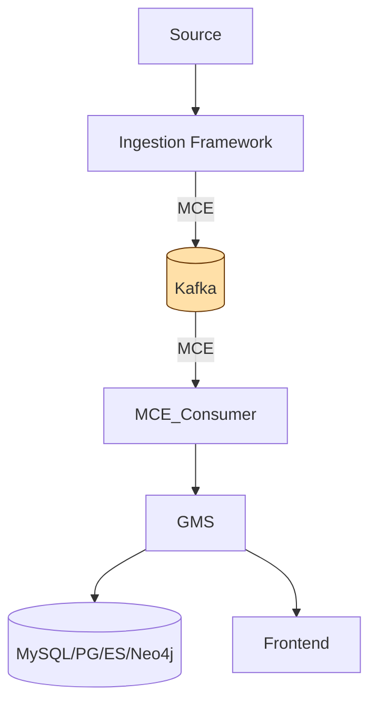
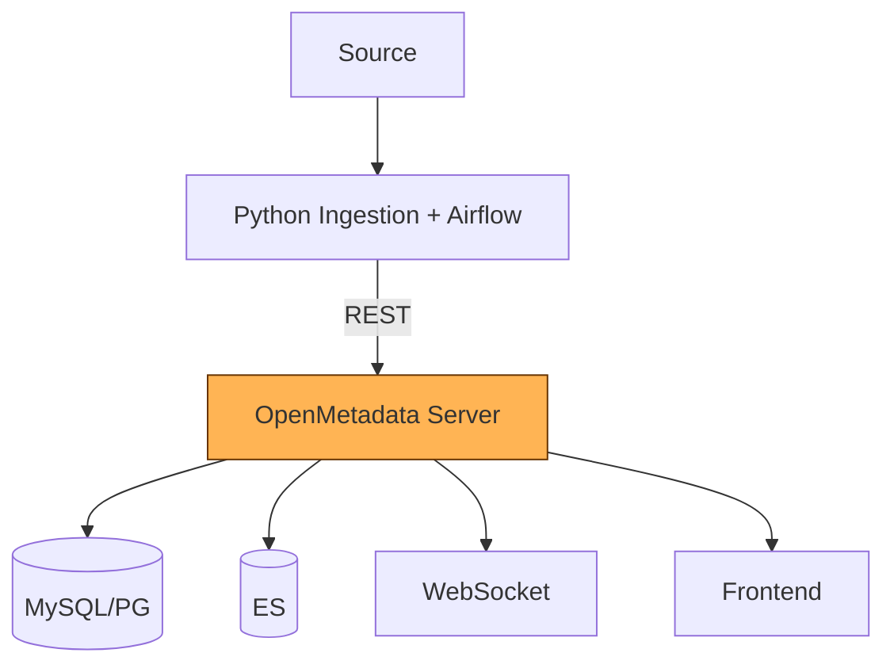
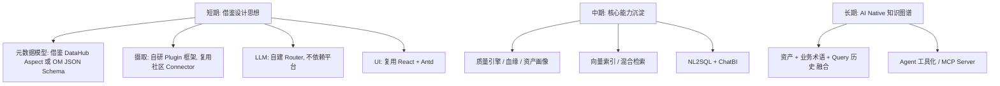

# DataHub vs OpenMetadata — 横向对比与 IDM 选型建议

> 配合 [datahub.md](./datahub.md) 与 [openmetadata.md](./openmetadata.md) 阅读
> 目的：从架构师视角，给 IDM 平台选型 / 借鉴路线提供参考

---

## 1. 一句话总结

| 平台 | 关键特征 |
| --- | --- |
| **DataHub** | LinkedIn 出品，**事件驱动** + **Aspect 元数据模型** + **Kafka 总线**，元数据领域的「开源版 Data Discovery + Graph」 |
| **OpenMetadata** | **JSON Schema 驱动** + **一体化** (元数据 + 质量 + 协作 + 可观测) 的「一站式」平台 |

---

## 2. 能力维度对比

| 维度 | DataHub | OpenMetadata | 备注 |
| --- | --- | --- | --- |
| **元数据建模** | PDL / Aspect (强类型, 服务端校验) | JSON Schema (动态扩展) | 都支持字段级扩展 |
| **事件总线** | Kafka Topic (MCE/MCL) | 内部 Event Bus + WebSocket | DataHub 更适合大数据生态 |
| **Connector 数** | 80+ | 80+ | 头部基本对齐 |
| **数据血缘** | 表级 + 列级 (SQL Parser) | 表级 + 列级 + Pipeline | OpenMetadata 协作展示更好 |
| **数据质量** | 通过 Actions 集成 | **原生** Test Suite | OM 一体化更顺 |
| **协作** | 弱 | **原生** Activity / Tasks / Announcements | OM 强 |
| **搜索** | ES + BM25, 即将支持向量 | ES + 向量 (v1.4+) | OM 走在前面 |
| **AI 能力** | LLM 文档生成 / Tag 推断 / NLQ | LLM 文档生成 / Chat Data / RAG | OM 商业化更成熟 |
| **可观测** | Actions / SLA 告警 | Insight / Incident / SLA | OM 一体化 |
| **API** | GraphQL + Rest | OpenAPI 3 + WebSocket | OM 文档更标准 |
| **UI** | React + Lit (组件多) | React + Antd (统一) | OM 更易二次开发 |
| **多语言 SDK** | Java / Python / Go | Java / Python / TS (OpenAPI) |  |
| **学习曲线** | 较陡 (PDL / MCE / GMS 概念多) | 中等 (JSON Schema 直观) |  |
| **运维复杂度** | 高 (Kafka / ES / DB / 三服务) | 中 (MySQL / ES / OM / Airflow) | OM 部署更轻 |
| **社区** | Linux Foundation, ★10k+ | Linux Foundation, ★5k+ | DataHub 更活跃 |
| **商业版** | Acryl Data | Collate |  |

---

## 3. 架构对比图

### 3.1 DataHub

### 3.2 OpenMetadata

> **核心差异**：DataHub 在 **数据通路** (Kafka) 上加抽象，OpenMetadata 在 **模型** (JSON Schema) 上加抽象。

---

## 4. AI 能力对比

| 能力 | DataHub | OpenMetadata |
| --- | --- | --- |
| 自动文档 | ✅ LLM | ✅ LLM |
| 自动 Tag / 分类 | ✅ 推断 | ✅ 推断 |
| NL2SQL | ✅ | ✅ Chat Data |
| ChatBI / RAG | 部分 | ✅ 商业版 |
| Agent Tooling (MCP / LangGraph) | ✅ 实验中 | ✅ 内置 |
| Embedding / 向量检索 | 实验 | ✅ v1.4+ |
| AI 治理 / 审计 | 有限 | 较完整 |

---

## 5. 给 IDM 的推荐路线

### 5.1 不要直接 fork

- DataHub / OpenMetadata 都是企业级平台 (≥20+ 服务模块)
- 我们的目标是「AI driven 数据管理平台」，差异点在 **LLM 能力 + 行业知识**

### 5.2 推荐做法

### 5.3 优先级建议

| 优先级 | 工作项 | 借鉴对象 |
| --- | --- | --- |
| P0 | 元数据模型 (Entity + Aspect 抽象) | DataHub |
| P0 | Plugin 摄取框架 | 两者 |
| P0 | LLM Router (NL2SQL / 文档生成) | OM 商业版 |
| P1 | 数据质量 (Test Suite 模式) | OpenMetadata |
| P1 | Activity Feed / Tasks | OpenMetadata |
| P1 | 血缘 (表级 + 列级) | 两者 |
| P2 | 向量索引 / 混合检索 | OpenMetadata v1.4+ |
| P2 | 数据合约 / SLA | DataHub Contract |
| P3 | 双向元数据同步 (Reverse Metadata) | OpenMetadata 商业版 |

---

## 6. 总结

- **想研究元数据架构 / 事件驱动？** → DataHub 是最佳教材
- **想要一体化 + 强协作 + 质量？** → OpenMetadata 更现代
- **我们要做 IDM** → 借鉴模型设计，**重做 LLM Native 层**，避免被生态绑定

---

## 相关文档

- [DataHub 详解](./datahub.md)
- [OpenMetadata 详解](./openmetadata.md)
