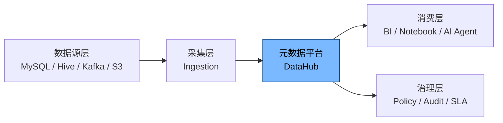
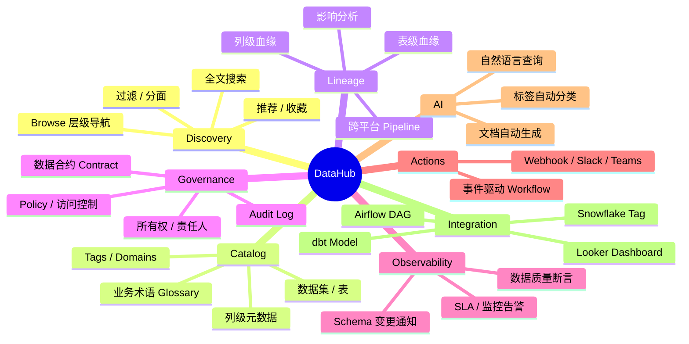
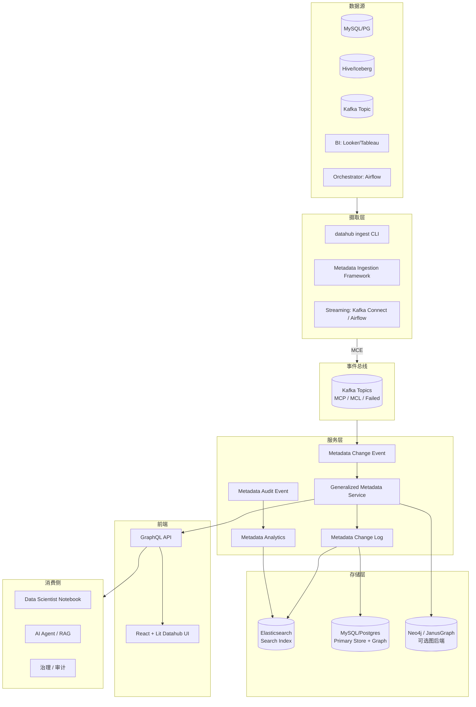
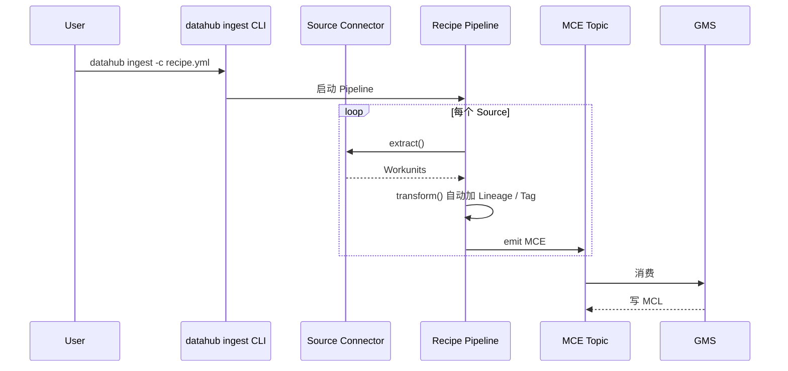
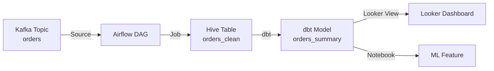
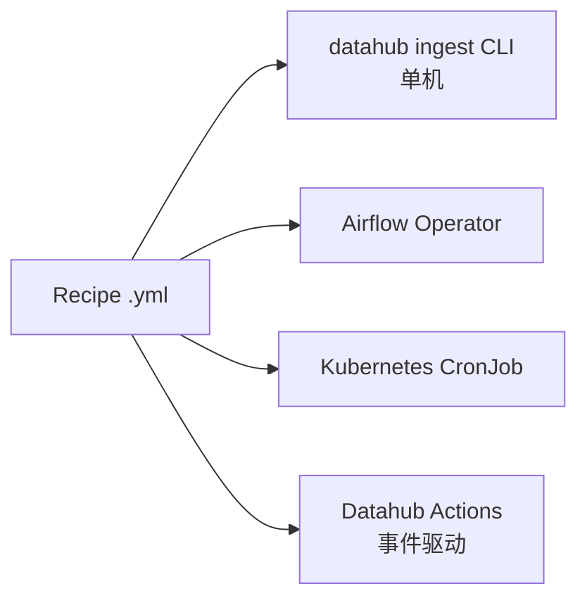
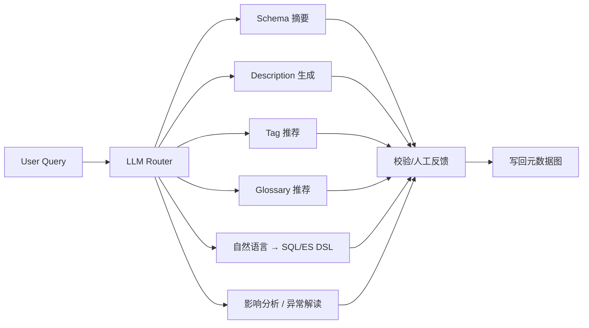
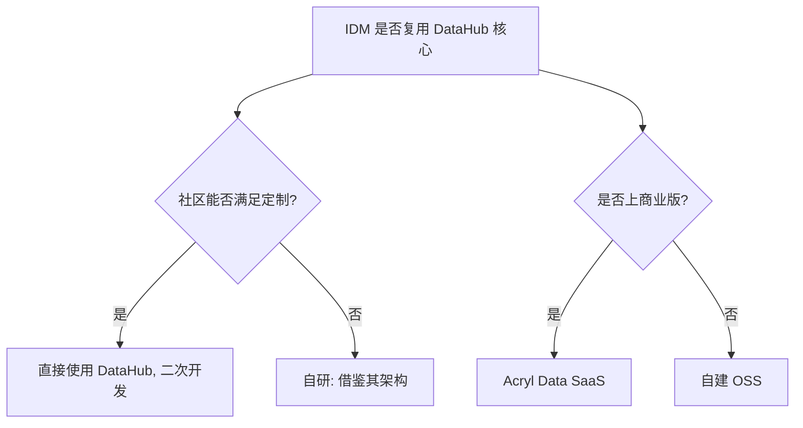

# DataHub 平台深度解析

> 一份面向 AI-Driven 数据管理平台 (IDM) 建设者的 DataHub 全景调研
> 涵盖：介绍 / 优缺点 / 功能矩阵 / 架构 / 技术实现 / 部署 / 二次开发指引

---

## 目录

- [1. 平台介绍](#1-平台介绍)
- [2. 优缺点分析](#2-优缺点分析)
- [3. 功能全景](#3-功能全景)
- [4. 整体架构](#4-整体架构)
- [5. 核心技术实现](#5-核心技术实现)
- [6. 数据模型与元数据建模](#6-数据模型与元数据建模)
- [7. 摄取框架 (Ingestion)](#7-摄取框架-ingestion)
- [8. 搜索 / 发现 / 数据血缘](#8-搜索--发现--数据血缘)
- [9. 安全 / 治理 / 策略](#9-安全--治理--策略)
- [10. AI 能力 (AI-Driven)](#10-ai-能力-ai-driven)
- [11. 部署与运维](#11-部署与运维)
- [12. 适用场景与对 IDM 的启示](#12-适用场景与对-idm-的启示)

---

## 1. 平台介绍

### 1.1 简介

**DataHub** 是由 LinkedIn 开源并捐赠给 Linux Foundation 的 **元数据平台 (Metadata Platform)**，定位为「Data Discovery + Data Observability + Data Governance」三位一体的现代数据栈基础设施。

> 官网: <https://datahubproject.io/>
> GitHub: <https://github.com/datahub-project/datahub> (★ 10k+)

它通过**事件驱动的元数据图 (Metadata Graph)**，把企业内的数据集 (Dataset)、仪表板 (Dashboard)、数据管道 (Pipeline)、用户 (User)、业务术语 (Glossary Term) 等实体统一建模，并提供：

- **统一的元数据模型**（基于 PDL / Pegasus，自动生成多语言 SDK）
- **强类型的变更事件流 (MCE / MCL)**，保证最终一致性
- **可插拔的摄取框架**，内置 80+ 数据源连接器
- **基于图数据库的存储**（默认 Elasticsearch + Neo4j / DataHub GMS）
- **AI 增强能力**（文档生成、分类、标签推荐、自然语言查询）

### 1.2 发展历史

```
2019 ─── LinkedIn 内部立项, MetaJob 元数据中心
2020 ─── 开源 (Apache 2.0), 聚焦 Data Catalog
2021 ─── v0.8 加入 Data Lineage + Schema Evolution
2022 ─── v0.9 加入 Actions / Observability
2023 ─── 加入 Linux Foundation, v0.10 加入 AI 助手 (DataHub AI)
2024 ─── v0.12+ 加入 Data Product / Data Contract / Data Observability Alerts
2025 ─── v1.0 路线: 多租户 SaaS 化 + LLM-native 知识图谱
```

### 1.3 在数据栈中的位置



---

## 2. 优缺点分析

### 2.1 优点

| 维度 | 优势描述 |
| --- | --- |
| **元数据建模能力** | PDL (Pegasus Data Language) 描述实体，类型安全；变更即代码 (Schema-as-Code) |
| **事件驱动架构** | 所有元数据变更走 Kafka / Pulsar Topic，最终一致、易扩展、便于二次开发 |
| **可插拔摄取** | 内置 80+ Connector（数据库、数据湖、BI、ML 平台、Orchestrator），统一 CLI 调度 |
| **图存储** | 实体关系用边表示，血缘、所有权、影响分析自然支持 |
| **社区活跃** | Linux Foundation 治理，大厂共建 (LinkedIn, Salesforce, Expedia, Pinterest) |
| **多语言 SDK** | 自动生成 Java / Python / Go SDK，便于嵌入到数据栈任意位置 |
| **AI 集成** | LLM 文档生成、术语推荐、ChatBI 自然语言检索 |
| **开放治理** | Apache 2.0，无供应商锁定 |

### 2.2 缺点

| 维度 | 痛点描述 |
| --- | --- |
| **运维复杂度高** | 默认依赖：Kafka + Elasticsearch + MySQL/Postgres + (Neo4j 或 MySQL 图模式) + Kafka Connect + 前端 GMS，组件 ≥ 6 |
| **资源占用** | 单实例 ≥ 8C16G，社区版没有托管 SaaS，企业需自建 SRE 团队 |
| **学习曲线陡** | PDL → Aspect 建模、Metadata Change Event、MCP/GMS/MS 三层服务，初学者要 2~4 周 |
| **UI 体验参差** | 前端基于 React + Lit (LITElement) 多模块加载，复杂查询性能偶发抖动 |
| **图谱能力** | 0.9 之前血缘只支持表级；列级血缘需配合 SQL 解析 (SQLLineage)，仍不完善 |
| **权限模型** | 旧版基于 Policy 引擎较弱，v0.10 后引入 DataHub RBAC，迁移成本高 |
| **多租户** | 单租户架构；多租户需借助外部网关或 fork |
| **中文文档** | 偏少，深度问题需翻 GitHub Issue |

### 2.3 适用与不适用

| 适用 | 不太适用 |
| --- | --- |
| 中大型互联网公司，需要「统一元数据 + 数据资产目录 + 强血缘」 | 极小团队 / 单数据源，简单 Excel 就能管 |
| 多云异构数据栈 (Lakehouse + 数仓 + OLTP + BI) | 主要使用单一 SaaS (如 Snowflake) 的公司 |
| 已有 Kafka / Kubernetes 基础设施 | 不想维护底层中间件的团队 |

---

## 3. 功能全景

### 3.1 核心功能模块



### 3.2 功能矩阵

| 功能领域 | 能力点 | 备注 |
| --- | --- | --- |
| **元数据采集** | 数据库 / 数仓 / 数据湖 / BI / Orchestrator / ML Platform | 80+ 内置 Connector |
| **元数据建模** | Entity + Aspect 模型，PDL 描述 | 自动生成多语言 SDK |
| **搜索** | 全文 + 多维过滤 + 排序 | ES 倒排索引 |
| **血缘** | 表级、列级、跨管道 | 列级依赖 SQL Parser + Job 解析 |
| **治理** | 所有权、分类分级、Tag、Glossary、Domain |  |
| **数据质量** | 断言 (Freshness / Volume / Custom SQL) | 独立 Datahub Actions 框架 |
| **数据合约** | Schema/Quality/SLA Contract | 与 SLA 引擎联动 |
| **可观测** | 告警 / 通知 (Slack, Teams, Email, Webhook) |  |
| **安全** | SSO (OIDC/SAML), RBAC, 字段级脱敏建议 |  |
| **AI** | 文档生成、Schema 摘要、Tag 推荐、NLQ | 集成 OpenAI / 本地 LLM |
| **扩展** | 自定义 Aspect、Action、UI 插件、GraphQL API |  |

---

## 4. 整体架构

### 4.1 一张总览图



### 4.2 三大核心服务角色

| 服务 | 名称 | 职责 |
| --- | --- | --- |
| **MCE Consumer** | `datahub-mce-consumer` | 消费外部 MCE Topic，做校验、去重、生成 MCL |
| **GMS** | `datahub-gms` | 通用元数据服务，对外暴露 GraphQL / Rest API；处理 CRUD + 校验 |
| **MAE Consumer** | `datahub-mae-consumer` | 消费 MCL 写 ES（搜索）与 Neo4j（图） |

> **设计哲学**：所有元数据变更 = 一条 `MetadataChangeEvent` 走 Kafka，**无状态 + 幂等**消费，保证最终一致。

---

## 5. 核心技术实现

### 5.1 元数据建模：PDL + Aspect

DataHub 把「实体 (Entity)」与「切面 (Aspect)」解耦。例：`Dataset` 实体拥有 `ownership`、`schema`、`status`、`datasetProperties` 等独立 Aspect。

```pdl
// 伪代码: 描述 Dataset 实体的一个 Aspect
@Aspect = {
  name: "datasetProperties"
  type: record {
    name: string,
    description: optional string,
    customProperties: map[string, string]
  }
}
```

- 改一个字段 = 改一个 Aspect，零迁移成本
- 自动生成 Java/Python/Go 类，强类型校验
- 配合 GMS `validateProposal` 引擎，做 **写时校验**

### 5.2 事件协议

```json
// MetadataChangeEvent (MCE) 示例
{
  "proposedDelta": {
    "entityType": "dataset",
    "entityUrn": "urn:li:dataset:(urn:li:dataPlatform:hive,SampleLogDB,PROD)",
    "changeType": "UPSERT",
    "aspectName": "datasetProperties",
    "aspect": {
      "value": "{ \"name\": \"SampleLogDB\", \"description\": \"auto-generated\" }",
      "contentType": "application/json"
    }
  },
  "systemMetadata": {
    "lastObserved": 1717000000000,
    "runId": "ingest-2024-05-29"
  }
}
```

> **MCL (Metadata Change Log)** = MCE 经 GMS 持久化后产生的事件流，供搜索 / 图 / 通知下游消费。

### 5.3 摄取框架



**Recipe (YAML)** 形式声明式：

```yaml
source:
  type: mysql
  config:
    host_port: localhost:3306
    database: mydb
    include_tables: true
    include_table_lineage: true

sink:
  type: datahub-rest
  config:
    server: http://localhost:8080

transformers:
  - type: add_dataset_ownership
    config:
      owners: ["urn:li:corpuser:datahub"]
```

### 5.4 搜索与发现

- **存储**：Elasticsearch 7.x，倒排索引 + 父子文档
- **写入**：MCL → MAE Consumer → ES
- **能力**：模糊匹配、`/q` 语法、过滤器 (entity, platform, owner, tag, domain, glossary)
- **推荐**：基于访问日志的个性化排序

### 5.5 血缘 (Lineage)



- **表级血缘**：通过 SQL Parser (sqlglot / sqllineage) + Job metadata
- **列级血缘**：DataHub Column Lineage (DCL) 走 MCP，下游基于输入列构造
- **API**：`/relationships?type=DownstreamOf&urn=...`

### 5.6 安全 / 治理

- **认证**：OIDC / SAML SSO；支持 LDAP 同步
- **授权**：基于 Policy (Resource × Privilege × Actor) 的 RBAC
- **审计**：所有 GMS 调用写 Audit Log Topic
- **数据分级**：Classification + 建议（敏感列自动打 tag）

### 5.7 前端架构

- **React 18 + Apollo GraphQL** 主框架
- **LitElement** 微前端组件，跨页面复用
- **CodeMirror / Monaco** 实现 SQL 描述、YAML 配置编辑
- **Vite** 构建，模块化按需加载

---

## 6. 数据模型与元数据建模

### 6.1 内置核心实体

| 实体 | URN 样例 | 关键 Aspect |
| --- | --- | --- |
| Dataset | `urn:li:dataset:(urn:li:dataPlatform:hive,db.tbl,PROD)` | schema, properties, ownership, status, glossaryTerms |
| Dashboard | `urn:li:dashboard:(looker,sales)` | dashboardInfo, charts, ownership |
| Chart | `urn:li:chart:(looker,revenue_chart)` | chartInfo, query, inputs |
| DataFlow / DataJob | `urn:li:dataFlow:(airflow,etl_dag,PROD)` | dataFlowInfo, jobInfo, ownership |
| MLModel | `urn:li:mlModel:(urn:li:dataPlatform:mlflow,churn_model,PROD)` | mlModelProperties, trainingJobs |
| GlossaryTerm | `urn:li:glossaryTerm:Customer.AOV` | glossaryTermInfo, relatedTerms |
| Tag | `urn:li:tag:PII` | tagProperties, color |
| Domain | `urn:li:domain:Sales` | domainProperties, owner |
| CorpUser / CorpGroup | `urn:li:corpuser:alice` | corpUserInfo, groupMembership |

### 6.2 URN (Uniform Resource Name)

URN = 实体在全局唯一标识符，所有 API / 血缘 / 搜索都以 URN 为锚点。

```
urn:li:<entityType>:(<keyPart1>,<keyPart2>...)
```

---

## 7. 摄取框架 (Ingestion)

### 7.1 三大调度方式



### 7.2 主要 Connector 一览

| 分类 | Connector | 关键能力 |
| --- | --- | --- |
| RDBMS | MySQL, PostgreSQL, Oracle, SQL Server, DB2 | 表、视图、列、外键、Profiler |
| 数仓 | Snowflake, BigQuery, Redshift, Databricks, Trino, Hive, Doris | Profile、Lineage、Usage |
| 数据湖 | S3, Glue, Iceberg, Hudi, Delta | Schema、文件级 |
| 消息 | Kafka, Pulsar | Topic / Schema Registry |
| BI | Looker, Tableau, Superset, PowerBI, Mode | Dashboard / Chart Lineage |
| 编排 | Airflow, Dagster, Prefect | DAG / Task 血缘 |
| 数据建模 | dbt | Model / Test / Source |
| ML | MLflow, Sagemaker, Vertex | Model / Run / Feature Store |
| 治理 | LDAP, Okta, ServiceNow | User / Group 同步 |
| API | OpenAPI, GraphQL | 自定义拉取 |

### 7.3 增量与状态管理

- **Stateful Ingestion**：检查点 (Checkpoint) 持久化到本地 / S3
- 增量字段：`last_updated_ts`、`watermark`
- 失败重试：基于 `systemMetadata.runId` 幂等

---

## 8. 搜索 / 发现 / 数据血缘

### 8.1 搜索能力

| 维度 | 实现 |
| --- | --- |
| 全文 | ES 倒排 + BM25 |
| 同义词 | 自定义 Analyzer |
| 实体过滤 | entityType / platform / type |
| 业务过滤 | owner / tag / domain / glossaryTerm / feature |
| 排序 | 相关度 / 热度 / 浏览量 |
| NLQ (v0.10+) | LLM 改写为 ES DSL |

### 8.2 血缘 API 示例

```bash
# 获取某表的下游链路
curl 'http://localhost:8080/api/graphql' \
  -H 'Content-Type: application/json' \
  -d '{
    "query": "{ dataset(urn: \"urn:li:dataset:(urn:li:dataPlatform:hive,Orders,PROD)\") { name downstreamLineage { entities { urn } } } }"
  }'
```

### 8.3 影响分析 (Impact Analysis)

- 找到上游/下游所有受影响的对象
- 辅助变更评审、灰度发布、回滚决策

---

## 9. 安全 / 治理 / 策略

### 9.1 角色 & 权限矩阵

| 角色 | 权限 |
| --- | --- |
| Admin | 平台配置、Connector 管理、用户管理 |
| Editor | 编辑元数据 (Description, Tag, Owner) |
| Reader | 只读 |
| Data Steward | Glossary 管理、分类分级 |
| Custom | 通过 Policy 自定义细粒度规则 |

### 9.2 策略 (Policy) 类型

- **Metadata Policy**：谁能改哪个实体
- **Data Policy**：行/列级访问控制 (集成 Ranger / Unity Catalog)
- **Container Policy**：Domain / Data Product 级别

### 9.3 数据质量 (Assertions)

- 字段级：`isNotNull`, `regexMatch`
- 表级：`rowCount`, `freshness`, `volume`
- 自定义 SQL：`SELECT COUNT(*) ...`

---

## 10. AI 能力 (AI-Driven)

### 10.1 内置 AI 助手



### 10.2 LLM 集成模式

| 模式 | 适用 |
| --- | --- |
| **闭源 API** (OpenAI, Claude) | 快速接入，文档生成质量高 |
| **本地 LLM** (Llama, Qwen, Mistral) | 数据合规场景 |
| **Self-Hosted Embedding** (bge, text2vec) | 离线 / 内网 |
| **MCP Server** | 让 AI Agent 直接 query 血缘 / Glossary |

### 10.3 典型用例

1. **自动文档**：新表入库后自动生成 Description
2. **Tag 智能分类**：基于 Column 名称 + Sample 推断 PII / Sensitive
3. **业务术语映射**：把 Column 自动关联到 Glossary
4. **自然语言搜索**：`帮我找「最近一个月每天活跃用户」` → 自动转 ES Query
5. **AI Agent 工具**：让 LangGraph / CrewAI 读取 Schema、Lineage、Glossary 做 ETL 自动生成

---

## 11. 部署与运维

### 11.1 部署模式

| 模式 | 工具 | 适用 |
| --- | --- | --- |
| 单机快速体验 | `datahub docker quickstart` | Demo |
| 生产 K8s | Helm Chart / DataHub Operator | 中大型 |
| SaaS | Acryl Data / Salesforce Data Cloud Cloud | 不愿自建 |
| Airflow 集成 | airflow-emr-plugin | 数据栈共生 |

### 11.2 资源清单 (单实例, 50 用户)

| 组件 | CPU | Mem | 存储 |
| --- | --- | --- | --- |
| GMS | 4 | 8G | 20G |
| MAE / MCE Consumer | 2 | 4G | 20G |
| Frontend | 2 | 4G | 10G |
| MySQL/PG | 4 | 8G | 200G |
| Elasticsearch (3 节点) | 6 | 12G | 500G |
| Kafka (3 节点) | 6 | 12G | 200G |
| **合计** | **24C** | **48G** | **>1T** |

### 11.3 监控指标

- `datahub_ingestion_*` 摄取吞吐/失败率
- `datahub_gms_qps_latency` API 时延
- `datahub_consumer_lag` MCL 消费滞后
- `datahub_search_query_seconds` 搜索 P95

---

## 12. 适用场景与对 IDM 的启示

### 12.1 与我们 IDM 项目的契合点

| 维度 | DataHub 做法 | 对 IDM 的可借鉴 |
| --- | --- | --- |
| 元数据模型 | Aspect 解耦 | 采用类似的「实体 + 切面」模型，灵活扩展 LLM 能力 |
| 摄取框架 | Plugin + Recipe | 抽象 Source/Sink 接口，便于接 ClickHouse / 各类 LLM 数据源 |
| 事件总线 | Kafka Topic | 利用现有 NATS / Kafka 即可 |
| AI 集成 | LLM Router | IDM 内置 NL2SQL、文档生成、Glossary 关联能力 |
| 搜索 | ES + BM25 | 加入向量索引（Qdrant / Milvus），支持混合检索 |
| 治理 | Policy + 审计 | 复用企业 IAM，与 SSO / 审计打通 |

### 12.2 我们应避开的坑

- 避免引入 6+ 中间件，先用 PG + 单机 ES / Qdrant 起步
- 早期不必上列级血缘，先把表级 + Job 血缘闭环
- UI 不必全用 LitElement，复用现有 React + Antd 技术栈

### 12.3 关键决策点



---

## 附录 A. 核心源码路径参考

| 模块 | 路径 |
| --- | --- |
| PDL 模型 | `metadata-models/src/main/pegasus/` |
| GMS 服务 | `metadata-service/graphql-servlet-impl/` |
| 摄取框架 | `metadata-ingestion/` |
| 前端 | `datahub-web-react/` |
| Action 框架 | `datahub-actions/` |
| Helm Chart | `datahub-k8s-chart/` |

## 附录 B. 推荐阅读

- 官方文档: <https://datahubproject.io/docs/>
- 论文 / Blog: <https://blog.datahubproject.io/>
- LinkedIn Engineering: <https://engineering.linkedin.com/blog/topic/data>
- Acryl 视频: <https://www.youtube.com/@acryldata>

---

> 📌 **下一步**：阅读 [openmetadata.md](./openmetadata.md) 对比两个平台的实现差异。
