# OpenMetadata 平台深度解析

> 一份面向 AI-Driven 数据管理平台 (IDM) 建设者的 OpenMetadata 全景调研
> 涵盖：介绍 / 优缺点 / 功能矩阵 / 架构 / 技术实现 / 部署 / 二次开发指引

---

## 目录

- [1. 平台介绍](#1-平台介绍)
- [2. 优缺点分析](#2-优缺点分析)
- [3. 功能全景](#3-功能全景)
- [4. 整体架构](#4-整体架构)
- [5. 核心技术实现](#5-核心技术实现)
- [6. 数据模型与元数据建模](#6-数据模型与元数据建模)
- [7. 摄取框架 (Ingestion)](#7-摄取框架-ingestion)
- [8. 搜索 / 发现 / 数据血缘](#8-搜索--发现--数据血缘)
- [9. 数据质量 / 血缘 / SLA](#9-数据质量--血缘--sla)
- [10. AI 能力 (AI-Driven)](#10-ai-能力-ai-driven)
- [11. 安全 / 治理 / 协作](#11-安全--治理--协作)
- [12. 部署与运维](#12-部署与运维)
- [13. 适用场景与对 IDM 的启示](#13-适用场景与对-idm-的启示)

---

## 1. 平台介绍

### 1.1 简介

**OpenMetadata** 是开源的**统一元数据、发现、治理、可观测平台**，诞生于 2021 年由 [UnifyData](https://www.unifydata.ai/)（后改名 OpenMetadata 基金会）发起并捐赠给 Linux Foundation，现由 [OpenMetadata Foundation](https://open-metadata.org/) 治理。

> 官网: <https://open-metadata.org/>
> GitHub: <https://github.com/open-metadata/OpenMetadata> (★ 5k+)

它把 **元数据 (Metadata) + 数据质量 (Quality) + 数据血缘 (Lineage) + 数据可观测 (Observability) + 协作 (Collaboration)** 五大能力收敛在**一套单一平台**，并通过**JSON Schema 驱动的元数据模型**实现了端到端的 Schema-as-Code 体验。

### 1.2 核心定位

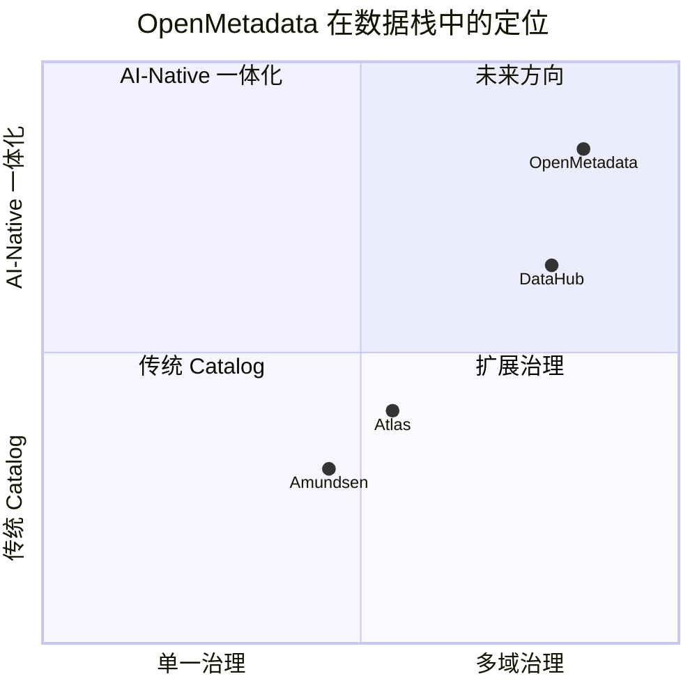

### 1.3 发展时间线

```
2021 ── 立项, UnifyData 团队
2022 ── v0.x, 元数据 + 血缘 + 质量 (Data Quality) 集成
2023 ── v1.0 GA, 引入 Data Observability / SLA / 通知中心
2023 ── 加入 Linux Foundation
2024 ── v1.3 加入 Metadata Versioning + Reverse Metadata
2024 ── v1.4 加入 Collapsible Glossary / Custom Property
2025 ── v1.5+ 加入 LLM Native Knowledge Graph + Multi-LLM Router
```

### 1.4 在数据栈中的位置

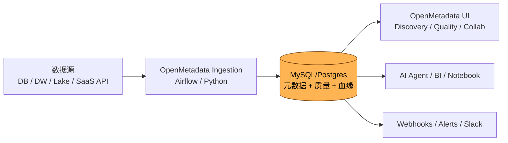

---

## 2. 优缺点分析

### 2.1 优点

| 维度 | 优势 |
| --- | --- |
| **一体化体验** | 元数据 + 质量 + 血缘 + 协作 + 可观测统一 UI，无需多平台拼装 |
| **JSON Schema 建模** | 所有 Entity Type 都是 JSON Schema 描述，自动生成前后端类型 |
| **原生数据质量** | 内置 Test Suite + Test Case + Profiler 引擎，告警链路完整 |
| **协作能力** | Activity Feed / Tasks / Announcements / Teams & Ownership / Conversation Thread |
| **REST + WebSocket API** | 全量 CRUD + 实时事件，OpenAPI 自动生成 SDK |
| **数据可观测** | 监控指标 (Data Insights)、SLA、Incident 跟踪 |
| **活跃社区** | Linux Foundation 治理；商业版 UnifyData / Collate 提供企业级 SaaS |
| **AI 集成** | Metadata Embedding、LLM 文档生成、NL2SQL、Chat Data |
| **元数据双向同步** | Reverse Metadata：把治理信息写回到 Snowflake / Databricks / Salesforce |

### 2.2 缺点

| 维度 | 痛点 |
| --- | --- |
| **后端 Java 重** | JVM 启动慢；JVM 调优成本高 (但 v1.4 已开始引入 Quarkus) |
| **Airflow 强依赖** | 大部分 Connector 强耦合 Airflow DAG 调度；轻量化部署不便 |
| **存储限制** | 默认 MySQL/Postgres；元数据规模大时单库压力大，需分库分表 |
| **文档质量参差** | 入门文档丰富；深度/底层实现说明偏少 |
| **生态相对窄** | Connector 数量约 80+，但部分长尾数据源覆盖不如 DataHub |
| **复杂权限模型** | Teams/Roles/Robots/Bots 概念多，新手需时间理解 |
| **商业化路径** | 部分高级特性 (Collate SaaS、Reverse Metadata) 需购买商业版 |

### 2.3 适用与不适用

| 适用 | 不太适用 |
| --- | --- |
| 中大型企业，希望「单一元数据+质量+协作」全栈 | 资源受限小团队，需要最轻量方案 |
| 已有 Airflow 基础设施 | 不想运维 Airflow |
| 关注数据质量 + 团队协作 | 只需要数据目录，不需要质量 |

---

## 3. 功能全景

### 3.1 核心模块思维导图

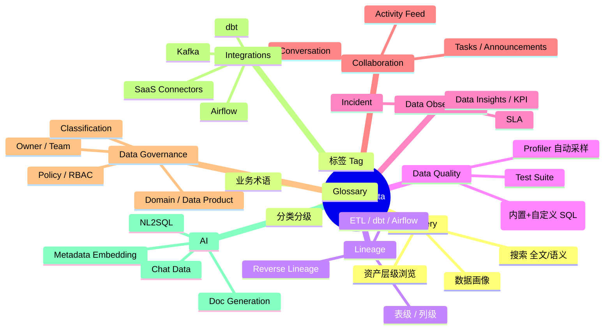

### 3.2 功能矩阵

| 功能领域 | 能力点 | 备注 |
| --- | --- | --- |
| **元数据采集** | 数据库 / 数据仓库 / 数据湖 / BI / Orchestrator / SaaS | 内置 80+ Connector |
| **元数据建模** | JSON Schema，Type-as-Code | 自动生成前后端 |
| **搜索** | 全文 + 高亮 + 过滤 | ES + 即将引入向量 |
| **血缘** | 表级 + 列级 + 实时 | 集成 SQL Parser、Job metadata |
| **质量** | Test Suite / Test Case / Profiler | 告警/失败联动 |
| **协作** | 任务、评论、公告、Activity | 强协作体验 |
| **可观测** | Insight、Incident、SLA |  |
| **安全** | SSO、RBAC、域、Team、Bot |  |
| **API** | REST + WebSocket + OpenAPI |  |
| **AI** | LLM 文档生成、Tag 推断、Chat Data | 可选 OpenAI / Local LLM |
| **双向同步** | Reverse Metadata 写回 | 商业版 |

---

## 4. 整体架构

### 4.1 一张总览图

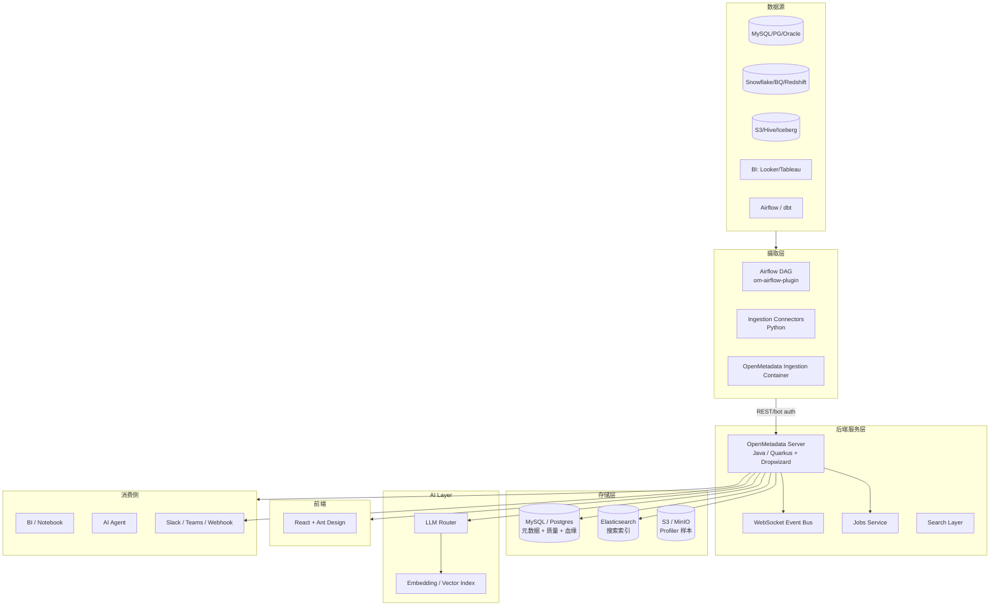

### 4.2 部署形态

| 形态 | 适用 |
| --- | --- |
| **Single Container (Docker Compose)** | Demo / 中小规模 |
| **Kubernetes (Helm)** | 生产 |
| **OpenMetadata + Airflow (Compose / K8s)** | 推荐生产 |
| **Collate SaaS** | 商业托管 |

---

## 5. 核心技术实现

### 5.1 技术栈总览

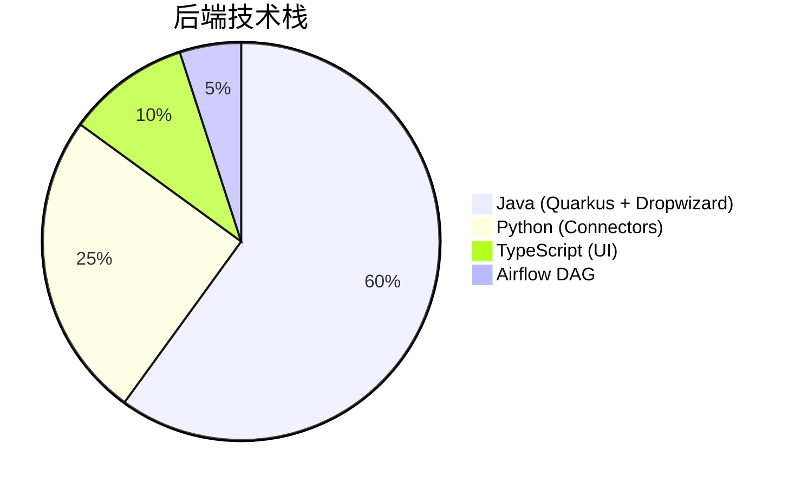

- **后端**：Java 17 + Quarkus (RESTEasy) + Dropwizard (历史模块)
- **持久化**：MySQL 8 / PostgreSQL 14+
- **搜索**：Elasticsearch 7.17+ / OpenSearch 2.x
- **异步**：内部 Event Bus（基于 Dropwizard）+ 外部 Airflow
- **前端**：React 18 + Ant Design + Vite
- **API 协议**：OpenAPI 3.0 + WebSocket

### 5.2 JSON Schema 驱动的元数据模型

OpenMetadata 把所有 Entity 用 **JSON Schema** 描述：

```json
{
  "$id": "entity/data/table.json",
  "title": "Table",
  "type": "object",
  "javaType": "org.openmetadata.schema.entity.data.Table",
  "properties": {
    "id":   { "$ref": "type/basic.json#/definitions/uuid" },
    "name": { "type": "string" },
    "description": { "$ref": "type/basic.json#/definitions/markdown" },
    "columns": { "type": "array", "items": { "$ref": "columns.json" } },
    "owner":  { "$ref": "../../type/entityReference.json" },
    "database": { "$ref": "../../type/entityReference.json" }
  },
  "required": ["name", "columns"]
}
```

- 自动生成 Java POJO、TypeScript interface
- 字段级扩展：**Custom Property** 直接在 UI 添加，无需改模型
- **ChangeEvent** 通过 WebSocket 推送给前端

### 5.3 摄取框架

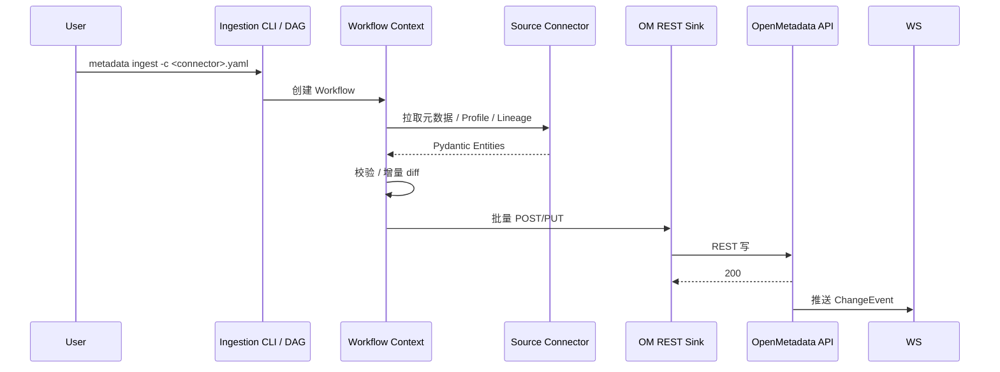

**Recipe (YAML)** 示例：

```yaml
source:
  type: mysql
  serviceName: mysql_orders
  serviceConnection:
    config:
      type: Mysql
      username: openmetadata_user
      password: ...
      hostPort: localhost:3306
      databaseFilterPattern:
        includes: [orders_.*]
  sourceConfig:
    type: DatabaseMetadata
    overrideMetadata: true
    markingLineage: true
    includeViews: true

sink:
  type: metadata-rest
  config: {}

workflowConfig:
  loggerLevel: INFO
  openMetadataServerConfig:
    hostPort: http://openmetadata-server:8585/api
    securityConfig:
      jwtToken: ...
```

### 5.4 数据质量引擎

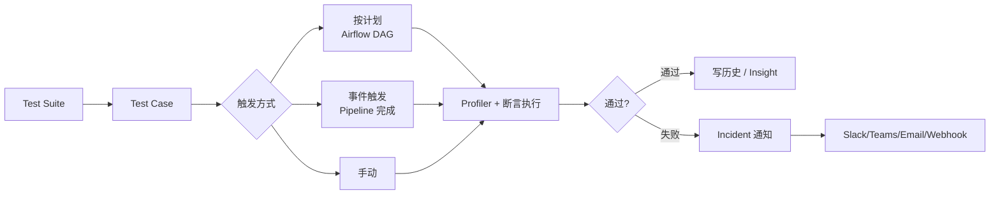

- **内置断言**：`tableRowCountToBeBetween`, `columnValuesToBeNotNull`, `columnValueLengthsToBeBetween`, `columnValuesToMatchRegex` 等
- **自定义 SQL**：写 `SELECT ... ASSERT ...`
- **结果存储**：MySQL 持久化，ES 索引；前端提供趋势图

### 5.5 血缘 (Lineage)

- **采集方式**：通过 Connector 解析 `query` log、dbt manifest、Airflow DAG
- **数据流**：表 / 列 / Pipeline 三层
- **API**：`GET /v1/lineage?fqn=...&upstreamDepth=3&downstreamDepth=3`
- **渲染**：前端 DAG (基于 ReactFlow / dagre) 实时可视化

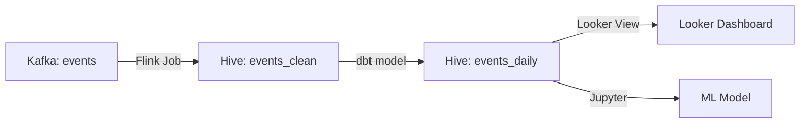

### 5.6 协作 (Collaboration)

- **Activity Feed**：所有变更进流，前端实时推送
- **Tasks**：分配 TODO、关联资产、截止日期
- **Announcements**：广播维护、数据问题
- **Conversation Thread**：在数据资产页内嵌讨论

### 5.7 搜索与发现

- 存储：ES 索引（entityType 分类、字段 Mapping）
- 高亮：`description` `tag` `glossary` 等
- 过滤：service、owner、tag、glossary、domain、type、tier
- **向量检索** (v1.4+)：通过 Embedding Index 做语义搜索

---

## 6. 数据模型与元数据建模

### 6.1 核心实体

| 实体 | 说明 |
| --- | --- |
| `DatabaseService` | 物理数据源 (MySQL, Snowflake...) |
| `Database` / `DatabaseSchema` | 库 / Schema |
| `Table` / `Column` | 表 / 列 |
| `Topic` | 消息队列 |
| `Dashboard` / `Chart` | 仪表板 / 图表 |
| `Pipeline` / `Task` | 数据管道 |
| `Container` | S3 / Blob 目录 |
| `Query` | 平台执行的查询 |
| `MlModel` / `MlFeature` | ML 模型 / 特征 |
| `Glossary` / `GlossaryTerm` | 业务术语 |
| `Tag` / `Classification` | 分类分级 |
| `Team` / `User` / `Bot` | 组织 |
| `Domain` / `DataProduct` | 业务域 / 数据产品 |
| `Policy` / `Role` | 访问控制 |
| `TestSuite` / `TestCase` / `TestDefinition` | 数据质量 |
| `Incident` / `Alert` | 事件 |
| `Kpi` / `DataInsight` | 可观测指标 |

### 6.2 FQN (Fully Qualified Name)

OpenMetadata 使用 FQN 标识：

```
mysql_orders.orders_db.orders_daily.order_id
snowflake_prod.analytics.fct_sales
```

> **vs DataHub URN**：URN 走严格命名空间；FQN 更可读、便于 API。

### 6.3 Custom Property

- 在 UI 内即可添加实体属性（类型：string / int / date / enum）
- 内部存为 `extension` 字段，不需要改 JSON Schema
- 可被搜索 / 导出

---

## 7. 摄取框架 (Ingestion)

### 7.1 三大部署模式

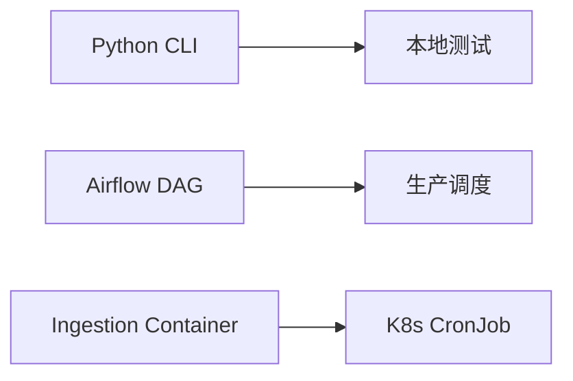

### 7.2 主要 Connector

| 分类 | Connector | 能力 |
| --- | --- | --- |
| Database | MySQL/PG/Oracle/SQL Server/MariaDB/Cassandra | Schema + Profile + Lineage |
| Data Warehouse | Snowflake/BQ/Redshift/Databricks/Synapse | 全功能 |
| Data Lake | S3/GCS/ADLS/Hive/Iceberg/Delta | Schema + 存储指标 |
| Messaging | Kafka/Kinesis/Pulsar | Topic / Schema |
| Orchestrator | Airflow/Dagster/Fivetran | DAG / Task 血缘 |
| BI | Looker/Tableau/Metabase/Superset/PowerBI | Dashboard / Chart 血缘 |
| dbt | dbt Manifest | Model / Test / Source |
| ML | MLflow/SageMaker/Vertex | Model 血缘 |
| API | REST/GraphQL | 通用 |
| Object Store | MinIO/NFS | 文件 / 目录 |

### 7.3 Profiler

- **采样策略**：可配置 rowLimit
- **指标**：count / null / distinct / min / max / mean / stddev / quantile
- **敏感数据检测**：PII / Email / Phone 识别（内置正则 + 可扩展 ML）

---

## 8. 搜索 / 发现 / 数据血缘

### 8.1 搜索能力

| 维度 | 实现 |
| --- | --- |
| 全文 | ES (multi_match) |
| 高亮 | description、tag、column name |
| 过滤 | service、type、tag、glossary、owner、domain、tier |
| 排序 | 字母 / 创建时间 / 更新时间 |
| 语义 (v1.4+) | Embedding + 向量索引（OpenSearch / pgvector） |

### 8.2 血缘 API 示例

```bash
# 表级血缘
curl -H "Authorization: Bearer $TOKEN" \
  "http://localhost:8585/api/v1/lineage?fqn=mysql_orders.orders_db.orders_daily&upstreamDepth=3&downstreamDepth=3"
```

### 8.3 UI 视图

- 节点支持 (Table/Column/Dashboard/Pipeline)
- 边携带 (transformer / query / job)
- 反向/正向切换

---

## 9. 数据质量 / 血缘 / SLA

### 9.1 三件套

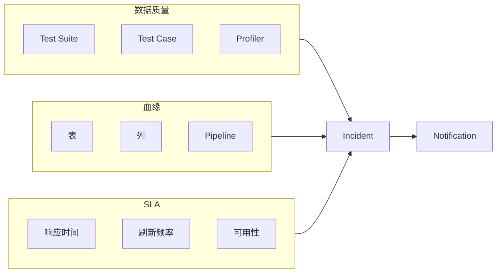

### 9.2 通知中心

- 失败 / 成功 / 阈值
- 渠道：Email / Slack / Teams / Webhook / G-Chat
- 用户可订阅任意资产的变化

### 9.3 Data Insights

- 平台整体健康分：Owner 覆盖率、Description 覆盖率、Quality 通过率
- 自动生成 Top Issue 列表
- 可导出 PDF / Email 周报

---

## 10. AI 能力 (AI-Driven)

### 10.1 架构

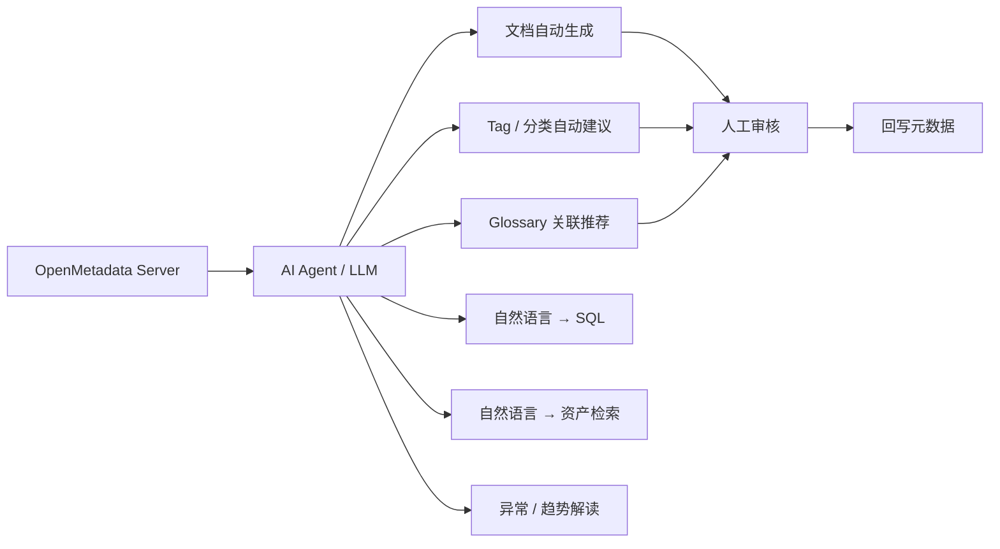

### 10.2 LLM 集成模式

| 模式 | 适用 |
| --- | --- |
| OpenAI / Claude / Gemini | 快速接入 |
| 本地 LLM (DeepSeek V4 / vLLM / TGI) | 内网合规 |
| 第三方 Embedding (OpenAI/Cohere) | 语义检索 |
| 自托管 Embedding (bge / m3e) | 数据不出网 |

### 10.3 典型用例

1. **自动文档**：拉取 Sample Row + Column 类型 → LLM 写 Description
2. **Tag 推断**：列名 / 描述 / 样本 → PII / Sensitive / 财务
3. **Glossary 匹配**：新接入表的 Column → 已有 Glossary 术语
4. **Chat Data**：`"上个季度 GMV 最高的产品线是？"` → 自动 SELECT
5. **RAG Agent**：嵌入资产、Glossary、Query 历史 → 业务问答

### 10.4 LLM 治理

- 每次 LLM 调用记录在 `AuditLog`
- 可关闭敏感资产的 LLM 行为
- 通过 Policy 控制谁能调用

---

## 11. 安全 / 治理 / 协作

### 11.1 角色 & 权限

- **Roles**：`Admin`, `DataSteward`, `DataConsumer`, `Bot`
- **Policies**：`Rule(Effect, Operation, Resource)`
- **Teams** 嵌套 + 自动同步 LDAP

### 11.2 域 & 数据产品

- **Domain**：业务域（销售、财务）
- **Data Product**：可独立治理的资产集合（含 SLA、Owner、合同）
- 支持跨域血缘可视化

### 11.3 审计

- `AuditLog` 表记录所有写操作
- 支持按 `actor` / `entity` / `time` 查询
- 配合 ELK 留痕

---

## 12. 部署与运维

### 12.1 资源清单 (中型生产, 100 用户)

| 组件 | CPU | Mem | 存储 |
| --- | --- | --- | --- |
| OpenMetadata Server | 4 | 8G | 20G |
| Jobs Service | 2 | 4G | 20G |
| Frontend (UI) | 2 | 4G | 10G |
| MySQL/PG | 4 | 8G | 200G |
| Elasticsearch (3 节点) | 6 | 12G | 500G |
| Airflow | 4 | 8G | 50G |
| **合计** | **22C** | **44G** | **>800G** |

### 12.2 部署模式

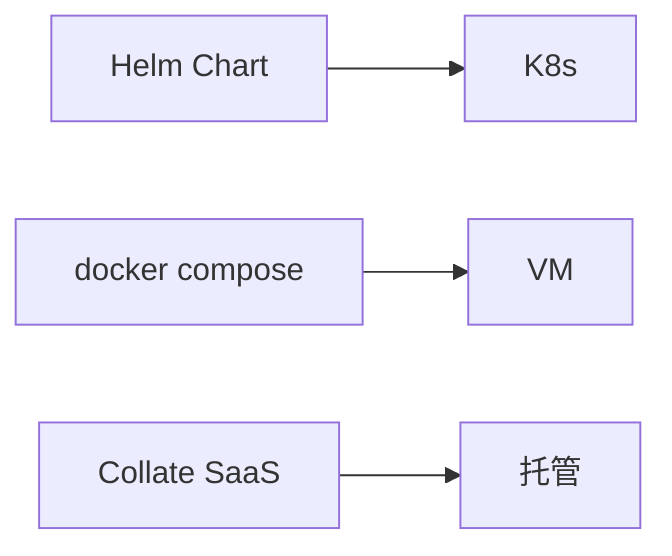

### 12.3 监控

- `om_jvm_*` JVM 指标
- `om_jobs_*` 摄取 / 质量 / 血缘吞吐
- `om_search_*` 搜索 P95
- `om_ws_*` 实时事件推送

---

## 13. 适用场景与对 IDM 的启示

### 13.1 与 IDM 的契合点

| 维度 | OpenMetadata 做法 | 对 IDM 的可借鉴 |
| --- | --- | --- |
| **统一元数据** | JSON Schema + 实体模型 | 直接采用 JSON Schema 风格；自动生成前后端类型 |
| **质量引擎** | Test Suite + Profiler | 在 IDM 内置质量能力：对接 ClickHouse / Doris 做断言 |
| **协作** | Activity Feed + Tasks | 借鉴到 IDM 内部：变更通知、协同编辑 |
| **LLM 集成** | LLM Router + Embedding | 我们的核心差异化：内置 NL2SQL、ChatBI |
| **API** | OpenAPI 3.0 + WebSocket | 沿用，简化集成 |
| **部署** | Airflow + K8s | 可与现有 Airflow 集成，复用 DAG 调度 |

### 13.2 关键启示

1. **质量 = 一等公民**：从第一天就设计 Test Suite / 断言引擎，不要等元数据成熟后再补
2. **协作 = 强诉求**：Activity Feed / Tasks 是企业能否落地的关键
3. **JSON Schema 优先**：便于快速迭代，避免后端改一个字段牵动前后端
4. **Airflow 是好朋友**：避免重造调度器，复用社区 Connector
5. **LLM 写回要可审计**：所有 AI 改元数据的动作进入 `AuditLog` + 人工审核流

### 13.3 决策点

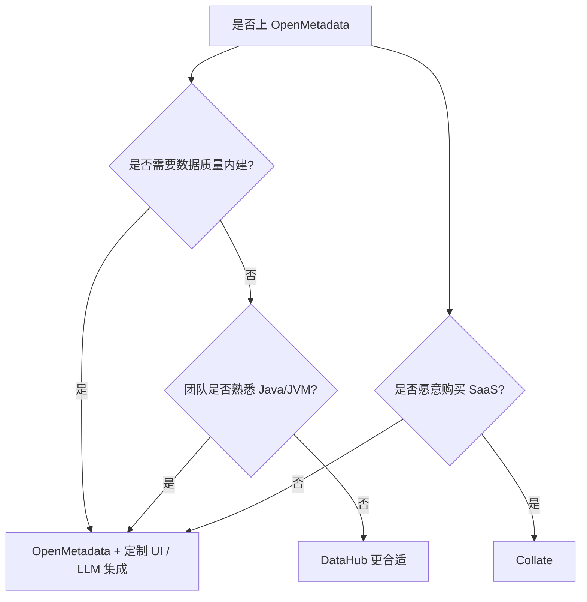

---

## 附录 A. 关键源码路径

| 模块 | 路径 |
| --- | --- |
| 元数据模型 (JSON Schema) | `openmetadata-spec/src/main/resources/json/schema/` |
| 后端服务 | `openmetadata-service/` |
| 摄取连接器 | `ingestion/src/metadata/ingestion/source/` |
| 前端 | `openmetadata-ui/src/main/resources/ui/` |
| Helm | `openmetadata-helm-charts/` |
| Operator | `openmetadata-k8s-operator/` |

## 附录 B. 推荐阅读

- 官方文档: <https://docs.open-metadata.org/>
- 社区博客: <https://blog.open-metadata.org/>
- Slack 社区: <https://slack.open-metadata.org/>
- 商业版: <https://www.collate.ai/>

---

> 📌 **下一步**：阅读 [datahub.md](./datahub.md) 与 [comparison.md](./comparison.md) 横向对比两个平台。
